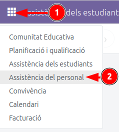

[Català](absences.md) | [Castellano](../../es/teachers/absences.md) | [English](../../en/teachers/absences.md)

---

# Sol·licitar una absència

**Rol necessari:** qualsevol persona del centre, docent o PAS

---

## Índex

1. [On es demana](#on-es-demana)
2. [Tipus d'absència](#tipus-dabsència)
3. [Dates i hores](#dates-i-hores)
4. [Declaració responsable](#declaració-responsable)
5. [Justificant](#justificant)
6. [Enviar la sol·licitud](#enviar-la-sollicitud)
7. [Consultar l'estat](#consultar-lestat)
8. [Crèdit d'hores per motius de salut](#crèdit-dhores-per-motius-de-salut)

---

## On es demana

**Assistència del personal > Absències**, i després el botó **Nova absència**.

---

## Tipus d'absència

Camp **obligatori**. Cap opció ve marcada: n'has de triar una.

| Tipus | Quan s'utilitza |
|---|---|
| **Baixa laboral** | Baixa mèdica tramitada oficialment |
| **Salut** | Absència per motius de salut sense baixa, comunicada immediatament a direcció |
| **Assistència a consulta mèdica** | Visita mèdica que no has pogut concertar fora del teu horari de treball |
| **Prova mèdica invasiva** | Colonoscòpia, endoscòpia, gastroscòpia o cateterisme. Ocupa tota la jornada |
| **Flexibilitat per menstruació o climateri** | Flexibilitat horària recuperable, màxim 8 hores al mes, a recuperar en 4 mesos |
| **Formació** | Cursos, Erasmus+ i formació en general |
| **Absència justificada** | Altres absències justificades que no encaixen en la resta |
| **Encàrrec de serveis** | Sortides, viatges i representació del centre |
| **ATRI** | Permisos que tramites al portal ATRI de la Generalitat |

En triar el tipus **ATRI**, el formulari et mostra els enllaços al portal. La sol·licitud també s'ha de fer allà:

- [Les meves sol·licituds - permisos i absències](https://atriportal.gencat.cat/ATRI-ng/#/meves-sollicituds/permisos-absencies)
- [Manual de permisos i absències d'ATRI (PDF)](https://atriportal.gencat.cat/ATRI-web/gestor-continguts/2011.pdf)

Direcció comprova que l'hagis tramitat al portal abans de marcar la verificació com a `Fet`.

Cada opció mostra el text complet del permís. Llegeix-lo abans de triar: en marcar-la, declares que t'hi trobes.

---

## Dates i hores

La casella **Dia sencer?** decideix què has d'omplir:

| Dia sencer? | Has d'indicar | Es compten |
|---|---|---|
| Sense marcar | Un dia, hora d'inici i hora de fi | Les hores que has faltat |
| Marcada | Data d'inici i data de fi | 7,5 hores per cada dia laborable |

Marca-la si no véns en tot el dia: comptaran 7,5 hores encara que aquell dia només hi tinguessis una classe. Deixa-la sense marcar si véns i te n'has d'anar, o si arribes tard.

Per demanar més d'un dia, marca-la i canvia la data de fi. Si és un sol dia, la data de fi ja es posa sola.

`Salut` i `Prova mèdica invasiva` es creen amb la casella marcada. Si només vas faltar una estona, desmarca-la.

---

## Declaració responsable

**Obligatòria en tots els tipus.** Sense marcar-la no es pot enviar la sol·licitud.

---

## Justificant

**Pots adjuntar-ne un a qualsevol absència, de qualsevol tipus i en qualsevol moment.** Tres tipus l'*exigeixen*: **Baixa laboral**, **Assistència a consulta mèdica** i **Prova mèdica invasiva**; en la resta és opcional, i val la pena adjuntar-lo sempre que el tinguis.

En el cas de consulta mèdica, el justificant ha de fer constar expressament el nom i cognoms del o de la pacient i l'hora d'entrada i sortida del centre o consulta mèdica.

**Un justificant que arriba més tard s'adjunta a la mateixa sol·licitud.** Obre l'absència, encara que ja estigui aprovada, adjunta el fitxer i desa. Això és el que fa desaparèixer una **Comprovació de direcció** en estat *Falta document*: no cal tornar a sol·licitar l'absència.

Per esborrar-ne un, fes clic a la creu del fitxer i confirma.

---

## Enviar la sol·licitud

El botó **Envia la sol·licitud**, al final del formulari. Fins que no el prems i confirmes, la sol·licitud no queda registrada.

El botó està desactivat mentre falti alguna cosa. Passa-hi el ratolí per sobre i et dirà quina:

- Triar el tipus d'absència.
- Indicar hores, amb la de fi posterior a la d'inici (si no és de dia sencer).
- Acceptar la declaració responsable.

Si surts del formulari sense enviar-lo, l'EMS t'avisa i et deixa descartar-lo.

---

## Consultar l'estat

A **Absències** tens la teva llista, amb dues columnes:

**Estat**

| Valor | Significa |
|---|---|
| Pendent | Encara no s'ha resolt |
| Aprovada | Concedida |
| Rebutjada | Denegada. És definitiu: si vols insistir, cal fer una sol·licitud nova |
| Cancel·lada | Anul·lada |

**Verificació de direcció** — si direcció ja ha comprovat el justificant:

| Valor | Color | Què has de fer |
|---|---|---|
| No fet | gris | Res, encara no s'ha revisat |
| Falta document | vermell | Adjuntar el justificant a la mateixa sol·licitud, encara que ja estigui aprovada |
| Fet | verd | Res |

---

## Crèdit d'hores per motius de salut

Les absències de tipus **Salut** descompten d'un crèdit de **15 hores per curs**.

Si una sol·licitud et fa superar el crèdit, rebràs un avís en demanar-la. L'avís no impedeix enviar-la: la sol·licitud es tramita igualment i queda marcada al llistat del cap d'estudis.

Pots consultar les hores que portes consumides al mateix formulari, un cop tries el tipus `Salut`.
