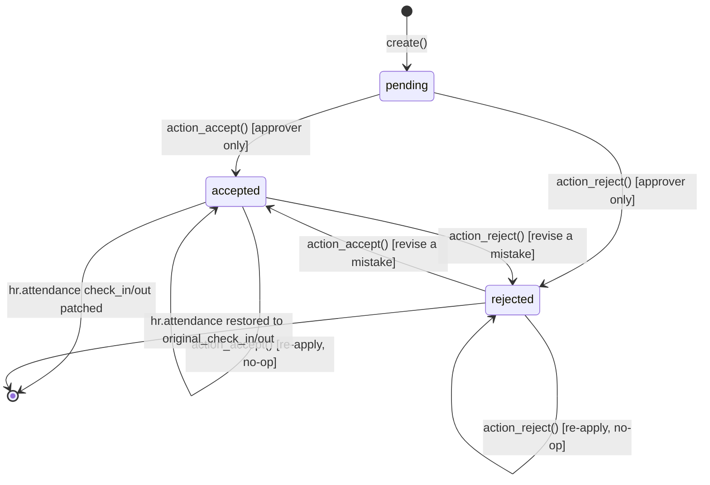
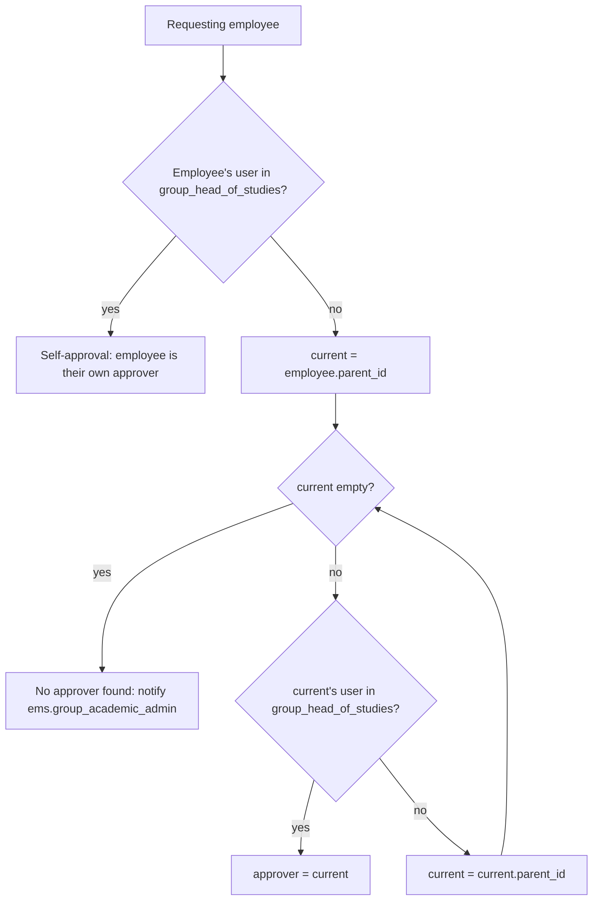

# Technical Reference: `ems.attendance_correction`

## Overview

`ems.attendance_correction` lets an employee request a correction of the check-in and/or check-out time on one of their own `hr.attendance` records (the native Odoo employee attendance model). The request is routed automatically to the nearest ancestor in the employee's manager chain who holds the Head of Studies (or Deputy Head of Studies) security group, and stays `pending` until that approver accepts (patching the attendance) or rejects it (leaving the attendance untouched). The requester is notified either way.

**Module file:** `models/attendance/attendance_correction.py`

---

## Data Model

### Fields

| Field | Type | Required | Stored | Description |
|-------|------|----------|--------|-------------|
| `attendance_id` | `Many2one → hr.attendance` | Yes | Yes | The attendance record being corrected |
| `employee_id` | `Many2one → hr.employee` (related) | — | Yes | From `attendance_id.employee_id` |
| `original_check_in` | `Datetime` (snapshotted at `create()`) | — | Yes | `attendance_id.check_in` at the time the request was made — not related, so it survives `action_accept()` overwriting the attendance |
| `original_check_out` | `Datetime` (snapshotted at `create()`) | — | Yes | `attendance_id.check_out` at the time the request was made, same reasoning |
| `requested_check_in` | `Float` (`float_time` widget) | No | Yes | Desired new check-in **time of day** (optional) — the date is not editable, see below |
| `requested_check_out` | `Float` (`float_time` widget) | No | Yes | Desired new check-out **time of day** (optional) — the date is not editable, see below |
| `reason` | `Text` | Yes | Yes | Why the correction is needed |
| `state` | `Selection` | Yes | Yes | `pending` / `accepted` / `rejected` |
| `approver_id` | `Many2one → res.users` | No | Yes | Stamped on decision |
| `decision_date` | `Datetime` | No | Yes | Stamped on decision |
| `decision_note` | `Text` | No | Yes | Optional note left by the approver |

At least one of `requested_check_in` / `requested_check_out` is enforced both at the Python level (`@api.constrains`) and at the DB level (`_sql_constraints`).

**Time-only correction:** a teacher can only request a different *time of day*, not a different date — the date is always taken from the original `hr.attendance` record. `_combine_date_and_time()` converts the original `check_in`/`check_out` (UTC) to the company's local timezone via `ems.datetime_utils.utc_datetime_to_local()`, keeps its `.date()`, and combines it with the requested float time via `time_float_to_utc_datetime()` (same mixin, reused rather than re-implemented — see the `ems.attendance_template`/`attendance_schedule` cron code for the other consumer of this helper). If `check_out` isn't set yet (still clocked in) and a check-out time is requested, `check_in`'s date is used instead since there is no original check-out to anchor to.

### State Machine

The approver isn't locked into their first decision — `action_accept()`/`action_reject()` can be called again at any time (not just while `pending`) to revise a mistaken decision. Both methods always work off the snapshotted `original_check_in`/`original_check_out`, never off whatever `hr.attendance` currently holds, which is what makes switching back and forth safe/idempotent.

### Approver Resolution

There is no per-teacher "reports to a specific Head of Studies" field in EMS: `role_hos` and `role_dhos` are both mapped to the same global `ems.group_head_of_studies` security group (see `data/main/ems.role_group_relationship.xml`). The approver is instead resolved by walking the native `hr.employee.parent_id` (manager) chain, implemented as `hr.employee.find_head_of_studies()`:

Since `group_head_of_studies` implies `group_tutor` which implies `group_teacher`, any Head of Studies/Deputy/Director/Academic Admin can also see and decide on **any** pending request (the group is global, not scoped per branch) — this is a known limitation of the v1 prototype, consistent with how `hr_attendance.group_hr_attendance_manager` already grants full attendance access today.

---

## CRUD Operations

### Create

A teacher opens one of their own `hr.attendance` records and clicks **Request Correction** in the header, which opens `ems.attendance_correction` in a dialog with `attendance_id` pre-filled. `requested_check_in`/`requested_check_out` default (`_default_requested_time()`) to the original time of that attendance, so the requester only has to tweak the value that's wrong. If the original `check_out` isn't set yet (employee still clocked in), `_schedule_time_for()` falls back to the requester's `resource.calendar` (working schedule) for that weekday — earliest `hour_from` for check-in, latest `hour_to` for check-out — instead of leaving the field blank. On `create()`, the resolved approver(s) get a `mail.activity` to-do (activity type `ems.mail_activity_attendance_correction`) and the record's chatter logs the request.

### Read

Teachers see their own requests (`views/attendance/attendance_correction/list.xml`); Head of Studies/Director/Academic Admin see all pending and historic requests, under the native "Attendances" menu. The list defaults to the **Pending** filter (`action_attendance_correction_tree`'s `context: {'search_default_pending': 1}`), matching the same pattern already used by `ems.student.document` — an approver isn't forced to wade through already-decided requests by default. The search view also exposes standalone **Accepted**/**Rejected** filters, so switching to (or combining) any other state, or removing the default filter to see all requests, is a single click. `action_view_corrections()` (the "Corrections" smart button on `hr.attendance`) explicitly resets the context to `{}` when drilling into one specific attendance's requests, so that view is never filtered.

### Update / Decide

Only the resolved approver (or an Academic Admin) may call `action_accept()` / `action_reject()` — this permission check (`_check_approver()`) is the only gate; there is no `state == 'pending'` restriction, so a decision can be revised later:
- `action_accept()`: combines `requested_check_in`/`requested_check_out` (whichever were set) with the snapshotted `original_check_in`/`original_check_out` date and writes the result onto `attendance_id`, marks the activity done, stamps `approver_id`/`decision_date`, notifies the requester.
- `action_reject()`: restores `attendance_id.check_in`/`check_out` to the snapshotted originals (a no-op if never accepted), same stamping/notification.

`reason` (set by the requester) is `readonly="id"` in the form — editable only in the creation dialog, never afterward, including by the approver or an admin. `decision_note` has no such restriction, since it's expected to be updated across multiple decision revisions.

### Delete

Only Academic Admin can delete correction requests (audit trail is otherwise kept).

---

## Access Control

| Role | Create | Read | Write | Delete | Group XML ID |
|------|:------:|:----:|:-----:|:------:|--------------|
| Administrator | ✓ | ✓ | ✓ | ✓ | `ems.group_academic_admin` |
| Head of Studies / Deputy / Director | — | ✓ | ✓ | — | `ems.group_head_of_studies` |
| Teacher | ✓ | ✓ | — | — | `ems.group_teacher` |

Record rules (`security/rules/attendance.xml`): Admin unrestricted; Head of Studies unrestricted (global group, see limitation above); Teacher restricted to `employee_id.user_id = user.id`.

---

## Integration Map

| Model | Field | Relation | Description |
|-------|-------|----------|--------------|
| `hr.attendance` | `attendance_id` | Many2one (required) | The attendance record being corrected; header button added via inherited view |
| `hr.attendance` | `correction_ids` / `correction_count` | One2many (inverse of `attendance_id`) / computed | Lets the attendance form show a "Corrections" smart button with a count, opening `action_view_corrections()` (domain-filtered reuse of `action_attendance_correction_tree`) |
| `hr.employee` | `find_head_of_studies()` | method | Resolves the approver by walking `parent_id` |
| `mail.activity.type` | `ems.mail_activity_attendance_correction` | data record | Dedicated activity type for the approval to-do |

---

## Views

| View | File | Notes |
|------|------|-------|
| List | `views/attendance/attendance_correction/list.xml` | Employee, attendance, requested times, state; `create="false"` — records can only be created from the "Request Correction" button, never from this list |
| Form | `views/attendance/attendance_correction/form.xml` | Statusbar + Accept/Reject buttons (visible to the resolved approver only) |
| Search | `views/attendance/attendance_correction/search.xml` | Pending/Accepted/Rejected filters + group by status/employee; `action_attendance_correction_tree` defaults to `search_default_pending: 1` |
| Menu | `views/attendance/attendance_correction/menu.xml` | Under the native "Attendances" root menu, sibling to Overview/Management |
| `hr.attendance` header button + smart button | `views/attendance/attendance_correction/hr_attendance_form.xml` | Inherits `hr_attendance.hr_attendance_view_form`: adds "Request Correction" to `//header`, and a "Corrections" stat button (count) before the first `<group>` that opens the same list/form (domain-filtered to that attendance) via `action_view_corrections()` |

---

## Data Files

| File | Purpose |
|------|---------|
| `data/main/ems.mail_activity_type.xml` | Adds the `mail_activity_attendance_correction` activity type |

---

## Follow-ups (out of scope for v1)

- Per-department scoping of Head of Studies visibility, if the flat/global model becomes a real problem in practice.

Note: a dedicated `mail.template` for the decision email was considered and dropped — `message_post(partner_ids=...)` already emails the requester as a mail notification (visible in the chatter added to the form), which covers the "notify by email" requirement without extra plumbing.
