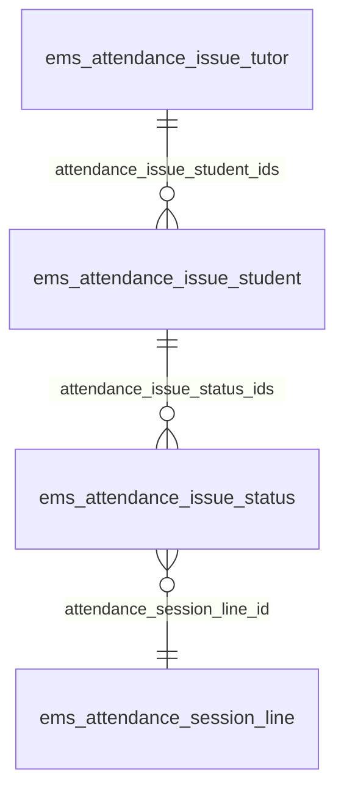

# Technical Reference: `ems.attendance_issue_tutor` / `_student` / `_status`

## Overview

**Not dead code** — despite `attendance_status.md`'s note that the "Issue" *status value*
(`ems.attendance_status_issue`) was conceptually superseded by [`ems.strike`](../coexistence/strike.md),
this three-model group is a completely different, very much live thing: the
notification-tracking backend written to by
[`ems.attendance_session_line._update_notification()`](attendance_session.md#notification-pipeline-create--emsattendance_session_linewrite)
every time a line's status becomes `notifiable` (e.g. `miss`). Confirmed not dead code by
this pass — checked explicitly per the roadmap's own open question, since it has real
list/form views under Attendance → "Daily issues" and Attendance → Configuration →
"Notifications" (both registered in `__manifest__.py`).

Three-level hierarchy, one row per level per (day, tutor, student, notifiable session line):



- **`ems.attendance_issue_tutor`** — one per (tutor, day): the unit the **daily tutor
  digest** email is built around.
- **`ems.attendance_issue_student`** — one per (tutor-day, student): purely a grouping
  level, no notification of its own.
- **`ems.attendance_issue_status`** — one per notifiable session line: the unit the
  **family/student** email is built around, and what actually stores
  `notification_id` (a `queue.job`) for that specific notification.

**Module file:** `models/attendance/attendance_issue.py` (`EmsAttendanceIssueTutor`, `EmsAttendanceIssueStudent`, `EmsAttendanceIssueStatus`)

---

## `send_notification()` — two independent notification tracks

- **`EmsAttendanceIssueTutor.send_notification()`**: one email, the tutor's own daily
  digest (`mail_attendance_issue_tutor`), scheduled via `with_delay()` from
  `attendance_session.py`'s `_schedule_daily_assistance_notification` — timed for the end
  of the tutor's working day (from their `resource_calendar_id`, or a company-wide default).
- **`EmsAttendanceIssueStatus.send_notification()`**: one email **per recipient**, sent
  individually (no BCC field on `mail.template`, and personal addresses must stay
  separated) — the student themselves (`mail_attendance_issue_status_student`) and each
  family contact (`mail_attendance_issue_status_family`), or
  `mail_attendance_issue_rectification` for everyone if `self.rectification` is set
  (status changed *after* the family was already notified once — see
  `attendance_session.py`'s scenario table). Scheduled via
  `_schedule_family_assistance_notification`, after a configurable delay
  (`res.company.attendance_issue_status_delay`, default 15 min) — enough time for a
  same-period status correction to happen before anyone gets emailed.

---

## Two real bugs found and fixed in this pass

Both were only ever exercised by `with_delay()`'s queued job actually running — since
nothing in the existing test suite (there was none before this pass) ever forced that,
**neither had ever been caught**. Both are the kind of failure a queue-job system hides
well: the job just sits in a `failed` state in the "Notifications" list
(`queue.job` records, `Attendance → Configuration → Notifications`) rather than surfacing
anywhere a developer would normally look.

### 1. Crash bug — stale `ca_ES`/`es_ES` translations referenced a renamed field

`mail_attendance_issue_status_student`/`_family`'s "Status:" row used
`t-field="object.attendance_status_id"` in the English source — correct, matching the
`status` → `status_id` field rename from the migration documented in
[`attendance_status.md`](attendance_status.md#field-rename-status--status_id). But
`i18n/ca_ES.po`/`i18n/es_ES.po`'s translation blocks for these two templates' `body_html`
were never updated during that migration — both `msgid` *and* `msgstr` still referenced the
old, now-nonexistent `object.attendance_status` (no `_id`). Odoo applies a `.po` `msgstr` to
a record field by matching the `#:` **reference** (module/model/field/xmlid), not by
diffing `msgid` against the live source — so this stale translation kept being applied on
every `./upgrade.sh`, silently overwriting the (correct) English content with broken markup
for any `ca_ES`/`es_ES` recipient.

**Impact:** confirmed via direct DB query (`SELECT body_html->>'ca_ES' FROM mail_template
...`) that the live stored translation had the broken reference. Since `ca_ES` is this
deployment's default language, **every family/student attendance notification email was
failing** — `send_notification()` raised `QWebException`/`KeyError: 'attendance_status'`
the moment the queued job tried to render it. Confirmed reproducible by a direct test
(`test_status_send_notification_does_not_raise`) before the fix. Fixed by correcting both
`msgid` and `msgstr` in both `.po` files to `object.attendance_status_id`.

**Lesson for future field renames:** the "All literals must be translatable" workflow (see
CLAUDE.md) covers `ir.model.fields`/plain `_()`-wrapped strings via the reused-label/`#:`
reference check, but a **translatable `Html`/`Text` field's `msgid` is the entire block of
markup** — renaming a field referenced *inside* that markup (a `t-field`/`t-out` expression)
is a content change to the msgid itself, not just a code change, and needs the exact same
`.po` msgid/msgstr update as any other renamed-placeholder case (same pattern as the
exit-wizards `%(name)s` renames elsewhere in this rollout) — easy to miss precisely because
it's *inside* a large HTML blob, not a short user-facing string.

### 2. Wrong-content bug — rectification email's "Status:" row showed the wrong field

`mail_attendance_issue_rectification`'s "Status:" row used
`t-field="object.attendance_session_line_id"` (a Many2one to
`ems.attendance_session_line`, rendering as `"{session display_name} | {student
display_name}"`) instead of `object.attendance_status_id` — a copy-paste mistake in the
**English source itself** (not a translation issue), so it affected every language. Didn't
crash (a valid field, just the wrong one) — the rectification email's status line silently
echoed session/student info that's already shown two rows above, instead of the corrected
attendance status. Fixed in `mails/attendance/attendance_issue_rectification.xml` and both
`.po` files' `msgid`/`msgstr` for that block.

---

## The same crash again, on the tutor template (2026-09-09)

The "lesson for future field renames" above was written on 2026-07-28 and did not prevent a
recurrence: `18.0.0.22.0` renamed `ems.attendance_issue_status.attendance_status` (Selection)
to `attendance_status_id` (Many2one), updated `mails/attendance/attendance_issue_tutor.xml`,
and again left both `.po` blocks untouched — so `mail_attendance_issue_tutor`'s `ca_ES`/`es_ES`
`body_html` kept rendering `t-field="status.attendance_status"` and raising
`KeyError: 'attendance_status'`.

Diagnosed against a production dump (2026-09-09): job `1855` failed with that error, and no
`queue.job` for `ems.attendance_issue_tutor` had ever reached `done`. Unlike the 2026-07-28
occurrence, this one affected **every** recipient rather than only the non-English ones:
`hr_employee.lang` is empty for all 129 employees, so the template's `{{object.tutor_id.lang}}`
never resolves and the render falls back to the executing user's language — and all 688 active
users are `ca_ES`. The correct `en_US` body is unreachable in that deployment.

Two things were needed, because the `.po` correction alone does not repair an existing database:

- `i18n/ca_ES.po`/`i18n/es_ES.po` corrected (`msgid` and `msgstr`), which repairs development —
  `upgrade.sh` runs with `--i18n-overwrite`, and in that mode the imported value wins.
- `migrations/18.0.0.24.0/pre-migrate.py`, which repairs production — `deploy.sh` runs *without*
  that flag, and the importer's no-overwrite branch puts the existing database value last in the
  jsonb merge, so a broken translation already stored there survives every subsequent deploy.

**Why a documented lesson was not enough, and what replaces it:** matching for a whole
translatable field's `.po` block is done on its `#:` xmlid reference alone — the `msgid` is
discarded (`odoo/tools/translate.py`, `TranslationImporter.load`) — so a stale `msgid` produces
no warning, no import error and no failing test; the only symptom is a queued job failing in a
language nobody develops in. `tests/test_mail_template_translations.py` now asserts, for every
EMS mail template, that no translated value uses a QWeb expression or `{{ }}` placeholder absent
from its English source. That is a mechanical check of the whole class, and it fails in CI on the
next rename that forgets a `.po`.

## `_compute_pending`: another real bug — multi-record crash

```python
@api.depends('notification_status')
def _compute_pending(self):
    for issue_status in self:
        issue_status.pending = self.notification_status is False or ...  # BUG: self, not issue_status
```

Used `self.notification_status` (the whole recordset) instead of `issue_status
.notification_status` (the current loop record) inside the per-record loop. Accessing a
scalar field on a multi-record recordset raises `ValueError: Expected singleton` in Odoo —
so this compute **crashed outright** whenever evaluated for more than one record at once,
e.g. the Daily Issues list view showing several rows, or simply reading `.pending` on 2+
statuses together (exactly what
`test_compute_pending_does_not_crash_on_multiple_records` does). Fixed by using the loop
variable consistently.

---

## `remove_if_empty()`: cleanup cascade

Called from two places: `ems.attendance_session_header.unlink()` (session deleted — clean
up that day's now-orphaned issue tracking) and `ems.attendance_session_line._update_notification()`
(a line's status flips back to non-notifiable *before* its notification was ever sent —
clean up immediately rather than leaving a dead tracking row). Cascades bottom-up: drops
any `attendance_issue_student` with no remaining `attendance_issue_status_ids`, then drops
the `attendance_issue_tutor` itself if it has no remaining students — cancelling the queued
`notification_id` job (`button_cancelled()`) at each level via `unlink()`'s own override.

## Views

| View | File | Notes |
|------|------|-------|
| List/Form (tutor digest) | `views/attendance/attendance_issue/{list,form}.xml` | "Daily issues" menu, `action_attendance_issue_tree` on `ems.attendance_issue_tutor` — this is the tutor-facing screen. |
| Notifications (queue.job) | `views/attendance/attendance_notification/menu.xml` | Admin-only by default (see the file's own NOTE); a filtered native `queue.job` list (`domain: [('model_name', 'like', '%attendance_issue%')]`), not a dedicated EMS view. |
| Embedded | `views/planning_grading/grading/year_record/form.xml` | `attendance_issue_count` (a computed field on `ems.student.year_record`, not covered by this file) shown read-only on the student's year record. |

**No tour added in this pass** — every screen here is read-only/system-generated (rows are
only ever created by the notification pipeline, never by a user filling in a form), so a
tour would mostly exercise static list/form rendering rather than any real interactive
logic; `TransactionCase` coverage of the actual business logic (this doc's two bugs, the
cleanup cascade) is the higher-value use of testing effort here, matching this rollout's
established "not every model needs a tour" judgment call (see e.g. `hr.job`'s DTON pass).

## Fixed in this pass (2026-07-28)

Classes renamed `ems_attendance_issue_tutor`/`_student`/`_status` →
`EmsAttendanceIssueTutor`/`_Student`/`_Status`. Loop variable `rec` → `issue_tutor`/
`issue_student`/`issue_status` throughout. `open_exception_popup`'s `'Error details'`
action title wrapped in `_()` (reused an existing translated label — added this file's own
`#:` reference to that block rather than duplicating it). The two mail-template bugs and
the `_compute_pending` crash above (all real, all fixed). New `tests/test_attendance_issue.py`
(10 tests, all with `IrMailServer.send_email` mocked per CLAUDE.md's email-safety rule) —
zero coverage existed before this pass.
