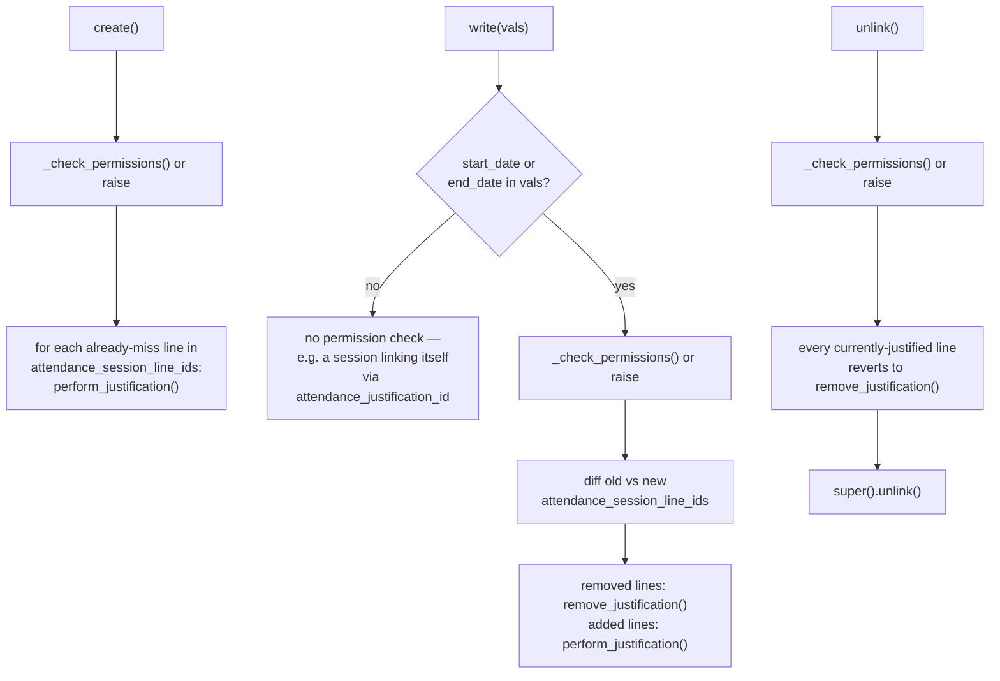

# Technical Reference: `ems.attendance_justification`

## Overview

An `ems.attendance_justification` is a tutor-entered proof-of-attendance covering a
date/time range for one student (e.g. "medical appointment, 2026-03-02 09:00–11:00") — it
retroactively re-marks any `miss` line within that range as `justified`, and going forward
acts as a *prevision*: a new session created within its range gets its line pre-filled as
justified instead of the usual default status. See
[`attendance_session.md`](attendance_session.md#_auto_populate_lines-continuation-vs-fresh-roll-call)
for how the prevision side is consumed.

**Module file:** `models/attendance/attendance_justification.py` (`EmsAttendanceJustification`)

**Only the student's own tutor (or an admin) can create/edit/remove a justification** —
enforced by `_check_permissions()` (`get_user_is_admin()` OR `get_user_is_tutor_of_self()`,
from the `ems.base` mixin), called from `default_get()` (blocks the form's "New" button
outright), `create()`, `write()` (only when `start_date`/`end_date` actually change — a
session linking itself to an existing justification also calls `write()`, and shouldn't be
gated the same way), and `unlink()`.

---

## Fields

| Field | Type | Notes |
|-------|------|-------|
| `attendance_session_line_ids` | `Many2many → ems.attendance_session_line` | Deliberately M2m, not M2o-inverse — a plain M2o on the line side would delete the status entries themselves when the justification's filters change, per the code's own NOTE. |
| `session_teacher_ids` | computed + stored, `readonly=False` | Every teacher (template or session) touched by the linked lines — an editable compute (same pattern as `product.template.ems_study_ids`, see [`enrollment_product_extension.md`](../enrollment/enrollment_product_extension.md)), used for `ir.rule` permission filtering. |
| `allowed_student_ids` | `Many2many`, not stored | Onchange-populated list of students the acting `teacher_id` may pick from (admin: everyone; otherwise: only their own tutorands). |
| `tutor_id` | `related='student_id.tutor_id'` | Read by `ems.base`'s `get_user_is_tutor_of_self()` for the permission check above. |

---

## `_check_time_overlap`

`@api.constrains('student_id', 'start_date', 'end_date')`: rejects `start_date >= end_date`,
and rejects any overlap with another justification for the **same student** (different
students' ranges never conflict — the domain filters by `student_id`).

---

## `create()` / `write()` / `unlink()`: syncing with session lines



`perform_justification(line, prevision=False)` and `remove_justification(line)` return a
plain **vals dict**, never write directly — callers decide when/how to apply it.
`perform_justification` has a documented dual calling convention: `line` is a real
`ems.attendance_session_line` **record** when called from this file's own `create()`/`write()`
(an actual justification), but a plain **dict** when called from
`attendance_session.py`'s `_auto_populate_lines()` (building a not-yet-created line's initial
values as a *prevision*) — `hasattr(line, '_name')` distinguishes the two. The resulting
`notes` are prefixed with `PREVISION_CAPTION`/`JUSTIFICATION_CAPTION` (`_lt`-lazy-translated
module constants) plus the acting teacher's name, so the roll-call always shows *who*
justified/expected the absence and *why* it says so.

---

## The `session_teacher_ids` back-link and why it needs `sudo()`

`rule_attendance_justification_teacher_own_read` (`security/rules/attendance.xml`) grants a
teacher read access to a justification when they appear in its `session_teacher_ids`. That
field is a stored compute over `attendance_session_line_ids`, so a teacher only becomes able
to read the justification **after** one of their own session lines has been linked to it.

The link itself is written by `EmsAttendanceSessionLine.create()`
(`attendance_session.py`), when a line is created carrying an `attendance_prevision_id`:

```python
line.attendance_prevision_id.sudo().attendance_session_line_ids = [(4, line.id)]
```

The `sudo()` is load-bearing, not defensive tidiness. Without it the acting teacher has to
write the very link that would grant them access, and `write()`'s override reads
`attendance_session_line_ids` on the way through — a read the record rules reject for a
teacher who is neither the student's tutor nor the justification's author. The result is a
chicken-and-egg `AccessError` that aborts the whole transaction, so the session is never
created and the slot cannot be rolled at all (issue #432). The back-link is system-driven
bookkeeping, not a user action, which is what makes `sudo()` the correct answer here — the
same reasoning as `get_current_justifications()`, which is already sudo.

For the same reason `write()` builds its `old_lines_map` (the old-vs-new line diff) only
when `start_date`/`end_date` are actually in `vals`, the single branch that consumes it.
Reading `attendance_session_line_ids` enforces the record rules, so doing it unconditionally
put a permission check in front of every unrelated write.

---

## Fixed in this pass (2026-07-28)

**Real bug found and fixed:** `student_id`'s domain was
`"[('contact_type', '=', 'student')"` — missing its closing `]`, invalid Python/domain
syntax. Domains on relational fields are evaluated **client-side** (the Many2one picker
widget), never enforced by the ORM itself, so no `TransactionCase` test could ever have
caught this — it would only surface as a broken student picker in the actual browser form.
Fixed to `"[('contact_type', '=', 'student')]"`; regression test
(`test_student_id_domain_is_valid_syntax`) parses the domain string with `ast.literal_eval`
to guard against this exact class of typo recurring silently. Two previously-untranslated
`ValidationError`s (`_check_time_overlap`'s two raises — one a plain string, one an f-string)
wrapped in `_()`, with new `ca_ES`/`es_ES` `.po` blocks.

Class renamed `ems_attendance_justification` → `EmsAttendanceJustification`. Whole file was
tab-indented — normalized to spaces. Loop variable `rec`/`record` → `justification`
throughout (and `ol`/`nl` → `old_line`/`new_line` in `write()`).
`super(ems_attendance_justification, self).write(vals)` simplified to `super().write(vals)`.

New `TestAttendanceJustificationPermissionsAndSync` test class (7 tests: tutor-only
create/write/unlink gating, auto-justify-on-create, un-justify-on-unlink,
`session_teacher_ids`) plus 4 new tests in the existing `TestAttendanceJustification` class
(start-after-end, `display_name`, the domain-syntax regression) — the existing 2 tests only
covered `_check_time_overlap`'s overlap branch.
