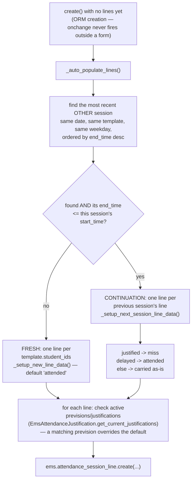
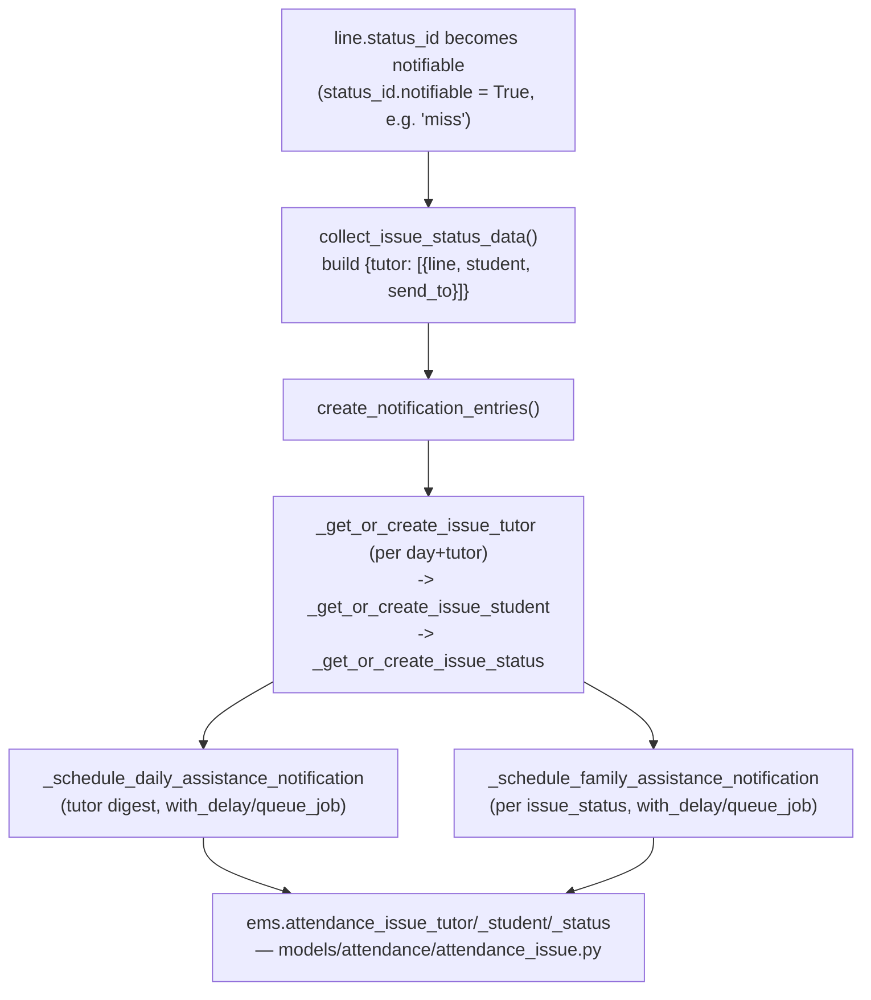

# Technical Reference: `ems.attendance_session_header` / `ems.attendance_session_line`

## Overview

The two models behind the daily roll-call: **`ems.attendance_session_header`** is one
concrete occurrence of an [`ems.attendance_schedule`](attendance_schedule.md) slot on a
given date (e.g. "Maths, group A, Monday 9:00–10:00, on 2026-03-02"); **`ems.attendance_session_line`**
is one row per student within that session, holding their `status_id`
([`ems.attendance_status`](attendance_status.md)) for that day.

**Module file:** `models/attendance/attendance_session.py` (`EmsAttendanceSessionHeader`, `EmsAttendanceSessionLine`)

---

## Session header: fields

Almost every field is derived from `attendance_schedule_id` → its `attendance_template_id`:

| Field | Source |
|-------|--------|
| `weekday`/`start_time`/`end_time`/`time_range` | `attendance_schedule_id`'s own fields |
| `start_date`/`end_date` | `date` (this session's actual day) combined with the schedule's `start_time`/`end_time`, timezone-converted |
| `group_ids`/`subject_id`/`space_id`/`study_ids`/`template_teacher_ids` | plain `related=` fields (e.g. `related="attendance_schedule_id.attendance_template_id.study_ids"`), `store=True` — genuine ORM `related` fields, not hand-written compute methods, so they need no `sudo()` of their own (Odoo's `related` resolution already runs with the necessary access) |
| `level_id` | **Not related to the template** — computed straight from `group_ids[:1].level_id` (`@api.depends("group_ids.level_id")`), since `ems.attendance_template` no longer has its own `level_id` (removed 2026-08-05, see [`attendance_template.md`](attendance_template.md)) |
| `session_teacher_id` | **Not derived** — who actually ran *this* session, defaults to the acting user's own `hr.employee`, but stays independent of the template's teacher set (covers substitution/guard-duty sessions) |
| `mode` | `scheduled` (normal roll-call) / `guard` (a substitute covering someone else's slot) / `manual` (ad-hoc, no schedule tie) |

`study_ids` (like `group_ids`/`template_teacher_ids` below) is a `Many2many`, so its `related`
field needs an explicit `relation`/`column1`/`column2` — Odoo doesn't auto-derive one for a
`related` M2M the way it would for a compute-based one (see the session-line note below).
`ems.attendance_session_line.study_ids` in turn is `related="attendance_session_id.study_ids"`,
one hop further down.

`_sql_constraints`: `UNIQUE(date, attendance_schedule_id)` — the actual concurrency guard
against two teachers creating the same day's session twice; `create()` catches the resulting
`IntegrityError` and re-raises as a friendly `ValidationError`.

---

## `_auto_populate_lines`: continuation vs. fresh roll-call

The continuation logic exists because a subject often spans two consecutive periods on the
same day (e.g. two back-to-back 55-minute slots) — a student marked `delayed` in the first
period is presumed to have arrived by the second (`attended`), while a `justified` absence
in the first carries forward as an unconfirmed `miss` in the second (not automatically
re-justified — the justification's own date range decides that, via the prevision check
below).

**`EmsAttendanceJustification.get_current_justifications(self, start_date, end_date)`** is
called unbound — `self` here is the *session*, not a justification recordset. This works
because the method's body only uses `self.env` (universal to any recordset), not any
justification-specific field — a deliberate, if unusual, code-reuse idiom in this codebase.
See [`attendance_justification.md`](attendance_justification.md).

---

## Notification pipeline (`create()` / `ems.attendance_session_line.write()`)

Every session `create()`, and every line `write()` (via `_update_notification()`), re-evaluates
whether the tutor/family need notifying:

The `ems.attendance_issue*` data models this pipeline writes to are documented separately —
see [`attendance_issue.md`](attendance_issue.md) for `send_notification()`'s actual email
templates and the rectification flow.

`ems.attendance_session_line.write()` unconditionally calls `_update_notification()` after
every write, regardless of which fields changed — it re-derives the previous/new
notification state from `get_issue_tutor`/`get_issue_student`/`get_issue_status` each time,
so a write to an unrelated field (e.g. `notes`) is a cheap no-op there rather than a bug.

### Real bug found and fixed in this pass

`collect_issue_status_data()` built `send_to = [student_id.student_email]`
**unconditionally** — if a student has no `student_email` set (a real, unremarkable state:
e.g. a newly admitted student without a corporate email yet), that list contains `False`,
and the later `separator.join(send_to)` raised `TypeError: sequence item 0: expected str
instance, bool found`. This didn't just skip the notification — it crashed the *entire*
enclosing `write()`/`create()` call, meaning marking **any** such student's line as `miss`
(or creating a session that auto-populates one via the continuation logic) would fail
outright. Confirmed by a direct test before the fix (`test_continuation_session_justified_becomes_miss`,
which needs a `miss`-status line, failed with exactly this `TypeError`). Fixed by only
including `student_email` when it's actually set: `send_to = [student_id.student_email] if
student_id.student_email else []`.

---

## `copy()` / `unlink()`

`copy()` is blocked outright (`UserError`) — a session is a historical record of a specific
day's roll-call, duplicating it makes no sense. `unlink()` cascades (native `ondelete` on the
lines/issue tables) and additionally calls `remove_if_empty()` on any `ems.attendance_issue_tutor`
for that date, cleaning up now-orphaned notification-tracking rows.

## Guard mode (`get_guard_sessions`/`get_guard_planned`/`get_normal_sessions_and_planned`/`create_scheduled_session`/`write_guard_session_line`)

`@api.model` RPC endpoints backing the pass-list OWL component
(`static/src/js/backend/attendance_session_view.js`), all gated by `ems.group_teacher`/
`ems.group_academic_admin` membership and running under `sudo()` internally (a guard teacher
needs to see/edit sessions they don't personally own). `get_guard_sessions` returns today's
sessions **excluding** the caller's own (already shown in normal mode); `get_guard_planned`
returns not-yet-created schedules for **other** teachers today. `create_scheduled_session`
is the click-to-start-a-session entry point, returning whether the new session is a
same-day continuation (mirroring `_auto_populate_lines`' own check, so the client can decide
whether to show a "continuing from period 1" hint before the roll-call even loads).

---

## Session line: fields worth noting

| Field | Notes |
|-------|-------|
| `is_auto_generated` | Distinguishes a line the system created (from `_auto_populate_lines`) from one a teacher manually added — a manually-added line can be re-targeted to a different student (`_onchange_student_id`), an auto-generated one can't (would silently break the "no duplicate student per session" expectation the view enforces). |
| `absence_rate` | `0`/`100`, not a boolean — lets the "Attendance reports" pivot/graph's default `avg` measure resolve directly to a percentage. |
| `group_ids`/`study_ids` | `related` (from the header's own `group_ids`/`study_ids`), each with an explicit custom `relation`/`column1`/`column2` — a `related` M2M field doesn't auto-derive a relation table the way a compute-based one does; the explicit names here also keep them under PostgreSQL's 63-character identifier limit. |
| `strike_count` | Stored so it works as a pivot/graph measure; a strike is created separately (`ems.strike`, see [`strike.md`](../coexistence/strike.md)) and merely links back via `attendance_session_line_id`. |

## Fixed in this pass (2026-07-28)

Classes renamed `ems_attendance_session_header`/`ems_attendance_session_line` →
`EmsAttendanceSessionHeader`/`EmsAttendanceSessionLine`. Whole file was tab-indented —
normalized to spaces. Loop variable `rec` → `session`/`line` throughout.
`super(ems_attendance_session_line, self).write(vals)` simplified to `super().write(vals)`.
**Dead code removed:** `_compute_attendance_session_display_name` (on
`EmsAttendanceSessionLine`) was never wired to any field — no `attendance_session_display_name`
field was ever declared on this model, so the method could never actually run (nothing in
Odoo's compute-dispatch graph referenced it). Leftover from an abandoned field addition;
removing it changes no behavior. The `collect_issue_status_data` crash above (real bug,
fixed). New `tests/test_attendance_session.py` (18 tests across both classes) — zero
coverage existed before this pass on either model.

## Changed in this pass (2026-08-05)

`level_id` no longer mirrors the template (which no longer has one) — recomputed from
`group_ids[:1].level_id` instead. `study_id` (`Many2one`) → `study_ids` (`Many2many`) on both
`ems.attendance_session_header` and `ems.attendance_session_line`, following the same rename
on `ems.attendance_template`. `group_ids`/`subject_id`/`space_id`/`template_teacher_ids`
converted from `sudo()`-laden compute methods to genuine `related=` fields (see
[`attendance_template.md`](attendance_template.md) for the full identity-field-locking
context this is part of).

## Fixed in this pass (2026-09-04): Guard mode blank screen after starting a covered session

Clicking "Start session" on a colleague's not-yet-started slot in Guard mode created the session
and loaded its student lines correctly, but the OWL component (`attendance_session_view.js`)
rendered "No sessions or scheduled timetables for this day" instead of the roll-call table.
Cause: the instant a guard-covered session is created, its `session_teacher_id` becomes the
covering teacher's own employee (see "Guard mode" above) — exactly the condition
`get_guard_sessions()` uses to exclude it, since it now belongs under Normal/Manual mode's own
view instead (avoiding showing it twice). `onStartSession()` calls `_loadAll()` — which wipes
`state.sessions`/`state.planned` via that same exclusion — *before* re-selecting the new session
and loading its lines directly by id, and the template's own "nothing at all" empty-state check
only looked at those (now guard-mode-empty) lists, never at whether `state.lines` had actually
loaded. Fixed in `attendance_session_view.xml`: the empty-state condition now also checks
`!state.lines.length`. First browser tour coverage for Guard mode
(`static/tests/tours/attendance_session_tour.js` → `ems_attendance_session_guard`,
`tests/test_attendance_session_tour.py`) is what caught this — `get_guard_planned` also had zero
backend test coverage before this pass. The same tour file's other entry
(`ems_attendance_session_continuation`) covers the same-day continuation banner/auto-copy
described above, likewise previously untested in a real browser.

## Search view: "Archived" filter added, `session_teacher_id` made searchable (2026-08-06, phase 8 of `plans/course_transition_teacher_schedule_archival.md`)

`views/attendance/attendance_session/search.xml` had no `<filter name="inactive">` at all — an
archived session (e.g. one belonging to a schedule line archived by the course transition
wizard, see `course_transition_wizard.md`) was simply unreachable from the "History" list's own
search bar, since Odoo does **not** auto-add this filter for models with an `active` field (it
has to be declared explicitly — confirmed empirically, see the sibling note in
`attendance_template.md`). Also added a plain `<field name="session_teacher_id" string="Teacher">`
so free-text search can find a session by teacher name at all, not just via the (already
existing) "Show only mine" filter.
