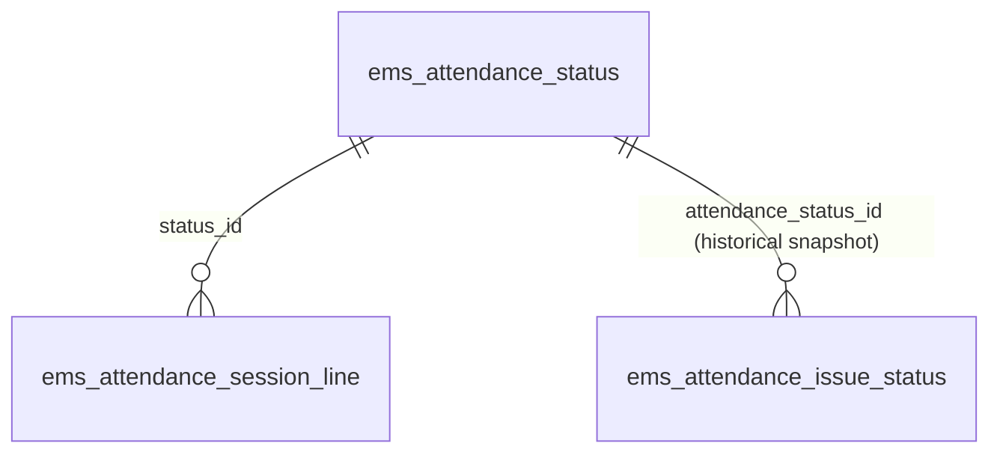

# Technical Reference: `ems.attendance_status`

## Overview

`ems.attendance_status` replaces what used to be a hardcoded Python `Selection` list (`attendance_status_selection` in `models/attendance/attendance_session.py`) backing `ems.attendance_session_line.status_id`. The change lets an Administrator add or retire a status from **Attendance → Configuration → Sessions → Statuses** without a code change — retiring means archiving (`active = False`), never deleting, so historical `ems.attendance_session_line`/`ems.attendance_issue_status` rows that already reference a status keep resolving correctly.

**Trigger for this change:** the "Issue" status (`ems.attendance_status_issue`) is now redundant — `ems.strike` (see [ems.strike](../coexistence/strike.md)) covers the same "something happened worth flagging" case with a proper record (reason, notes, kicked-out flag, notifications), so `ems.attendance_status_issue` ships **archived from the start**, seeded only so existing historical rows keep a valid reference.

**Module files:** `models/attendance/attendance_status.py`, `models/attendance/attendance_session.py` (own fields/logic in [`attendance_session.md`](attendance_session.md)), `models/attendance/attendance_justification.py` (own fields/logic in [`attendance_justification.md`](attendance_justification.md)), `models/attendance/attendance_issue.py` (own fields/logic in [`attendance_issue.md`](attendance_issue.md) — **not dead code**, despite the "Issue" status value below being superseded), `models/attendance/attendance_reports.py`.

---

## Data Model

| Field | Type | Description |
|-------|------|--------------|
| `name` | `Char` (translate) | Label shown in the passlist buttons, radio widget, and reports |
| `sequence` | `Integer` | Ordering, matches the original enum order (Attended, Minor Delay, Severe Delay, Miss, Justified Miss, Issue) |
| `active` | `Boolean` | Archivable without deleting historical references |
| `category` | `Selection` (`assistance`/`absence`) | Replaces the old `a_`/`m_` code-prefix convention (`attendance_status_selection`'s comment: *"status starting with 'a_' will be computed as an 'attendance' and starting with 'm_' as a 'm_miss' when reporting summary data"*) — now an explicit field instead of a naming convention, read by `_report_data` in `attendance_reports.py` for the Assistance/Absence breakdown |
| `notifiable` | `Boolean` | Replaces the hardcoded `ems_attendance_session_line.status_is_notificable()` check (`self.status in ['m_miss', 'a_issue']`) — now `bool(self.status_id.notifiable)` |
| `color` | `Char` (hex, `ems.hex_color_mixin`) | Text color used for this status in the per-session printed report (`reports/attendance/session.xml`); same free-pick color widget as `ems.role`/`ems.attendance_template` |

Seed data (`data/main/ems.attendance_status.csv`), fixed xmlids so the migration backfill and the business-logic `env.ref()` lookups below have a stable target:

| xmlid | name | category | notifiable | active |
|-------|------|----------|:----------:|:------:|
| `ems.attendance_status_attended` | Attended | assistance | — | ✓ |
| `ems.attendance_status_delayed` | Minor Delay | assistance | — | ✓ |
| `ems.attendance_status_delayed_severe` | Severe Delay | **absence** | ✓ | ✓ |
| `ems.attendance_status_miss` | Miss | absence | ✓ | ✓ |
| `ems.attendance_status_justified` | Justified Miss | absence | — | ✓ |
| `ems.attendance_status_issue` | Issue | absence | ✓ | **✗ (archived)** |

**Minor vs. severe delay:** originally there was a single "Delayed" status (`category = assistance`,
never counted as an absence). A severe delay needed to count as an absence and notify the family,
so a second record (`ems.attendance_status_delayed_severe`) was added instead of adding a new
mechanism — the existing generic `category`/`notifiable` fields already do the job with no code
change in any of the absence-rate computations (`_compute_absence_rate`, `_report_data`,
`_attendance_rates`), which all filter by `category` rather than enumerating specific xmlids. The
original "Delayed" record was renamed to "Minor Delay" (same xmlid, same behaviour) to read clearly
alongside the new "Severe Delay". The two are independent statuses a teacher picks directly at
roll-call — there is no automatic escalation from repeated minor delays. The one place that *does*
need to know about both xmlids is `_setup_next_session_line_data()` (see below): a severe delay
resets to "Attended" on the next period's line, exactly like a minor one — a delay of either kind
only ever applies to the single period it was marked in.

---

## Field rename: `status` → `status_id`

`ems.attendance_session_line.status` (`Selection`) became `status_id` (`Many2one → ems.attendance_status`, required). `ems.attendance_issue_status.attendance_status` (`Selection`, a point-in-time snapshot — "a miss can be justified later, but the original notification status shouldn't change") became `attendance_status_id` (`Many2one`) for the same reason: same semantics, just an id reference instead of a string code.

Business logic that used to compare/write string codes now goes through `env.ref()` on the fixed xmlids above instead:
- `attendance_session.py`: `status_is_notificable()`, `_setup_new_line_data()`, `_setup_next_session_line_data()`, `_get_or_create_issue_status()`, `_update_notification()`.
- `attendance_justification.py`: the "which sessions need a justification/prevision" search domain (`_onchange_attendance_session_line_ids`), `perform_justification()`/`remove_justification()`, and the `create()`/`unlink()` guards that only act on lines currently `m_miss`/`m_justified`.

**Frontend (`static/src/js/backend/attendance_session_view.js`):** `_loadStatuses()` used to read the field's `selection` attribute via `fields_get` — that no longer applies to a `Many2one`, so it now does a `searchRead` on `ems.attendance_status` (active-filtered by default, so the archived "Issue" status never appears as a clickable button) ordered by `sequence`. `onStatusClick`/`_writeSessionLine` write `status_id` instead of a string; the roll-call table's status buttons are otherwise unchanged — they were already generic (rendered from whatever `_loadStatuses()` returns, no per-value branching).

**Reports:** `student.xml`/`subject.xml`/`group.xml` needed no template changes at all — their `main.breakdown`/`attendance_session_line` dicts are purely key-driven (`t-foreach="main.breakdown" t-as="s"` then `attendance_session_line[s]`), so switching the dict keys from status codes to status ids in `attendance_reports.py` is transparent to the templates. `reports/attendance/session.xml` did need a template change: its 5-branch hardcoded `t-elif="entry.status == 'a_attended'"`/etc. color chain became a single lookup of `entry.status_id.color`.

---

## Migration

Existing `ems.attendance_session_line.status`/`ems.attendance_issue_status.attendance_status` rows have real production data (string codes). Merged into the **existing, not-yet-released** `migrations/18.0.0.22.0/post-migrate.py` (the developer chose not to bump the manifest version for this — 0.22.0 is what ships to production) rather than a new version folder. Backfill runs in `post-migrate` (the new `status_id`/`attendance_status_id` columns don't exist until Odoo's schema sync between pre- and post-migrate, and the seed `ems.attendance_status` records need to already be loaded to resolve xmlids — both true by the time `post-migrate` runs), then drops the now-unused `status`/`attendance_status` columns. Odoo's own schema sync never drops orphaned columns automatically (confirmed against `odoo/modules/loading.py` — no code path does it), so without this explicit `DROP COLUMN` they would otherwise sit unused in the database forever.

---

## Views

| View | File |
|------|------|
| List/Form (statuses, admin config) | `views/attendance/attendance_status/{list,form}.xml` |
| Menu (Attendance → Configuration → Sessions → Statuses) | `views/attendance/attendance_status/menu.xml` |
| Session form radio widget | `views/attendance/attendance_session/form.xml` (`status_id`, `widget="radio"` — supports `many2one` in Odoo 18, same as it supported `selection` before) |

## Access Control

| Role | Create | Read | Write | Delete |
|------|:------:|:----:|:-----:|:------:|
| Administrator | ✓ | ✓ | ✓ | ✓ |
| Teacher | — | ✓ | — | — |

Same pattern as `ems.strike.reason` (`security/ir.model.access.csv`) — teachers need read access for the roll-call/report widgets, only Administrators manage the list.
