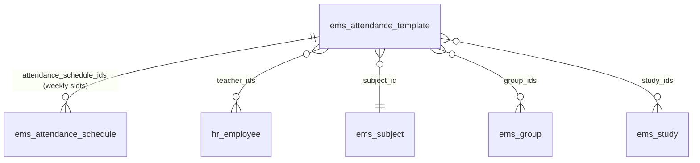
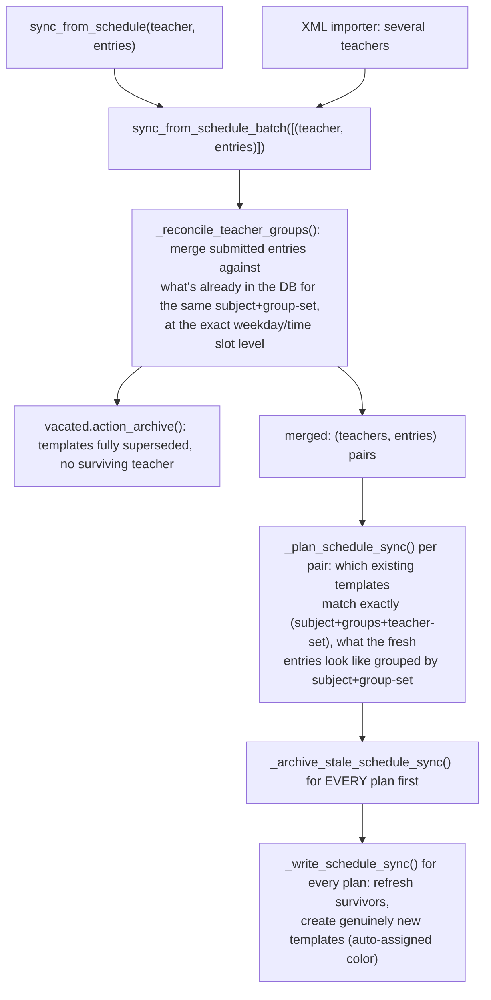

# Technical Reference: `ems.attendance_template`

## Overview

An `ems.attendance_template` answers "who teaches what, where and for whom": one record groups a teacher-set + subject + set of groups into a weekly schedule, its `attendance_schedule_ids` — the actual weekday/start_time/end_time slots, each carrying its **own** enrolled-student roster (`student_ids`, moved here from the template 2026-08-11 - see [`attendance_schedule.md`](attendance_schedule.md), and `plans/calendar_driven_attendance_templates.md`, point 1). Templates are the backbone that turns a raw weekly schedule (imported from an XML planner file, or edited live from a teacher's own "Schedule" tab) into what the attendance roll-call screens actually check students against.

**Templates are NOT creatable or archivable directly by anyone, admin included** (`plans/calendar_driven_attendance_templates.md`, point 3, 2026-08-11) — they only ever come into existence, or go away, as a consequence of `sync_from_schedule_batch()` reconciling a teacher's calendar (or a course transition archiving one). See "Access control" below for the actual enforcement mechanism. The form/list views exist purely for inspecting the result and correcting non-identity fields (color, etc.) - never for creating or archiving one by hand.

`ems.attendance_template` also carries `mail.thread`/`mail.activity.mixin` (chatter) — every archive/clone the sync pipeline performs, and any manual non-identity-field edit, is tracked there.

**Module files:** `models/attendance/attendance_template.py`, `views/attendance/attendance_template/`, `models/shared/hex_color_mixin.py` (color), `models/attendance/attendance_schedule.py` (the weekly slots, own fields/logic documented in [`attendance_schedule.md`](attendance_schedule.md)).

## Relations

`student_ids` (the enrolled-student roster) is **not** a direct relation of this model - it lives on
`ems_attendance_schedule` instead, see [`attendance_schedule.md`](attendance_schedule.md).

`study_ids` is **not required** — a template built from a *reinforcement* `ems.group` (`group_type == 'reinforcement'`) has no study of its own and leaves it empty (see `_write_schedule_sync`). There is no `level_id` on this model anymore (removed 2026-08-05, see "Identity fields and locking" below) — a level is always derivable from `group_ids`/`study_ids` when needed (e.g. `ems.attendance_session_header.level_id`, still on the session side, is computed straight from `group_ids[:1].level_id`).

## Data model

| Field | Type | Notes |
|-------|------|-------|
| `start_date` / `end_date` | `Date`, required | The template's active date range |
| `color` | `Char` (hex) | Free-pick display color, auto-assigned on creation — see [Free-pick color widget](../shared/color_widget.md) |
| `teacher_ids` | `Many2many → hr.employee` | Required. Domain restricted to `employee_type = 'teacher'`. More than one teacher means co-teaching. Unconditionally locked (write() guard, not just view `readonly`) — see "Identity fields and locking" |
| `subject_id` | `Many2one → ems.subject` | Required. Domain restricted to `allowed_subject_ids`. Unconditionally locked |
| `study_ids` | `Many2many → ems.study` | Optional (see above). Unconditionally locked |
| `group_ids` | `Many2many → ems.group` | Required (`_check_group_ids`). Domain restricted to `study_id in study_ids`. Unconditionally locked |
| `allowed_subject_ids` | `Many2many → ems.subject`, computed, non-stored | Subjects available in **every** one of `study_ids` (intersection, not union) — backs `subject_id`'s domain and `_check_subject_valid_for_all_studies` below. Empty `study_ids` means no restriction (all subjects allowed) |
| `attendance_schedule_ids` | `One2many → ems.attendance_schedule` | The actual weekly weekday/start_time/end_time slots. No `space_id` on the template itself (removed 2026-08-11) — each line carries its own |
| `has_sessions` | `Boolean`, computed | `True` once any of this template's schedules has a real `attendance_session_ids` entry — see "Identity fields and locking" below |
| `read_only_user` | `Boolean`, non-stored | `True` unless: admin, one of `teacher_ids`, or the record's own creator |

### `_check_subject_valid_for_all_studies`

`@api.constrains('subject_id', 'study_ids')`: rejects a `subject_id` that isn't in `allowed_subject_ids` whenever `study_ids` is non-empty — i.e. the chosen subject must actually be taught in **every** selected study, not just one of them. A reinforcement template (no `study_ids`) is never subject to this.

## Identity fields and locking

**As of 2026-08-11, the template's identity/logistics fields — `teacher_ids`, `subject_id`,
`study_ids`, `group_ids`, `start_date`, `end_date` (`active` already was) — are UNCONDITIONALLY
locked** via a `write()` guard, not just once `has_sessions` becomes true (see "Lock extended to
every identity/logistics field" under "Access control" below for the full mechanism/reasoning). The
same applies to each schedule line's own `weekday`/`space_id`/`start_time`/`end_time`/
`attendance_template_id` (line-level, see [`attendance_schedule.md`](attendance_schedule.md)) —
only `color` (template) and `student_ids` (schedule line) stay freely writable. Before this pass,
these fields were only locked once real sessions existed (`has_sessions`); the developer's own call
was that editing them by hand is never legitimate, session history or not, since a template's
identity should only ever reflect what the calendar itself says — direct edits risked drifting the
two out of sync even before any attendance was ever taken.

Editing them in place after real sessions exist would additionally retroactively misrepresent what
those already-taken sessions were actually about (every `ems.attendance_session_header` field
mirroring them is `related`+`store=True`, so an in-place edit would silently rewrite history — see
[`attendance_session.md`](attendance_session.md)) — the ORIGINAL reason this lock existed at all,
before it was widened to cover every case regardless of session history.

**Until 2026-08-11, a per-record "Edit" button (`action_new_version()`) let an admin/teacher
unlock a locked template by hand** (archive the whole template + clone it fresh, no session
history). **Removed** as part of `plans/calendar_driven_attendance_templates.md`'s point 3
(developer's own call: *"Este mecanismo que hicimos para 'editar' templates o schedules ha
quedado obsoleto"*) - correcting a mistake or handling a mid-year teacher/subject/group change is
now done exclusively by editing the teacher's calendar and letting the sync pipeline reconcile
it (see "CRUD flow" below and "Access control" for why no other path exists any more).

**The underlying shared mechanism, `ems.attendance_mixin._write_or_new_version(vals)`
(`models/shared/attendance_mixin.py`, in both this model's and `ems.attendance_schedule`'s
`_inherit`), was NOT removed** - `_write_or_new_version(vals)` writes `vals` in place if
`not self.has_sessions`, or archives `self` and returns `self.copy({'active': True, **vals})`
otherwise. It's still used internally by:
- The **schedule-sync pipeline** (`_archive_stale_schedule_sync`/`_write_schedule_sync`, see "CRUD
  flow" below) for its own per-schedule-line decisions (though it can't call this method as a
  single atomic step there — see that section for why).
- `ems.course_transition_wizard._apply_calendar_archival()`, to drop a departing co-teacher from a
  still-shared template without touching the remaining teachers' own historical
  `template_teacher_ids`.
- The working-schedule import wizard's own room-reassignment conflict resolution
  (`working_schedule.py`).

Every one of these callers on `ems.attendance_template` runs the archive+copy branch with both
`sudo()` and an internal context flag (`ems_bypass_template_lock`, see "Access control" below) -
required now that create()/unlink() are revoked and archiving is separately blocked by this
model's own `write()` override; harmless no-ops for `ems.attendance_schedule`, which was never
locked that way.

Archiving happens **before** copying, not after — copying first would momentarily leave the
original and the identical fresh clone both active, sharing the same
teacher/room/time/subject, which `ems.attendance_schedule.check_overlap()` correctly rejects
as a double-booking. The already-taken sessions stay linked to the archived original,
permanently accurate; the clone starts with no session history (`attendance_session_ids` is
`copy=False`), so every identity field is freely editable again - the schedule-sync pipeline is
what actually applies the correction, from the calendar's own new data.

**Historical note (two real bugs found and fixed 2026-08-06, back when `action_new_version()`
still existed):** `attendance_schedule_ids` needed an explicit `copy=True` (Odoo's `One2many`
defaults to `copy=False`, so `copy()` silently produced a clone with **no lines at all** until
this was added — `attendance_session_ids`, line-level, stays `copy=False` regardless, since
session history must never be duplicated), and the freshly-copied lines needed
`with_context(active_test=False)` before `.action_unarchive()` to actually flip them back active
(they carried over their just-archived `active=False`, and a plain O2M read at that point already
excluded them). Both fixes are baked into `_write_or_new_version`'s own behavior today, not
specific to the now-removed button - still relevant to every remaining caller listed above.
`duplicate="0"` stays disabled on this model's views (`views/attendance/attendance_template/
{form,list}.xml`) for the same reason it was added then: a plain Duplicate never archives the
original first, so it would immediately self-collide via `check_overlap`.

## CRUD flow

The entry points are `sync_from_schedule()` (single teacher, e.g. the employee "Schedule" tab's live editor) and `sync_from_schedule_batch()` (several teachers at once, e.g. the XML planner importer) — both funnel through the same three-stage pipeline, so a solo live edit and a multi-teacher import share identical co-teaching/conflict logic:

Key behaviours, each covered by its own docstring in the code:

- **Co-teaching reconciliation** (`_reconcile_teacher_groups`) works at the exact (weekday, start_time, end_time) slot level, not at the whole-template level — a single teacher's live edit can retroactively **split** another teacher's existing template if they now land on the exact same slot, or leave it alone otherwise.
- **Archive-then-write, in two full passes across the whole batch** (`_archive_stale_schedule_sync` for every plan, then `_write_schedule_sync` for every plan) — never interleaved per-plan. Interleaving would let one plan's fresh line collide (via `ems.attendance_schedule.check_overlap()`) with another plan's still-active *stale* line that hasn't been re-synced yet, when two groups share a classroom.
- **Per-line, `has_sessions`-aware matching for a persisting template (added 2026-08-05, replacing a blunter "archive every line, recreate all fresh" behavior):** `_plan_schedule_sync` calls `_decide_schedule_line_changes` (renamed 2026-09-08 from `_match_schedule_lines`, same algorithm, unchanged - see "Bottom-up sync redesign" below) once per persisting key, matching the survivor's current `attendance_schedule_ids` against the incoming entries by `(weekday, start_time, end_time)` - a line's own identity within a template. A line with no matching entry is archived outright (genuinely gone); a matched line whose room hasn't changed is left completely untouched; a matched line whose room *has* changed goes through the same decision as `ems.attendance_mixin._write_or_new_version` - updated in place if it has no real sessions yet, or archived-and-replaced-with-a-fresh-line if it does (split across the two passes above for the same cross-plan collision reason, not called as one atomic step - see the code's own comments on `_archive_stale_schedule_sync`/`_write_schedule_sync` for why). This is shared, unconditional model-level behavior - it applies identically whether the caller is the live Schedule tab's own edit or (once built) the working-schedule import wizard, not something either caller opts into separately.

### Bottom-up sync redesign (Phases 1-7 done, Phase 8 remaining, 2026-09-08)

Any `resource.calendar.attendance` change (`create`/`write`/`unlink`) is now the reliable, single
trigger for keeping this model in sync - built bottom-up: `_decide_schedule_line_changes` (a pure
decision function, no writes - the "bottom" piece, tested in isolation) → per-template appliers
(`_apply_schedule_line_archive_pass`/`_apply_schedule_line_write_pass`) → a per-teacher sync step
(`hr.employee._ems_sync_schedule_from_calendar()`) → an automatic hook on
`resource.calendar.attendance` itself (`_ems_sync_schedule_from_calendar_unless_suppressed()`,
gated by the `EMS_SKIP_AUTO_SCHEDULE_SYNC` context flag - see `models/shared/attendance_mixin.py`
for when a batch caller needs to suppress it and resync explicitly afterward instead, e.g. to
avoid a false cross-teacher room collision mid-batch). Every existing caller
(`apply_schedule_changes`, the working-schedules import wizard, `regenerate_all_from_calendars`)
was unified onto this same mechanism in the same pass.

**Design invariant, closed for good by Phase 7: every active line always has a real calendar block
behind it.** Nothing outside the sync mechanism itself writes
`ems.attendance_template`/`ems.attendance_schedule` directly anymore - a caller that needs to move
or archive a session's room does so by touching only `resource.calendar.attendance` (via
`ems.attendance_schedule._relocate_via_calendar_blocks`/`_archive_via_calendar_blocks`, or
`ems.group._resolve_or_flag_pending_block`'s own automatic, no-collision path) and lets the hook
keep this model in sync as a consequence. A one-time migration
(`migrations/18.0.0.23.6/post-migrate.py`, re-running `regenerate_all_from_calendars()`) backfilled
every legacy calendar block that predated the `attendance_schedule_id` FK or the automatic hook
itself.

**Phase 7 (2026-09-08) closed the one remaining exception:** `course_transition_wizard.py`'s own
`_apply_calendar_archival()` used to manage `ems.attendance_template`/`ems.attendance_schedule`
directly (a hand-rolled FK/fallback lookup, plus its own per-template departure decision) - now it
only archives the migrating `resource.calendar.attendance` rows and lets the automatic hook resync
the affected teacher(s), exactly like any other calendar change (see
`docs/en/developers/settings/course_transition_wizard.md` for the full before/after and the
empirical check that motivated it - 124 of 127 tests passed unchanged with the hook un-suppressed;
the 3 that didn't tested a calendar/template drift the new invariant makes structurally impossible,
and were deleted). With no writer left able to create a line without a calendar block behind it,
the TEMPORARY fallback `_relocate_via_calendar_blocks`/`_archive_via_calendar_blocks` kept for this
exact gap was removed in the same pass - both methods now unconditionally assume a calendar block
exists, matching the invariant they help enforce.

This section will be filled in with the finished, diagrammed architecture as part of Phase 8.
- **Duplicate consolidation:** more than one active template can share the same (subject, group-set, teacher-set) key, a pre-existing data-quality artifact of repeated past imports. Only `templates[0]` (the "survivor") gets refreshed; every other duplicate sharing that key is archived outright. Since `_check_unique_teaching_assignment` (2026-08-11) rejects a literal duplicate `create()`/`write()` outright, this path is now effectively legacy-data-only — a duplicate can no longer be created going forward, only inherited from data older than that constraint (see `tests/test_attendance_template.py::test_resync_consolidates_duplicate_templates_for_same_key`, whose fixture now constructs the duplicate via raw SQL for exactly this reason).
- **Archive-or-delete (changed 2026-09-07):** every template-level "this is stale/superseded/a duplicate" call site (`vacated` above, `_archive_stale_schedule_sync`'s two template-level branches, `regenerate_all_from_calendars`'s scope-wide archive step, and the import wizard's own `db_conflicts` "prevail_left" resolution in `working_schedule.py`) goes through `_archive_or_delete()` rather than a bare `action_archive()`: a template with **no real session anywhere in its lines** (checked with `active_test=False`, so an already-archived line with real history still counts — see `_has_real_sessions()`) is deleted outright (`sudo().unlink()`); one that has real history is still archived exactly as before. Before this, EVERY superseded template was archived forever regardless of whether it was ever actually used — found from a real complaint: repeatedly re-importing working schedules to fix small details (several times in one day) left hundreds of never-used archived templates behind, pure clutter with no history worth keeping. `unlink()` itself still refuses outright once any of a template's schedule lines (active OR archived) has a real `attendance_session_ids` entry — a real roll-call was taken against it — so `_archive_or_delete()` can never accidentally destroy real history; it's a safe, additive convenience on top of that same guarantee, not a relaxation of it. A second safety net exists below the ORM layer too: `ems_attendance_session_header.attendance_schedule_id` is a DB-level `ON DELETE RESTRICT` foreign key, so even a bypassed/bug in the Python check would still have Postgres itself refuse the delete outright rather than silently losing a session's own link. Not applied (yet) to `course_transition_wizard`'s own two template-archival call sites — a deliberate, smaller-scope decision for this pass, see `plans/attendance_template_archive_or_delete_course_transition.md`.
- **`find_external_conflicts()`** is a read-only helper (used by the import wizard's preview and by the import itself) that finds active schedule lines belonging to teachers **outside** the current batch that would collide on room+time — a batch only cleans up its own teachers' stale data, so an external teacher's now-conflicting line needs separate handling.

### `regenerate_all_from_calendars(teachers=None)` — full archive-and-rebuild (2026-08-11)

Not part of the normal sync entry points above — a separate, coarser operation: archives every
active template outright (or just the ones belonging to `teachers`, if given), then rebuilds an
equivalent set from scratch via `sync_from_schedule_batch()`, reading every teacher's CURRENT
`resource.calendar.attendance` rows directly as the batch's `teacher_entries`. See
`plans/calendar_driven_attendance_templates.md`'s "Production migration sequencing" section for
the full design reasoning — in short, this is what makes a stale/duplicate/orphaned template moot
without any dedicated merge logic: `_reconcile_teacher_groups` groups by `(subject, group-set,
teacher-set)`, so a rebuild from the same source of truth can never reproduce a duplicate. Called
unconditionally (no `teachers` argument) from `migrations/18.0.0.22.0/post-migrate.py`, inside the
migration itself — before the upgraded service is reachable by any user, so the archive+rebuild
window is never visible as broken. Also refills every regenerated line's roster via
`ems.attendance_schedule.fill_students()` (from live enrollment, not preserved from the archived
line) as the final step, scoped the same way.

**Breaking change:** a teacher with no real teaching rows on their CURRENT calendar ends up with
zero active templates and cannot take attendance until a real schedule is loaded for them.

**Unresolved room conflicts don't abort the whole batch (2026-08-11):** confirmed against a real
production snapshot, this centre has a real, recurring pattern where a support/reinforcement
teacher is recorded under their OWN `subject_id`, physically sharing a room/slot with the group's
main teacher (e.g. 'Priscila Rodríguez' co-teaching several different subjects, always opposite a
different primary teacher, same room/time, every day). `is_co_teaching_with` can't recognise this
as legitimate co-teaching, since it requires a matching `subject_id` — and deliberately isn't
widened to accept "different subject, same room/slot/group" in general, since that's also the
shape of the far more common REAL double-booking mistake (two unrelated teachers accidentally
sharing a room) that `check_overlap` exists to catch. Instead, `_drop_unresolved_conflicts` runs
BEFORE the sync, pairwise-scanning every teacher's entries for exactly this shape of clash and
dropping ONE side (arbitrary — whichever is reached second in iteration order, no attempt to guess
which one is "really" the reinforcement teacher) so the batch can still complete. Returns the list
of skipped entries (and what each conflicted with) so a caller — the migration, in particular — can
report it clearly for a human to review and fix by hand via the Schedule tab. A dropped entry's
underlying `resource.calendar.attendance` row is untouched — only its regenerated
template/schedule line is skipped.

**Date-aware since the "Mid-course subject handoff" refinement, same day:** `_drop_unresolved_
conflicts` also checks `_entry_dates_overlap` before treating two same-room/slot entries as a
conflict — two calendar blocks explicitly scoped to non-overlapping `date_from`/`date_to` ranges
(see `docs/en/developers/employees/working_schedule.md`) were never going to collide once synced
into templates either (the same date-range filter `check_overlap` already applies), so they must
not be dropped. This is a different, narrower case than the reinforcement pattern above — same
room/slot, but a genuinely different point in the year, not a genuinely simultaneous double-use.

## Access control

| Group | Access | Restriction |
|-------|--------|-------------|
| `ems.group_academic_admin` | Read + write, **no create/unlink** | None on read/write (`security/rules/attendance.xml`: `rule_attendance_template_admin`, domain `[]`) |
| `ems.group_teacher` | Read + write, **no create/unlink** | Own data only: `create_uid = user` **or** `teacher_ids.user_id = user` (`rule_attendance_template_teacher_own`) |
| `ems.group_secretary` | Read-only | None |

`read_only_user` (computed per-record, non-stored) additionally locks down the **form view** for a teacher looking at a template that passes the record rule via `create_uid` but isn't one of `teacher_ids` themselves (e.g. one co-teacher edited it, another can still see it under the OR domain above) — the ACL/rule layer decides *whether a row is visible/writable at the ORM level at all*, `read_only_user` decides whether *this specific viewer* should see editable widgets once it is.

### Creation/archival locked to the calendar-driven pipeline only (2026-08-11)

`security/ir.model.access.csv`: `create`/`unlink` are `0` for **every** group on this model,
admin included (`plans/calendar_driven_attendance_templates.md`, point 3 - developer's own
explicit call after confirming `ems.course_transition_wizard._templates_to_archive()`'s own
study-scoped search already archives a template correctly regardless of how it was created, so
there's no orphan risk either way: "Bloquear también al admin, solo aviso no es suficiente").
`views/attendance/attendance_template/{form,list}.xml` also set `create="0"`, hiding the "New"
button entirely rather than just failing on click.

**Archival can't be blocked by the CSV alone** - "Archive" is a plain `write()` of `active`, and
`write` access has to stay granted for legitimate direct edits (`color`, etc.). Blocking it
specifically needed a code-level guard: `ems.attendance_template.write()` raises `UserError` if
`active` is in `vals` and the call isn't carrying the internal context flag
`ems_bypass_template_lock` (`EMS_BYPASS_TEMPLATE_LOCK_KEY`, defined in
`models/shared/attendance_mixin.py` so both this model and the sync pipeline can import one
constant without a circular import between them). Every legitimate internal archival call site
(the sync pipeline's own vacate/consolidate steps, `course_transition_wizard`'s template
archival, `_write_or_new_version`'s own archive+copy branch) wraps itself with
`self.with_context(**{EMS_BYPASS_TEMPLATE_LOCK_KEY: True})` before calling `action_archive()`/
`write()`. **Known Odoo limitation, not fully solved:** the generic "Archive" menu item itself may
still be visible in the UI (Odoo shows it for any model with `active` + write access, and there's
no per-list-view declarative attribute to suppress just that one action the way kanban's
`archivable="false"` does) - clicking it always raises the explanatory error above, but it isn't
hidden from view the same clean way "New" is.

`ems.attendance_template.sync_from_schedule_batch*`'s own internal `create()` calls (and
`_write_or_new_version`'s `copy()`, which is a `create()` under the hood) additionally need
`.sudo()` - CSV `create=0` blocks the calling **user's** own permission regardless of group, so a
sync triggered by an admin saving the Schedule tab or running the import wizard would otherwise
fail too, not just a genuinely unauthorized direct create.

### Lock extended to every identity/logistics field, and `ems.attendance_schedule` locked the same way (2026-08-11)

The original 2026-08-11 lock above only covered `active`. The developer found admin/teacher could
still freely rewrite `teacher_ids`/`subject_id`/`group_ids`/`study_ids`/`start_date`/`end_date`
directly through the form - the exact inconsistency-with-the-calendar risk this whole design exists
to prevent. `write()`'s guard now checks a `_LOCKED_FIELDS` set covering all of those (plus
`active`) - only `color` is still freely writable. `space_id` was removed from the model entirely
(not locked) - it only ever existed as a default-value source for manually adding a schedule line,
itself locked out the same day (see `docs/en/developers/attendance/attendance_schedule.md`'s own
section on this). `ems.attendance_mixin._write_or_new_version`'s in-place-write branch didn't carry
the bypass context at all before this pass (only its archive+copy branch did) - fixed to bypass
both branches, since `course_transition_wizard`'s departing-co-teacher correction and the import
wizard's room-reassignment resolution both rely on the in-place branch too. Every internal call
site inside `_write_schedule_sync`/`_archive_stale_schedule_sync` that writes a persisting
template's fields or archives a schedule line directly (not through the mixin) was updated to carry
`EMS_BYPASS_TEMPLATE_LOCK_KEY` (plus `sudo()` where a nested schedule-line `create()` is now
involved, since `ems.attendance_schedule` create/unlink are ACL-revoked too as of the same pass).

## Known limitations

- **No default start/end date configuration** (`_plan_schedule_sync`'s `# TODO`): a new template's start date defaults to September 1st of the current year and end date to July 1st of the next, hardcoded — not read from any settings/course record.
- **Auto-assigned color is cosmetic only** — it exists to visually tell templates apart in the list view, nothing else reads it (no calendar/kanban `highlight_color` currently wired to it). See [Free-pick color widget](../shared/color_widget.md) for the rotation logic and the "all red" issue it replaced.
- **`study_ids` desync risk: resolved (2026-08-11), left here for history.** `group_ids`/`study_ids` used to be directly editable by hand before `has_sessions` became true, risking a stale-but-consistent `study_ids` if only `group_ids` was edited. Both fields are now unconditionally locked (see "Lock extended..." above) - a template's `group_ids`/`study_ids` can no longer be edited directly at all, only ever recomputed by the sync pipeline itself, so this specific desync path no longer exists.

## Changed in this pass (2026-08-05)

`level_id` removed entirely (never used in any report, always derivable from `group_ids`/
`study_ids`); `study_id` (`Many2one`) → `study_ids` (`Many2many`), since a template can
legitimately cover groups from more than one study (co-teaching/"desdoble" across studies —
`_write_schedule_sync` now unions every involved group's own study). Added the
`has_sessions`-gated identity-field lock and "Edit" archive-and-clone action (both
here and on `ems.attendance_schedule`, see that doc). Converted `ems.attendance_session_header`'s
`group_ids`/`subject_id`/`space_id`/`template_teacher_ids`/`study_ids` from `sudo()`-laden
compute methods to genuine `related=` fields (see [`attendance_session.md`](attendance_session.md)).
Migration: `migrations/18.0.0.22.0/{pre,post}-migrate.py` (column rename + relation-table
backfill for the `study_id`→`study_ids` schema change).

**Later the same day:** extracted the archive-or-write decision behind `action_new_version()`
into a new shared mixin, `ems.attendance_mixin` (`models/shared/attendance_mixin.py`,
`_write_or_new_version(vals)`) - reused by the schedule-sync pipeline for its own per-line
decisions (see "CRUD flow" above), and intended for the working-schedule import wizard's future
room-reassignment step too (see `plans/working_schedule_import_redesign.md`), per the developer's
explicit reuse requirement rather than each caller reimplementing the same `has_sessions` check.
`_archive_stale_schedule_sync`/`_write_schedule_sync` changed from unconditionally archiving and
recreating *every* schedule line of a persisting template to a per-line match (unchanged lines
untouched, changed-without-sessions lines updated in place, changed-with-sessions lines
archived+recreated) - this is model-level behavior, not wizard-specific, so it applies to the
live Schedule tab's own edits too, not only a not-yet-built import path.

## Search view: "Archived" filter added (2026-08-06, phase 8 of `plans/course_transition_teacher_schedule_archival.md`)

`views/attendance/attendance_template/search.xml` had no `<filter name="inactive">` at all — an
archived template (e.g. one the course transition wizard archives, or one corrected via
`action_new_version()` above) was simply unreachable from the list view's own search bar. Odoo
does **not** auto-add this filter for models with an `active` field just because the field
exists — it has to be declared explicitly, confirmed empirically by checking the web client's own
`search` JS (no reference to auto-injecting an "Archived" menu item anywhere in
`@web/search/*`) and by reproducing the gap live (the filter genuinely didn't appear until
added). Native Odoo models (e.g. `resource.calendar`, see `working_schedule.md`) ship this filter
in their own core search view for the same reason — it's a per-view opt-in, not a per-model one.
