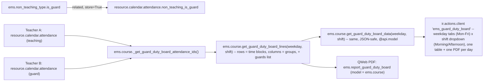

# Technical Reference: Guard Duty Schedule Board

## Overview

Every teacher's own weekly working schedule can already carry a "Guard" slot — one
configurable `ems.non_teaching_type` reason among others (see [Non-teaching types](../employees/non_teaching_type.md)),
assigned to a period the same way as a break or a coordination meeting (see
[Teacher working schedules & schedule frameworks](../employees/working_schedule.md)). What
was missing was a way to consult that information **across** teachers: for a given weekday,
who is teaching where, and who is on guard duty, in each time block. This board is a
read-only, centre-wide aggregation answering exactly that — no new data is captured, it only
re-reads what already lives on every teacher's own `resource.calendar.attendance` rows.

**No dedicated model.** An earlier version introduced a `ems.guard_duty_board` `TransientModel`
wizard, opened via a dynamic `ir.actions.server`. That was replaced (2026-08-31) once it caused
a real, user-visible problem: the URL bar showed a raw `ems.guard_duty_board/<id>` instead of a
stable `action-<xmlid>` like every other EMS screen, because Odoo can only put a real xmlid in
the URL for a *statically declared* action — a server action that returns a dynamically-built
`act_window` dict has no xmlid of its own to show. The board's methods now live directly on
`ems.course` instead (a real, always-existing model every teacher already has read access to —
see "Access control" below), and the screen itself is a plain `ir.actions.client`, both
addressable by a real, stable URL.

## Model changes

**`ems.non_teaching_type`** (`models/employees/non_teaching_type.py`):
- `is_guard` (Boolean) — marks a non-teaching reason as counting toward guard duty on this
  board. Seeded `True` on the "Guard" row (`data/main/ems.non_teaching_type.csv`, code `G`).
  Data-driven, same pattern as `is_break`/`is_fixed` — a centre could in principle flag more
  than one reason as `is_guard` (e.g. a "corridor guard" split from a "break guard"), the
  board doesn't assume there is exactly one.

**`resource.calendar.attendance`** (`ems_working_schedule_assignation`, `models/employees/working_schedule.py`):
- `non_teaching_is_guard` (Boolean, `related="non_teaching.is_guard"`, `store=True`) —
  mirrors the pre-existing `non_teaching_is_break` field. Used server-side by
  `get_guard_duty_board_lines()` (below) to single out a guard row without a separate
  `ems.non_teaching_type` fetch.

**`ems.course`** (extended, `models/attendance/guard_duty_board.py`,
`_inherit = ['ems.course', 'ems.schedule_report_mixin']` — same "extend in place" pattern as
`ems_working_schedule`/`resource.calendar` and `ems_group_schedule`/`ems.group`):
- `_get_guard_duty_board_attendance_ids()` — every non-framework calendar's Mon-Fri
  attendance row, across every teacher. Same aggregation idea as
  `ems.group._compute_schedule_attendance_ids` (see [Group Schedule](../contacts/group_schedule.md)),
  generalized from "this group" to "the whole centre" — deliberately **not** filtered by
  `calendar_id.course_id`, mirroring that same precedent: a course-transitioned-out
  calendar/attendance row is archived (`active=False`), so the plain `search()` already only
  returns the current course's real, active schedules, and this also stays correct for a
  legacy calendar whose `course_id` was never backfilled. `self` (the course the method is
  called on) is purely informational here — the query itself never filters by it.
  Also filters `calendar_id.active = True` explicitly (added 2026-09-01, see
  `plans/course_transition_stale_teacher_assignments.md`) — a real-world case surfaced a
  departed/reassigned teacher's non-teaching rows (guard duty, a coordination meeting) still
  `active=True` on an already-archived, prior-year calendar, since `_apply_calendar_rollover()`
  never counted them as "teaching left" and (at the time) nothing archived them once the
  calendar itself retired. `ems_working_schedule.action_archive()` now cascades to its own
  `attendance_ids` (see `course_transition_wizard.md`), which fixes this at the source going
  forward — the explicit filter here stays anyway as defense-in-depth, not redundant with it.
- `get_guard_duty_board_lines(weekday, shift)` — instance method, `self.ensure_one()`, called
  on a real `ems.course` record (the PDF template calls it on each of `docs`). For one weekday
  (`'0'`-`'4'`) and one shift (`'morning'`/`'afternoon'`, `SHIFT_HOURS` mirroring `ems.group`'s
  own constant), returns `{'groups': [...], 'lines': [...]}`:
  - `groups` — every `ems.group` actually taught in that weekday/shift slice, sorted by name
    — these become the table's columns.
  - `lines` — one row per distinct `(hour_from, hour_to)` period, each with one `cells` entry
    per group (`entries`: the teaching `resource.calendar.attendance` record(s) there;
    `teachers`: every co-teacher, deduped, since a co-taught slot has one attendance row per
    teacher and naively picking just the first would silently drop the rest) plus a `guards`
    recordset (every `non_teaching_is_guard` entry in that period). A guard slot has no
    `group_ids` of its own, so it can never occupy a group's cell — it's always reported
    through `guards` instead, never as an extra column.
  - Reuses `_format_report_time` from `ems.schedule_report_mixin` (still the reason this class
    mixes it in) — but deliberately **not** `_report_color_key`/`REPORT_COLOR_PALETTE`, unlike
    the teacher/group schedule PDFs. An earlier version did colour each cell by subject the same
    way those do; removed per developer feedback (2026-09-01) — with every group already its
    own column and the subject spelled out as a short `acronym` in the cell, a colour wash per
    subject added visual noise without adding information the plain grid didn't already convey.
    No colour anywhere on the board at all now, not even the guard-duty badge — see "Client
    action" and "PDF report" below for the full history of that. Recordset-based — used
    server-side (Python) only, by the PDF template.
- `get_guard_duty_board_data(weekday, shift)` — `@api.model`. Resolves "the current course"
  itself via `self.env.company.get_current_course_or_raise()` rather than taking a course
  argument, so the JS client action never needs to know or guess an `ems.course` id — matches
  `_get_guard_duty_board_attendance_ids()`'s own course-agnostic scoping. Thin JSON-safe
  wrapper around `get_guard_duty_board_lines()` (plain dicts/strings/ids instead of
  recordsets — `subject` is the short `acronym`, e.g. "MP 0440", not the full `display_name`,
  to keep cells compact; `teachers` is a plain list of display names) — see "Client action"
  below for why a JSON-safe RPC call is needed at all instead of reading a prefetched field.
- `get_current_course_data()` — `@api.model`, returns `{'id': ..., 'name': ...}` for the
  current course. Used by the client action to label the page and to supply the PDF button's
  own `active_ids` (the page has no bound record of its own to read that from). Also called
  through `res.company.get_current_course_or_raise()`, so it's the first of the two methods to
  raise a friendly `ValidationError` (surfaced as the client action's own error dialog) if no
  "Current course" has ever been configured — a real scenario on a freshly installed instance
  before an admin visits Settings for the first time, not just a test-DB gap. Bug fixed
  2026-09-01: both methods used to read `current_course_id` unguarded, crashing with a raw
  `ValueError: Expected singleton: ems.course()` instead.

## Access control

| Action | `ems.group_teacher` (every teacher) | `ems.group_department_chief` and above |
|--------|:---:|:---:|
| Open the board | Yes | Yes |
| Call `get_guard_duty_board_lines()` / `get_guard_duty_board_data()` | Yes | Yes |
| Export the board to PDF | Yes | Yes |

**No new `ir.model.access.csv` rows at all.** `ems.access_ems_course_teacher` already grants
`ems.group_teacher` read access to `ems.course` — since the board's methods live there now
(rather than on a dedicated model that would have needed its own ACL), every teacher can
already call them. No `sudo()` is used anywhere in `_get_guard_duty_board_attendance_ids()`
either, and none is needed: base Odoo's own `resource` module already grants `base.group_user`
(every internal user, so every teacher) plain read access to
`resource.calendar`/`resource.calendar.attendance`, with no `ir.rule` narrowing it further —
see [Group Schedule](../contacts/group_schedule.md)'s own "Access control" section, which
documents this same fact for its identical aggregation. Colleagues' schedules were never
actually access-restricted at the model level; only the "Working Schedules" *menu* (admin
configuration screen, `resource.calendar` records with `is_framework=False`, write access
still `ems.group_department_chief`-only) was.

## Menu

`views/attendance/guard_duty_board/menu.xml` — `action_guard_duty_board` is a plain
`ir.actions.client` (`tag="ems_guard_duty_board"`), not bound to any model or record — see the
class docstring in `models/attendance/guard_duty_board.py` for why this replaced an earlier
`TransientModel` + dynamic server-action design. `<menuitem>` sits under
`hr_attendance.menu_hr_attendance_root` ("Employee Attendances", already visible to
`ems.group_teacher`, see `views/attendance/menu.xml`), a sibling of "Correction Requests" —
deliberately not under "Working Schedules" (`menu_work_locations`), which only Head of
Studies/Direction can see.

## Client action

`static/src/js/backend/guard_duty_board.js` (`GuardDutyBoard`, registered as
`registry.category("actions").add("ems_guard_duty_board", GuardDutyBoard)`, `static props =
["*"]` — the standard shape for a top-level `ir.actions.client` component, same convention as
`attendance_session_view.js`'s `AttendanceSessionView`) + matching `.xml` template
(`static/src/xml/backend/guard_duty_board.xml`) and CSS
(`static/src/css/backend/guard_duty_board.css`, `o_guard_board_*` classes). `onWillStart` first
calls `get_current_course_data()` (to label the page and remember the course id for the PDF
button), then loads the initially-active day/shift. `useState({ activeDay, activeShift, board,
loading, courseId, courseName })` drives the weekday tabs (Mon-Fri) plus a **shift `<select>`**
(Morning/Afternoon) — a dropdown, not a second row of tabs, and not both shifts stacked on one
page: morning and afternoon are different shifts (see `ems.group.shift`) and a school's real
bell schedule made the two stacked together too dense to read at a glance (developer feedback,
2026-08-31). Only one `<table>` (the active day + active shift) is ever rendered from
`state.board`.

**Opens on today's own day/shift, not always Monday/Morning.** `getDefaultDayAndShift()`
(top of the file) reads the browser's own `Date()` — "now" here means the *viewer's* wall-clock
time, not the server's — and maps `Date.getDay()` (0=Sunday..6=Saturday) onto the board's own
weekday index (0=Monday..4=Friday); a weekend defaults to Monday (the board has no weekend
concept at all, every table is keyed to a Mon-Fri `dayofweek`). The shift threshold (`>=15:00`
→ afternoon) is a hand-kept copy of `SHIFT_HOURS`'s own boundary in
`models/attendance/guard_duty_board.py` — added per developer feedback (2026-09-01): "cuando
entro en la sección... por defecto tendría que estar viendo el que toca". Regression-tested in
`guard_duty_board_tour.js` by computing the same expected day/shift independently in the test
itself (against the real clock the test happens to run at) and asserting the board's initial
state matches — not a fixed "Monday" assumption, which the rest of that same tour still relies
on for its own (date-independent) fixture-data assertions, reached by explicitly switching back
to Monday/Morning right after this check.

**The data is fetched via RPC (`ems.course.get_guard_duty_board_data()`), one weekday/shift at a
time.** An early version instead read a form field's own prefetched sub-records client-side
(the same approach `group_schedule_grid_field.js` uses for its own, much smaller, per-group
aggregation) — this broke in practice: the web client silently caps how many sub-records a
relational field fetches for rendering, and a centre-wide aggregation easily exceeds that cap
(several hundred rows for a real school), so only whichever weekday happened to load first
(in practice, Monday) ever showed real data — every other tab rendered empty, even though the
server-side PDF (which reads the same recordset directly over the ORM, no such cap) always
showed the full week. `setActiveDay()`/`onShiftChange()` both call the same `loadBoard()`,
which re-fetches exactly the currently active day+shift pair.

**No cell colouring.** An earlier version painted each occupied cell's background with the
same per-subject colour the teacher/group schedule PDFs use
(`ems.schedule_report_mixin.REPORT_COLOR_PALETTE`), with white text on top
(`.o_guard_board_cell_occupied`). Removed per developer feedback (2026-09-01): "quita los
colores de background de la tabla... a ver como queda" — with every group already its own
column and the subject spelled out as a short acronym, the colour wash was noise, not signal.
The Guard duty column's own light background tint went too, for the same "no background colour
anywhere in the table" reading of that request. First pass deliberately kept one exception —
the guard-duty badge itself (`.o_guard_board_guard_badge`, a fixed orange fill) — reasoning
that it was the actual "who is on duty" signal the column exists to surface, not a whole-cell/
whole-column wash. The developer asked for that gone too on a second pass, same day: "quitar
el color de fondo de los nombres de las personas que están de guardia" — so `.o_guard_board_guard_badge`
now has **no** `background-color`/`color` overrides at all, just a thin `1px solid #ccc` border
(purely to keep several names in the same cell visually separated from each other, not a
colour). Applied identically to the PDF (see "PDF report" below) — same reasoning throughout,
verified against a real generated PDF at each pass.

**Why a table, not the existing absolute-positioned grid:** `schedule_grid_field.js`/
`group_schedule_grid_field.js` position entries by pixel offset within one non-overlapping
timeline per weekday column — valid because a single teacher or group can only be in one
place at a given hour. A centre-wide board breaks that invariant (many groups run in parallel
at any given hour), so instead of a 5-day-column grid, this renders weekday **tabs** (one day
visible at a time) and, within a day, a genuine `<table>` whose **columns are the groups**
taught in that shift and whose **rows are time blocks** — structurally the same shape
`get_guard_duty_board_data()` already returns, rendered close to as-is.

**Column widths are fixed, not content-driven — deliberately.** Each group column shares one
identical CSS width (`.o_guard_board_col_group`) via an explicit `<colgroup>` combined with
`table-layout: fixed` on the `<table>`; the Time block (first) and Guard duty (last) columns
get their own, wider fixed widths (denser content: a full time range; one badge per teacher on
duty). Two things this fixes, both found during manual review (2026-08-31):
1. A first attempt used `table-layout: auto` with `min-width`/`max-width` hints instead — this
   let *each* shift's table auto-size its own columns from its own content, so Morning and
   Afternoon (or one weekday vs. another) never lined up the same way, and one abnormally long
   cell (e.g. an unlinked "Pending teacher (email@...)" placeholder) could still noticeably
   skew a single column's width relative to the rest.
2. Auto-layout sizing also under-reported the table's true rendered width to the wrapping
   `
`'s own `scrollWidth` calculation in practice, so the scrollbar existed but couldn't
   actually be dragged all the way to reveal the last column. `table-layout: fixed` with
   `<col>`-defined widths removes that ambiguity — the table's total width is the literal sum
   of the declared column widths, so `overflow-x: auto` always has an exact width to scroll
   against. Regression-tested in `guard_duty_board_tour.js` (scrolls the wrapper to its
   reported max and asserts the last header cell is then fully within the wrapper's visible
   bounds).

**Per-day toolbar** (shift `<select>` + PDF button) sits right under the weekday tabs, so
switching days always shows that day's own controls — matches "one PDF per day" (below), not a
single page-wide PDF button for the whole week.

**Page layout: the root needs an explicit height, or neither scroll axis works at all.** This
is a plain `ir.actions.client` page (no `<sheet>`/form chrome to inherit sizing from), and
Odoo's own action container clips whatever the mounted component doesn't explicitly claim — an
early version's bare, height-less root div meant a table taller (or wider) than the viewport
was just cut off with **no scrollbar on either axis** (developer feedback, 2026-08-31), not a
squeezed-but-scrollable one. Fixed the same way `attendance_session_view.css`'s `.ems-av-root`
already does it: `.o_guard_board` gets `height: 100%; display: flex; flex-direction: column`,
the title/tabs/toolbar sit in a fixed-height `.o_guard_board_header`, and only
`.o_guard_board_content` (`flex: 1 1 auto; overflow-y: auto`) scrolls vertically — with
`.o_guard_board_table_wrap`'s own `overflow-x: auto` still handling horizontal scroll inside
that, so a vertical drag can never also scroll sideways. Both axes are regression-tested in
`guard_duty_board_tour.js` the same way: scroll to the reported max, assert the true end
(rightmost column / bottom row) is then actually visible.

## PDF report (`ems.report_guard_duty_board`)

`reports/attendance/report_guard_duty_board.xml` — a `qweb-pdf` `ir.actions.report` on
`ems.course` (not the removed `ems.guard_duty_board`). Not bound to the generic Print menu (no
`binding_type`/`binding_model_id`) — triggered only from the client action's own **PDF**
button, same as `ems.report_working_schedule`/`ems.report_group_schedule`.

**Landscape A3, not the site default (portrait A4).** `paperformat_id` points at a new,
reusable `ems.paperformat_a3_landscape` (`report.paperformat`, same file) — same margins/dpi/
`css_margins` as base Odoo's own default `paperformat_euro`, only `format`/`orientation`
differ. Needed because this board is wide (one column per group, easily a dozen or more):
under the site-default portrait A4, every group column was cramped even after the fixed-width
pass below. Landscape A4 alone (the first attempt, 2026-09-01) still felt too tight in
practice per developer feedback after seeing it rendered — moved to A3 (420×297mm usable vs.
A4's 297×210mm) for real breathing room. Not named guard-duty-specific, since any future EMS
report facing the same "wide grid" shape (a school-wide timetable, say) can reference this
same paperformat record instead of each defining its own — verified by generating a real PDF
against this dev DB's own data at each step, same way the column-width bug below was
originally caught.

**One PDF per day AND per shift — not the whole week, not both shifts.** `onPdfClick()` calls
`actionService.doAction("ems.action_report_guard_duty_board", { additionalContext: {
active_ids: [this.state.courseId], guard_duty_weekday: String(this.state.activeDay),
guard_duty_shift: this.state.activeShift } })` — the extra `guard_duty_weekday`/`guard_duty_shift`
context keys are what scope the report down to whichever day tab and shift dropdown value were
active. The template reads both via `course.env.context.get(...)` (there is no bare `context`
name bound inside a QWeb report template — `additionalContext` merges into the calling env's
own context, which every record obtained from `docs` already carries) and loops just that one
day/shift; if a key is absent (defensive fallback only — no other caller omits either) it falls
back to all 5 weekdays and/or both shifts, one `
` per weekday (standard QWeb
pagination). For whichever day(s)/shift(s) it renders, the template calls
`course.get_guard_duty_board_lines(weekday, shift)` directly (Python-side, unlike the client
action's own JSON RPC) to render the same groups-as-columns table (subject `acronym`, every
co-teacher). No colour anywhere, same as the live screen — see the "No cell colouring" note
above for the full history (including the guard-duty badge itself losing its fill on a second
developer pass the same day).

**Column widths are fixed here too — `<colgroup>` + `table-layout: fixed`, mirroring the live
screen** (`.gdb-col-time`/`.gdb-col-group`/`.gdb-col-guard`: 85/115/160px, sized for A3
landscape's own usable width — see the class comment in the template for the exact figure —
not simply carried over from the live screen's 90/130/190px, nor from the original A4-sized
60/75/110px attempt). **A bigger page alone does not widen a `table-layout: fixed` table** —
found switching this report from A4 to A3 (2026-09-01, developer feedback: "sigue saliendo
todo muy apretado" even after landscape A4): the paperformat change alone did nothing visible,
because the `<col>` widths are absolute pixel values independent of the page they're printed
on — a bigger page just adds blank margin around the same-sized table unless the column widths
are *also* widened to use the extra room. One thing the live screen didn't need but the PDF
did: `overflow-wrap`/`word-break: break-word` on every cell's text spans
(`.gdb-cell-subject`/`.gdb-cell-teacher`/`.gdb-cell-room`/`.gdb-guard-badge`). Confirmed by
generating a real PDF against this dev DB's own data (2026-08-31): without it, one long
unbroken string (an unlinked "Pending teacher (email@...)" placeholder — no spaces to wrap at)
still forced that one column — and, via `border-collapse`, every row sharing it — visibly wider
than the rest, even under `table-layout: fixed`. With word-breaking allowed, the same content
wraps onto multiple lines within its declared column width instead.

## Related docs

- [Non-teaching types](../employees/non_teaching_type.md)
- [Teacher working schedules & schedule frameworks](../employees/working_schedule.md)
- [Group Schedule](../contacts/group_schedule.md) — the aggregation precedent this board generalizes
- [shared/schedule_report_mixin.md](../shared/schedule_report_mixin.md)
