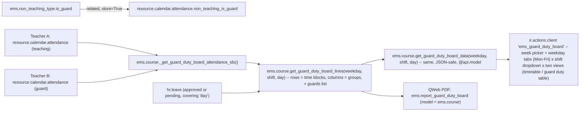
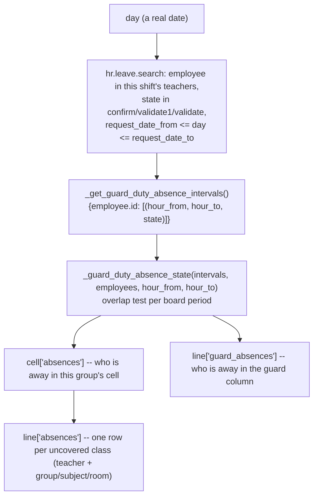
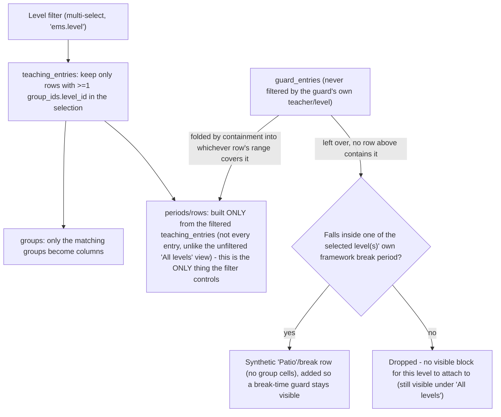

# Technical Reference: Guard Duty Schedule Board

## Overview

Every teacher's own weekly working schedule can already carry a "Guard" slot — one
configurable `ems.non_teaching_type` reason among others (see [Non-teaching types](../employees/non_teaching_type.md)),
assigned to a period the same way as a break or a coordination meeting (see
[Teacher working schedules & schedule frameworks](../employees/working_schedule.md)). What
was missing was a way to consult that information **across** teachers: for a given weekday,
who is teaching where, and who is on guard duty, in each time block. This board is a
read-only, centre-wide aggregation answering exactly that — no new data is captured, it only
re-reads what already lives on every teacher's own `resource.calendar.attendance` rows.

**No dedicated model.** An earlier version introduced a `ems.guard_duty_board` `TransientModel`
wizard, opened via a dynamic `ir.actions.server`. That was replaced (2026-08-31) once it caused
a real, user-visible problem: the URL bar showed a raw `ems.guard_duty_board/<id>` instead of a
stable `action-<xmlid>` like every other EMS screen, because Odoo can only put a real xmlid in
the URL for a *statically declared* action — a server action that returns a dynamically-built
`act_window` dict has no xmlid of its own to show. The board's methods now live directly on
`ems.course` instead (a real, always-existing model every teacher already has read access to —
see "Access control" below), and the screen itself is a plain `ir.actions.client`, both
addressable by a real, stable URL.

## Model changes

**`ems.non_teaching_type`** (`models/employees/non_teaching_type.py`):
- `is_guard` (Boolean) — marks a non-teaching reason as counting toward guard duty on this
  board. Seeded `True` on the "Guard" row (`data/main/ems.non_teaching_type.csv`, code `G`).
  Data-driven, same pattern as `is_break`/`is_fixed` — a centre could in principle flag more
  than one reason as `is_guard` (e.g. a "corridor guard" split from a "break guard"), the
  board doesn't assume there is exactly one.

**`resource.calendar.attendance`** (`ems_working_schedule_assignation`, `models/employees/working_schedule.py`):
- `non_teaching_is_guard` (Boolean, `related="non_teaching.is_guard"`, `store=True`) —
  mirrors the pre-existing `non_teaching_is_break` field. Used server-side by
  `get_guard_duty_board_lines()` (below) to single out a guard row without a separate
  `ems.non_teaching_type` fetch.

**`ems.course`** (extended, `models/attendance/guard_duty_board.py`,
`_inherit = ['ems.course', 'ems.schedule_report_mixin']` — same "extend in place" pattern as
`ems_working_schedule`/`resource.calendar` and `ems_group_schedule`/`ems.group`):
- `_get_guard_duty_board_attendance_ids()` — every non-framework calendar's Mon-Fri
  attendance row, across every teacher. Same aggregation idea as
  `ems.group._compute_schedule_attendance_ids` (see [Group Schedule](../contacts/group_schedule.md)),
  generalized from "this group" to "the whole centre" — deliberately **not** filtered by
  `calendar_id.course_id`, mirroring that same precedent: a course-transitioned-out
  calendar/attendance row is archived (`active=False`), so the plain `search()` already only
  returns the current course's real, active schedules, and this also stays correct for a
  legacy calendar whose `course_id` was never backfilled. `self` (the course the method is
  called on) is purely informational here — the query itself never filters by it.
  Also filters `calendar_id.active = True` explicitly (added 2026-09-01, see
  `plans/course_transition_stale_teacher_assignments.md`) — a real-world case surfaced a
  departed/reassigned teacher's non-teaching rows (guard duty, a coordination meeting) still
  `active=True` on an already-archived, prior-year calendar, since `_apply_calendar_rollover()`
  never counted them as "teaching left" and (at the time) nothing archived them once the
  calendar itself retired. `ems_working_schedule.action_archive()` now cascades to its own
  `attendance_ids` (see `course_transition_wizard.md`), which fixes this at the source going
  forward — the explicit filter here stays anyway as defense-in-depth, not redundant with it.
  Also filters `calendar_id.employee_id != False` (added 2026-09-08) — excludes any calendar
  that isn't a specific teacher's own personal working schedule, concretely Odoo's own generic
  default calendar ("Standard 40 hours/week", auto-created with Mon-Fri 8-12/13-17 rows the
  first time anything needs `res.company.resource_calendar_id` and nothing real has been
  configured yet). That calendar is never `is_framework=True`, so the check above alone doesn't
  exclude it; on a clean install with no real schedules yet it silently leaked into this
  aggregation and its generic 8-12 block absorbed narrower real periods into itself (found via
  CI, which installs clean — this box's own long-lived dev DB never had that generic calendar
  to begin with, which is why the bug never showed up locally).
- `get_guard_duty_board_lines(weekday, shift)` — instance method, `self.ensure_one()`, called
  on a real `ems.course` record (the PDF template calls it on each of `docs`). For one weekday
  (`'0'`-`'4'`) and one shift (`'morning'`/`'afternoon'`, `SHIFT_HOURS` mirroring `ems.group`'s
  own constant), returns `{'groups': [...], 'lines': [...]}`:
  - `groups` — every `ems.group` actually taught in that weekday/shift slice, sorted by name
    — these become the table's columns.
  - `lines` — one row per distinct `(hour_from, hour_to)` period, each with one `cells` entry
    per group (`entries`: the teaching `resource.calendar.attendance` record(s) there;
    `teachers`: every co-teacher, deduped, since a co-taught slot has one attendance row per
    teacher and naively picking just the first would silently drop the rest) plus a `guards`
    recordset (every `non_teaching_is_guard` entry in that period). A guard slot has no
    `group_ids` of its own, so it can never occupy a group's cell — it's always reported
    through `guards` instead, never as an extra column.
  - **A period fully contained in another period is folded into it, not given its own row**
    (`_merge_absorbed_periods()`, module-level helper, fixed 2026-09-07 — issue #410). Found in
    production as a guard-duty slot ending `13:25-14:00` (a teacher's own personal schedule
    ending that block 25 minutes early) sitting right next to a colleague's `13:25-14:25` guard
    for the same start time — before the fix, `periods` was a plain set of every distinct
    `(hour_from, hour_to)` tuple across `entries`, so two conceptually-the-same periods with a
    different `hour_to` rendered as two rows, the shorter one nearly (for a guard) or entirely
    (for any other non-teaching entry — it's neither a `teaching_entries` cell nor a
    `guard_entries` row, since it has no group and isn't `non_teaching_is_guard`) empty.
    `_merge_absorbed_periods(periods)` groups periods into `{period: [period, *absorbed]}` —
    one entry per period that keeps a row, mapping to every period (its own bounds plus any it
    absorbed) whose `cells`/`guards` fold into that row. Containment uses `HOUR_EPSILON` (see
    [shared/schedule_report_mixin.md](../shared/schedule_report_mixin.md)) for the same reason
    `hr.employee._get_derived_break_entries` needs it — two periods meant to represent the same
    moment can differ by a hair's-width float remainder. A period with no containing period
    (e.g. a genuinely isolated 35-minute coordination slot with nothing else running at the same
    time) keeps its own row exactly as before — the merge only removes a row when another,
    larger period's range actually covers it.
  - **A period left with no teaching cell and no guard, after the merge above, is dropped
    entirely** (developer follow-up, 2026-09-07) — `if not guards and not any(cell['entries']
    for cell in cells): continue`. Found on the Wednesday coordination-time slots
    (`13:25-14:00`/`14:00-15:00`): once the merge above stopped duplicating rows, these two
    genuinely had nothing to show (every teacher is in a coordination duty or the meeting itself,
    nobody's on guard through it) — a bare time range with no subject and no guard name is not
    useful information, so it no longer renders at all. A period with a guard but no teaching
    (the normal shape of most guard slots) is unaffected — only a period with **neither** is
    dropped.
  - Reuses `_format_report_time` from `ems.schedule_report_mixin` (still the reason this class
    mixes it in) — but deliberately **not** `_report_color_key`/`REPORT_COLOR_PALETTE`, unlike
    the teacher/group schedule PDFs. An earlier version did colour each cell by subject the same
    way those do; removed per developer feedback (2026-09-01) — with every group already its
    own column and the subject spelled out as a short `acronym` in the cell, a colour wash per
    subject added visual noise without adding information the plain grid didn't already convey.
    No colour anywhere on the board at all now, not even the guard-duty badge — see "Client
    action" and "PDF report" below for the full history of that. Recordset-based — used
    server-side (Python) only, by the PDF template.
- `get_guard_duty_board_data(weekday, shift)` — `@api.model`. Resolves "the current course"
  itself via `self.env.company.get_current_course_or_raise()` rather than taking a course
  argument, so the JS client action never needs to know or guess an `ems.course` id — matches
  `_get_guard_duty_board_attendance_ids()`'s own course-agnostic scoping. Thin JSON-safe
  wrapper around `get_guard_duty_board_lines()` (plain dicts/strings/ids instead of
  recordsets — `subject` is the short `acronym`, e.g. "MP 0440", not the full `display_name`,
  to keep cells compact; `teachers` is a plain list of display names) — see "Client action"
  below for why a JSON-safe RPC call is needed at all instead of reading a prefetched field.
- `get_current_course_data()` — `@api.model`, returns `{'id': ..., 'name': ...}` for the
  current course. Used by the client action to label the page and to supply the PDF button's
  own `active_ids` (the page has no bound record of its own to read that from). Also called
  through `res.company.get_current_course_or_raise()`, so it's the first of the two methods to
  raise a friendly `ValidationError` (surfaced as the client action's own error dialog) if no
  "Current course" has ever been configured — a real scenario on a freshly installed instance
  before an admin visits Settings for the first time, not just a test-DB gap. Bug fixed
  2026-09-01: both methods used to read `current_course_id` unguarded, crashing with a raw
  `ValueError: Expected singleton: ems.course()` instead.

## Absences on the board

**The problem this solves.** A guard-duty period is only worth planning if you know which
classes are actually going to be left without a teacher. That information lives in `hr.leave`
(see [Staff absences](../employees/absence.md)) and nothing joined the two: the board answered
"who is on guard on a Tuesday", never "who is missing on Tuesday the 15th".

**Weekday vs date — why the screen needed a week picker first.** The timetable repeats by
weekday; an absence happens on a real date. There is no way to resolve one from the other, so
`get_guard_duty_board_lines()`/`get_guard_duty_board_data()` take an optional `day`, and the
client action grew a date input and week navigation to supply it. **Without a date the board
behaves exactly as it did before** — every absence structure comes back empty — which is what
keeps every weekday-only caller working unchanged.

**Two states, never one.** `ABSENCE_STATES` maps hr_holidays' states onto the only two
distinctions that matter to whoever assigns guards: `validate` → `'approved'` (a fact to plan
around), `confirm`/`validate1` → `'pending'` (a request nobody has decided on yet). The two
pre-approval states are collapsed deliberately — "waiting for the first approver" vs "the
second" changes nothing here. Refused and cancelled requests are not in the mapping at all,
which is what keeps them off the board entirely. When the same teacher has both an approved and
a pending absence overlapping one period, approved wins: the period needs covering either way,
and reporting it as merely requested would understate it.

**Whole day vs part of one.** The interval is read from `request_unit_hours` rather than
`ems_full_day`: it is the field that actually decides whether `request_hour_from`/`_to` carry
anything (see `hr.leave._compute_request_unit_hours` and EMS's override of it), and a multi-day
request is a whole day on each of its days however it was filled in. A whole day becomes
`(0.0, 24.0)` so it compares against a board period exactly like a partial one does — no special
case anywhere downstream. Arriving an hour late therefore marks the 9-10 lesson and leaves the
11-12 one alone.

**An absent guard is a subtraction, not an addition.** A teacher who is away during a period
they were on guard for has no class of their own for anybody to cover — they are simply one
fewer person available to cover somebody else's. That is why `guard_absences` is reported
separately from `absences` and never folded into it: the guard column marks them, and no row
appears in the "what needs covering" list.

**Confidentiality.** The absence search runs `sudo()` — same justification
`ems.attendance_session_header.get_guard_sessions()` already carries for reading schedules that
are not the reader's own: whoever reads this board legitimately needs to know a colleague is not
coming. Only **the fact and the interval** are ever exposed. The absence type, its reason and
its attachments never leave the model, so the confidentiality rule described in
[Staff absences](../employees/absence.md) is not weakened by this screen.

## Access control

| Action | `ems.group_teacher` (every teacher) | `ems.group_department_chief` and above |
|--------|:---:|:---:|
| Open the board | Yes | Yes |
| Call `get_guard_duty_board_lines()` / `get_guard_duty_board_data()` | Yes | Yes |
| Export the board to PDF | Yes | Yes |

**No new `ir.model.access.csv` rows at all.** `ems.access_ems_course_teacher` already grants
`ems.group_teacher` read access to `ems.course` — since the board's methods live there now
(rather than on a dedicated model that would have needed its own ACL), every teacher can
already call them. No `sudo()` is used anywhere in `_get_guard_duty_board_attendance_ids()`
either, and none is needed: base Odoo's own `resource` module already grants `base.group_user`
(every internal user, so every teacher) plain read access to
`resource.calendar`/`resource.calendar.attendance`, with no `ir.rule` narrowing it further —
see [Group Schedule](../contacts/group_schedule.md)'s own "Access control" section, which
documents this same fact for its identical aggregation. Colleagues' schedules were never
actually access-restricted at the model level; only the "Working Schedules" *menu* (admin
configuration screen, `resource.calendar` records with `is_framework=False`, write access
still `ems.group_department_chief`-only) was.

## Menu

`views/attendance/guard_duty_board/menu.xml` — `action_guard_duty_board` is a plain
`ir.actions.client` (`tag="ems_guard_duty_board"`), not bound to any model or record — see the
class docstring in `models/attendance/guard_duty_board.py` for why this replaced an earlier
`TransientModel` + dynamic server-action design. `<menuitem>` sits directly under
`hr_attendance.menu_hr_attendance_root` ("Employee Attendances", already visible to
`ems.group_teacher`, see `views/attendance/menu.xml`), a sibling of the "Attendance" submenu
(which itself groups Overview/Correction Requests/Management) and "Time off" — deliberately not
under "Working Schedules" (`menu_work_locations`), which only Head of Studies/Direction can see.

## Client action

`static/src/js/backend/guard_duty_board.js` (`GuardDutyBoard`, registered as
`registry.category("actions").add("ems_guard_duty_board", GuardDutyBoard)`, `static props =
["*"]` — the standard shape for a top-level `ir.actions.client` component, same convention as
`attendance_session_view.js`'s `AttendanceSessionView`) + matching `.xml` template
(`static/src/xml/backend/guard_duty_board.xml`) and CSS
(`static/src/css/backend/guard_duty_board.css`, `o_guard_board_*` classes). `onWillStart` first
calls `get_current_course_data()` (to label the page and remember the course id for the PDF
button), then loads the initially-active day/shift. `useState({ activeDay, activeShift, board,
loading, courseId, courseName })` drives the weekday tabs (Mon-Fri) plus a **shift `<select>`**
(Morning/Afternoon) — a dropdown, not a second row of tabs, and not both shifts stacked on one
page: morning and afternoon are different shifts (see `ems.group.shift`) and a school's real
bell schedule made the two stacked together too dense to read at a glance (developer feedback,
2026-08-31). Only one `<table>` (the active day + active shift) is ever rendered from
`state.board`.

**A week, not just a weekday.** `state.weekStart` holds the Monday of the shown week, and the
weekday tabs render their own day of the month alongside their name, so the tab strip doubles
as that week's calendar. The toolbar carries `‹ ›` week navigation plus a native
`<input type="date">`; picking any date moves the whole week and lands on that date's own
weekday tab. Three helpers at the top of the file keep this honest: `toIsoDate()` formats from
the browser's **local** calendar fields, deliberately not `toISOString()` (which converts to UTC
first and so returns the previous day for anyone east of Greenwich during the evening — the
board's date is a calendar day, never an instant); `fromIsoDate()` parses one back; `mondayOf()`
maps any date onto its week's Monday, with a weekend belonging to the week it closes, which is
also what makes picking a Saturday in the date input land on a real, showable weekday.

**Two views of the same payload, no extra round trip.** `state.activeView` switches between the
timetable (`schedule`) and the guard duty table (`table`), rendered as `nav-pills` in the
toolbar rather than a second row of `nav-tabs`, so they never compete visually with the weekday
tabs above them. Both read the *same* already-fetched `state.board.lines` — the server sends
`cells`, `guards` and `absences` on every line (see "Absences on the board" above), so switching
view is a pure re-render. Every teacher arrives as `{name, absence}` rather than a bare name,
which is what lets both views mark absences the same way without matching names back against a
separate list; `absenceClass()` maps that to `o_guard_board_absent` (bold red, an absence that
is going to happen) or `o_guard_board_absent_pending` (lighter italic, still awaiting its
approver). That red is the only colour left anywhere on the board — everything else was
deliberately stripped back to plain text and thin borders (developer feedback, 2026-09-01), so
nothing competes with it.

**The guard duty table is not stretched across the window, unlike the timetable.** It only ever
has three columns, so Bootstrap's own `.table { width: 100% }` spread them over the full width of
a wide screen and left the content adrift in empty cell (developer feedback, 2026-09-08: "queda
demasiado disperso en la pantalla"). `.o_guard_board_duty_table` overrides `width` to `auto`, so
`table-layout: fixed` sizes the table to the literal sum of its `<col>` widths (100 + 300 + 230 =
750px), and `margin: 0 auto` centres that block. The wrapper keeps its own `overflow-x: auto`, so
a narrow window scrolls rather than squeezing the columns. Each absence stays on **one line** —
teacher and the class to cover side by side, never wrapped (developer feedback, 2026-09-08:
"elimina el salto de línea aunque quede una columna un poco más ancha"). The absence column's
420px comes from measuring the real worst case on this centre's own data (a 22-character name
plus a 33-character group/subject/room detail, ~315px rendered) and leaving room to spare; the
`text-overflow: ellipsis` alongside `white-space: nowrap` is not expected to trigger, it is there
so a longer name degrades by being clipped rather than by spilling over the guard-duty column.
All three are regression-tested in `guard_duty_board_tour.js`, which asserts the table is
narrower than its wrapper, centred within it, and that no absence row wraps onto a second line
(measured against its own computed `line-height`, not a hardcoded pixel height).

**Opens on today's own day/shift, not always Monday/Morning.** `getDefaultDayAndShift()`
(top of the file) reads the browser's own `Date()` — "now" here means the *viewer's* wall-clock
time, not the server's — and maps `Date.getDay()` (0=Sunday..6=Saturday) onto the board's own
weekday index (0=Monday..4=Friday); a weekend defaults to Monday (the board has no weekend
concept at all, every table is keyed to a Mon-Fri `dayofweek`). The shift threshold (`>=15:00`
→ afternoon) is a hand-kept copy of `SHIFT_HOURS`'s own boundary in
`models/attendance/guard_duty_board.py` — added per developer feedback (2026-09-01): "cuando
entro en la sección... por defecto tendría que estar viendo el que toca". Regression-tested in
`guard_duty_board_tour.js` by computing the same expected day/shift independently in the test
itself (against the real clock the test happens to run at) and asserting the board's initial
state matches — not a fixed "Monday" assumption, which the rest of that same tour still relies
on for its own (date-independent) fixture-data assertions, reached by explicitly switching back
to Monday/Morning right after this check.

**The data is fetched via RPC (`ems.course.get_guard_duty_board_data()`), one weekday/shift at a
time.** An early version instead read a form field's own prefetched sub-records client-side
(the same approach `schedule_grid_readonly_field.js` uses for its own, much smaller, per-group/
per-student aggregation) — this broke in practice: the web client silently caps how many sub-records a
relational field fetches for rendering, and a centre-wide aggregation easily exceeds that cap
(several hundred rows for a real school), so only whichever weekday happened to load first
(in practice, Monday) ever showed real data — every other tab rendered empty, even though the
server-side PDF (which reads the same recordset directly over the ORM, no such cap) always
showed the full week. `setActiveDay()`/`onShiftChange()` both call the same `loadBoard()`,
which re-fetches exactly the currently active day+shift pair.

**No cell colouring.** An earlier version painted each occupied cell's background with the
same per-subject colour the teacher/group schedule PDFs use
(`ems.schedule_report_mixin.REPORT_COLOR_PALETTE`), with white text on top
(`.o_guard_board_cell_occupied`). Removed per developer feedback (2026-09-01): "quita los
colores de background de la tabla... a ver como queda" — with every group already its own
column and the subject spelled out as a short acronym, the colour wash was noise, not signal.
The Guard duty column's own light background tint went too, for the same "no background colour
anywhere in the table" reading of that request. First pass deliberately kept one exception —
the guard-duty badge itself (`.o_guard_board_guard_badge`, a fixed orange fill) — reasoning
that it was the actual "who is on duty" signal the column exists to surface, not a whole-cell/
whole-column wash. The developer asked for that gone too on a second pass, same day: "quitar
el color de fondo de los nombres de las personas que están de guardia" — so `.o_guard_board_guard_badge`
now has **no** `background-color`/`color` overrides at all, just a thin `1px solid #ccc` border
(purely to keep several names in the same cell visually separated from each other, not a
colour). Applied identically to the PDF (see "PDF report" below) — same reasoning throughout,
verified against a real generated PDF at each pass.

**One deliberate, narrower exception added 2026-09-11 (developer request):** a break/"Patio"
row's own `.o_guard_board_time` cell gets a 4px `border-left` accent (`#8a6240`, the exact same
brown `schedule_grid.css`'s `.o_schedule_grid_entry_break` already uses for a break block on the
teacher's own Schedule tab, so the same colour reads as "patio" on both screens). This does not
reopen the decision above: it is a border, not a background fill; it lives on the time cell, not
the guard badge; and it exists to distinguish a *row type* (this period is break time), not to
recolour a person's name or a subject the way the removed washes did. See "Level filter" below
for what actually decides which rows get it.

**Why a table, not the existing absolute-positioned grid:** `schedule_grid_field.js`/
`schedule_grid_readonly_field.js` position entries by pixel offset within one weekday column, at
most a handful of genuinely overlapping blocks side by side (see the read-only widget's own
`layoutOverlappingBlocks` column-split, added for a student's own schedule — a single teacher
still can't be in two places at once, but a group or a student can have a handful of concurrent
entries). A centre-wide board is a different scale of the same problem — many dozens of groups
run in parallel at any given hour, not a handful — so instead of a 5-day-column grid, this renders
weekday **tabs** (one day
visible at a time) and, within a day, a genuine `<table>` whose **columns are the groups**
taught in that shift and whose **rows are time blocks** — structurally the same shape
`get_guard_duty_board_data()` already returns, rendered close to as-is.

**Column widths are fixed, not content-driven — deliberately.** Each group column shares one
identical CSS width (`.o_guard_board_col_group`) via an explicit `<colgroup>` combined with
`table-layout: fixed` on the `<table>`; the Time block (first) and Guard duty (last) columns
get their own, wider fixed widths (denser content: a full time range; one badge per teacher on
duty). Two things this fixes, both found during manual review (2026-08-31):
1. A first attempt used `table-layout: auto` with `min-width`/`max-width` hints instead — this
   let *each* shift's table auto-size its own columns from its own content, so Morning and
   Afternoon (or one weekday vs. another) never lined up the same way, and one abnormally long
   cell (e.g. an unlinked "Pending teacher (email@...)" placeholder) could still noticeably
   skew a single column's width relative to the rest.
2. Auto-layout sizing also under-reported the table's true rendered width to the wrapping
   `
`'s own `scrollWidth` calculation in practice, so the scrollbar existed but couldn't
   actually be dragged all the way to reveal the last column. `table-layout: fixed` with
   `<col>`-defined widths removes that ambiguity — the table's total width is the literal sum
   of the declared column widths, so `overflow-x: auto` always has an exact width to scroll
   against. Regression-tested in `guard_duty_board_tour.js` (scrolls the wrapper to its
   reported max and asserts the last header cell is then fully within the wrapper's visible
   bounds).

**Per-day toolbar** (shift `<select>` + PDF button) sits right under the weekday tabs, so
switching days always shows that day's own controls — matches "one PDF per day" (below), not a
single page-wide PDF button for the whole week.

**Page layout: the root needs an explicit height, or neither scroll axis works at all.** This
is a plain `ir.actions.client` page (no `<sheet>`/form chrome to inherit sizing from), and
Odoo's own action container clips whatever the mounted component doesn't explicitly claim — an
early version's bare, height-less root div meant a table taller (or wider) than the viewport
was just cut off with **no scrollbar on either axis** (developer feedback, 2026-08-31), not a
squeezed-but-scrollable one. Fixed the same way `attendance_session_view.css`'s `.ems-av-root`
already does it: `.o_guard_board` gets `height: 100%; display: flex; flex-direction: column`,
the title/tabs/toolbar sit in a fixed-height `.o_guard_board_header`, and only
`.o_guard_board_content` (`flex: 1 1 auto; overflow-y: auto`) scrolls vertically — with
`.o_guard_board_table_wrap`'s own `overflow-x: auto` still handling horizontal scroll inside
that, so a vertical drag can never also scroll sideways. Both axes are regression-tested in
`guard_duty_board_tour.js` the same way: scroll to the reported max, assert the true end
(rightmost column / bottom row) is then actually visible.

## PDF report (`ems.report_guard_duty_board`)

`reports/attendance/report_guard_duty_board.xml` — a `qweb-pdf` `ir.actions.report` on
`ems.course` (not the removed `ems.guard_duty_board`). Not bound to the generic Print menu (no
`binding_type`/`binding_model_id`) — triggered only from the client action's own **PDF**
button, same as `ems.report_working_schedule`/`ems.report_group_schedule`.

**Landscape A3, not the site default (portrait A4).** `paperformat_id` points at a new,
reusable `ems.paperformat_a3_landscape` (`report.paperformat`, same file) — same margins/dpi/
`css_margins` as base Odoo's own default `paperformat_euro`, only `format`/`orientation`
differ. Needed because this board is wide (one column per group, easily a dozen or more):
under the site-default portrait A4, every group column was cramped even after the fixed-width
pass below. Landscape A4 alone (the first attempt, 2026-09-01) still felt too tight in
practice per developer feedback after seeing it rendered — moved to A3 (420×297mm usable vs.
A4's 297×210mm) for real breathing room. Not named guard-duty-specific, since any future EMS
report facing the same "wide grid" shape (a school-wide timetable, say) can reference this
same paperformat record instead of each defining its own — verified by generating a real PDF
against this dev DB's own data at each step, same way the column-width bug below was
originally caught.

**One PDF per day AND per shift — not the whole week, not both shifts.** `onPdfClick()` calls
`actionService.doAction("ems.action_report_guard_duty_board", { additionalContext: {
active_ids: [this.state.courseId], guard_duty_weekday: String(this.state.activeDay),
guard_duty_shift: this.state.activeShift } })` — the extra `guard_duty_weekday`/`guard_duty_shift`
context keys are what scope the report down to whichever day tab and shift dropdown value were
active. The template reads both via `course.env.context.get(...)` (there is no bare `context`
name bound inside a QWeb report template — `additionalContext` merges into the calling env's
own context, which every record obtained from `docs` already carries) and loops just that one
day/shift; if a key is absent (defensive fallback only — no other caller omits either) it falls
back to all 5 weekdays and/or both shifts, one `
` per weekday (standard QWeb
pagination). For whichever day(s)/shift(s) it renders, the template calls
`course.get_guard_duty_board_lines(weekday, shift)` directly (Python-side, unlike the client
action's own JSON RPC) to render the same groups-as-columns table (subject `acronym`, every
co-teacher). No colour anywhere, same as the live screen — see the "No cell colouring" note
above for the full history (including the guard-duty badge itself losing its fill on a second
developer pass the same day).

**Column widths are fixed here too — `<colgroup>` + `table-layout: fixed`, mirroring the live
screen** (`.gdb-col-time`/`.gdb-col-group`/`.gdb-col-guard`: 85/115/160px, sized for A3
landscape's own usable width — see the class comment in the template for the exact figure —
not simply carried over from the live screen's 90/130/190px, nor from the original A4-sized
60/75/110px attempt). **A bigger page alone does not widen a `table-layout: fixed` table** —
found switching this report from A4 to A3 (2026-09-01, developer feedback: "sigue saliendo
todo muy apretado" even after landscape A4): the paperformat change alone did nothing visible,
because the `<col>` widths are absolute pixel values independent of the page they're printed
on — a bigger page just adds blank margin around the same-sized table unless the column widths
are *also* widened to use the extra room. One thing the live screen didn't need but the PDF
did: `overflow-wrap`/`word-break: break-word` on every cell's text spans
(`.gdb-cell-subject`/`.gdb-cell-teacher`/`.gdb-cell-room`/`.gdb-guard-badge`). Confirmed by
generating a real PDF against this dev DB's own data (2026-08-31): without it, one long
unbroken string (an unlinked "Pending teacher (email@...)" placeholder — no spaces to wrap at)
still forced that one column — and, via `border-collapse`, every row sharing it — visibly wider
than the rest, even under `table-layout: fixed`. With word-breaking allowed, the same content
wraps onto multiple lines within its declared column width instead.

**The PDF prints what the screen shows, absences included.** The board's PDF button passes
`guard_duty_date` alongside the `guard_duty_weekday`/`guard_duty_shift` context keys it already
sent, and the template forwards it to `get_guard_duty_board_lines(..., day=...)` and marks
absent teachers with `.gdb-absent`/`.gdb-absent-pending` — the same two-state distinction, and
the same single accent colour, as the live screen. A cuadrante handed out on paper to assign the
day's guards is no use without them. Omitting the key (any other caller) still prints the plain
timetable. The guard duty table view has **no** PDF of its own yet.

## Level filter (issue #390)

**Spec, written before implementation** — a level selector next to the existing shift
`<select>`, letting a viewer narrow the board down to one or more `ems.level`s (e.g. "just my
own vocational-training levels" while another colleague loads ESO/Batxillerat data in
parallel). Design decisions confirmed with the developer 2026-09-07 (see
`plans/guard_duty_board_level_filter.md` for the original design sketch/open questions this
resolves):

- **What "a level" means for the filter**: a plain multi-select over existing `ems.level`
  records (7 today: ESO, Batxillerat, CFGB, CFGM, CFGS, Cursos d'especialització, PFI) — no new
  grouping model/field. The developer's own "ESO+Batxillerat" example is simply two boxes
  checked at once; nothing persists the combination between visits. `ems.group` already carries
  its own `level_id` (`models/contacts/group.py`, required for a "main" group, always empty for
  a "reinforcement" one) — filtering reads `attendance.group_ids.filtered(lambda group:
  group.level_id.id in level_ids)` directly, no `study_id` hop needed. A "reinforcement" group
  (mixes students from several levels/studies by design) has no `level_id` at all, so it can
  never match a level filter — only ever visible under "All levels", which the developer did not
  flag as a problem for this iteration.
- **The filter only ever controls which time blocks (rows) are visible — it never looks at a
  guard's own teacher/level at all.** An earlier version (same day) derived a guard's "own level"
  from whatever else that teacher taught that day (`level_teacher_ids`, an employee-id set) and
  only showed a guard if they belonged to the filter that way — reverted after developer feedback
  once it wrongly excluded a guard-only shift with no teaching entry of their own at all: *"no
  tenemos forma de saber si un docente es de un nivel o de otro, pero es indiferente, porque está
  de guardia y eso es lo que manda. Lo único que controlaremos con los filtros, es el marco
  horario que aparece."* Once a row is visible (because some class of the filtered level(s) runs
  then), **every** guard on duty during that block shows, regardless of what they otherwise
  teach — a guard whose duty slot doesn't overlap **any** visible row is dropped under that
  filter (not shown almost-empty), visible only under "All levels". The one exception is the
  break/"Patio" case below, which exists specifically so a real break-time guard commitment
  doesn't just vanish because no class runs during a break.
- **Non-teaching, non-guard rows (CT/AC/CM/WIC, coordination/meetings)** need no filter logic of
  their own — confirmed with the developer that the board never surfaces them as their own
  content in the first place (they have no `group_ids` and aren't `non_teaching_is_guard`, so
  the pre-existing "drop a period with nothing in it" rule from issue #410 already removes them
  whether a level filter is active or not).
- **Break ("Patio") labelling, once a level is selected**: the break itself is never a real
  per-teacher attendance row (a teacher's own calendar has one continuous block spanning across
  it, see `hr.employee._get_derived_break_entries`'s own docstring) — so a guard duty scheduled
  specifically for a break period would otherwise have no teaching row to fold into and would
  simply disappear once filtering periods to the selected level's own teaching entries. Instead,
  after the normal per-period rows are built, any **remaining, still-unmatched** guard entry
  (any guard not already folded into a row above — there is no per-teacher/level relevance check
  any more, see above) is checked against that level's own framework(s)' break periods
  (`resource.calendar` with
  `is_framework=True` and `level_id` in the filter, `resource.calendar.attendance` rows with
  `non_teaching_is_break=True`) — same source `_get_derived_break_entries` already reads. A
  match becomes its own row (`is_break: True`, no group cells, just the guard(s)) labelled
  distinctly by the client; a break period with no guard inside it is not rendered at all (same
  "nothing to show" rule every other row already follows).
- **`is_break` also fires under "All levels" (added 2026-09-11, developer request: make a patio
  guard visually obvious without needing the level filter)** — but not via a synthetic row like
  the level-filtered case above: every row the main per-period loop already builds (filtered or
  not) is checked against `_get_guard_duty_board_break_periods(level_ids, ...)` (every
  framework's own break periods when `level_ids` is falsy, only the selected one(s) otherwise —
  shared by both this check and `_get_guard_duty_board_break_lines` above) and marked `is_break`
  when its period falls inside one of them **AND** no group has a real class in it. That second
  half is what keeps this safe despite different levels having different break windows
  (confirmed against this dev DB, 2026-09-07: ESO/BTX break 10:00-10:25 + 12:25-12:40, ciclos
  break 11:00-11:25 + 18:00-18:20): a period that coincides with one level's break clock time
  while another level is genuinely teaching then already has a non-empty cell, so it's never
  mislabelled "Patio" just because some other level happens to be on a break at that hour. Found
  the hard way while writing this feature's own test against this dev DB's real data: a
  deliberately *wide* guard/break test period (the level-filtered test's own original fixture,
  ~1h47m, chosen to dodge being absorbed INTO an unrelated real class) ended up fully containing
  a real, unrelated 09:00-10:00 class instead, populating its own cells and wrongly suppressing
  `is_break` — the fix was narrowing that fixture to straddle one real hour boundary (not fully
  inside either side of it) rather than spanning nearly two hours, which dodges both directions
  of the absorption risk at once (see `test_get_guard_duty_board_lines_level_filter_shows_break_time_guard_as_patio_row`'s
  own updated docstring in `tests/test_guard_duty_board.py`).
- **`is_wc` (added 2026-09-11, developer request)**: a per-guard flag on the JSON payload's own
  guard column (see `get_guard_duty_board_data` below), set when a guard's own
  `non_teaching.code == 'GWC'` ("Guard (WC)"). Deliberately *not* computed on `get_guard_duty_board_lines`
  itself, only on the JSON wrapper — the raw `resource.calendar.attendance` recordset the lines
  method returns already carries `non_teaching` for any caller (the PDF report) that needs it,
  so only the client-facing payload needs the reduction to a plain boolean. Unlike `is_break`,
  this is worth surfacing precisely because it's *not* redundant with anything else on the row: a
  "Guard (Break)" duty always coincides with a break period (already covered by `is_break`
  above), but a "Guard (WC)" duty can fall at any time of day, so there is no other visual cue
  that tells it apart from a plain "Guard" duty in the same period.

**Backend** (`models/attendance/guard_duty_board.py`):
- `_period_contains(container, period)` — new module-level helper, extracted from the
  containment check `_merge_absorbed_periods()` already had inline, now reused for folding a
  guard/break row into whichever row's range covers it (a real containment check, not the exact
  tuple-membership check the unfiltered path still uses — a guard's own period is no longer
  necessarily one of the `periods` the rows come from once filtering restricts `periods` to
  teaching entries only).
- `get_guard_duty_board_lines(weekday, shift, level_ids=None, day=None)` — new optional
  `level_ids` (falsy/omitted = "All levels", the exact previous behaviour, unchanged).
  `groups`/`periods` come from level-filtered `teaching_entries` only when a filter is active.
  `level_ids` and `day` (see "Absences on the board" above) are independent of each other and
  compose freely — a level-filtered break/"Patio" row still carries its own `guard_absences`,
  computed from the same `intervals` the caller already resolved for `day`.
  **`level_ids` covering every existing `ems.level` is normalized to the falsy/"All levels" path
  too** (bug fix, 2026-09-07, developer report): checking every checkbox in the client's own
  filter dropdown is meant to mean "show everything", the same as checking none. Even with guard
  visibility now purely time-based (above), a level-filtered view's rows still only ever come
  from `teaching_entries` — never from a guard-only period, or a "reinforcement" group's period
  (no `level_id` at all), the way the unfiltered path's own `entries`-wide `periods` naturally
  include both. Comparing `set(level_ids)` against every current `ems.level` id and falling back
  to `None` keeps "select everything" an exact match for "no filter" despite that structural
  difference, without weakening the row-narrowing for a genuine *partial* selection (e.g. ESO+BTX
  only, still correctly hiding every ciclos group/row).
- `_get_guard_duty_board_break_periods(level_ids, weekday, shift_start, shift_end)` — the
  `{(hour_from, hour_to), ...}` set of break periods from the relevant framework(s), shared by
  both the main loop's own `is_break` check and `_get_guard_duty_board_break_lines` below (which
  used to compute this inline, now delegates here).
- `_get_guard_duty_board_break_lines(level_ids, weekday, shift_start, shift_end, groups,
  unmatched_guards, intervals)` — new private helper, the break/"Patio" row logic above.
- `get_guard_duty_board_data(weekday, shift, level_ids=None, day=None)` — passes both through;
  each JSON line also carries `is_break` (default `False`) for the client template; each guard in
  a line's `guards` list also carries `is_wc` (`_guard_duty_teacher_data`'s new `wc_employee_ids`
  parameter).
- `get_guard_duty_board_levels()` — new `@api.model`, `[{'id':, 'name':} ...]` for every
  `ems.level` (centre-wide curriculum data, not course-scoped), read once by the client action
  to populate the filter's checkbox list.

**Frontend** (`static/src/js/backend/guard_duty_board.js` /
`static/src/xml/backend/guard_duty_board.xml`): `state.activeLevelIds` (array, empty = "All
levels") + `state.levels` (fetched once `onWillStart`, alongside the existing course-data call).
A Bootstrap dropdown-with-checkboxes next to the shift `<select>` (native multi-`<select>`
would need ctrl/cmd-click, which is not discoverable) — `o_guard_board_level_dropdown`/
`o_guard_board_level_menu`. Toggling a checkbox re-runs `loadBoard()`, now passing
`state.activeLevelIds` as the RPC's third argument (`this.activeDate`, from the absences work
below, is the fourth). The PDF button forwards the same selection via a `guard_duty_level_ids`
context key, mirroring `guard_duty_weekday`/`guard_duty_shift`/`guard_duty_date`.

**PDF report** (`reports/attendance/report_guard_duty_board.xml`): reads
`guard_duty_level_ids` from context the same way as the existing weekday/shift/date keys,
passed through to `get_guard_duty_board_lines()`.

## Related docs

- [Non-teaching types](../employees/non_teaching_type.md)
- [Teacher working schedules & schedule frameworks](../employees/working_schedule.md)
- [Group Schedule](../contacts/group_schedule.md) — the aggregation precedent this board generalizes
- [shared/schedule_report_mixin.md](../shared/schedule_report_mixin.md)
- [Staff absences](../employees/absence.md) — where the absences drawn on this board come from
