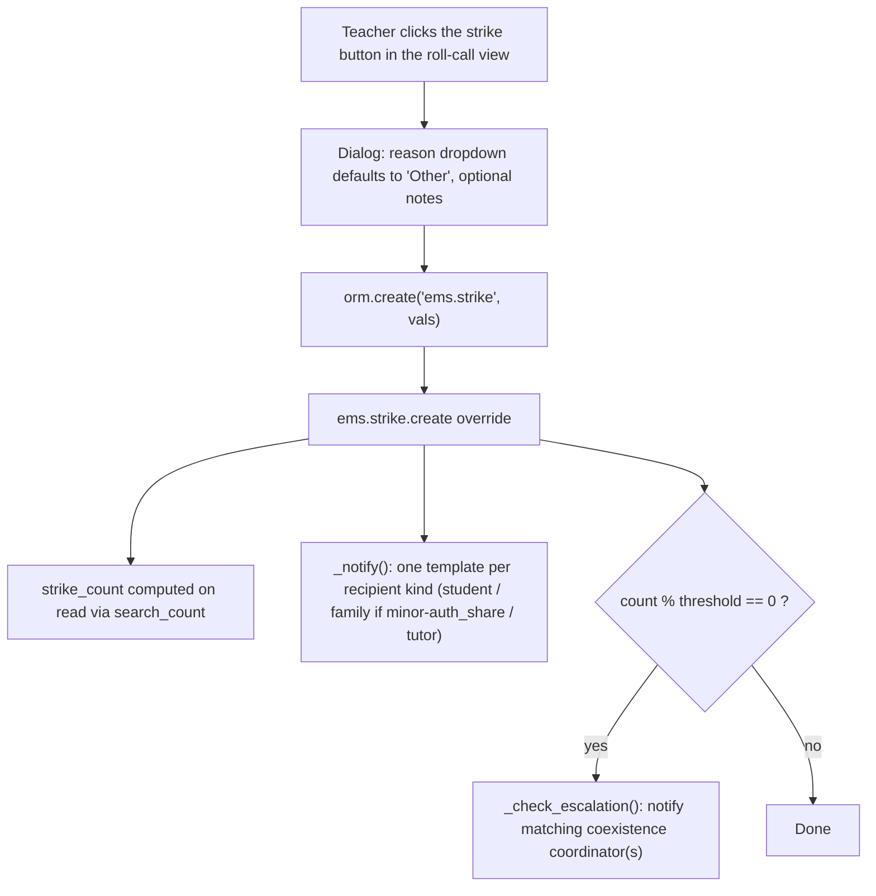

# Technical Reference: `ems.strike`

## Overview

`ems.strike` lets a teacher flag a disciplinary incident ("strike") against a student from the roll-call/attendance-taking view (a button to the left of the notes pencil). Each strike is independent of the attendance session — just student, issuing teacher, date, reason, optional notes, and whether the incident ended with the student being kicked out of the classroom (`kicked_out`, defaults to unmarked).

Every strike notifies the student's own email always, and the group tutor always. Whether the family is also notified (subject to the same minor/`auth_share` rule used for attendance-issue notifications) depends on a configurable setting, `strike_family_notification_mode` (`res.company`): `'all'` notifies the family on every strike, `'kicked_out'` only when that strike's `kicked_out` is `True`. Every time the student's cumulative strike count is a multiple of a configurable threshold (`ems.strike_escalation_threshold`, default 3), the coexistence coordinator(s) sharing the issuing teacher's ascendant Head of Studies / Deputy Head of Studies are also notified.

**Module files:** `models/coexistence/strike.py`, `models/coexistence/strike_reason.py`

---

## Data Model

### `ems.strike.reason`

| Field | Type | Description |
|-------|------|--------------|
| `name` | `Char` (translate) | Reason label shown in the roll-call dropdown |
| `sequence` | `Integer` | Ordering; `ems.strike_reason_other` (sequence 1) is the default, generic reason |
| `active` | `Boolean` | Archivable without deleting historical references |

### `ems.strike` (`_inherit = ['ems.base']` — gives `mail.thread`/chatter for free)

| Field | Type | Required | Description |
|-------|------|:--------:|--------------|
| `student_id` | `Many2one → res.partner` | Yes | Domain `contact_type = student`, `ondelete='cascade'` |
| `teacher_id` | `Many2one → hr.employee` | Yes | Issuer; defaults to the current user's employee |
| `reason_id` | `Many2one → ems.strike.reason` | Yes | Defaults to `ems.strike_reason_other` |
| `date` | `Datetime` | Yes | Defaults to now (date and time of the incident) |
| `notes` | `Text` | No | Free-text details |
| `kicked_out` | `Boolean` | No | Defaults to `False`; set by the issuing teacher in the roll-call strike dialog when the incident ended with the student being sent out of the classroom. Shown on the Coexistence form and reported in all three notification emails |
| `send_to` | `Char` (readonly) | — | Resolved recipient addresses, semicolon-separated (bookkeeping) |
| `strike_count` | `Integer` (computed, not stored) | — | Student's cumulative strike count up to and including this one; not shown in any view (redundant with the list itself) — used internally by `_check_escalation()` and by the escalation email's "Total strikes" line |
| `attendance_session_line_id` | `Many2one → ems.attendance_session_line` | No | Optional; set only when issued from the roll-call view, `ondelete='set null'` — the strike record is never deleted just because its session/line is |

`display_name` is computed as `"{student} | {date} | {reason}"`.

**Per-session strike count (UI only):** `ems.attendance_session_line` carries the inverse `strike_ids` (`One2many`, inverse of `attendance_session_line_id`) purely so the roll-call view can show, per student row, how many strikes were issued during *that specific session* — the strike button turns solid red and displays the count instead of the icon once `strike_ids.length > 0` (`static/src/xml/backend/attendance_session_view.xml`, `.ems-av-strike-btn--has-strikes` in the matching CSS). Date/time-window matching was deliberately rejected for this: the school runs parallel sessions (e.g. a scheduled class and a guard-duty session covering the same room/time), so only an explicit link captured at creation time is unambiguous. `ems.strike`'s core identity and independence from the attendance model are otherwise unchanged — the field is optional and a strike created outside the roll-call flow (e.g. directly in the backend) is still perfectly valid with no session line at all.

The same `strike_ids` inverse also backs a computed `strike_count` (`Integer`, not stored) on `ems.attendance_session_line`, plus an `action_view_strikes()` method (same pattern as `res.partner.action_view_strikes()` below) — used by a count column + object button on the "Statuses" list of the session's own read-only form (`views/attendance/attendance_session/form.xml`, reachable from Attendance → History). Before this, a session's detail form showed no trace of any strike issued during it; the button opens `ems.action_strike_list` filtered to `attendance_session_line_id = <line>`. The button's `<i>` icon needs an explicit `vertical-align: middle` (`.o_field_widget[name="attendance_session_line_ids"] td.o_data_cell:has(button[name="action_view_strikes"])` in `static/src/css/backend/ems.css`) — Odoo's list rendering leaves button-column cells top-aligned by default, which looks off next to the taller `image_1920` avatar column in the same row.

**Unrelated pre-existing access-rule gap this surfaced:** opening some sessions from History raised an `AccessError` on `ems.attendance_schedule` ("Horari d'assistència"), for a teacher who could otherwise open the session fine. Cause: `rule_attendance_session_teacher_own` grants read on `ems.attendance_session_header` via `create_uid`/`template_teacher_ids`/`session_teacher_id`, but `rule_attendance_schedule_teacher_own` on the *schedule* the session points to only checked `create_uid`/`teacher_ids` (a related pass-through from `attendance_template_id.teacher_ids`) — so a teacher covering a `mode='guard'` session for a schedule whose template doesn't list them as a teacher could see the session but not the `attendance_schedule_id` field on its own form. Fixed with an additional, read-only `ir.rule` (`rule_attendance_schedule_teacher_session_read` in `security/rules/attendance.xml`) mirroring the session rule's own domain one hop out via `attendance_schedule.attendance_session_ids` — additive only (Odoo ORs same-group rules), so it widens read access without touching write/create/unlink. Covered by `tests/test_attendance_schedule.py` (new file; not a full DTON pass on `ems.attendance_schedule`, scoped to this access-rule behaviour only).

---

## CRUD Flow

- **Create**: only entry point — the list view has `create="0"`, records are only created via `create()`, either from the roll-call button (`orm.create`) or the backend for admins.
- **Notification** (`_notify`): `_collect_recipients_by_kind()` reuses the exact minor/`auth_share` authorization rule already used by `ems.attendance_issue_status`/`ems.notice`, but keeps the three recipient kinds separate instead of flattening them — student email always; family emails from `student.relation_all_ids` filtered to `contact_type == 'family'`, only if `not student.is_adult or student.auth_share` **and** `strike_family_notification_mode` allows it (`'all'`, or `'kicked_out'` with this strike's `kicked_out = True`); the group tutor's email (`student.tutor_id.email`, via the existing `res.partner.tutor_id` related field) — student and tutor are never gated by `strike_family_notification_mode`. Each kind gets its own `mail.template` (`ems.mail_strike_notification_student` / `_family` / `_tutor`, all three defined in `mails/coexistence/strike_notification.xml`) so the wording matches who's actually reading it (e.g. the student's own copy skips the redundant "Student:" row, the tutor's copy points to the Convivencia list instead of "reply to the teacher"). All three always render a "Kicked out of class: Yes/No" line (`object.kicked_out`), regardless of the value, so the recipient knows either way. One `send_mail(force_send=True, email_values={'email_to': ...})` call per recipient address, in that recipient's own language — same pattern as `ems_attendance_issue_status.send_notification()`.
- **Escalation** (`_check_escalation`): fires every time `strike_count % strike_escalation_threshold == 0` (repeating, not one-time — e.g. at 3, 6, 9... strikes with the default threshold). Matching coordinators are resolved by walking `ems.role_coexistence.employee_ids` (bridged from `hr.employee.public` to `hr.employee`) and comparing each coordinator's `find_head_of_studies()` result to the issuing teacher's — only coordinators in the same HoS/DHoS branch are notified.
- **Read**: see Access Control below.
- **Update/Delete**: only Administrators (`ems.group_academic_admin`).

---

## Access Control

| Role | Create | Read | Write | Delete | Group/Rule |
|------|:------:|:----:|:-----:|:------:|-------------|
| Administrator | ✓ | ✓ (all) | ✓ | ✓ | `ems.group_academic_admin` |
| Coexistence Manager/Administrator | — | ✓ (all, centre-wide) | — | — | `ems.group_coexistence` / `ems.group_coexistence_admin` |
| Tutor | ✓ | ✓ (own issued + tutees) | — | — | `ems.group_tutor` (implies `group_teacher`) |
| Teacher | ✓ | ✓ (own issued only) | — | — | `ems.group_teacher` |

Record rules: `security/rules/coexistence.xml`. `ems.group_coexistence` is a **new, independent security group family** (its own `ir.module.category`, `category_coexistence`), not nested under the teacher/tutor/HoS hierarchy — coexistence coordinators can read every strike centre-wide regardless of branch (the HoS/DHoS branch matching logic is only used to route the *escalation email*, not to gate read access). `ems.role_coexistence.group_id` is wired to `ems.group_coexistence`, and `ems.role_coexistence.unipersonal` is `false` — multiple coexistence coordinators (one per HoS/DHoS branch) are expected.

---

## Settings

- `strike_escalation_threshold` (`res.company`, default `3`) — "Strikes Settings" block in Settings, same pattern as `attendance_issue_status_delay`.
- `strike_family_notification_mode` (`res.company`, `Selection`, `'all'`/`'kicked_out'`) — same block, `widget="radio"`. Defaults to `'all'` at the field level so an installation upgrading into this version keeps its existing always-notify-the-family behaviour unchanged (no migration script needed — the plain field default is enough, via the normal schema-backfill mechanism). A brand-new installation has no prior behaviour to preserve, so `post_init_hook` (`__init__.py::_default_strike_family_notification_kicked_out`) sets it to the stricter `'kicked_out'` instead, right after data files load.

---

## Frontend

- `static/src/js/backend/attendance_session_view.js`: loads active `ems.strike.reason` records on `onWillStart`; `onStrikeClick`/`onStrikeCancel`/`onStrikeSend` mirror the existing notes-dialog handlers (`onNotesClick`/`onNotesCancel`/`onNotesSave`); `onStrikeSend` calls `orm.create("ems.strike", [...])`, including the `kicked_out` checkbox state.
- `static/src/xml/backend/attendance_session_view.xml`: `<td class="ems-av-td-strike">` (button, `fa-exclamation-triangle`) placed immediately before the notes `<td>`; `<dialog t-ref="strikeDialog">` with a reason `<select>` + optional `<textarea>` + a "Kicked out of class" checkbox (unchecked by default, reset on every open) + Send/Cancel, structurally identical to the notes dialog.
- `static/src/css/backend/attendance_session_view.css`: `.ems-av-strike-*` classes mirroring `.ems-av-notes-*`.

---

## Views

| View | File |
|------|------|
| List/Form (strikes) | `views/coexistence/strike/{list,form}.xml` |
| Menu (top-level "Convivencia") | `views/coexistence/strike/menu.xml` |
| List/Form (reasons, admin config) | `views/coexistence/strike_reason/{list,form}.xml` |
| Menu (Convivencia → Configuration → Strikes → Reasons) | `views/coexistence/strike_reason/menu.xml` |
| Student form smart button | `views/community/contact/form.xml` (`button_box`, `strike_count` → `action_view_strikes()`) |
| Session History form (per-line strike count/button) | `views/attendance/attendance_session/form.xml` (`ems.attendance_session_line.strike_count` → `action_view_strikes()`) |

---

## Mail Templates

| Template | File | Purpose |
|----------|------|---------|
| `ems.mail_strike_notification_student` | `mails/coexistence/strike_notification.xml` | Sent to the student, on every strike |
| `ems.mail_strike_notification_family` | `mails/coexistence/strike_notification.xml` | Sent to the family (if minor or `auth_share`), on every strike |
| `ems.mail_strike_notification_tutor` | `mails/coexistence/strike_notification.xml` | Sent to the group tutor, on every strike |
| `ems.mail_strike_escalation` | `mails/coexistence/strike_escalation.xml` | Coexistence coordinator escalation, sent every time the threshold multiple is reached |

All three notification templates live in the same file since they're the same underlying notification, just addressed and worded differently per recipient (not three unrelated features) — `ems.strike._notify()` picks the matching template per recipient kind returned by `_collect_recipients_by_kind()`.

---

## Data Files

| File | Purpose |
|------|---------|
| `data/main/ems.strike.reason.csv` | Seeds `ems.strike_reason_other` (default) plus a few sample reasons |

---

## Testing note

`ems.strike._notify()`/`_check_escalation()` send email synchronously (`force_send=True`) on every `create()`. Any test that creates a strike **must** patch `odoo.addons.base.models.ir_mail_server.IrMailServer.send_email` (see `tests/test_strike.py`/`tests/test_strike_tour.py`), since this environment's `ir.mail_server` records point to real, credentialed outgoing servers — Odoo's test runner does not suppress real SMTP delivery on its own.

## Follow-ups (out of scope for v1)

- No per-course-year scoping of the strike count (cumulative for the student's entire history).
- No configurable per-branch escalation recipient override beyond the HoS/DHoS-matching algorithm.

## `ems.strike.reason` DTON pass (2026-07-28)

Class renamed `ems_strike_reason` → `EmsStrikeReason` (had its own `_name`, not an
`_inherit`-only extension). New `tests/test_strike_reason.py` (5 tests: required `name`,
default `active`, `sequence`/`name` ordering, archiving doesn't disturb a strike already
referencing it, the seeded `ems.strike_reason_other` default) — no dedicated test file
existed before, only incidental use via `env.ref` in `test_strike.py`. No dev-doc changes
needed — the fields table and views table above already covered this model; no tour needed
either, since `static/tests/tours/strike_tour.js`'s reason-select step already exercises the
one place this model's data is rendered outside its own admin config screen. No bugs found.
