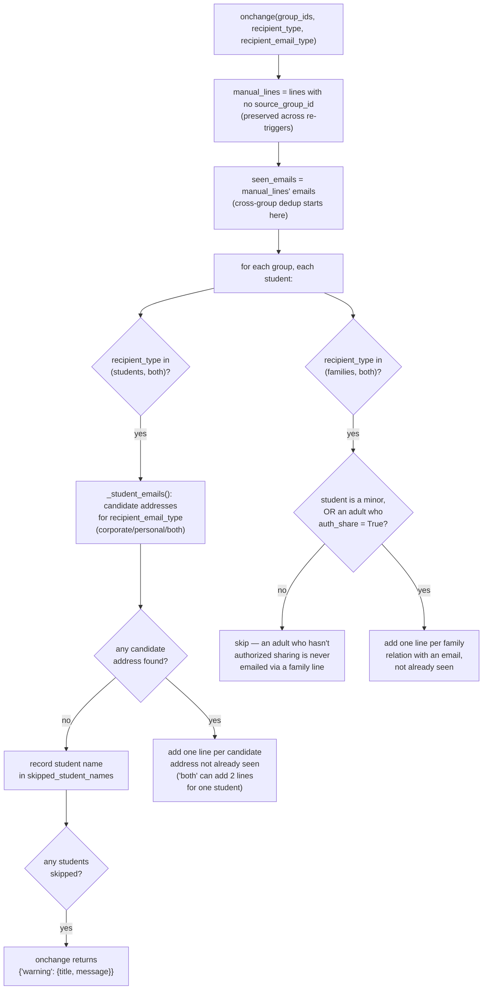
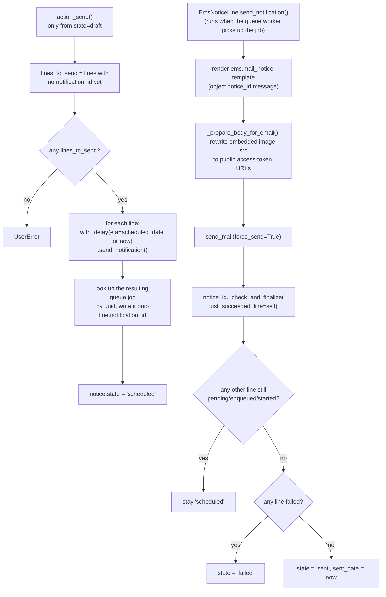

# Technical Reference: `ems.notice` / `ems.notice.line`

## Overview

`ems.notice` is a bulk email — one message sent to students and/or their families across one
or more groups. Entirely self-contained: sent through Odoo's own `ir.mail_server`, no
external service involved (unlike [`ems.limesurvey*`](limesurvey.md), the other model group
in this phase, which talks to a real LimeSurvey instance).

**Module file:** `models/communications/notice.py` (`EmsNotice`, `EmsNoticeLine`)

---

## Fields

| Field | Type | Notes |
|-------|------|-------|
| `state` | `Selection` (draft/scheduled/sent/failed) | `draft` → `action_send()` → `scheduled` → (async, via `_check_and_finalize`) → `sent`/`failed`. `action_cancel()` returns to `draft`. |
| `use_schedule`/`scheduled_date` | `Boolean`/`Datetime` | If set, `action_send()` passes `scheduled_date` as the queue job's `eta` — recipients get the email at that time, not immediately. |
| `recipient_type` | `Selection` (students/families/both) | Drives `_build_auto_lines`' filtering. |
| `recipient_email_type` | `Selection` (corporate/personal/both, default `both`) | **Added 2026-09-05.** Which of a student's two email addresses to use - see below. Meaningless for a families-only send (`invisible="recipient_type == 'families'"` in the form), since families only ever have one `email` field, no corporate counterpart. |
| `signature` | `Html` | **Added 2026-09-05.** `default=lambda self: self.env.company.notice_email_signature` - copied from the company's own default at creation time, then freely editable (or clearable) per notice. Rendered verbatim by `ems.mail_notice` (see "Email rendering" below) - replaces what used to be a hardcoded "Kind regards, {company name}" baked into the template itself. |
| `notice_line_ids` | `One2many → ems.notice.line` | Mix of auto-populated (from `group_ids`, `source_group_id` set) and manually-added (no `source_group_id`) rows — see below. |
| `can_cancel` | computed | `True` only when `state == 'scheduled'` **and** `use_schedule` **and** no line's job has reached `started`/`done`/`failed` yet. An immediate send (`use_schedule=False`) can never be cancelled, even before the queue actually processes it — it's treated as already committed the moment it's sent. |

`ems.notice.line`: one row per recipient — `email`, `recipient_type` (student/family),
`source_group_id` (which auto-population group produced this row; `False` for a manually
added recipient), `notification_id` (the `queue.job` tracking this line's send).

---

## Recipient auto-population (`_build_auto_lines` / `_onchange_groups`)



Re-triggering the onchange (e.g. adding another group) never duplicates or drops a manually
added recipient — only the auto-populated set (`source_group_id` set) gets rebuilt from
scratch each time; anything without `source_group_id` is untouched.

### `recipient_email_type`: corporate vs. personal student email (added 2026-09-05)

A student has two independent, optional email addresses (`models/contacts/contact.py`):
`student_email` (the **corporate**/institutional Google Workspace address, auto-provisioned by
the account-creation job in `models/contacts/google_workspace_integration.py:284-285` -
`self.sudo().student_email = email` - and empty until that job has run) and `email` (the
**personal** address, imported/entered manually - see
[`google_workspace_student.md`](../contacts/google_workspace_student.md) for the full
provisioning flow). Before this change, `_build_auto_lines` used a hardcoded, non-configurable
fallback: `student.student_email or student.email` - always preferred corporate, silently fell
back to personal, and could never use both.

`recipient_email_type` replaces that fallback with an explicit, user-chosen mode, applied per
student via the new `_student_emails()` helper:

| `recipient_email_type` | Candidate addresses per student |
|---|---|
| `corporate` | `student_email` only (student skipped if empty) |
| `personal` | `email` only (student skipped if empty) |
| `both` (default) | **Both**, if present - a student with both addresses gets **two** `ems.notice.line` rows (two separate emails sent), not one line with a fallback choice. A student with only one of the two still gets exactly one line for it. |

A student contributes **zero** lines only when none of their candidate addresses (per the
current mode) are set - that student's name is collected into `skipped_student_names` and
`_onchange_groups` surfaces it via the standard Odoo onchange
`{'warning': {'title': ..., 'message': ...}}` dict, the same idiom already used elsewhere in
this codebase for onchange-time validation (`models/enrollment/enrollment.py:354-372`,
`models/employees/employee.py:404-419`) - not `ems.base.notify()` (bus notifications need a DB
commit to deliver, which an onchange on an unsaved/`new()` record never has) and not the
wizard-style `stats['warnings']`/`warning_html` pattern (`models/contacts/student_import_wizard.py`
etc. - built around an explicit "Run" button's result, not live onchange feedback).

The family branch is unaffected: families only ever have the single base `email` field, no
corporate counterpart, so `recipient_email_type` has no effect on `recipient_type in
('families', 'both')`'s family-line logic - and the field is hidden in the form entirely when
`recipient_type == 'families'`.

**Unrelated bug fixed in the same pass:** `recipient_type`'s `Both` option had an empty
`msgstr` in both `i18n/ca_ES.po`/`i18n/es_ES.po` (msgid existed, never actually translated) -
reported by the developer while reviewing this feature. Fixed alongside `recipient_email_type`'s
own new `Both` option, since both share the same msgid text and Odoo folds them into the same
`.po` block (`#:` references to both selections' xmlids on one entry) - see
`TestNotice.test_both_selection_labels_are_translated`.

---

## Sending: `action_send()` → queued jobs → `_check_and_finalize()`



`just_succeeded_line` exists because of a real timing gap: by the time `_check_and_finalize`
runs *inside* `send_notification()`, the job that's currently executing may still report its
own `queue.job.state` as `started` (the transition to `done` happens after the method
returns) — so the method explicitly treats the currently-running line as already-done rather
than reading its (momentarily stale) `display_status`.

**`send_notification()` registers a `postrollback` hook** (`self.env.cr.postrollback.add`)
so that if the job itself fails and its transaction rolls back, the notice's state still gets
finalized in a **separate, already-committed cursor** — `queue_job` marks a failed job's
state in its own committed transaction before the rollback happens, so by the time the hook
runs, reading that job's state from a fresh cursor is reliable.

---

## Email rendering: signature and Reply-To (`mails/communications/communication.xml`)

`ems.mail_notice`'s `body_html` used to hardcode a signature block directly in the template:

```xml
<t t-out="object.notice_id.message"/>
<p>Kind regards,<br/><t t-out="object.create_uid.company_id.name"/></p>
```

**Changed 2026-09-05** (developer feedback after receiving a test notice with an unexpected,
unremovable "Kind regards, {centre name}"): the `<p>...</p>` block is gone, replaced by
`<t t-out="object.notice_id.signature"/>` - the template now renders exactly whatever the
notice's own `signature` field holds (nothing, if cleared). `signature` defaults from
`res.company.notice_email_signature` (**Settings → EMS Management → Notice email
signature**, translatable) at notice-creation time, then stays independently editable per
notice - editing the company default only changes what *future* notices start with.

**`reply_to`** was previously unset on this template at all, so Odoo fell back to `email_from`
(`ir_mail_server.py`'s `msg['Reply-To'] = reply_to or email_from`) - a hardcoded technical
address (`ems@elpuig.xeill.net`), identical for every sender. Now set to
`{{object.notice_id.sent_by.email or object.notice_id.create_uid.email}}` - whoever actually
sent the notice (`sent_by`, set by `action_send()`) or, if that's not populated yet (e.g. a
`queue_job__no_delay` test rendering the template before `action_send()`'s own `write()`
executes), whoever created it. Same pattern as `mails/coexistence/strike_notification.xml`'s
`{{object.teacher_id.email}}`.

**`email_from` stays hardcoded and must not change**: both configured outgoing mail servers
(`ir.mail_server`, checked via `psql`) have `from_filter = 'ems@elpuig.xeill.net'` - the only
address they're configured to relay mail *as*. Every `mail.template` in this module hardcodes
the same literal for the same reason (`grep -rn "elpuig.xeill.net" mails/`). This is why the
fix targets `reply_to` specifically rather than making the visible sender per-user.

### Seeding the initial company signature (`__init__.py` / `migrations/18.0.0.23.3/`)

`res.company.notice_email_signature` is `Html` with `translate=True`. Seeding its initial
value (preserving the old hardcoded English text, but now in all 3 languages) turned out to
need a specific, non-obvious API - two more idiomatic-looking approaches were tried and
silently produced wrong/no data before landing on this one:

1. **A loop of `company.with_context(lang=X).write(...)` calls, once per language** - Odoo's
   translated-field write auto-cascades a new value onto every *other* language that still
   looks "not manually customized," so writing `en_US` then `ca_ES` then `es_ES` in sequence
   ends up with `en_US` clobbered by the last write (confirmed empirically: `en_US` ended up
   holding the Catalan text).
2. **`record.update_field_translations(field_name, {lang: value})`** - the ORM's own intended
   multi-language API. Returns `False` and writes nothing here, because `fields.Html` sets
   `field.translate` to the `html_translate` *function*, not the literal `True` - the ORM
   takes a completely different code path for callable-`translate` fields (term-by-term
   `{lang: {old_term: new_term}}`, diffed against an existing value) instead of "set the whole
   value," and that path requires a pre-existing value to do the diff against - it can't seed
   a still-empty field at all.

The working approach: a **direct SQL write of the full jsonb value**
(`UPDATE res_company SET notice_email_signature = %s` with a `psycopg2.extras.Json({...})`
parameter) - correct and simple for a one-time initial seed, bypassing both ORM code paths
above entirely. Same logic duplicated in `__init__.py::_seed_notice_email_signature_default`
(fresh installs, via `post_init_hook`) and `migrations/18.0.0.23.3/post-migrate.py` (existing
installs upgrading in) - see "Migrations" in `CLAUDE.md` for why both paths need it.

---

## `_prepare_body_for_email`: images need public URLs, not editor-internal ones

The rich-text `message` field can contain images two ways — pasted as a base64 data URI, or
already uploaded as an `ir.attachment` referenced via `/web/image/<id>` (no access token,
since the *editor* is authenticated and doesn't need one). Neither works unmodified in an
outbound email to an external recipient:

- **`data:image/...;base64,...`** → decoded and saved as a real `ir.attachment` (owned by
  this `ems.notice.line`), then rewritten to `/web/image/<id>?access_token=<token>`.
- **`/web/image/<id>`** (no token) → the existing attachment gets an access token generated
  (if it doesn't have one yet) and the URL is rewritten to include it.

**Known inefficiency, not fixed in this pass:** a data-URI image is re-decoded and
re-uploaded as a **new** `ir.attachment` independently for every recipient line, since each
line renders and processes the shared `notice.message` HTML on its own. For a notice with an
embedded image sent to N recipients, this creates N duplicate attachments holding identical
image data. Not incorrect (each line's email still renders correctly), just wasteful storage
— left as-is since deduplicating across lines would be a real behavior change (e.g. caching
by content hash on the parent `ems.notice` instead), not a normalization fix.

---

## Access control

**Updated 2026-09-05** — Head of Studies/Deputy Head of Studies (`ems.group_head_of_studies`,
the same group covers both roles) and the Quality coordinator (`ems.group_quality_admin`) now
have their own `ir.model.access.csv` rows for `ems.notice`/`ems.notice.line`, alongside
`ems.group_academic_admin`'s pre-existing full access.

| Group | Sees (read) | Creates/edits/deletes |
|-------|------|------------------------|
| `group_academic_admin`, `group_director` | Every notice | Every notice |
| `group_head_of_studies` (HOS/DHOS) | Every notice (for supervision) | Only notices they created |
| `group_quality_admin` (Quality coordinator) | Every notice (for supervision) | Only notices they created |

Enforced by `security/rules/communications.xml`: `rule_notice_admin`/`rule_notice_line_admin`
(`domain_force=[(1,'=',1)]`, full CRUD, groups `group_academic_admin` + `group_director`),
`rule_notice_read_all`/`rule_notice_line_read_all` (`domain_force=[]`, `perm_read` only, groups
`group_head_of_studies` + `group_quality_admin`) and `rule_notice_own`/`rule_notice_line_own`
(`domain_force=[('create_uid','=',user.id)]` — the line variant reads through
`notice_id.create_uid` instead, since lines have no menu of their own — `perm_write`/
`perm_create`/`perm_unlink` only, same two groups).

**Updated again 2026-09-05 (same day):** the Head of Studies/Quality coordinator read
visibility was widened from "own only" to "every notice, read-only for others'" — mirroring
the `only_mine`-filter idiom already used by `ems.attendance_template`/`.attendance_session`/
`.attendance_justification` (`views/attendance/*/search.xml`). The difference from that
precedent: those three default the filter **off** (their `ir.rule` already does the hard
per-owner restriction for teachers, so the filter is just an optional narrowing tool, mostly
useful to the already-unrestricted admin group); here the `ir.rule` itself was widened to
open read access, and `views/communications/notice/search.xml`'s "Show only mine" filter
(`domain=[('create_uid','=',uid)]`) is instead defaulted **on** via
`action_communication_list`'s `context: {'search_default_only_mine': 1}` — so a HOS/DHOS or
Quality coordinator still gets the same comfortable "just mine" default view as before, but
can remove the filter to supervise everyone else's notices, rather than having no access to
them at all. Write/create/unlink stay hard-restricted to `create_uid = user.id` either way -
only *read* visibility changed.

**Correction (still 2026-09-05):** the default filter is a single static `context` on
`action_communication_list` itself — there is only one "Notices" menu/action, shared by every
group that can open it. This means `group_academic_admin`/`group_director` also open Notices
with "Show only mine" checked by default, exactly like HOS/DHOS/the Quality coordinator; they
are **not** exempt from it. This is intentional (developer feedback 2026-09-05): the intent is
"every teacher-held role gets a comfortable own-records default", and since admin/director are
normally held by real teachers too, giving them the same default is correct, not an oversight.
The only case that's genuinely different is a non-teacher administrative account (e.g. a plain
system `admin` login with no `hr.employee` behind it) — determining "is this specific user a
teacher" from inside a static XML action `context` isn't possible (it has no ORM access, just
literals like `uid`/`context_today`), so no attempt is made to special-case it. That account
gets the same default-on filter as everyone else and removes it manually the first time (or
uses Odoo's own per-user "Save current search" star, unchecking the filter first and ticking
"Default filter", to make the removal stick permanently for just that login) — accepted as
sufficient, see `docs/en/admin/notice.md`.

**Bug fixed in this pass:** `rule_notice_own` previously had **no `groups` restriction at
all** (a "global" rule). Odoo combines a global rule with every other rule via **AND**, not as
an alternative OR — so `rule_notice_admin`'s `[(1,'=',1)]` was silently ANDed with
`rule_notice_own`'s `create_uid = user.id`, meaning **an academic admin only ever saw their
own notices too**, contradicting the rule's own name/comment ("Admins see all
communications"). Verified against `odoo/addons/base/models/ir_rule.py::_compute_domain`
(global rules → `global_domains`, always ANDed; group rules the user belongs to → ORed
together, then ANDed onto the global result) and with a real before/after test
(`TestNoticeAccessControl.test_admin_sees_all_notices`, `tests/test_notice.py`). The fix scopes
`rule_notice_own` to the two non-admin groups explicitly instead of leaving it global. Note
this is a *different* trap from `ems.enrollment`'s secretary rule in
`docs/en/developers/contacts/enrollment.md` (an unrestricted **group-scoped** rule made moot by
a `0`-everywhere model-access ceiling, not a global rule ANDing against another group's rule) —
that file's "inert, not a bug" conclusion still holds and wasn't affected by this fix.

`unlink()` is now also guarded in Python: a notice can only be hard-deleted while in `draft`
state (nothing sent yet); once scheduled/sent/failed, `UserError` tells the caller to
**archive** it instead (`ems.base`'s standard `action_archive()` / `active` field). This
applies to every group, including admins, since a sent notice has real delivery history
(`queue.job` records via `notice_line_id.notification_id`) worth preserving.

## Views

| View | File |
|------|------|
| List/Form | `views/communications/notice/{list,form}.xml` |
| Menu | `views/communications/menu.xml` ("Notices") |
| Mail template | `mails/communications/communication.xml` (`ems.mail_notice`) |

## Fixed in this pass (2026-07-28)

None — the file was already clean (PascalCase classes, no Spanish comments, consistent
`_()` usage, spaces indentation) before this pass; this was a pure T + D pass. New
`tests/test_notice.py` (24 tests across both classes) — zero coverage existed before. No
bugs found on a careful read of the send/finalize/cancel state machine or the image-rewrite
logic; the one real inefficiency found (duplicate attachment creation per recipient,
above) was judged not worth a behavior change in a normalization pass.
