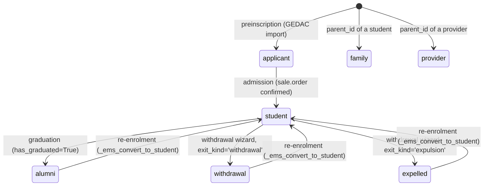
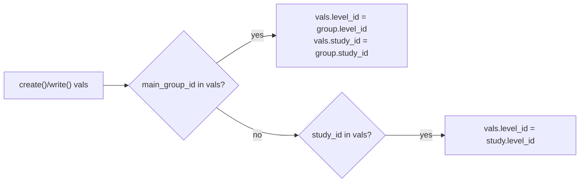
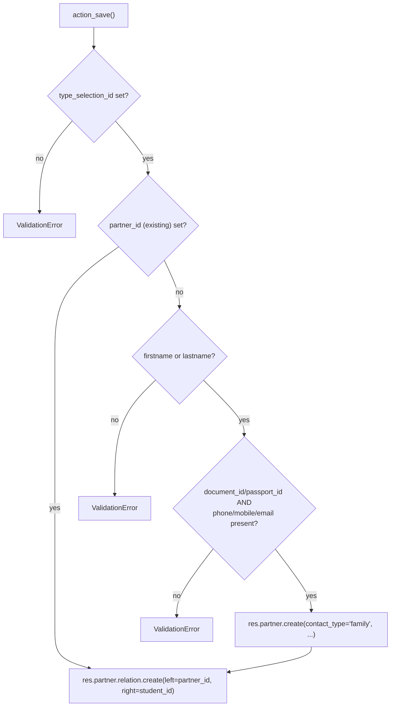

# Technical Reference: `res.partner` (EMS contact) / `ems.student.benefit` / `ems.contact.relation.wizard`

## Overview

EMS does not define its own "contact" model: every student, family member, applicant, alumnus, withdrawal and external provider is a `res.partner` record, distinguished by `contact_type`. `models/contacts/contact.py` extends `res.partner` (`_inherit`) with the whole EMS-specific surface: lifecycle, academic placement, benefits/exemptions, authorizations, portal-access side effects and Google Workspace triggers. The same file also defines `ems.student.benefit`, a satellite one2many owned by a student.

**Module files:**
- `models/contacts/contact.py` — `ResPartner` (`_inherit = 'res.partner'`), `EmsStudentBenefit`
- `models/contacts/contact_relation.py` — `EmsContactRelationWizard`, `ResPartnerRelationAll` (`_inherit = 'res.partner.relation.all'`, from the `partner_multi_relation` OCA module)
- `models/contacts/google_workspace_integration.py` — `ResPartnerGoogleWorkspace`, the corporate-account side of the lifecycle (not covered here — see [Google Workspace student integration](google_workspace_student.md))

Related docs: [`ems.group`](group.md) (`main_group_id`), [Enrollment benefits](../enrollment/enrollment_benefits.md) (`ems.student.benefit` vs `sale.order`/invoice interaction), [Graduation & withdrawal wizards](exit_wizards.md) (deferred graduation mark vs immediate withdrawal cascade).

---

## Contact lifecycle

`contact_type` also has two lifecycle-independent values not shown above: `family` and `provider`, auto-assigned in `create()` from the parent contact's own `contact_type` whenever `parent_id` is set (a child contact of a student becomes `family`; of a provider, `provider` — see `create()`'s inline note on why this can't rely on the value arriving from the popup form).

`has_graduated` is a **permanent** mark, set once by the graduation wizard and never cleared — it is what `_ems_convert_to_ex_student()` uses to decide `alumni` vs `withdrawal` on exit, even after a later re-enrolment. **`expelled` (added 2026-08-01) overrides this entirely**: `_ems_convert_to_ex_student(kind='expulsion')`, called only by the withdrawal wizard when the admin picks "Expulsion", always produces `contact_type = 'expelled'` regardless of `has_graduated` — see [Graduation & withdrawal wizards](exit_wizards.md#exit_kind--withdrawal-vs-expulsion-added-2026-08-01) for the full `exit_kind` design (and why it required a full audit of every place `contact_type` was filtered/branched on before adding the new value).

### `_sync_category()`

Every lifecycle transition re-tags `category_id` via a fixed map (`contact_type` → `res.partner.category` XML ID). `student`, `applicant`, `alumni`, `withdrawal` and `expelled` all additionally carry the shared `ems.partner_category_student` marker — this is what keeps family-relation domains (which pin the right-hand side to `partner_category_student`) valid across the whole lifecycle, not just while `contact_type == 'student'`. `_ems_resync_lifecycle_categories()` is a `@api.model` idempotent heal, invoked from a data `<function>` on upgrade, for partners created before this shared marker existed.

### `archived_reason_label` / `archived_reason_color`

Feed the shared `ems_archived_reason_ribbon` field widget (`static/src/js/backend/archived_reason_ribbon_field.js`, also used by `hr.employee` — see [`employee.md`](../employees/employee.md)) on both `views/community/contact/{form,kanban}.xml`: `_compute_archived_reason()` (`@api.depends('contact_type')`) returns `(_("Alumni"), '#4C7A5D')` / `(_("Withdrawal"), '#C97B3D')` / `(_("Expelled"), False)` for the three lifecycle-exit values, `(False, False)` for anything else (`student`/`family`/`provider`/`applicant`) — the native "Archived" ribbon (`base.view_partner_form`) is adjusted, not replaced, to only show for that last group (`invisible="active or archived_reason_label"`).

This **must be a real compute, not a plain `related=`**, unlike `hr.employee`'s equivalent (see [`employee.md`](../employees/employee.md)): `contact_type` has six possible values and only three are ribbon-worthy, so something has to decide which — a `related=` field always mirrors its target 1:1, with no way to express "but only for these values, otherwise nothing." `expelled`'s color is deliberately `False` (falls back to the widget's own default red, `#dc3545`) — same reasoning as leaving `hr.departure.reason`'s "Fired" record uncolored: severity that's already self-evident doesn't need a bespoke color to make the point.

---

## `ems.student.benefit`

| Field | Type | Notes |
|-------|------|-------|
| `student_id` | `Many2one → res.partner` | required, `ondelete='cascade'` |
| `benefit_type` | `Selection` (7 values) | required |
| `category` | `Selection` (`bonification`/`exemption`), computed, stored | `@api.depends('benefit_type')` — see mapping in `_compute_category` |
| `document` | `Binary` | required (supporting document) |
| `renewal_date` | `Date` | defaulted by `_onchange_benefit_type` (9 months for `scholarship`, 2 years otherwise) — a one-time UI convenience, not a stored compute, so it stays user-editable afterwards |

`res.partner.benefit_status` aggregates a student's `benefit_ids` into `none`/`bonification`/`exemption` (exemption wins if both are present). **The interaction between a benefit and an already-confirmed enrollment's invoice — draft orders react live, confirmed orders freeze — is documented in full in [Enrollment benefits](../enrollment/enrollment_benefits.md); `tests/test_enrollment_benefit.py` is the authoritative test coverage for that interaction**, not `tests/test_contact.py`.

---

## Key computed/derived fields on `res.partner`

| Field | Depends on | Notes |
|-------|-----------|-------|
| `is_adult` | `birth_date` | `>= 18` years via `relativedelta`; `False` if no birth date |
| `strike_count` | `strike_ids` | `len()` of `ems.strike` records |
| `transition_status` | `contact_type`, `exit_type`, next-course `sale_order_ids` | `enrolled` / `unplaced` / `graduated` / `former` / `missing`; searchable via `_search_transition_status` (evaluates in Python then converts to an `id in/not in` domain — not SQL-pushable). Full branch coverage in `tests/test_exit_management.py`. |
| `auth_image` / `auth_trip` / `auth_healt` / `auth_share` | current-course `sale_order_ids.ems_authorization_ids` | One `ems.authorization` per template per order; `True` only if `status == 'yes'` for that `auth_type` in the **current** course |
| `ems_authorization_ids` | (not stored) | Current-course authorizations across the student's `sale.order`s — feeds the badges above |
| `ems_current_enrollment_id` | (not stored) | The student's `sale.order` for the enrollment-default (or else current) course, in `draft/sent/sale` state |
| `benefit_status` | `benefit_ids`, `benefit_ids.category` | See `ems.student.benefit` above |
| `archived_reason_label` / `archived_reason_color` | `contact_type` | Feeds the `ems_archived_reason_ribbon` field widget (form + kanban) — see "Contact lifecycle" above |

> `ems_authorization_ids`/`ems_current_enrollment_id`/`auth_*` sit at the boundary with [`ems.authorization*`](../enrollment/authorization.md) (`models/enrollment/authorization.py`). `_compute_ems_authorization_ids` was missing its `@api.depends` entirely (a real bug — a non-stored compute field with no dependencies never gets invalidated by later writes in the same transaction) — found and fixed during that model group's own DTON pass, not this one; see that doc's "res.partner auth booleans" section.

### `_compute_group_data(values)`

Not a `@api.depends` compute — a **vals-mutation helper** called from both `create()` and `write()` before the actual `super()` call: if `main_group_id` is present in the incoming vals, it derives and injects `level_id`/`study_id` from that group; if only `study_id` is present, it derives `level_id`. Keeps the three fields from ever disagreeing regardless of which one the caller set. The client-side `_onchange_level_id`/`_onchange_study_id` mirror this in the form (clearing the now-stale child field the moment a parent field changes) but are pure UI convenience — `_compute_group_data` is what makes the guarantee hold for any programmatic write (RPC, import, wizard).

### `_migrate_enrollments_on_group_change(old_main_groups)` — a tutor moving a student between groups (issue #395)

A tutor's own tutorands' `main_group_id` field is no longer locked by `is_tutor_readonly` on the form (see "Access Control" below) — a tutor can move a student from one group to another (e.g. group A to group B, within the same study/level; `study_id` stays tutor-locked so the study itself can never change this way). `write()` reacts to that change: **before** calling `super().write()` it captures `{partner.id: partner.main_group_id}` for every partner about to have `main_group_id` written (skipped entirely if `env.su`, see below); **after** the write, `_migrate_enrollments_on_group_change()` compares each partner's captured old value against its new one and, for every real A→B change, calls [`ems.enrollment._ems_move_group(partner, old_group, new_group)`](enrollment.md#_ems_move_groupstudent-old_group-new_group--following-a-students-group-change-issue-395) — which repoints that student's subject enrollments (and, through its own reused `create()`/`unlink()`, their attendance-schedule rosters and open grade-session lines) from the old group to the new one. A partner with no previous group (a first placement) or whose group ends up unchanged is skipped.

**`env.su` is what keeps this from firing on `sale.order._ems_apply_destination_placement()`** (course transition / enrollment-placement confirmation), which also writes `main_group_id` but deliberately does *not* want the outgoing group's enrollments touched (they are the ending year's history) — that flow always writes via `sudo()`. See `_ems_move_group`'s own doc for the full reasoning and the mirrored `env.su` check `ems.enrollment.default_get()` already uses for the same purpose.

Applies to **any** interactive change of `main_group_id`, not only when a tutor does it — admin/secretary editing the same field, or a bulk student CSV re-import updating an existing student's group, are the same real-world event ("this student's group changed") and get the same cascade; this is what closes a pre-existing gap where changing `main_group_id` never used to move a student's subject enrollments at all, regardless of who changed it.

**`main_group_pending_change` — pre-save warning (issue #395).** A `compute='_compute_main_group_pending_change'`, `@api.depends('main_group_id')` boolean, `store=False`, feeding a yellow `alert alert-warning` banner at the top of the Studies tab's "Enrollment Data" section (`views/community/contact/form.xml`). Compares `partner.main_group_id` (the live, possibly-unsaved on-screen value) against `partner._origin.main_group_id` (the actually-persisted one): `_origin` is what keeps this reactive to an in-progress form edit *before* Save, rather than only reflecting the outcome after the fact like `_migrate_enrollments_on_group_change` itself does — the same distinction `docs/en/developers/enrollment/enrollment.md`'s `NewId(origin=...)` note describes for onchange-time virtual records. `False` whenever there is no real old group (first placement) or the edited value matches the persisted one (including "changed then changed back" within the same edit session). Covered by `tests/test_contact.py`'s `test_main_group_pending_change_*` (built via `self.env['res.partner'].new({}, origin=student)`, the lower-level equivalent of editing the field in a `Form()`/browser without saving) and exercised visually by `tests/test_contact_group_change_tour.py`.

**`tutor_id` is now `readonly=True` at the field level (bug found 2026-09-06, same testing pass).** `related="main_group_id.tutor_id"` had no explicit `readonly`; per Odoo's `Field.setup_related()`, a related field only skips auto-generating a write-through inverse when *it or its target* is already readonly — neither was true here, so Odoo silently wired one up. Without the fix, editing "Tutor" from a **student's own form** would not merely have updated a display value for that one student: it would have reassigned `main_group_id.tutor_id` on the underlying `ems.group` record itself, changing the tutor for *every* student in that group. `readonly=True` removes the inverse entirely (a `write()` including `tutor_id` is now silently ignored — Odoo does not raise for a compute field with no inverse, it just cannot persist the value; only the calling recordset's own in-memory cache reflects it until next recompute). The view's own conditional `readonly="is_tutor_readonly"` on this field was dropped as redundant. Covered by `tests/test_contact.py::test_tutor_id_write_does_not_reassign_the_group_tutor`.

### `_check_nuss` (`@api.constrains('nuss')`)

The Spanish Social Security number (NUSS) must be exactly 12 numeric digits (`re.fullmatch(r'\d{12}', nuss)`) when set.

---

## Portal email change

`write()` detects, **before** calling `super()`, any student/family partner whose `email` is about to change while holding active portal access (`_has_active_portal_user`), then **after** the write calls `_apply_portal_email_change()` for each: revokes portal access at the old email and re-grants it at the new one via `ems.portal.access.wizard` (sudo — tutors lack `res.users` rights), and posts a portal-visible message on the related student(s) explaining what happened. `_onchange_email_portal_warning` gives the same heads-up client-side, before Save, via a non-blocking `warning`.

---

## `toggle_active()` — archiving is the withdrawal flow

Archiving one or more **active students** does not flip `active` directly: it opens the withdrawal wizard instead (mirroring `hr.employee`'s departure-reason flow), because withdrawal changes more state atomically (`contact_type`, operational-record cleanup, portal) than a bare `active` flip — none of it may run before a reason is captured, and nothing should happen if the wizard is cancelled. Non-student contacts in the same recordset are archived directly; reactivating never opens the wizard. See [Graduation & withdrawal wizards](exit_wizards.md) for the full withdrawal cascade this triggers. Full coverage (including the generic Archive action from list/form, mixed recordsets, and the "still shows under Former students" edge case the tour catches) lives in `tests/test_exit_management.py` and `tests/test_withdrawal_tour.py`.

---

## `ems.contact.relation.wizard` — adding a family contact

`res.partner.relation.all` (from the third-party `partner_multi_relation` module) is extended (`ResPartnerRelationAll`) with read-only related columns (`other_partner_phone/mobile/email`, relation labels) purely for display in the student/family form's relation list — no new logic.

`ems.contact.relation.wizard` (`action_open_relation_wizard`, opened from the student's "Contacts & Addresses" tab) either links an **existing** `family`-typed partner or creates a **new** one, then always creates one `res.partner.relation` between it and the student:

`_onchange_student_id` pre-fills the address fields from the student (client-side convenience only — `action_open_relation_wizard` already seeds them server-side when the wizard is created, since it's opened with `target: 'new'` on an already-saved record, not a blank `new()` form).

---

## Google Workspace

`models/contacts/google_workspace_integration.py` (`ResPartnerGoogleWorkspace`) manages the student corporate-account lifecycle (creation eligibility, OU relocation on adult/minor transition, suspend/reactivate) via `with_delay()`-queued jobs, invoked from `ResPartner.create()`/`write()`/`_ems_convert_to_ex_student()`. Fully DTON'd separately — see [Google Workspace student integration](google_workspace_student.md) for the full technical reference, and [Google Workspace staff](../employees/google_workspace_staff.md) for the equivalent pattern on the employee side.

---

## Access Control

### `ir.model.access.csv`

| Model | Role | Create | Read | Write | Delete |
|-------|------|:------:|:----:|:-----:|:------:|
| `res.partner` | Academic admin | ✓ | ✓ | ✓ | ✓ |
| `res.partner` | Secretary | ✓ | ✓ | ✓ | ✓ |
| `res.partner` | Teacher | — | ✓ | — | — |
| `ems.student.benefit` | Academic admin | ✓ | ✓ | ✓ | ✓ |
| `ems.student.benefit` | Secretary | ✓ | ✓ | ✓ | ✓ |
| `ems.student.benefit` | Teacher | ✓ | — | — | — |
| `ems.contact.relation.wizard` | Academic admin | ✓ | ✓ | ✓ | ✓ |
| `ems.contact.relation.wizard` | Teacher | ✓ | ✓ | ✓ | ✓ |

### `security/rules/contacts.xml` (record rules, `res.partner`)

| Rule | Groups | Domain | Write |
|------|--------|--------|:-----:|
| `rule_contact_admin` | Academic admin | `[]` (unrestricted) | ✓ |
| `rule_contact_secretary` | Secretary | `[]` (unrestricted) | ✓ |
| `rule_contact_teacher` | Teacher | `[]` (read-only, no write/create/unlink) | — |
| `rule_contact_tutor` | Teacher (tutor subset) | Own tutorands **or** their family (`relation_all_ids.other_partner_id.tutor_id`) | ✓ (no create/unlink) |

The **field-level** editing surface for tutors is narrower than the record rule allows: `read_only_user`/`is_tutor_readonly` (computed on load, not stored) drive `readonly=`/`invisible=` attributes across the view, so a tutor's ORM write access to their own tutorands is real but the form only exposes a subset of fields as actually editable (`_get_read_only_user`/`_get_is_tutor_readonly`, `_user_is_tutor_of_record`). **`main_group_id` is the one exception (issue #395):** every other tutor-locked field on the "Studies"/"Secretary" pages stays behind `is_tutor_readonly`, but `main_group_id` deliberately excludes it — a tutor can move their own tutorand to another group of the same study (`study_id`'s own domain still scopes the choice, and `study_id` itself stays locked) — see `_migrate_enrollments_on_group_change` above for what happens to the student's subject enrollments when they do.

---

## Views

| View | File | Notes |
|------|------|-------|
| List | `views/community/contact/list.xml` | `js_class="student_list"`; columns conditional on `default_contact_type` context |
| Kanban | `views/community/contact/kanban.xml` | Default view for the Students menu |
| Form | `views/community/contact/form.xml` | Inherits `base.view_partner_form`; `js_class="studentpopup_expand_button"`; conditional pages per `contact_type` (`student`, `applicant`, `former_student`, `academic_history`, base `contact_addresses`) |
| Search | `views/community/contact/search.xml` | — |
| Relation wizard | `views/community/contact/relation_wizard.xml` | `action_contact_relation_wizard` |
| Menu | `views/community/contact/menu.xml` + `views/community/menu.xml` | `action_student_kanban` (top-level "Educational Community" entry), `action_family_list`, `action_provider_kanban` |

Other student-related popups — [portal access](portal_access_wizard.md), [documents](student_document.md), [graduation/withdrawal](exit_wizards.md) — live in the same `views/community/contact/` folder but are documented separately. The import wizards (`student_import`, `student_update`, `applicant_import`) are not yet DTON'd (see the roadmap).

### List view columns (2026-09-03)

`views/community/contact/list.xml`'s student-only columns (`document_id`, `birth_date`, `is_adult`, `nuss`, `citizenship_id`, `street`, `zip`, `city`, `main_group_id`, `tutor_id`, `special_needs`, `auth_image`/`auth_trip`/`auth_healt`/`auth_share`) were chosen to mirror, as closely as EMS's data model allows, the centre's own official Esfera student data export ("DADES ALUMNAT" CSV) — the fields that don't have a stored equivalent (a split second surname, sex, age as a column) were deliberately left out rather than added as new fields. `exit_type`/`exit_course_id` stay fully removed for students (`column_invisible="1"`) since they aren't part of that reference sheet. All optional columns default to `optional="show"` (visible unless a user hides them via the column selector) except `state_id`/`vat`/`invoice_sending_method`/`invoice_edi_format`/`category_id`, forced `column_invisible="True"` — not useful on a student record.

**Gotcha: `<field name="priority">99</field>` is load-bearing.** `invoice_sending_method`/`invoice_edi_format` aren't part of `base.view_partner_tree` itself — a separate `account` module view (`account.res_partner_view_tree`) adds them via its own inherit of the same parent. Odoo composes every view inheriting the same parent in priority order (default 16), applying each one's xpath modifications to the accumulating arch in turn; at default priority, this view's own xpaths run *before* `account`'s addition lands, so `//field[@name='invoice_sending_method']` can't be located and the whole view fails to load (`ParseError`). Raising this view's `priority` to 99 forces it to compose after `account`'s (and any other default-priority) inherit — remove it and the view breaks again the moment any xpath here targets a field added by another module's same-parent inherit, not one from `base.view_partner_tree` directly.

Deferred to a future iteration: **family contact** (phone/email) has no ready field on `res.partner` — the data lives on the related `family`-typed partner(s) via `relation_all_ids`, and a student can have more than one. Adding it as a list column would need a new non-stored compute field aggregating across them (see "Key computed/derived fields" above for the `auth_*`/`is_adult` pattern to follow) — not done here.
