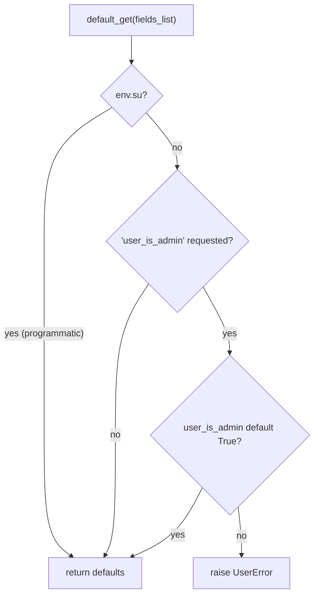
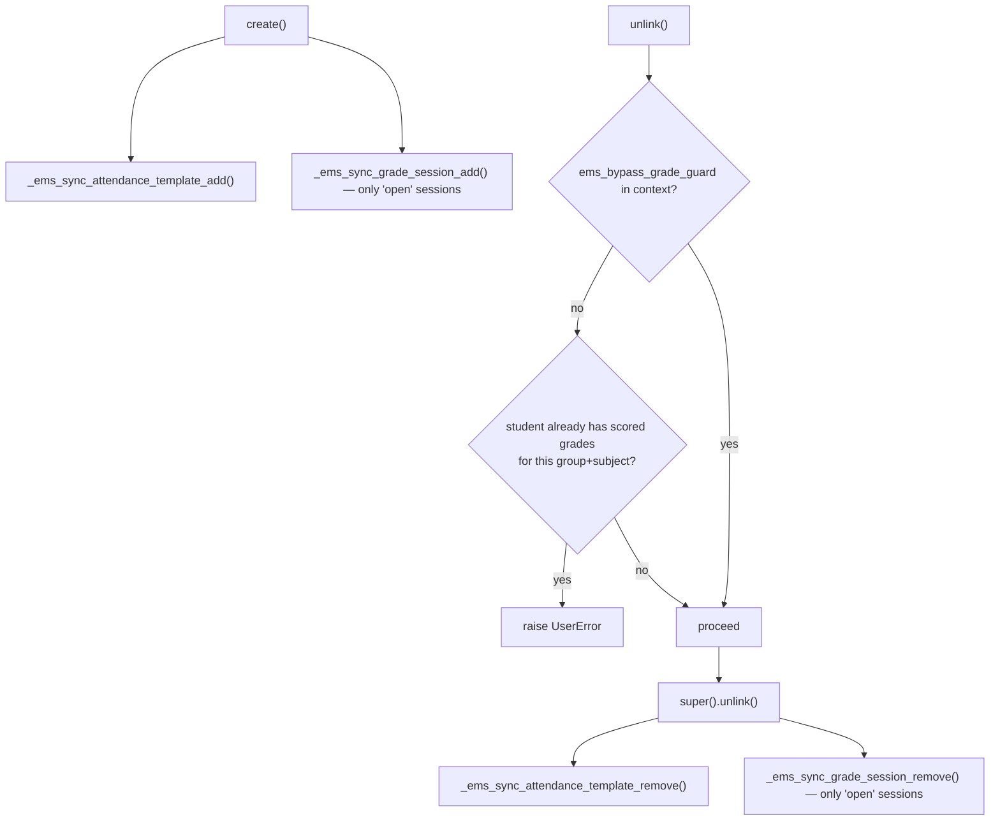
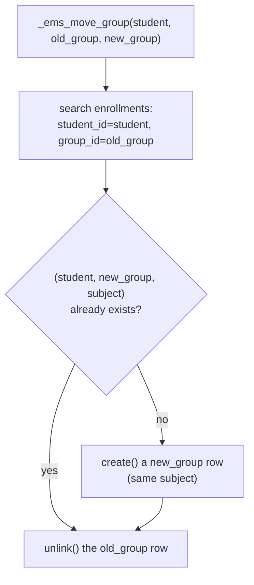

# Technical Reference: `ems.enrollment`

## Overview

`ems.enrollment` is the ternary junction row **student × group × subject** — a student is only actually "in" a subject once this row exists, not merely by having a `main_group_id`. It is the single source of truth two other models read from: [`ems.group.enrolled_student_ids`/`enrollment_view_ids`](group.md#_compute_enrolled_student_ids--_compute_enrollment_ids) (which students are effectively in a group) and `ems.attendance_template`/`ems.grade_session` (who should have attendance/grade lines for a subject). This doc covers `ems.enrollment` itself; the two `ems.group` computed fields that read from it are documented in [`ems.group`](group.md), not repeated here.

**Module file:** `models/contacts/enrollment.py`

**Not to be confused with** the sale.order-based enrollment *header* under `models/enrollment/` (matriculation, fees, authorizations) — see [`enrollment.md`](../enrollment/enrollment.md) in the `enrollment/` doc folder. This model is only the per-subject placement record, created once a subject placement is confirmed.

---

## Data Model

| Field | Type | Required | Notes |
|-------|------|----------|-------|
| `student_id` | `Many2one → res.partner` | Yes | Domain `contact_type = 'student'`, `ondelete='cascade'` |
| `group_id` | `Many2one → ems.group` | Yes | `ondelete='cascade'` |
| `subject_id` | `Many2one → ems.subject` | Yes | `ondelete='cascade'` |
| `inuse_subject_ids` | `Many2many → ems.subject` (computed, not stored) | — | This student's already-enrolled subjects; used purely to filter the `subject_id` selection widget in the embedded one2many on the student's own form, so the same subject can't be picked twice |

`_inherit = ['ems.base']` pulls in `mail.thread`/`mail.activity.mixin` (chatter) plus `user_is_admin`/`user_is_tutor` helper fields — heavier than a pure junction table strictly needs, but consistent with the rest of the module's base mixin usage.

**`_sql_constraints` uniqueness on `(student_id, group_id, subject_id)` — fixed 2026-07-30.** The production database had 21 pre-existing duplicate triples (42 rows), all field-identical within their pair (only `id`/timestamps differed — no data-merge needed). Fixed with `('unique_student_group_subject', 'UNIQUE(student_id, group_id, subject_id)', ...)`. Since duplicates already existed, `migrations/18.0.0.22.0/pre-migrate.py::_dedupe_ems_enrollment` deletes the higher-id row of each duplicate pair via raw SQL **before** Odoo's schema sync tries to create the constraint — deliberately not through ORM `unlink()`, since at the time `unlink()`'s `_ems_sync_grade_session_remove` had no "is the student still enrolled via another row" guard (unlike its sibling `_ems_sync_attendance_template_remove`) and would have risked wiping the surviving duplicate's grade lines for an open session. That asymmetry is now fixed too — see [below](#createunlink--keeping-two-side-systems-in-sync). Tested in `tests/test_enrollment.py::test_duplicate_student_group_subject_raises`/`test_same_student_different_group_is_allowed`.

### `default_get()` — admin-only manual creation

Only users in `ems.group_academic_admin` may open a blank `ems.enrollment` form at all — tutors are expected to enroll a student in a subject from the **student's own form** (the embedded one2many on `res.partner`, see [`contact.md`](contact.md)), not from this model's standalone list/menu. The check happens in `default_get` rather than via `ir.model.access.csv`/`ir.rule` because the "New" button itself can't easily be hidden per-role from the standalone action (see the method's own `TODO`) — tutors do have model-level create rights (needed for the embedded one2many to work), so the guard has to fire when the blank form actually loads.

**The `env.su` escape hatch — added 2026-09-01, after the guard broke enrollment confirmation in production.** `create()` builds its values through `_add_missing_default_values()`, which calls `default_get()`, so a guard living there fires on **every** creation, not only on the ones a human starts from a form. That is exactly what happened once the 26-27 transition flipped the current course: from that moment `sale.order._ems_placement_is_individual()` is true for every pending enrollment, so confirming one runs `_ems_apply_destination_placement()` — which creates the subject enrollments — and the confirmation died with *"Only admins can create manual enrollments"* instead of placing the student.

The placement already ran the creation under `sudo()`, which was believed to be enough. It is not: **`sudo()` does not turn `env.user` into the superuser, it only sets `env.su`**. `get_user_is_admin()` reads `self.env.user.has_group(...)`, so under `sudo()` it still answers for the real user behind the request — a student confirming from the portal (`controllers/portal_enrollment.py`, `enrollment.sudo().action_confirm()`), or the secretary confirming from the backend. Neither is an academic admin, and neither was ever meant to be blocked here.

`env.su` is what tells the two situations apart, and it is the only signal that does: a form opened from the UI never carries it, a placement running on somebody's behalf always does. Covered by `tests/test_enrollment_placement.py::test_placement_runs_for_whoever_confirms` (portal user and secretary) and `::test_manual_enrollment_is_still_blocked_for_a_tutor` (the guard itself, unchanged for manual creation).

### `_compute_inuse_subject_ids` / `_compute_display_name`

`inuse_subject_ids` is recomputed from `student_id.enrollment_ids.subject_id` — every subject the student is already enrolled in *anywhere*, including the row currently being edited (a mild self-inclusion quirk with no practical effect: the domain that consumes this field only need exclude subjects other than the one already chosen on the same line). `display_name` is just the subject's own `display_name` — enrollment rows have no meaningful name of their own, so lists/references show the subject instead of a generic `"ems.enrollment,123"`.

### `create()`/`unlink()` — keeping two side systems in sync

An enrollment row is the trigger that adds/removes a student from whichever `ems.attendance_template`s and `ems.grade_session`s already exist for that subject/group:

- **Attendance template add:** every `ems.attendance_template` matching `(subject_id, group_id in group_ids)` gets the student added — `group_ids` can cover several groups (co-teaching), so `group_id in group_ids` rather than `=`.
- **`_ems_still_enrolled(student_id, subject_id, group_ids)` — added 2026-07-30:** shared `@api.model` helper (`True` if an `ems.enrollment` row still exists for that student+subject in any of the given `group_ids`), extracted so the two `_remove` hooks below can't drift apart on what "still enrolled" means, and reusable by any future caller needing the same check.
- **Attendance template remove:** only drops the student if `_ems_still_enrolled` says **no** other remaining enrollment keeps them within that same template's scope (checked over `group_id in template.group_ids`) — otherwise a co-teaching student would be wrongly dropped from a template still covering one of their other groups.
- **Grade session add/remove:** only touches sessions in `state = 'open'` — `board`/`final` sessions are frozen and must not gain or lose lines from a later enrollment change. `_ems_sync_grade_session_remove` now also checks `_ems_still_enrolled` (for the exact `group_id` being removed) before deleting grade lines — added for symmetry with the attendance-template guard above; the only historical trigger (a duplicate `ems.enrollment` row for the same triple) is itself now prevented by the `_sql_constraints` above, so this is defensive rather than currently reachable through normal use.
- **`ems_bypass_grade_guard`** (context flag): the withdrawal flow (`res.partner._ems_clear_operational_records`, see [`contact.md`](contact.md)) unlinks enrollments with `sudo().with_context(ems_bypass_grade_guard=True)` — it runs *after* the academic history has already frozen the grades, so the normal "has scored grades" guard would otherwise block exactly the cleanup it needs to do.

### `_ems_move_group(student, old_group, new_group)` — following a student's group change (issue #395)

Called from `res.partner.write()` (see [`contact.md`](contact.md#_migrate_enrollments_on_group_changeold_main_groups)) whenever a student's `main_group_id` changes from one real group to another: every `ems.enrollment` row of `student` still pointing at `old_group` is repointed to `new_group` (same `subject_id`). A row already in a *different* group (e.g. a reinforcement group) is untouched — only rows in `old_group` specifically move.

Implemented as `unlink()` + `create()` (never a direct `group_id` write) specifically so the row-level side effects documented above — the attendance-template roster sync and the open-grade-session line sync — fire exactly as they already do for any other enrollment change, instead of needing a second, parallel sync path. The "already exists" check avoids a duplicate-key error when the student happens to already have that same subject enrolled in the destination group before the move (e.g. from an earlier reinforcement enrollment).

**Runs entirely under `sudo()`.** By the time this runs, `student.main_group_id` already equals `new_group` (the caller writes it via `super().write()` first) — so a caller whose own ORM access to the student/enrollment came from being the tutor of the *old* group (`rule_contact_tutor`/`rule_enrollment_tutor`, both keyed off the student's current `tutor_id`, itself `related="main_group_id.tutor_id"`) can lose that access mid-transaction the instant the group differs, most obviously when the destination group has a different tutor. The group change itself was already authorized at the point `main_group_id` was written; this cascade is a system-level consequence of that authorized action, not a separate action needing its own re-check — the same reasoning `sale.order._ems_apply_destination_placement()` already applies to its own `sudo()`'d `create()` (see [`../enrollment/enrollment.md`](../enrollment/enrollment.md)). `sudo()` only bypasses ACL/record rules, never this model's own Python-level guards: `unlink()`'s scored-grades check still runs, and still aborts the **whole** group change (nothing is repointed) with the same `UserError` a manual delete would raise, if any of the old group's subjects already has scored grades.

**Deliberately excluded: `sale.order._ems_apply_destination_placement()`** (course transition / enrollment-placement confirmation), which also writes `main_group_id` — but on purpose *without* touching the outgoing group's enrollments, since those are the ending year's history, not something to repoint. That flow always writes `main_group_id` via `sudo()`, so `res.partner.write()` uses the same `env.su` signal `default_get()` already relies on above to tell the two situations apart: an interactive group change (tutor/admin/secretary on the form, or a bulk CSV re-import) has `env.su == False` and triggers this cascade; a system placement running on somebody's behalf has `env.su == True` and does not.

Covered by `tests/test_enrollment.py` (`_ems_move_group` directly: repoint, untouched sibling group, duplicate-target skip, scored-grades guard, attendance-schedule/co-teaching roster, open grade session lines) and `tests/test_contact.py::TestContactMainGroupChange` (the `write()` orchestration, including the `env.su` exclusion).

---

## Access Control

### `ir.model.access.csv`

| Role | Create | Read | Write | Delete |
|------|:------:|:----:|:-----:|:------:|
| Academic admin | ✓ | ✓ | ✓ | ✓ |
| Teacher | ✓ | ✓ | ✓ | ✓ |
| Secretary | ✓ | — | — | — |

### `security/rules/contacts.xml` record rules

| Rule | Groups | Domain | Write |
|------|--------|--------|:-----:|
| `rule_enrollment_admin` | Academic admin | `[]` (unrestricted) | ✓ |
| `rule_enrollment_secretary` | Secretary | `[]` (unrestricted) | ✓ |
| `rule_enrollment_teacher` | Teacher | `[]` (read-only) | — |
| `rule_enrollment_tutor` | Teacher (tutor subset) | `student_id.tutor_id.user_id = user.id` | ✓ |

The secretary model-access row (read/write/create/unlink all `0` except create) combined with the unrestricted `rule_enrollment_secretary` record rule looks contradictory at first glance — the model-access row is the ceiling, the record rule can only narrow it further, never widen it; secretary's practical enrollment access is therefore governed elsewhere (the sale.order-based enrollment process, not this junction model directly). Teachers get full CRUD at the model-access level, but the two combined record rules (`teacher`: read-only everywhere; `tutor`: full CRUD, same `group_teacher` group) net out to: read every enrollment, but only create/edit/delete for their own tutored students — the same OR-combination pattern documented for `res.partner` in [`contact.md`](contact.md#access-control).

---

## Views

| View | File | Notes |
|------|------|-------|
| List/Form/Search | `views/community/enrollment/{list,form,search}.xml` | Standalone screen, admin/tutor-of-record only in practice (see `default_get` above) |
| Menu | `views/community/enrollment/menu.xml` | `action_enrollment_tree`, "Enrollments (student x group x subject)", under Students config |
| Embedded one2many | `views/community/contact/form.xml` (student's "Studies" area) | The real day-to-day entry point — `subject_id`'s domain excludes `inuse_subject_ids`; `group_id`'s domain allows a group matching the student's own `study_id` **or** any `group_type = 'reinforcement'` group (fixed 2026-09-06 — reinforcement groups always have `study_id = False` by design, see [`group.md`](group.md), so a plain study-match domain silently excluded them entirely) |

`views/communications/surveys/recipient/form.xml` embeds a **different**, unrelated model (`ems.limesurvey_enrollment`, in `models/communications/limesurvey.py`) that duplicates the same `inuse_subject_ids` filtering idea for its own purposes — not a consumer of this model, just a parallel pattern worth knowing about if the two are ever confused.
