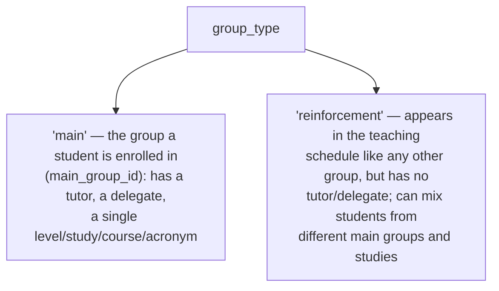
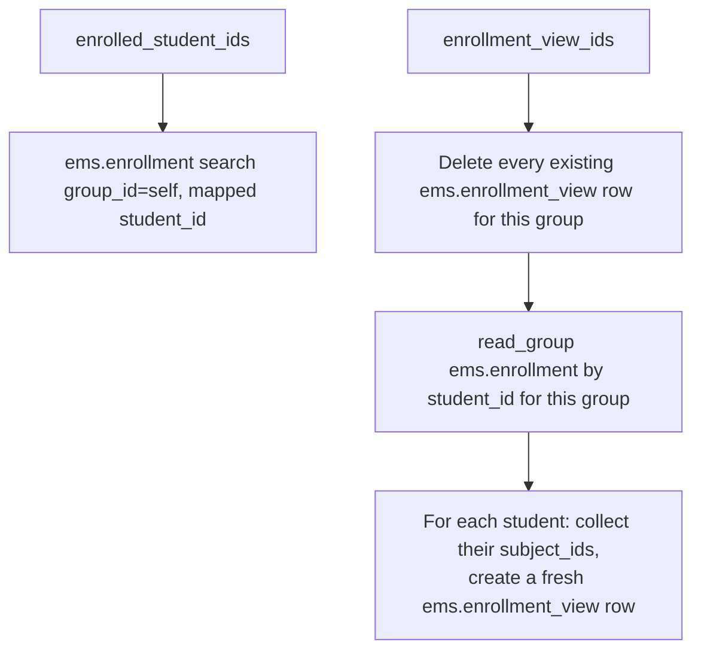
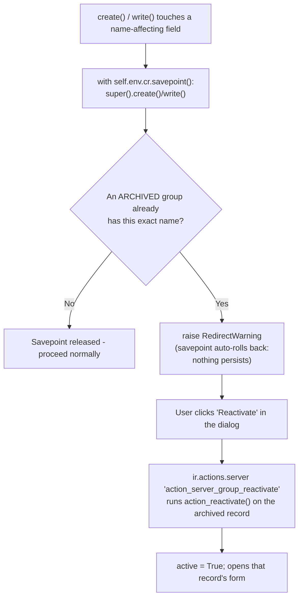
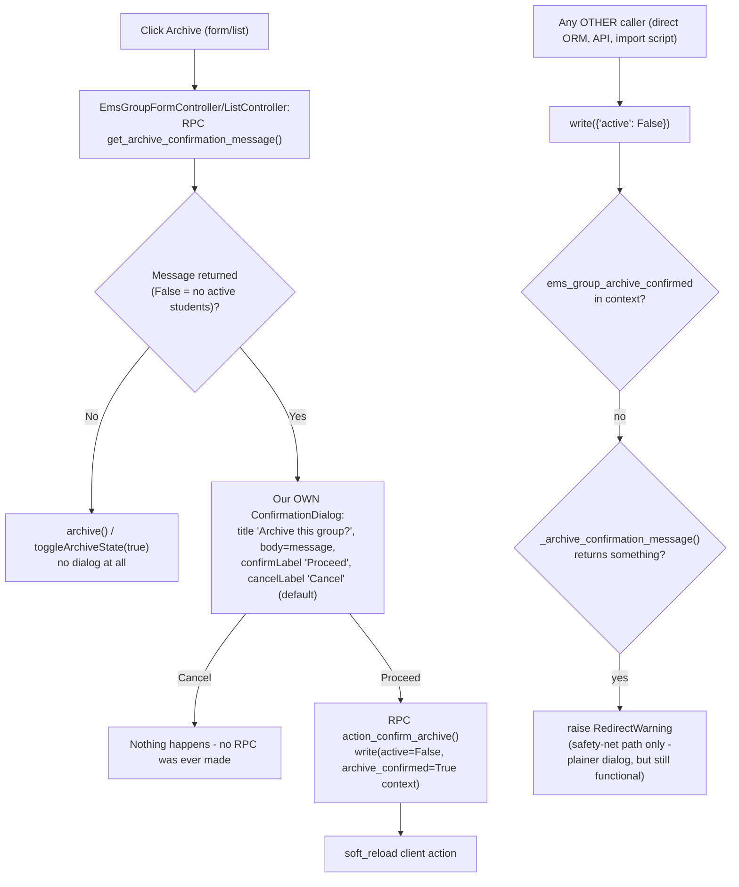

# Technical Reference: `ems.group`

## Overview

`ems.group` is the class group students are assigned to — one of the most widely-referenced models in EMS (attendance, teaching, grading, notices, working schedules, enrollment all key off `group_id`/`group_ids`). This doc covers the core model; the **Schedule tab specifically** (aggregating teachers' calendars into a read-only weekly timetable) has its own dedicated doc: [Group schedule (read-only aggregation)](group_schedule.md), implemented in the separate `models/contacts/group_schedule.py` file (`_inherit = ['ems.group', 'ems.schedule_report_mixin']`).

**Module file:** `models/contacts/group.py`

---

## Data Model

### Two group types, one model



### Fields

| Field | Type | Required | Stored | Description |
|-------|------|----------|--------|-------------|
| `active` | `Boolean`, default `True` | — | Yes | Standard Odoo archive mechanism — see "Archiving and reactivation" below |
| `group_type` | `Selection` (`main`/`reinforcement`), default `main` | Yes | Yes | See above |
| `course` | `Integer` | `main` only | Yes | e.g. `1` = first year |
| `acronym` | `Char` | `main` only | Yes | e.g. `A` |
| `external_id` | `Char` | No | Yes | Esfera (SAGA) group code, e.g. `ESO LOEM101` |
| `name` | `Char` (computed, `store=True`, `readonly=False`) | — | Yes | See `_compute_name` below — should not be edited manually for `main` groups |
| `level_id` | `Many2one → ems.level` | `main` only | Yes | — |
| `study_id` | `Many2one → ems.study` | `main` only | Yes | — |
| `tutor_id` | `Many2one → hr.employee` | No (`main` only, never on `reinforcement`) | Yes | Domain restricted to `employee_type = 'teacher'`; see the create/write sync below |
| `delegate_id` | `Many2one → res.partner` | No (`main` only) | Yes | Domain restricted to students of this same group |
| `space_id` | `Many2one → ems.space` | No | Yes | Usual classroom |
| `shift` | `Selection` (`morning`/`afternoon`) | No | Yes | Feeds `group_schedule.md`'s `SHIFT_HOURS` window |
| `main_student_ids` | `One2many → res.partner` | — | No | Inverse of `contact.main_group_id`, filtered to students |
| `reinforcement_student_ids` | `Many2many → res.partner` | — | Yes | Filtered to students |
| `enrolled_student_ids` | `Many2many → res.partner` (computed) | — | No | See below |
| `enrollment_view_ids` | `One2many → ems.enrollment_view` (computed) | — | No | See below |
| `notes` | `Text` | No | Yes | — |

### `_compute_name`

For `main` groups: `f"{study_id.acronym}{course}{acronym}"` (e.g. `DAM1A`) — but only once all three source fields are actually filled in; left blank rather than rendering the literal `"False0False"` during the transient state right after switching a `reinforcement` group back to `main` (see `_compute_name`'s own comment and `test_compute_name_leaves_blank_for_incomplete_main_group`). For `reinforcement` groups: `acronym` or `external_id` or a translated `"New Reinforcement Group"` fallback — but only if `name` isn't already set (a reinforcement group's name is typically hand-entered, e.g. `REF-MATHS`).

### `_compute_enrolled_student_ids` / `_compute_enrollment_ids`



`enrollment_view_ids` is unusual: its compute has **side effects** (delete + recreate `ems.enrollment_view` rows) rather than being a pure read — the only way found to expose "this group's enrollments, one row per student with their subjects aggregated" as a browsable One2many, since Odoo can't filter a computed relation server-side the way a stored inverse can (see the field's own inline comment). `ems.enrollment_view` is a `TransientModel` (auto-vacuumed), so the churn is cheap, but every read of a stale/unset `enrollment_view_ids` re-runs a delete+insert, not just a `SELECT` — worth knowing if this model's read patterns ever become a hot path.

**Runs under `sudo()` (bug found 2026-09-06).** `ems.enrollment_view`'s ACL grants teacher/tutor only `perm_read` (it's meant to be a read-only helper view) — but the compute's delete+recreate used to run as whoever opened the group's own form, so simply *reading* `enrollment_view_ids` as a plain teacher/tutor (no `perm_create`/`perm_unlink`) raised an `AccessError`, on any group at all, not something specific to one dataset. The delete+recreate is internal scratch-data bookkeeping for a computed field, not a real action the viewing user is taking, so it now runs via `self.env['ems.enrollment_view'].sudo()` throughout — safe here since every row it touches is already scoped to a `group_id` the calling user was independently allowed to `read()` in the first place. Covered by `tests/test_group.py::test_enrollment_view_ids_readable_by_a_plain_teacher`.

### `group_type` switching

- **`_onchange_group_type`** (form-only): clears the group's own now-irrelevant fields the moment the radio is toggled, purely so the user sees them clear before Save.
- **`_sanitize_group_type_vals`** (called from both `create()` and `write()`): the actual guarantee — the onchange never runs for a `write()` that doesn't go through this exact form (RPC, batch action, an import), so this re-does the same clearing at the ORM level, right before `_check_group_type_fields` would otherwise reject the switch.
- **`_check_group_type_fields`** (`@api.constrains`): the hard validation — `main` requires level+study+course+acronym; `reinforcement` must have none of level/study/tutor/delegate, and blocks the switch entirely if the group still has `main_student_ids` enrolled (they'd otherwise be silently orphaned).

### Archiving and reactivation

A group's `name` (e.g. `DAM1A`, `GA2C`) is confirmed unique in real-world use. A group that
won't run this course but may come back in a future one (a cycle skipping a year, a shift
being suspended temporarily...) should be **archived** (standard Odoo `active = False`, via the
Action menu's Archive/Unarchive, or the "Archived" filter to find it again) rather than
deleted — deleting loses the record's history (tutor, space, past enrollments/schedule), and
recreating it from scratch the day it returns risks a duplicate `name`.

`_raise_if_archived_duplicate()` is the safety net for that duplicate risk: called from both
`create()` and `write()` (the latter only when a name-affecting field — `name`, `course`,
`acronym`, `study_id`, `group_type`, `external_id` — is actually part of the written vals, to
avoid a pointless search on every unrelated edit). If the resulting `name` collides with an
existing **archived** group, it raises `RedirectWarning` — a modal with the offending name and
a "Reactivate" button — instead of letting the duplicate persist.



Both `create()` and `write()` run the actual mutation **inside `self.env.cr.savepoint()`**: if
`_raise_if_archived_duplicate()` raises, Odoo rolls back to that savepoint automatically (see
`odoo/sql_db.py`'s `Savepoint`/`_FlushingSavepoint`), so the newly-created record or the
renamed field values never persist — deterministically, regardless of whether the caller is a
real form Save, a direct ORM call, or a test (unlike relying on the HTTP layer's own
per-request rollback, which only covers the real-browser-Save case). `RedirectWarning`'s
`action` param points to `action_server_group_reactivate` (`views/community/group/menu.xml`),
an `ir.actions.server` (`state='code'`) running `records.action_reactivate()` — Odoo's standard
mechanism for "warn, but offer a one-click way to resolve it instead" (see `RedirectWarning`
usage across Odoo core, e.g. `account_move.py`, `res_partner.py`). `additional_context` carries
`active_id`/`active_ids` so the server action's `records` resolves to the archived group.

Regression tests: `test_group.py::test_create_with_archived_duplicate_name_raises_and_creates_nothing`,
`::test_write_rename_into_archived_duplicate_name_raises_and_reverts`,
`::test_action_reactivate_sets_active_and_returns_form_action`. Browser tour:
`ems_group_reactivate_archived_duplicate` (`group_tour.js`) exercises the actual dialog/button.

### Confirming archiving a group that still has active students

Archiving is always allowed and never removes/unenrolls anyone — `main_student_ids` is a plain
inverse of `res.partner.main_group_id`, `reinforcement_student_ids` a stored Many2many, and
neither is touched by `active` changing. `_raise_if_archiving_active_students()` only asks for
confirmation before that happens, via the same self-retriggering `RedirectWarning` pattern Odoo
core uses for e.g. `account.account`'s Unmerge: the dialog's own button re-runs the exact same
`write()` with a context flag (`ems_group_archive_confirmed`) that skips the check the second
time, so declining (closing the dialog) leaves the group genuinely untouched — the check runs
**before** `super().write()` is ever called, so there is nothing to roll back either way.

```mermaid
flowchart TD
    A["write({'active': False})"] --> B{"ems_group_archive_confirmed\nin context?"}
    B -- yes --> P[Proceed straight to super\(\).write\(\)]
    B -- no --> C{"Any active main_student_ids\nor reinforcement_student_ids?"}
    C -- no --> P
    C -- yes --> E["raise RedirectWarning\n(nothing written yet)"]
    E --> F["User clicks 'Proceed' in the dialog"]
    F --> G["ir.actions.server 'action_server_group_confirm_archive'\nruns action_confirm_archive()"]
    G --> H["write(active=False, archive_confirmed=True context)"]
    H --> I["soft_reload client action"]
```

The count sums `len(main_student_ids)` (already `active_test`-filtered automatically, since it's
a plain inverse search) plus `len(reinforcement_student_ids.filtered("active"))` (a stored
Many2many does **not** auto-filter archived records on read, unlike a computed inverse - an
explicit `.filtered("active")` is required or an already-archived reinforcement student would
count and wrongly trigger the dialog). `_archive_confirmation_message()` builds the message
(four paragraphs joined with `"\n\n"`, plain text - no HTML, no bullets) and is shared by two
very different callers:



**The interactive path (top) never lets the user see `RedirectWarning`'s dialog at all** - the
generic `web.RedirectWarningDialog`/`web.FormErrorDialog` templates aren't ours to style (fixed
"Odoo Warning" title from a `subType` that's never populated for a plain RPC error, no way to
rename the "Close" button to "Cancel"). `EmsGroupFormController`/`EmsGroupListController`
(`static/src/js/backend/group_{form,list}_controller.js`, wired via `js_class="ems_group_form"`/
`"ems_group_list"` on `views/community/group/{form,list}.xml`) instead call
`get_archive_confirmation_message()` **before** ever attempting the archive, and show their own
`web/core/confirmation_dialog`'s `ConfirmationDialog` (full control over title/labels) only when
there's something to confirm - calling `action_confirm_archive()` directly on "Proceed" (which
already passes `ems_group_archive_confirmed` in context, so `write()`'s own guard never fires
for this path either). This also incidentally skips Odoo's own generic, unconditional "Are you
sure you want to archive this record?" dialog that the Action menu's `archive` item would
otherwise show first (`list_controller.js`/`form_controller.js`'s `archiveDialogProps` - a
purely client-side step for **any** archivable model, before any RPC happens, so nothing
server-side could ever suppress it) - both controllers override `getStaticActionMenuItems()` to
replace that item's default callback entirely, the same customization point already used for
students (`StudentPopupFormController`/`StudentListController` in
`form_controller_custom.js`/`list_controller_custom.js`, skipped there because archiving a
student already opens the withdrawal wizard with its own confirmation).

`write()`'s `_raise_if_archiving_active_students()` (bottom of the diagram) still exists and is
still tested directly - it's the **safety net** for anything that archives a group without going
through this UI at all (a direct `env['ems.group'].write(...)` call, an import script, another
module's automation). It shows the plainer `RedirectWarningDialog` if reached via RPC, which is
an acceptable trade-off for a path that isn't the normal interactive one.

**The Archive/Unarchive menu item only appears if the view itself declares the `active`
field** - not just the model. `form_controller.js`'s `archiveEnabled` getter checks
`model.root.activeFields` (the current view's own declared fields), not the model's Python
field list; `list_controller.js`'s equivalent checks `props.fields` (`fields_get()`, model-wide)
instead, so the list's Action menu may not have needed this, but the form's did. Both
`views/community/group/form.xml` and `list.xml` now declare `<field name="active"
invisible="1"/>` / `column_invisible="True"` for this reason - discovered empirically when a
first version of the browser tour timed out looking for the Archive menu item at all.

Regression tests: `test_group.py::test_archive_group_with_active_main_students_raises_confirmation`,
`::test_archive_group_with_active_reinforcement_students_raises_confirmation`,
`::test_archive_group_ignores_already_archived_reinforcement_students`,
`::test_archive_empty_group_does_not_raise`, `::test_action_confirm_archive_actually_archives`,
`::test_get_archive_confirmation_message_false_when_no_active_students`,
`::test_get_archive_confirmation_message_mentions_the_count`.
Browser tour: `ems_group_archive_confirmation` (`group_tour.js`) exercises both the accept
("Proceed") and decline ("Close") paths through the real Action menu.

### Tutor role sync — `create()`/`write()` share `_sync_tutor_role()`

**Fixed bug (2026-07-27, ahead of this model's own DTON turn, at the user's explicit request once the gap was found while DTON-ing `hr.employee`):** `write()` already called `update_tutor_role()`/`_sync_security_groups()` on `hr.employee` whenever `tutor_id` changed; `create()` didn't — a group created with `tutor_id` already set in the creation vals left the employee's `tutorship_ids` relation correct (it's just `tutor_id`'s inverse) but never granted `ems.role_tutor` or synced their security groups, until someone happened to re-save the field later. Both paths now share one `_sync_tutor_role(employees)` helper. Regression test: `test_group.py::test_create_with_tutor_already_set_syncs_role`.

```mermaid
flowchart TD
    A["create() with tutor_id in vals"] --> B[super().create]
    B --> C["_sync_tutor_role(created.mapped('tutor_id'))"]
    D["write() with tutor_id in vals"] --> E[snapshot old_tutor before super().write]
    E --> F[super().write]
    F --> G["_sync_tutor_role(old_tutor | new_tutor)"]
```

**Who clears a stale `tutor_id`/`delegate_id` (2026-09-01):** neither field is auto-derived by a
compute — both stay whatever they were last set to (by hand on the group form, or by CSV import)
until something explicitly writes over them. Two independent cleanups now do that, in the two
situations this actually comes up:
- `tutor_id` — a group's tutoring is also recorded as an ordinary `ems.teaching` row on the
  group's own tutoring subject (`ems.subject.is_tutorship`); `ems.teaching.unlink()` clears
  `tutor_id` whenever that row goes away and `tutor_id` still matches the departing teacher (see
  `docs/en/developers/employees/teaching.md`). No group-emptiness check is involved — the group
  itself is never archived by this.
- `delegate_id` — `res.partner._ems_clear_stale_delegate(group)` clears it whenever a student who
  was the delegate stops being a member of `group` (leaving the centre entirely, or a course
  transition stranding them with no placement — see `docs/en/developers/settings/
  course_transition_wizard.md`).

Groups are reused across academic years (see "Archiving and reactivation" above) — emptying out
for a year is normal and never archives the group on its own; only these two now-invalid
references get cleared.

---

## Access Control

Defined in `security/ir.model.access.csv` (lines 42–44).

| Role | Create | Read | Write | Delete | Group XML ID |
|------|:------:|:----:|:-----:|:------:|--------------|
| Department Chief | ✓ | ✓ | ✓ | ✓ | `ems.group_department_chief` |
| Teacher | — | ✓ | — | — | `ems.group_teacher` |
| Secretary | — | ✓ | — | — | `ems.group_secretary` |

Note: the admin-equivalent group here is `group_department_chief`, not `group_academic_admin` like most other configuration models — Head of Studies and above already have write access via role escalation (see [Academic role hierarchy](../employees/role_hierarchy.md)), so department chiefs are the practical floor for managing groups directly.

---

## Integration Map

`ems.group` is referenced (as `group_id`/`group_ids`) by well over a dozen models across the app — selected consumers:

| Area | Model(s) |
|------|----------|
| Attendance | `ems.attendance_template`, `ems.attendance_session_header/_line`, `ems.attendance_report_wizard` |
| Teaching/schedule | `ems.teaching`, `resource.calendar.attendance` (working schedule) |
| Grades | `ems.grade_session`, `ems.student.year_record`, `ems.em_grading_wizard` |
| Enrollment | [`ems.enrollment`](enrollment.md), `ems.contact` (`main_group_id`) |
| Communications | `ems.notice`, `ems.limesurvey_header`, `ems.limesurvey_recipient` |
| Employees | `hr.employee.tutorship_ids` (inverse of `tutor_id`) |

---

## Views

| View | File | Notes |
|------|------|-------|
| List | `views/community/group/list.xml` | — |
| Form | `views/community/group/form.xml` | Main data (radio `group_type`) + Students (main or reinforcement, shown conditionally) / Enrolled / Schedule / Notes tabs |
| Action + Menu | `views/community/group/menu.xml` | `action_group_tree`, "Groups (for students)" |

The Schedule tab is documented separately — see [Group schedule](group_schedule.md).
