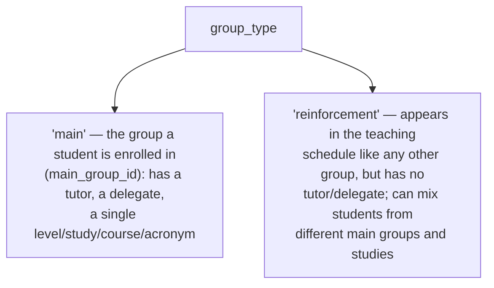
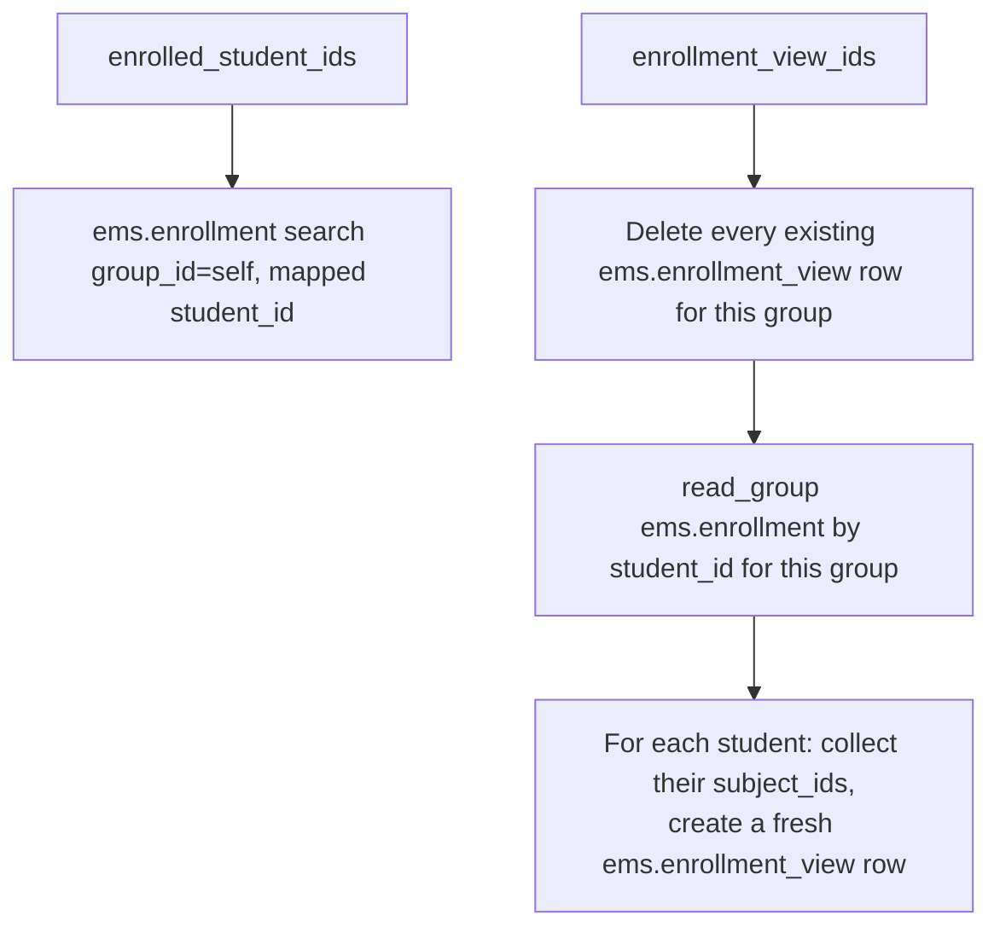
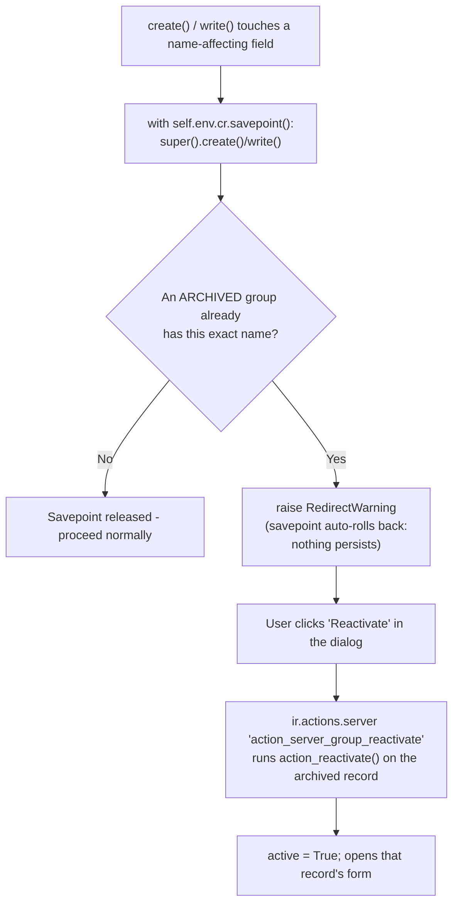
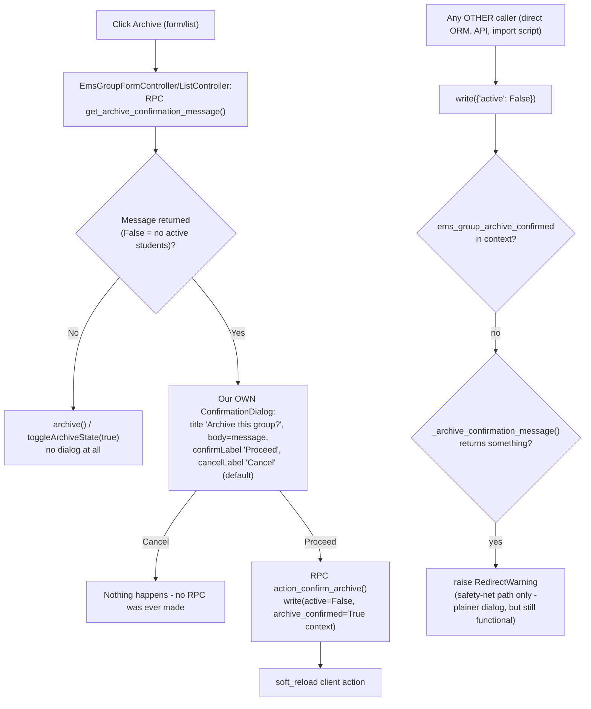
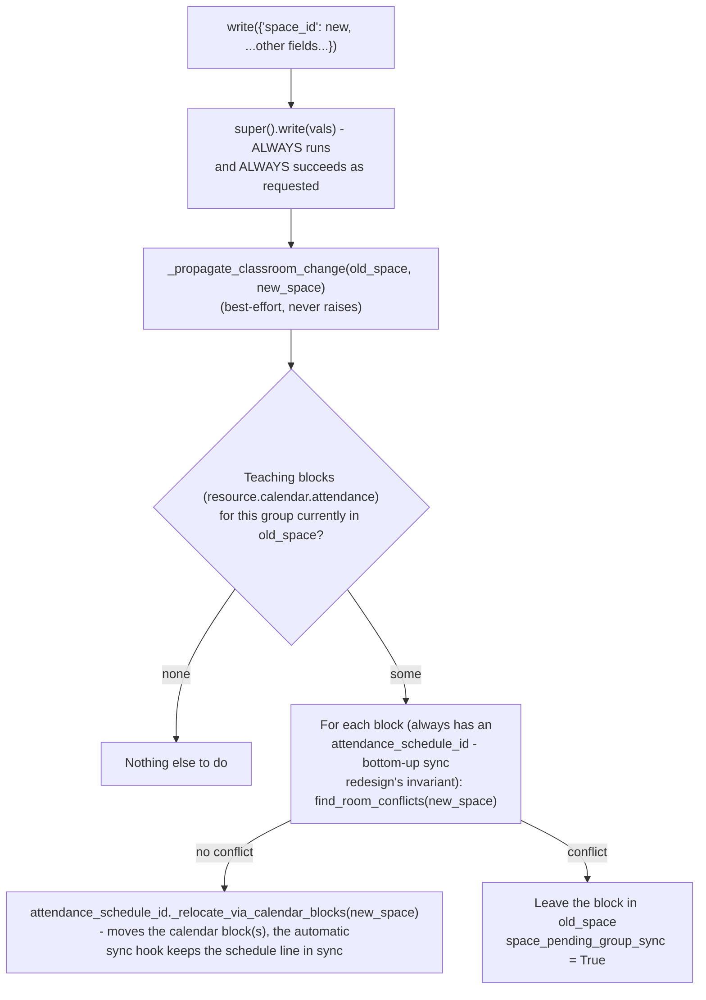
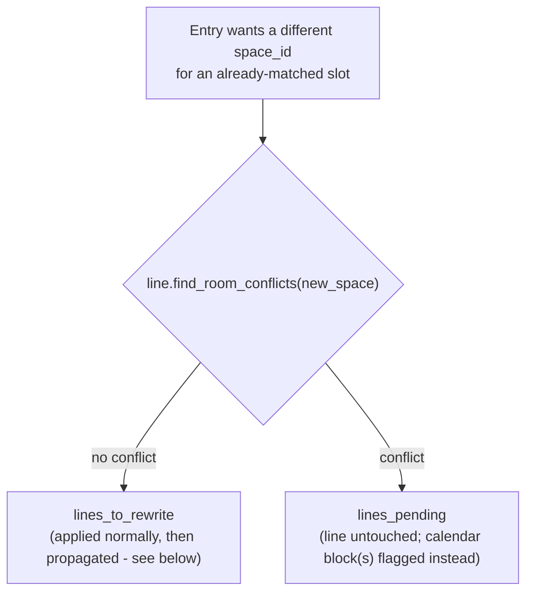

# Technical Reference: `ems.group`

## Overview

`ems.group` is the class group students are assigned to — one of the most widely-referenced models in EMS (attendance, teaching, grading, notices, working schedules, enrollment all key off `group_id`/`group_ids`). This doc covers the core model; the **Schedule tab specifically** (aggregating teachers' calendars into a read-only weekly timetable) has its own dedicated doc: [Group schedule (read-only aggregation)](group_schedule.md), implemented in the separate `models/contacts/group_schedule.py` file (`_inherit = ['ems.group', 'ems.schedule_report_mixin']`).

**Module file:** `models/contacts/group.py`

---

## Data Model

### Two group types, one model



### Fields

| Field | Type | Required | Stored | Description |
|-------|------|----------|--------|-------------|
| `active` | `Boolean`, default `True` | — | Yes | Standard Odoo archive mechanism — see "Archiving and reactivation" below |
| `group_type` | `Selection` (`main`/`reinforcement`), default `main` | Yes | Yes | See above |
| `course` | `Integer` | `main` only | Yes | e.g. `1` = first year |
| `acronym` | `Char` | `main` only | Yes | e.g. `A` |
| `external_id` | `Char` | No | Yes | Esfera (SAGA) group code, e.g. `ESO LOEM101` |
| `name` | `Char` (computed, `store=True`, `readonly=False`) | — | Yes | See `_compute_name` below — should not be edited manually for `main` groups |
| `level_id` | `Many2one → ems.level` | `main` only | Yes | — |
| `study_id` | `Many2one → ems.study` | `main` only | Yes | — |
| `tutor_id` | `Many2one → hr.employee` | No (`main` only, never on `reinforcement`) | Yes | Domain restricted to `employee_type = 'teacher'`; see the create/write sync below |
| `delegate_id` | `Many2one → res.partner` | No (`main` only) | Yes | Domain restricted to students of this same group |
| `space_id` | `Many2one → ems.space` | No | Yes | Labeled "Reference classroom" in the UI - the group's usual classroom; shown in the group schedule PDF header, see `group_schedule.md` |
| `shift` | `Selection` (`morning`/`afternoon`) | No | Yes | Feeds `ems.schedule_report_mixin`'s `SHIFT_HOURS` window - see `group_schedule.md` |
| `main_student_ids` | `One2many → res.partner` | — | No | Inverse of `contact.main_group_id`, filtered to students. Always empty for a `reinforcement` group |
| `enrolled_student_ids` | `Many2many → res.partner` (computed) | — | No | See below. For a `reinforcement` group, this is that group's only notion of "membership" — see the removal note below |
| `enrollment_view_ids` | `One2many → ems.enrollment_view` (computed) | — | No | See below |
| `notes` | `Text` | No | Yes | — |
| `pending_classroom_conflict_count` | `Integer` (computed) | — | No | See "Classroom change propagation to the schedule" below |
| `suggested_space_id` | `Many2one → ems.space` (computed, `search=`) | — | No | See "Classroom drift suggestion" below |

### `_compute_name`

For `main` groups: `f"{study_id.acronym}{course}{acronym}"` (e.g. `DAM1A`) — but only once all three source fields are actually filled in; left blank rather than rendering the literal `"False0False"` during the transient state right after switching a `reinforcement` group back to `main` (see `_compute_name`'s own comment and `test_compute_name_leaves_blank_for_incomplete_main_group`). For `reinforcement` groups: `acronym` or `external_id` or a translated `"New Reinforcement Group"` fallback — but only if `name` isn't already set (a reinforcement group's name is typically hand-entered, e.g. `REF-MATHS`).

### `_compute_enrolled_student_ids` / `_compute_enrollment_ids`



`enrollment_view_ids` is unusual: its compute has **side effects** (delete + recreate `ems.enrollment_view` rows) rather than being a pure read — the only way found to expose "this group's enrollments, one row per student with their subjects aggregated" as a browsable One2many, since Odoo can't filter a computed relation server-side the way a stored inverse can (see the field's own inline comment). `ems.enrollment_view` is a `TransientModel` (auto-vacuumed), so the churn is cheap, but every read of a stale/unset `enrollment_view_ids` re-runs a delete+insert, not just a `SELECT` — worth knowing if this model's read patterns ever become a hot path.

**`reinforcement_student_ids` removed (2026-09-07).** A `reinforcement` group used to have its
own, separate `Many2many` field for "who belongs to this group", populated only by hand-editing
the group's own **Students** tab — completely disconnected from `ems.enrollment`, the model that
actually drives attendance/grades and is how a student is normally added to *any* group's roster
(from the student's own form). A student enrolled that real way (an `ems.enrollment` row with
`group_id` pointing at a reinforcement group) never showed up anywhere on the group's own form,
since the tab reflecting real enrollments (`enrollment_view_ids`, below) was hidden for
`group_type == 'reinforcement'` — reported by a teacher who enrolled students into a
"Reforç Programació" group and saw them on the student's own card but not the group's. Fixed by
deleting the field entirely (confirmed with the developer: no production reinforcement group
relies on it as the sole record of a student's membership) and showing the `Enrolled` tab
(`enrollment_view_ids`) for both group types — `ems.enrollment` is now the single, unambiguous
source of truth for group membership regardless of `group_type`.

**Runs under `sudo()` (bug found 2026-09-06).** `ems.enrollment_view`'s ACL grants teacher/tutor only `perm_read` (it's meant to be a read-only helper view) — but the compute's delete+recreate used to run as whoever opened the group's own form, so simply *reading* `enrollment_view_ids` as a plain teacher/tutor (no `perm_create`/`perm_unlink`) raised an `AccessError`, on any group at all, not something specific to one dataset. The delete+recreate is internal scratch-data bookkeeping for a computed field, not a real action the viewing user is taking, so it now runs via `self.env['ems.enrollment_view'].sudo()` throughout — safe here since every row it touches is already scoped to a `group_id` the calling user was independently allowed to `read()` in the first place. Covered by `tests/test_group.py::test_enrollment_view_ids_readable_by_a_plain_teacher`.

### `group_type` switching

- **`_onchange_group_type`** (form-only): clears the group's own now-irrelevant fields the moment the radio is toggled, purely so the user sees them clear before Save.
- **`_sanitize_group_type_vals`** (called from both `create()` and `write()`): the actual guarantee — the onchange never runs for a `write()` that doesn't go through this exact form (RPC, batch action, an import), so this re-does the same clearing at the ORM level, right before `_check_group_type_fields` would otherwise reject the switch.
- **`_check_group_type_fields`** (`@api.constrains`): the hard validation — `main` requires level+study+course+acronym; `reinforcement` must have none of level/study/tutor/delegate, and blocks the switch entirely if the group still has `main_student_ids` enrolled (they'd otherwise be silently orphaned).

### Archiving and reactivation

A group's `name` (e.g. `DAM1A`, `GA2C`) is confirmed unique in real-world use. A group that
won't run this course but may come back in a future one (a cycle skipping a year, a shift
being suspended temporarily...) should be **archived** (standard Odoo `active = False`, via the
Action menu's Archive/Unarchive, or the "Archived" filter to find it again) rather than
deleted — deleting loses the record's history (tutor, space, past enrollments/schedule), and
recreating it from scratch the day it returns risks a duplicate `name`.

`_raise_if_archived_duplicate()` is the safety net for that duplicate risk: called from both
`create()` and `write()` (the latter only when a name-affecting field — `name`, `course`,
`acronym`, `study_id`, `group_type`, `external_id` — is actually part of the written vals, to
avoid a pointless search on every unrelated edit). If the resulting `name` collides with an
existing **archived** group, it raises `RedirectWarning` — a modal with the offending name and
a "Reactivate" button — instead of letting the duplicate persist.



Both `create()` and `write()` run the actual mutation **inside `self.env.cr.savepoint()`**: if
`_raise_if_archived_duplicate()` raises, Odoo rolls back to that savepoint automatically (see
`odoo/sql_db.py`'s `Savepoint`/`_FlushingSavepoint`), so the newly-created record or the
renamed field values never persist — deterministically, regardless of whether the caller is a
real form Save, a direct ORM call, or a test (unlike relying on the HTTP layer's own
per-request rollback, which only covers the real-browser-Save case). `RedirectWarning`'s
`action` param points to `action_server_group_reactivate` (`views/community/group/menu.xml`),
an `ir.actions.server` (`state='code'`) running `records.action_reactivate()` — Odoo's standard
mechanism for "warn, but offer a one-click way to resolve it instead" (see `RedirectWarning`
usage across Odoo core, e.g. `account_move.py`, `res_partner.py`). `additional_context` carries
`active_id`/`active_ids` so the server action's `records` resolves to the archived group.

Regression tests: `test_group.py::test_create_with_archived_duplicate_name_raises_and_creates_nothing`,
`::test_write_rename_into_archived_duplicate_name_raises_and_reverts`,
`::test_action_reactivate_sets_active_and_returns_form_action`. Browser tour:
`ems_group_reactivate_archived_duplicate` (`group_tour.js`) exercises the actual dialog/button.

### Confirming archiving a group that still has active students

Archiving is always allowed and never removes/unenrolls anyone — `main_student_ids` is a plain
inverse of `res.partner.main_group_id` and `enrolled_student_ids` a computed field derived from
`ems.enrollment.group_id`, and neither is touched by `active` changing. `_raise_if_archiving_active_students()` only asks for
confirmation before that happens, via the same self-retriggering `RedirectWarning` pattern Odoo
core uses for e.g. `account.account`'s Unmerge: the dialog's own button re-runs the exact same
`write()` with a context flag (`ems_group_archive_confirmed`) that skips the check the second
time, so declining (closing the dialog) leaves the group genuinely untouched — the check runs
**before** `super().write()` is ever called, so there is nothing to roll back either way.

```mermaid
flowchart TD
    A["write({'active': False})"] --> B{"ems_group_archive_confirmed\nin context?"}
    B -- yes --> P[Proceed straight to super\(\).write\(\)]
    B -- no --> C{"'main': any active main_student_ids?\n'reinforcement': any active enrolled_student_ids?"}
    C -- no --> P
    C -- yes --> E["raise RedirectWarning\n(nothing written yet)"]
    E --> F["User clicks 'Proceed' in the dialog"]
    F --> G["ir.actions.server 'action_server_group_confirm_archive'\nruns action_confirm_archive()"]
    G --> H["write(active=False, archive_confirmed=True context)"]
    H --> I["soft_reload client action"]
```

The count is type-aware, not a plain sum of both fields (which would double-count a `main`
group's students, who normally also show up in `enrolled_student_ids` via their own subject
enrollments): `main` groups count `len(main_student_ids)` (already `active_test`-filtered
automatically, since it's a plain inverse search); `reinforcement` groups count
`len(enrolled_student_ids.filtered("active"))` instead (`enrolled_student_ids` is built via
`mapped()`, which does **not** auto-filter archived records the way a plain inverse search does -
an explicit `.filtered("active")` is required or an already-archived reinforcement student would
count and wrongly trigger the dialog). `_archive_confirmation_message()` builds the message
(four paragraphs joined with `"\n\n"`, plain text - no HTML, no bullets) and is shared by two
very different callers:



**The interactive path (top) never lets the user see `RedirectWarning`'s dialog at all** - the
generic `web.RedirectWarningDialog`/`web.FormErrorDialog` templates aren't ours to style (fixed
"Odoo Warning" title from a `subType` that's never populated for a plain RPC error, no way to
rename the "Close" button to "Cancel"). `EmsGroupFormController`/`EmsGroupListController`
(`static/src/js/backend/group_{form,list}_controller.js`, wired via `js_class="ems_group_form"`/
`"ems_group_list"` on `views/community/group/{form,list}.xml`) instead call
`get_archive_confirmation_message()` **before** ever attempting the archive, and show their own
`web/core/confirmation_dialog`'s `ConfirmationDialog` (full control over title/labels) only when
there's something to confirm - calling `action_confirm_archive()` directly on "Proceed" (which
already passes `ems_group_archive_confirmed` in context, so `write()`'s own guard never fires
for this path either). This also incidentally skips Odoo's own generic, unconditional "Are you
sure you want to archive this record?" dialog that the Action menu's `archive` item would
otherwise show first (`list_controller.js`/`form_controller.js`'s `archiveDialogProps` - a
purely client-side step for **any** archivable model, before any RPC happens, so nothing
server-side could ever suppress it) - both controllers override `getStaticActionMenuItems()` to
replace that item's default callback entirely, the same customization point already used for
students (`StudentPopupFormController`/`StudentListController` in
`form_controller_custom.js`/`list_controller_custom.js`, skipped there because archiving a
student already opens the withdrawal wizard with its own confirmation).

`write()`'s `_raise_if_archiving_active_students()` (bottom of the diagram) still exists and is
still tested directly - it's the **safety net** for anything that archives a group without going
through this UI at all (a direct `env['ems.group'].write(...)` call, an import script, another
module's automation). It shows the plainer `RedirectWarningDialog` if reached via RPC, which is
an acceptable trade-off for a path that isn't the normal interactive one.

**The Archive/Unarchive menu item only appears if the view itself declares the `active`
field** - not just the model. `form_controller.js`'s `archiveEnabled` getter checks
`model.root.activeFields` (the current view's own declared fields), not the model's Python
field list; `list_controller.js`'s equivalent checks `props.fields` (`fields_get()`, model-wide)
instead, so the list's Action menu may not have needed this, but the form's did. Both
`views/community/group/form.xml` and `list.xml` now declare `<field name="active"
invisible="1"/>` / `column_invisible="True"` for this reason - discovered empirically when a
first version of the browser tour timed out looking for the Archive menu item at all.

Regression tests: `test_group.py::test_archive_group_with_active_main_students_raises_confirmation`,
`::test_archive_group_with_active_reinforcement_students_raises_confirmation`,
`::test_archive_group_ignores_already_archived_reinforcement_students`,
`::test_archive_empty_group_does_not_raise`, `::test_action_confirm_archive_actually_archives`,
`::test_get_archive_confirmation_message_false_when_no_active_students`,
`::test_get_archive_confirmation_message_mentions_the_count`.
Browser tour: `ems_group_archive_confirmation` (`group_tour.js`) exercises both the accept
("Proceed") and decline ("Close") paths through the real Action menu.

### Classroom change propagation to the schedule (issue #405)

Changing `space_id` used to have zero effect on a group's already-generated schedule — the
teacher's editable weekly calendar (`resource.calendar.attendance`) and the derived, official
model behind real attendance-taking (`ems.attendance_schedule`) kept using whatever room they
were created with, silently diverging from the group's own "current" classroom. `write()` now
propagates the change, but **never at the cost of aborting the save** — a room collision is
resolved later via a wizard, not by rolling back the edit that was just made (including any other
field changed in the same save).



**Bottom-up sync redesign (2026-09-08):** the "no conflict" path used to write
`ems.attendance_schedule.space_id` directly (`_write_or_new_version`), then re-point the block's
own `attendance_schedule_id` by hand — this had a real latent bug (fixed the same day): if that
write cloned the line (a co-teacher's line with real session history), any OTHER teacher sharing
that same line was left pointing at the now-archived id. It now calls
`schedule._relocate_via_calendar_blocks(new_space)` instead - moves every calendar block deriving
that line (not just this one), and the automatic sync hook keeps `ems.attendance_schedule` correct
as a natural consequence, exactly the same shared method `ems.group_classroom_change_wizard` and
the working-schedules import wizard's own conflict resolution use (see
`docs/en/developers/attendance/attendance_template.md`'s "Bottom-up sync redesign" section).

`ems.attendance_schedule.find_room_conflicts(new_space_id)` is `check_overlap()`'s own
candidate-search extracted into a reusable, non-raising method — `check_overlap()` now calls it
with `self.space_id` (identical behavior), and this feature calls it with a hypothetical room
before ever writing anything, to decide whether a block can move safely.

**Why a persisted flag (`space_pending_group_sync` on `resource.calendar.attendance`) instead of
comparing `block.space_id != group.space_id` on the fly:** a block's room is documented
(`space_id`'s own comment above) to legitimately and permanently diverge from its group's default
— e.g. a one-off reassignment made resolving a schedule-import conflict. Treating every such
divergence as "pending" would misfire on data that was never meant to track the group's room
1:1. The flag is only ever set by `_propagate_classroom_change` (a real, unresolved collision from
*this* feature) and only ever cleared by the wizard's confirmation (paths below) — a block moved
back into agreement with its group's room by any other means stays flagged until someone actually
visits the wizard, since nothing else is in a position to know the mismatch was ever accepted.

`ems.group.pending_classroom_conflict_count` (computed: count of this group's
`resource.calendar.attendance` rows with `space_pending_group_sync = True`) drives a persistent
banner on the group form (`views/community/group/form.xml`, next to `space_id`) — never a
one-shot dialog that could be dismissed and forgotten — with a button opening
`ems.group_classroom_change_wizard` (`models/contacts/group_classroom_change_wizard.py`).

The wizard reuses, unmodified, the conflict-resolution infrastructure already built for the
working-schedules import wizard (`docs/en/developers/employees/working_schedule.md`'s "Import
wizard" section): `ems.group_classroom_change_wizard_conflict_line` inherits
`ems.working_schedules_import_wizard.conflict_mixin` (`kind`/`resolution`/`left_space_id`/
`right_space_id`) and its view uses the same `widget="ems_grouped_conflict_lines"` OWL field
(dual `AutoComplete` room pickers, grouped cards) already driving the import wizard's own
conflict screens — no client-side code was added for this feature. `kind` is always
`plain_conflict` here (legitimate co-teaching is already excluded by `find_room_conflicts`, the
same way `check_overlap` excludes it). All three of the mixin's resolutions apply, with the same
meaning the import wizard already gives them: `reassign_rooms` (pick a room for either/both
sides), `prevail_left` (the pending block takes the new room; the already-existing colliding
session is archived, exactly like `_continue_from_db_conflicts`'s own handling), `prevail_right`
(the pending block keeps its current room for that slot — the divergence becomes a deliberate,
accepted one; the existing session is untouched). Confirming any resolution clears
`space_pending_group_sync` on the resolved block.

### A second trigger for the same mechanism: one class's room, from a teacher's own schedule (issue #444's follow-up, 2026-09-12)

Everything above is triggered by `ems.group.write()`'s own `space_id` — the whole GROUP's default
classroom changing. A teacher can also move just ONE of their own classes to a different room from
their personal "Schedule" tab (`views/community/employee/form.xml`), without touching the group's
default at all. Before this follow-up, that path had no collision handling whatsoever:

- A co-taught class (two teachers, one shared `ems.attendance_schedule` line, each with their own
  `resource.calendar.attendance` row - see `docs/en/developers/attendance/attendance_template.md`'s
  "Co-teaching" docs): the room change was **silently discarded**. Root cause:
  `ems.attendance_template._reconcile_teacher_groups()` rebuilt the shared slot's data from the
  OTHER, untouched co-teacher's still-old calendar row *before* folding in the submitting teacher's
  own fresh entry, and only merged in the submitter's teacher id, never their actual field values -
  fixed by making the submitting teacher's own entry win outright for a slot it touches.
- A solo class: the room change reached `ems.attendance_schedule.check_overlap()` directly, raising
  a raw, unresolvable `ValidationError` on a genuine collision - no wizard, unlike the group-wide
  path above.

**Fix: `_decide_schedule_line_changes()` (`ems.attendance_template`,
`docs/en/developers/attendance/attendance_template.md`) now checks `find_room_conflicts()` for a
`lines_to_rewrite` candidate too**, splitting it into a THIRD bucket, `lines_pending`, checked
*before* the archive pass runs (so a `has_sessions` line is never archived only to discover the
collision too late to undo it):



- **No conflict (`lines_to_rewrite`):** applied exactly as before for the *submitting* teacher (who
  already has the new room on their own calendar, from `apply_schedule_changes()`'s own earlier
  write) - but a co-teacher who ISN'T submitting in this call never had their own calendar touched
  at all. **Real bug found on live data the same day** (moving one class's room, no collision,
  silently left the co-teacher's own calendar pointing at the old room - the group's own schedule
  and the moving teacher's calendar both looked correct, masking it). Fixed: every co-teacher's own
  block for that exact slot is now brought in line too, via the same slot-matching lookup described
  below (`attendance_schedule_id` isn't linked yet at this point in the pipeline, so it can't be
  used to find them the way `_relocate_via_calendar_blocks` normally would).
- **Conflict (`lines_pending`):** `resource.calendar.attendance.relocate_or_flag_pending(new_space)`
  - extracted from this doc's own `_resolve_or_flag_pending_block` above (moved onto the model that
    actually owns both the block being relocated and the pending flag itself - `ems.group`'s own
    version is now a thin wrapper calling it) - is reused as-is for the check, but the actual
    flagging is done by `ems.attendance_template._flag_room_change_pending()`: the calendar block(s)
    behind the entry are found by matching **calendar + weekday/hour + subject** (not
    `attendance_schedule_id`, which is only linked at the very end of the whole sync -
    `sync_from_schedule_batch`'s own `_link_calendar_attendance` call), reverted to the line's own
    still-current room, and flagged (`space_pending_group_sync = True`,
    **`pending_new_space_id`** = the room actually requested).

**`pending_new_space_id`** (`resource.calendar.attendance`, new field): unlike the group-wide path
(whose "intended room" is always deducible from `group.space_id`, a single well-known field), a
teacher's own one-off room request has nothing else to derive it from - this field remembers it
until the wizard resolves the block one way or the other (cleared alongside
`space_pending_group_sync`). `ems.group_classroom_change_wizard._build_conflict_lines()` now reads
it directly (falling back to a caller-supplied `fallback_space` - `group.space_id` for the
group-wide origin - only for a block flagged before this field existed), and
`_apply_resolution()`'s `prevail_left` branch reads it the same way, both origins going through
identical code from this point on.

**The wizard itself needed no new UI, only a second scope.** `group_id` is now optional (a new
`employee_id` sits alongside it, equally optional - exactly one is ever set); `_build_conflict_lines()`
takes the pending-blocks recordset directly instead of deriving it from `group_id` internally, so
`hr.employee.action_open_classroom_change_wizard()` (same shape as `ems.group`'s own action) can
pass in "this teacher's own pending blocks" instead. `hr.employee.pending_classroom_conflict_count` +
a banner on the "Schedule" tab (same pattern as the group form's own, `views/community/employee/
form.xml`) surface it there. See `docs/en/developers/attendance/attendance_template.md` for the
sync-pipeline side of this feature in full.

**A fourth bug, found the same day: resolving from one entry point left the OTHER side's own
pending flag stuck forever.** A co-taught class's collision flags every co-teacher's own calendar
block for the exact same slot (`_flag_room_change_pending()` above acts on every teacher sharing
the entry, not just the submitter) - genuinely the same conflict, seen from each side. But
`ems.group_classroom_change_wizard_conflict_line._apply_resolution()` only ever cleared
`space_pending_group_sync`/`pending_new_space_id` on its OWN `left_attendance_id` - resolving from
a teacher's own wizard (scoped to just their own calendar) left the co-teacher's own sibling block
never even shown in that wizard still flagged, even though the room had already converged
correctly via the sync hook this same write triggers; the group's own banner kept reporting it as
unresolved. Fixed: `_apply_resolution()` now also finds every OTHER `resource.calendar.attendance`
row still flagged pending for the identical subject/dayofweek/hour_from/hour_to and applies the
same outcome (`resolved_space`, whichever resolution was chosen) to it too - regardless of which
wizard (group-scoped or employee-scoped) the resolution came from.

### Classroom drift suggestion (last deferred follow-up of issue #405, 2026-09-09)

`space_id` can silently drift from reality even without ever hitting a collision: a room change
gets resolved elsewhere (the wizard above, or a teacher editing their own calendar directly) by
moving the group's actual classes to a different room, but nobody goes back and updates the
group's own `space_id` to match. `suggested_space_id` (computed, non-stored,
`search="_search_suggested_space_id"`) surfaces this: it looks at the group's active teaching
blocks (`resource.calendar.attendance`: `group_ids` contains the group, `subject_id` set, owning
`calendar_id.active` — the same domain `_propagate_classroom_change` already uses above) and, if
the group's CURRENT `space_id` (including unset — a group with no room at all is drift too, and
arguably the most useful case to flag) accounts for zero of those hours, suggests the room with
the most total hours. Ties are broken by room name, then id, so the result is always deterministic.
`False` when the group has no active teaching blocks at all (nothing to suggest — an unused group,
not drift) or its current room already accounts for at least some of its real hours (drift is
specifically "zero hours in the CURRENT room", not "not the majority room").

Non-stored with `search=` rather than `store=True`/`@api.depends`, same reasoning as
`pending_classroom_conflict_count` above and the same pattern already used by
`ems.study.uses_enrollment_flow` (`models/curriculum/study.py`) — the real dependency runs through
`resource.calendar.attendance.group_ids`, a reverse M2M `@api.depends` can't express cleanly. It
does still declare `@api.depends('space_id')` — not because that's the *whole* dependency, but
because it's the one part Odoo's own cache invalidation CAN track, and skipping it left this
field's cached value stale within the same transaction right after applying a suggestion (found via
`tests/test_group_classroom_suggestion.py::test_apply_suggestion_updates_space_and_propagates`). A
caller that changes the calendar elsewhere and needs a fresh read without reloading the record
still needs an explicit `invalidate_recordset()`, same as `pending_classroom_conflict_count`.

Surfaced two ways:
- A banner on the group form (`views/community/group/form.xml`, `alert-info` — deliberately
  distinct from the pending-conflict banner's `alert-warning` above: this is a suggestion, not an
  unresolved error) with a one-click "Apply suggested classroom" button
  (`action_apply_suggested_space`).
- A "Classroom drift" filter (`views/community/group/search.xml` — the first dedicated search view
  this model has ever had; before this it relied on Odoo's auto-generated default) and an optional
  `suggested_space_id` column on the group list (`views/community/group/list.xml`), for reviewing
  several groups at once instead of one at a time.

**Applying is provably conflict-free, not just usually fine.** `action_apply_suggested_space()`
does a plain `self.space_id = self.suggested_space_id` — a field assignment on a persisted record
goes through `write()` the same way an external caller's `write()` call does — relying entirely on
`write()`'s own `_propagate_classroom_change` (above) to do the real work.
`_propagate_classroom_change` only ever moves blocks currently sitting in the group's OLD room; by
construction, `suggested_space_id` is only ever set when that old room already has zero blocks to
move. This can never reach `_resolve_or_flag_pending_block`'s own conflict branch — no new
conflict-handling logic was needed for this feature at all.

### Tutor role sync — `create()`/`write()` share `_sync_tutor_role()`

**Fixed bug (2026-07-27, ahead of this model's own DTON turn, at the user's explicit request once the gap was found while DTON-ing `hr.employee`):** `write()` already called `update_tutor_role()`/`_sync_security_groups()` on `hr.employee` whenever `tutor_id` changed; `create()` didn't — a group created with `tutor_id` already set in the creation vals left the employee's `tutorship_ids` relation correct (it's just `tutor_id`'s inverse) but never granted `ems.role_tutor` or synced their security groups, until someone happened to re-save the field later. Both paths now share one `_sync_tutor_role(employees)` helper. Regression test: `test_group.py::test_create_with_tutor_already_set_syncs_role`.

```mermaid
flowchart TD
    A["create() with tutor_id in vals"] --> B[super().create]
    B --> C["_sync_tutor_role(created.mapped('tutor_id'))"]
    D["write() with tutor_id in vals"] --> E[snapshot old_tutor before super().write]
    E --> F[super().write]
    F --> G["_sync_tutor_role(old_tutor | new_tutor)"]
```

**Who clears a stale `tutor_id`/`delegate_id` (2026-09-01):** neither field is auto-derived by a
compute — both stay whatever they were last set to (by hand on the group form, or by CSV import)
until something explicitly writes over them. Two independent cleanups now do that, in the two
situations this actually comes up:
- `tutor_id` — a group's tutoring is also recorded as an ordinary `ems.teaching` row on the
  group's own tutoring subject (`ems.subject.is_tutorship`); `ems.teaching.unlink()` clears
  `tutor_id` whenever that row goes away and `tutor_id` still matches the departing teacher (see
  `docs/en/developers/employees/teaching.md`). No group-emptiness check is involved — the group
  itself is never archived by this.
- `delegate_id` — `res.partner._ems_clear_stale_delegate(group)` clears it whenever a student who
  was the delegate stops being a member of `group` (leaving the centre entirely, or a course
  transition stranding them with no placement — see `docs/en/developers/settings/
  course_transition_wizard.md`).

Groups are reused across academic years (see "Archiving and reactivation" above) — emptying out
for a year is normal and never archives the group on its own; only these two now-invalid
references get cleared.

---

## Access Control

Defined in `security/ir.model.access.csv` (lines 42–44).

| Role | Create | Read | Write | Delete | Group XML ID |
|------|:------:|:----:|:-----:|:------:|--------------|
| Department Chief | ✓ | ✓ | ✓ | ✓ | `ems.group_department_chief` |
| Teacher | — | ✓ | — | — | `ems.group_teacher` |
| Secretary | — | ✓ | — | — | `ems.group_secretary` |

Note: the admin-equivalent group here is `group_department_chief`, not `group_academic_admin` like most other configuration models — Head of Studies and above already have write access via role escalation (see [Academic role hierarchy](../employees/role_hierarchy.md)), so department chiefs are the practical floor for managing groups directly.

---

## Integration Map

`ems.group` is referenced (as `group_id`/`group_ids`) by well over a dozen models across the app — selected consumers:

| Area | Model(s) |
|------|----------|
| Attendance | `ems.attendance_template`, `ems.attendance_session_header/_line`, `ems.attendance_report_wizard` |
| Teaching/schedule | `ems.teaching`, `resource.calendar.attendance` (working schedule) |
| Grades | `ems.grade_session`, `ems.student.year_record`, `ems.em_grading_wizard` |
| Enrollment | [`ems.enrollment`](enrollment.md), `ems.contact` (`main_group_id`) |
| Communications | `ems.notice`, `ems.limesurvey_header`, `ems.limesurvey_recipient` |
| Employees | `hr.employee.tutorship_ids` (inverse of `tutor_id`) |

---

## Views

| View | File | Notes |
|------|------|-------|
| List | `views/community/group/list.xml` | — |
| Form | `views/community/group/form.xml` | Main data (radio `group_type`) + Students (`main` only) / Enrolled (both types) / Schedule / Notes tabs |
| Search | `views/community/group/search.xml` | "Classroom drift" filter — see "Classroom drift suggestion" above |
| Action + Menu | `views/community/group/menu.xml` | `action_group_tree`, "Groups (for students)" |
| Classroom change wizard | `views/community/group/classroom_change_wizard.xml` | Opened from the group form's pending-conflicts banner — see "Classroom change propagation to the schedule" above |

The Schedule tab is documented separately — see [Group schedule](group_schedule.md).
