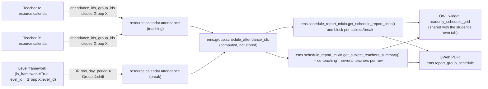

# Technical Reference: Group Schedule (read-only aggregation, partially editable)

## Overview

`ems.group` has no schedule of its own — every timetable slot lives on a *teacher's*
personal `resource.calendar` (see [Teacher working schedules & schedule frameworks](../employees/working_schedule.md)),
tagged with `group_ids` (Many2many `ems.group`). The **Schedule** tab on the group form is
mostly a read-only "photo" of that data, built by aggregating every `resource.calendar.attendance`
row across every teacher's calendar whose `group_ids` includes this group — plus, when
derivable, the group's break/patio period — with a PDF export.

**Issue #446:** `ems.group_department_chief` and above can additionally edit two fields per
teaching block directly from this tab - `topic` and the classroom (`space_id`) - without
leaving the group's own form. Every other field (day, hour, subject, teacher(s), groups) stays
read-only here; changing any of those still requires the teacher's own Schedule tab. See "Editing
from the group form" below.

The exact same rendering problem, one level down, is what a **student's own** Schedule tab
solves — see [Student schedule (read-only aggregation)](student_schedule.md), which shares
the OWL widget, the PDF-building logic and the break-derivation helper with this one almost
entirely unchanged; only the *search* that decides which `resource.calendar.attendance` rows
belong on the schedule differs (a whole group's teaching vs. one student's own enrollment
pairs). Read this doc first — the student one only calls out what's actually different.

## Model changes

**`resource.calendar.attendance`** (`ems_working_schedule_assignation`, `models/employees/working_schedule.py`):
- `employee_id` (Many2one `hr.employee`, computed, stored, `compute_sudo=True`, depends on
  `calendar_id`) — the teacher who owns the slot's calendar, resolved via the new
  `resource.calendar.get_employee()` helper (the same reverse `resource_calendar_id` search
  `apply_schedule_changes()` already did inline). Stored because it is read in bulk across
  many different teachers' calendars whenever a group's or a student's schedule is aggregated.

**`models/shared/schedule_report_mixin.py`** (`AbstractModel`, `ems.schedule_report_mixin`) —
holds everything genuinely shared between the group's and the student's own aggregation, not
just PDF-coloring helpers as its original (pre-student) version did:
- `WEEKDAYS`, `SHIFT_HOURS` — class attributes (moved here from what used to be
  module-level constants private to `group_schedule.py`).
- `REPORT_COLOR_PALETTE`, `_report_color_key()`, `_format_report_time()` — PDF-coloring/time
  helpers, unchanged since before the student tab existed.
- `_get_level_break_entries(level, shift)` — derives a break/patio period from `level`'s
  schedule framework (a `resource.calendar` with `is_framework=True` and a matching
  `level_id`), filtered to `shift`'s `day_period` and `non_teaching.is_break` rows. Both
  `ems.group._get_break_entries()` (passing its own `level_id`/`shift`) and res.partner
  (student)'s own version (passing its **main group's** `level_id`/`shift` instead, since a
  student has no `level_id`/`shift` of its own) delegate to this one helper.
- `_schedule_report_shift()` — overridable hook: which `shift` value
  `get_schedule_report_lines()` should filter/window by. Defaults to a plain `self.shift`
  read, which already resolves correctly for `ems.group` (a real field there) with no
  override needed; res.partner (student) works the same way, since its own `shift` is
  *itself* a related field onto `main_group_id.shift` (see the student doc) — no Python
  override needed either, in the end.
- `get_schedule_report_lines()` — one row per distinct `(hour_from, hour_to)`, one cell per
  weekday, reading `self.schedule_attendance_ids` (a field every consuming model must define
  itself — see below) and `self._schedule_report_shift()`. Within a cell, entries are grouped
  by subject/non-teaching reason (several teachers co-teaching the same subject at the same
  time — or, for a student, several of their own enrollments happening to land on the exact
  same slot — collapse into **one** visual block, never one per entry); entries outside the
  resolved shift's window (`SHIFT_HOURS`: morning 8-15, afternoon 15-22) are dropped first. No
  filtering happens when the shift can't be resolved (e.g. a reinforcement group, or a student
  with no main group). The same window is applied client-side by the OWL widget (its own
  `SHIFT_HOURS` constant in `schedule_grid_readonly_field.js`, kept in sync by hand) to size
  the grid's axis.
- `get_subject_teachers_summary()` — one row per distinct `(subject, topic)` pair in
  `self.schedule_attendance_ids` (issue #428: a subject split into several topics, e.g. FP
  Basica's MP 3161, gets one row per topic rather than merging every teacher under a single
  subject row), with the sorted, de-duplicated list of `employee_id.display_name` teaching it.
  This is where co-teaching (or, for a student, several teachers across different
  subjects/groups) becomes visible (more than one name in the row), instead of in the grid.

Both `get_schedule_report_lines()` and `get_subject_teachers_summary()` are inherited
**unchanged** by both consumers — neither `ems.group` nor res.partner (student) overrides
either; the whole aggregation-to-report pipeline is identical past the point where
`schedule_attendance_ids` itself has been computed.

**`ems.group`** (`models/contacts/group_schedule.py`, `_inherit = ['ems.group', 'ems.schedule_report_mixin']`):
- `schedule_attendance_ids` (Many2many `resource.calendar.attendance`, computed, not
  stored, `@api.depends('level_id', 'shift')`) — union of two searches: teaching rows
  (`group_ids` includes this group, any subject) and, if derivable, the group's own break
  row(s) (`_get_break_entries()`, delegating to the mixin's `_get_level_break_entries` with
  this group's own `level_id`/`shift`). Same pattern already used for `enrolled_student_ids`.
  **The `@api.depends` can't cover the real dependency** (a cross-model search over
  `resource.calendar.attendance`, which Odoo has no way to declare) — it only guards against
  a *same-transaction* staleness trap: without it, an earlier read of this field (before
  `level_id`/`shift` were set, e.g. mid-`create()`) can leave a stale cached value that
  nothing then invalidates for the rest of that transaction, since Odoo only re-triggers a
  no-`@api.depends` compute when *something* tells it to. A fresh web-client request (a new
  transaction, empty cache every time) was never affected by this in production; it only
  bit a test — see the student doc's own version of this note for the concrete incident that
  surfaced it.

## OWL widget

`static/src/js/backend/schedule_grid_readonly_field.js` (`ReadonlyScheduleGridField`, field
widget `readonly_schedule_grid`, `supportedTypes: ["many2many"]`) + matching `.xml`
template — **shared, unmodified, by both the group's and the student's own Schedule tab**
(originally built for the group alone, under the name `group_schedule_grid`/
`GroupScheduleGridField`; renamed when the student tab was added, since reusing it as-is
across two models is the whole point — see the student doc for exactly what changes between
the two: nothing in this file, only the server-side search feeding `schedule_attendance_ids`
and the view's embedded `<list>`). Purely display: no edit buffer, no Edit/Import/New. It
does **not** call `get_schedule_report_lines()`/`get_subject_teachers_summary()` over RPC
(those return real recordsets in a `'entries'`/`'blocks'` shape that isn't
JSON-serializable — they're used server-side only, by the PDF template below) — instead it
builds the grid and the "Subject → Teacher(s)" table entirely client-side from the record's
own prefetched `schedule_attendance_ids` sub-records (the sub-fields declared on the view's
embedded `<list>`: `dayofweek`, `hour_from`, `hour_to`, `subject_id`, `non_teaching`,
`employee_id`, `space_id`), mirroring how the teacher's own `schedule_grid_field.js` never
calls `get_schedule_report_lines()` either. It reuses the teacher grid's existing CSS classes
as-is (`static/src/css/backend/schedule_grid.css`) — including
`.o_schedule_grid_entry_nonteaching` for the break block — no new CSS was needed.

Shares only pure geometry helpers (`PX_PER_HOUR`, day labels, bounds/hours computation, time
formatting, colour assignment) with the teacher's `schedule_grid_field.js`, via a plain
module `static/src/js/backend/schedule_grid_geometry.js` that both widgets import from — not
a shared component, since the two widgets' interactive surface (edit buffer vs. none) is
different enough that forcing one component to cover both would leave a lot of dead code
active in the read-only case. **The PDF toolbar button is resolved per model**
(`PDF_ACTION_BY_MODEL` in the widget file, keyed by `this.props.record.resModel`) — the one
place a new model reusing this widget needs to register itself, alongside defining its own
`schedule_attendance_ids` field and Schedule-tab view.

**Overlap handling:** unlike a single teacher's own calendar (which can't have two genuinely
simultaneous entries), a group's aggregated schedule can — e.g. several elective subjects or
co-teaching entries scheduled at the same time as the derived break — and a **student's** own
schedule can too, more routinely (a main-group class and an elective through a different
group, genuinely overlapping, not just identical-slot co-teaching). `blocksForDay()` first
merges entries sharing the *exact same* `(hour_from, hour_to)` and subject/non-teaching reason
into one block (co-teaching never repeats a block per teacher); the resulting blocks are then
run through `layoutOverlappingBlocks()` (`schedule_grid_geometry.js`) — a generic interval-
overlap-clustering + greedy column assignment (the same shape of algorithm Google/Outlook-style
day views use): blocks that genuinely overlap in time get split into side-by-side columns
(`left`/`width` calculated inline, mirroring `schedule_grid_field.js`'s own narrower
"identical slot" version of the same idea), instead of silently stacking on top of each other.
A break block still keeps its own separate treatment on top of this: always rendered at its
true, exact duration (never stretched to a minimum height like a short teaching block is) and
always painted *behind* teaching blocks (`z-index: 1` vs `2` in `schedule_grid.css`), so it
never hides an overlapping subject even within its own column.

**Break-only compact rendering:** a break is also rendered as a single compact line (time +
label together, `.o_schedule_grid_entry_compact`) instead of the normal time/label/room stack,
since a short patio slot doesn't have room for three lines. This must key off
`resource.calendar.attendance.non_teaching_is_break` (a `related="non_teaching.is_break"`,
stored field added for exactly this) — **not** a plain `non_teaching` truthiness check, which
would also catch a full-length (e.g. 1h) guard duty or coordination meeting and needlessly
cram it into the compact layout too. The teacher's own tab needs this distinction (it has real
non-break `non_teaching` entries); the group's and the student's own `schedule_attendance_ids`
structurally never contain anything but breaks in their non-teaching slice
(`_get_break_entries()` already filters on `is_break`), but reads the same field for
consistency and to not rely on that invariant holding forever.

Below the grid, a read-only "Subject → Teacher(s)" table, built the same client-side way.
A single toolbar action, **PDF**, calling
`actionService.doAction(<the model's own action id>, { additionalContext: { active_ids: [...] } })`
— not gated by any permission check, since read access to a group's or a student's own
schedule is already universal for staff (see Access control below). The PDF itself is where
`get_schedule_report_lines()`/`get_subject_teachers_summary()` actually run, server-side.

## Editing from the group form (issue #446)

`ems.group_department_chief` and above (same check as `hr.employee.can_edit_schedule`, mirrored
here as `ems.group.can_edit_schedule`, `models/contacts/group.py`) can edit a teaching block's
`topic` and classroom (`space_id`) directly from this tab, without opening the teacher's own
form. Every other field (weekday, hour, subject, teacher(s), groups) stays locked here — those
still require the teacher's own Schedule tab.

**Backend:** `resource.calendar.attendance.update_topic_and_relocate(topic, space_id)`
(`models/employees/working_schedule.py`, right below `relocate_or_flag_pending`) — called with
every calendar block making up ONE visual entry (more than one for a co-taught session, one row
per co-teacher, since each carries its own `resource.calendar.attendance` row even though they
share a single `ems.attendance_schedule` line):
- `topic` is a plain `write({'topic': ...})` — free text, no collision semantics, always safe.
  Not part of `_SYNC_TRIGGER_FIELDS`, so it never triggers the bottom-up calendar-sync hook.
- The classroom reuses `relocate_or_flag_pending()` **unmodified**, once per underlying block —
  the exact same method a teacher's own calendar edit already calls (issue #444), so behaviour is
  byte-for-byte identical: no collision moves every co-teacher's block together (via
  `ems.attendance_schedule._relocate_via_calendar_blocks`); a collision leaves the block
  untouched and flags `space_pending_group_sync`/`pending_new_space_id` on it instead of raising.

No new wizard code was needed: the pre-existing `ems.group_classroom_change_wizard` already
queries every `space_pending_group_sync=True` block for the group (`_build_conflict_lines`),
regardless of which of the three flows flagged it (a group-wide reference-classroom change,
issue #405; a teacher's own calendar edit, issue #444; or this feature).

**Real bug found and fixed while building this (2026-09-12):** the group-scoped wizard's own
`action_confirm()` crashed with a `MissingError` when TWO conflict lines happened to share the
same `right_schedule_id` — exactly the shape this feature makes common (a co-taught block
colliding with the same already-active session flags BOTH co-teachers' blocks independently, see
`ems.group._propagate_classroom_change`'s own pre-existing per-block loop). Required Many2one
fields default to `ondelete='cascade'` (`odoo/fields.py`'s `Many2one.setup_nonrelated`), so
resolving the first line (e.g. `prevail_left` archiving the colliding session down to deletion)
cascade-deleted the second, still-unprocessed wizard line right along with it.
`action_confirm()` now guards with a plain `line.exists()` before calling `_apply_resolution()` —
safe, since the vanishing line's own calendar block is still correctly resolved by the first
line's own "clear siblings" pass (`_apply_resolution`, issue #444's third follow-up). See
`tests/test_group_classroom_change.py`'s
`test_group_wizard_with_co_teaching_conflict_builds_two_lines_confirm_does_not_crash`.

The group's own pending-classroom banner text (`views/community/group/form.xml`) was reworded to
stay accurate for BOTH origins now possible on this model - it used to read "This group's
classroom changed, but...", which would be misleading for a block edited directly from this tab
without the group's own `space_id` ever changing. Now origin-neutral: "N teaching block(s)
couldn't move to their requested classroom automatically because of a room collision."

**Frontend:** `ReadonlyScheduleGridField` (`schedule_grid_readonly_field.js` +
`schedule_grid_readonly_field.xml`) gains a card-based edit mode, visually mirroring the
teacher's own editable grid (`schedule_grid_field.js`/`.xml`) rather than an inline per-block
popover — a first version used a pencil icon opening a small panel per block, but the developer
found it too fiddly to click reliably (target size/position depend on the block's own label
text) and asked for the teacher-grid's own card layout instead:
- Gated by a new `canEditSchedule` getter reading `ems.group.can_edit_schedule` off the host
  record — `false` (and the "Edit" toolbar button absent) for every OTHER model reusing this
  widget (`res.partner`/student never defines that field at all).
- **"Edit"** (toolbar, next to PDF) switches every day column from the visual grid into a list
  of cards — one per block, built by `startEdit()` snapshotting `blocksForDay()` into `buffer`
  (`_cardFromBlock()`), decoupled from the live entries for the rest of the edit session, same
  reasoning as the teacher grid's own buffer. Unlike that widget, there is no schedule-framework
  baseline to overlay — `blocksForDay()` only ever returns real entries, so no blank/unassigned
  placeholder cards are ever shown, and there is no add/remove/day/hour/subject/group editing at
  all.
- Every card shows day/time, the subject (or non-teaching reason) name, and — new here, since a
  teacher's own card never needs it (their calendar only has one teacher) — which teacher(s)
  teach it, as **plain read-only text**. Only a teaching block's card (`card.editable`, i.e. not
  a break/guard-duty/meeting, which has neither `topic` nor a classroom to edit) additionally
  shows an editable **Topic** input and classroom `<select>` (same `catalog.spaces` pattern
  `schedule_grid_field.js` already uses).
- A single **Save**/**Cancel** pair (replacing "Edit"/"PDF" while editing, same toolbar
  swap the teacher grid already does) applies to every card at once: `save()` calls
  `update_topic_and_relocate` once per editable card (its own block's underlying
  `resource.calendar.attendance` ids, topic and classroom), in parallel via `Promise.all`, then
  `record.load()` to refresh the group (which also naturally refreshes
  `pending_classroom_conflict_count` and the banner, no extra wiring needed). Sent
  unconditionally for every editable card, not just changed ones — both a no-op topic write and
  an unchanged-room `relocate_or_flag_pending` call are harmless server-side, and a group's own
  schedule is small enough that this stays cheap; no dirty-tracking was worth the complexity.

## PDF report (`ems.report_group_schedule`)

`reports/contacts/report_group_schedule.xml` — a `qweb-pdf` `ir.actions.report` on
`ems.group`, bound (`binding_type="report"`) so it also appears in the group form's native
Print menu. Mirrors `reports/employees/report_working_schedule.xml`'s structure (grid table
+ a summary table below), swapping the hours-summary for the "Subject → Teacher(s)" table
described above. The student's own PDF (`reports/contacts/report_student_schedule.xml`,
`ems.report_student_schedule`) is a near-verbatim copy of this template, bound to `res.partner`
instead — see the student doc.

The header shows the group's tutor (when set) and, right below it, the group's reference
classroom (`space_id`, `t-if="group.space_id"`) — both lines omitted when the corresponding
field is empty (see `test_report_group_schedule_shows_reference_classroom`/
`test_report_group_schedule_hides_reference_classroom_when_unset` in `tests/test_group_schedule.py`).

## Access control

| Action | `base.group_user` (teacher, secretary, tutor, ...) | `ems.group_department_chief` and above |
|--------|------------------------------|------------------------------|
| Read a group's aggregated schedule (`schedule_attendance_ids`, `get_schedule_report_lines()`, `get_subject_teachers_summary()`) | Yes | Yes |
| Export a group's schedule to PDF | Yes | Yes |
| Edit a block's `topic`/classroom from the group form (issue #446) | No | Yes |
| Edit day/hour/subject/teacher(s)/groups | No (never possible from this tab — edit from the teacher's own Schedule tab) | No (same) |

No new ACL rows are needed for reading: every internal user already has read access to
`resource.calendar`/`resource.calendar.attendance` (base Odoo ACL) and, via
`ems.access_ems_group_teacher`/`ems.access_ems_group_secretary`, to `ems.group` itself. Writing
`topic`/`space_id` on `resource.calendar.attendance` from the group form reuses the existing
`ems.access_resource_calendar_attendance_admin` ACL row (`ems.group_department_chief`+ already has
full CRUD there, needed for `apply_schedule_changes()`/the classroom-change wizard) - a plain
teacher has no write ACL on that model at all, so this is enforced the same way as every other
schedule write already is, with no new security row.
Portal users (families/students, `base.group_portal`) have **no** access to `ems.group` or
`resource.calendar*` today — out of scope for this feature. See the student doc for the
equivalent table on `res.partner` (same shape, same "staff-only, portal out of scope"
conclusion).
