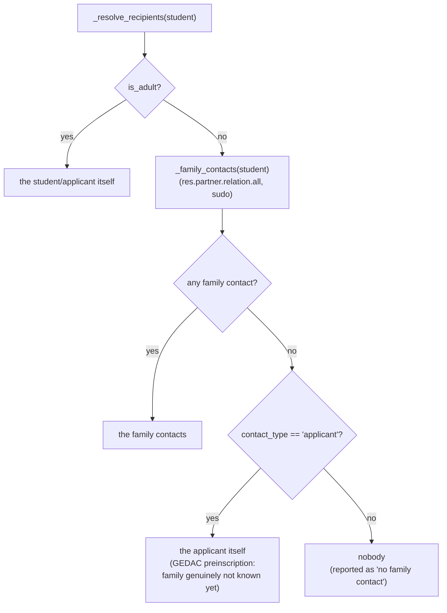
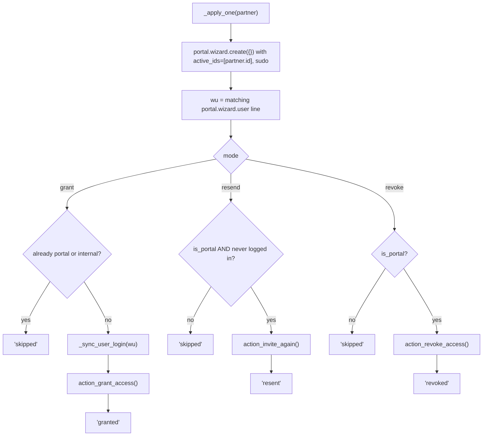

# Technical Reference: `ems.portal.access.wizard`

## Overview

`ems.portal.access.wizard` is the admin/secretary/tutor-facing bulk action for granting, revoking or re-inviting **portal access** for one or more students — wrapping Odoo's native `portal.wizard`/`portal.wizard.user` (from the `portal` module) with EMS-specific recipient resolution (who actually gets the access: the student, or their family) and permission scoping (a tutor can only manage their own tutorands).

**Module file:** `models/contacts/portal_access_wizard.py` (`EmsPortalAccessWizard`, `EmsPortalAccessWizardLine`)

**Not the family/portal-facing side** — the end-user experience of *using* portal access once granted is documented separately for families/tutors (`docs/en/families/manual-portal-alumne.md`, `docs/en/tutors/acces-portal.md`). This doc covers only the admin-side wizard that grants/revokes it.

---

## Recipient resolution — who gets the access

A minor's family contacts are found via `res.partner.relation.all` (`this_partner_id = student`, `other_partner_id.contact_type = 'family'`), run with `sudo()` since a tutor may lack read rights on the relation records of a family they don't otherwise manage.

**Age comes before contact type.** An earlier version keyed the first branch on `applicant`, giving every applicant their own login whatever their age, on the grounds that "at preinscription the family contacts are not known yet". That stopped being true once a returning ex-student became an applicant (see below): their family relations survive a withdrawal, so a 15-year-old coming back would have been emailed their own credentials, the opposite of what a `student` of the same age gets. Testing for the family contacts themselves, rather than for the contact type, keeps a real GEDAC preinscription (which has none on file) behaving exactly as before.

---

## Modes

| Mode | Native call | Applies to |
|------|-------------|------------|
| `grant` | `portal.wizard.user.action_grant_access()` | Recipients without portal access (or archived from a previous revoke) |
| `revoke` | `action_revoke_access()` | Recipients with active portal access |
| `resend` | `action_invite_again()` | Recipients with portal access who **never logged in** (`login_date` empty) — an expired/lost invitation |

`grant`/`resend` both end up calling Odoo's native `_send_email()` (`force_send=True`, real synchronous SMTP) — any test exercising either mode must mock `IrMailServer.send_email` (see `tests/test_portal_access_wizard.py`).

### `_apply_one(partner)` — the shared per-recipient application

Runs entirely under `sudo()` — tutors have no `res.users` creation/write rights of their own, but must still be able to grant/revoke access for their own tutorands. Called from two places outside this wizard's own `action_apply`:
- `res.partner._apply_portal_email_change()` (`contact.py`) — revoke at the old email, then grant at the new one, whenever a student/family's main email changes while they hold active portal access.
- `res.partner._ems_revoke_student_portal()` (`portal.py`) — used by the graduation/withdrawal flow and by a data migration backfill.

### `_sync_user_login(wu)` — stale login after a re-grant

Revoking access archives the `res.users` record rather than deleting it, so it keeps its old login/email. If the partner's email changed while access was revoked, a plain re-grant would silently reactivate the user with the **stale** login. `_sync_user_login` realigns `login`/`email` to the partner's current email right before granting — unless another user already owns that target login, in which case it leaves the stale login alone and lets the native `_assert_user_email_uniqueness` raise a clean "already registered" error instead of silently colliding.

---

## `action_apply()` — the wizard's main entry

Loops `student_ids`; per student: re-checks `_user_can_manage` (defense in depth — `student_ids` could in principle be tampered with client-side before submit), then the adult-without-email guard, then resolves recipients and applies per-recipient with a try/except around `_apply_one` so one failure doesn't abort the whole batch. Aggregates into a single `display_notification` (counts of granted/revoked/resent/skipped, plus a bulleted list of issues — `type: 'warning'` and `sticky: True` if there were any issues, `'success'` otherwise).

---

## Preview (`line_ids`) — `default_get` / `_onchange_mode` / `_build_lines`

The form shows a **read-only preview** of who will be affected before the user clicks Apply — `_build_lines` resolves recipients per selected student and computes `has_portal`/`connected` (from `recipient.user_ids[:1]`, `active_test=False` so an archived/revoked user is still found) and a `note` (`"No family contact found"` if `_resolve_recipients` came back empty, `"Recipient without email"` if the recipient has none). `default_get` builds the initial preview from `active_ids` (the selected `res.partner` records the wizard was opened from); `_onchange_mode` rebuilds it whenever the mode radio changes, additionally filtering to `has_portal and not connected` when switching to `resend` (only those recipients would actually be affected).

`default_get`/`_build_lines` are **not** re-triggered by a plain ORM `create()` from Python — that's an onchange, which only fires through the web client (or an explicit test call to `_onchange_mode()`); this is a common testing gotcha, not a wizard bug.

---

## Access Control

### `ir.model.access.csv`

| Model | Role | Create | Read | Write | Delete |
|-------|------|:------:|:----:|:-----:|:------:|
| `ems.portal.access.wizard` (+ `.line`) | Academic admin | ✓ | ✓ | ✓ | ✓ |
| | Secretary | ✓ | ✓ | ✓ | ✓ |
| | **`ems.group_tutor`** (not the generic `ems.group_teacher`) | ✓ | ✓ | ✓ | ✓ |

A plain teacher who is not currently tutoring anyone cannot even open this wizard — `ems.group_tutor` is a role-derived group only granted while an employee actually tutors at least one group (see [`ems.group`](group.md)'s `_sync_tutor_role`). `_user_can_manage`'s tutor branch is the **per-student** narrowing on top of that: even a real tutor can only manage their own tutorands, checked both in `default_get` (silently filters the preselection) and again in `action_apply` (reports an explicit issue rather than silently skipping, in case `student_ids` reached the server without going through the normal preselection — e.g. tampered client state).

---

## Views

| View | File | Notes |
|------|------|-------|
| Form | `views/community/contact/portal_access_wizard.xml` | `view_portal_access_wizard_form` — mode radio, readonly recipient preview list, Apply/Cancel footer |
| Bulk entry point | same file | `action_portal_access_bulk` (`ir.actions.server`), bound to the `res.partner` list view's cog-menu, restricted to `group_academic_admin`/`group_secretary`/`group_teacher` at the action level (the model's own `ir.model.access.csv`/`_user_can_manage` are the real gate for a non-tutoring teacher, as above). Its `code` field is a single call to `res.partner.action_portal_access_bulk()` (`models/contacts/contact.py`), which filters the selection down to `student`/`applicant` and raises a `UserError` when nothing survives. The logic lives in Python, not inline in the action, because `safe_eval`'s context has no `_`: an inline `_("...")` raises `NameError: name '_' is not defined` and the RPC surfaces that traceback instead of the intended message. |

> **How a returning ex-student gets in.** A contact that left is `withdrawal`/`alumni`/`expelled` and cannot hold portal access as such. Sending them a new enrollment converts them to `applicant` (`sale.order._ems_offer_to_ex_student()`, `models/enrollment/enrollment.py`), which is what makes them eligible here; confirming that enrollment later turns them into a full `student` via `_ems_admit_student()`. An `expelled` contact is never converted, so it stays out of scope on purpose.
>
> This exists because the four requirements otherwise form a closed loop: portal access needs `student`/`applicant`, becoming a student needs a confirmed enrollment, confirming needs the required authorizations answered, and those are answered *from the portal*. Sending the offer is the only deliberate act that can break it. See `docs/en/developers/enrollment/enrollment.md`.

Registered as a `data` entry in `__manifest__.py` (line ~97), alongside the rest of `views/community/contact/`.
