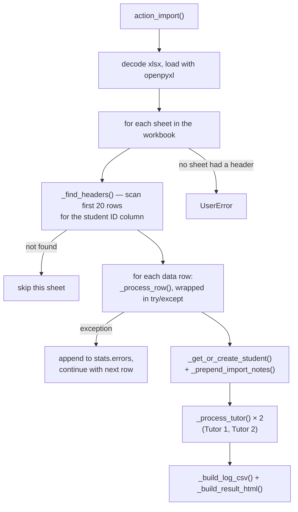

# Technical Reference: `ems.student_import_wizard`

## Overview

Bulk-imports/updates student and family-contact records from an **Esfera (SAGA)** xlsx export — the Catalan education administration's official system of record for already-enrolled students. Not to be confused with the GEDAC **preinscription** import (`ems.applicant_import_wizard`, documented separately): Esfera/SAGA is a different source system, covering students already admitted, not applicants.

**Module file:** `models/contacts/student_import_wizard.py` (`EmsStudentImportWizard`)

**Entry point:** a **cog-menu item** ("Import from Esfera") on the Students list/kanban view — not a `<menuitem>`. See `static/src/js/backend/import_student_cog_menu.js`: it registers into Odoo's `cogMenu` registry and is only shown when the current action is `ems.menu_students`' own action and the view isn't a form (`isDisplayed`, checked against the *action*, not the current *user's group* — the wizard's own `ir.model.access.csv`/action `groups_id` is what actually enforces admin/secretary-only, the cog menu item itself doesn't hide for other roles).

---

## Import flow

**Every sheet holding data is imported**, not just the workbook's active one — a real Esfera export regularly splits its students across several sheets, and reading only `wb.active` silently dropped all the others. A sheet whose first 20 rows carry no student-ID column (an empty or auxiliary tab) is skipped rather than aborting the file; the `UserError` fires only when *no* sheet in the workbook has one.

One row failing (a raised exception anywhere in `_process_row`) does **not** abort the batch — it's logged into `stats['errors']` and the loop continues, so a single malformed row can't block importing the rest of the file.

### Required columns — only the student identifier

`_STUDENT_ID_COLUMN` (`Identificador de l'alumne/a`, the RALC/IDALU) is the **only** column a file must carry, and it doubles as the marker `_find_headers` scans for to locate each sheet's header row. Everything else is optional: a row with no `Grup Classe` is imported without a group instead of being silently discarded (which is what a whole file of empty group cells used to hit — 0 imported, no error, no warning), and a row with no identifier is skipped *with a warning*, since nothing could match it to a student.

### Write policy — `overwrite`, `_values_to_write`, `_is_empty`

The wizard asks upfront, through the `overwrite` boolean on its own form, what should happen to a student who is already in EMS. `_values_to_write` applies the answer to students and family contacts alike:

| | `overwrite` unticked (default) | `overwrite` ticked |
|---|---|---|
| Field empty in EMS | filled in from the file | filled in from the file |
| Field already set in EMS | **kept as is** | replaced by the file's value |
| Cell empty in the file | **never blanks EMS's value** | **never blanks EMS's value** |

The second rule holds in both modes and is the one that matters most in practice: before it existed, `existing.write(data)` wrote the whole dictionary, so a column the export left empty erased whatever EMS held. `_is_empty` is what both rules read — it covers `None`/`False`, blank or whitespace-only strings, and the empty recordset a many2one reads back as.

`_CONTROL_FIELDS` (`active`, `contact_type`) deliberately bypasses the policy: re-importing a withdrawn student must reactivate them and restore their `student` contact type in either mode, since that is import control rather than student data.

### Notes — `_prepend_import_notes`

Notes are **never** overwritten, in either mode. Each import stacks its own block on top of whatever the record already holds, stamped with the import date and closed by a horizontal rule, so it stays visible when each block arrived and nothing written by hand is ever lost. (Odoo's HTML sanitiser rewrites the `
` the code emits as `
` — worth knowing when asserting on the stored value.)

### Column mapping — `_col_get`

`_process_row`/`_process_tutor` each locally re-declared an identical `get(col_name)` closure before this DTON pass (2026-07-28) — deduplicated into `_col_get(row, col_map, col_name)`. Looks up a column by its **exact Esfera header text** in `col_map` (built once by `_find_headers`), returns `None` if the column doesn't exist in this particular file or the cell is empty for this row.

### Student upsert — `_get_or_create_student`

Matched by `student_id` (RALC, the Catalan student identifier), searched with `active_test=False` — re-importing after a withdrawal (which archives the contact, see [Graduation & withdrawal wizards](exit_wizards.md)) **reactivates** the same record with `active: True` rather than creating a duplicate. This is the one piece of the wizard with dedicated `TransactionCase` coverage from before this DTON pass (create/update/reactivate).

### Tutor upsert — `_process_tutor` / `_get_or_create_family` / `_deduce_relation_type`

Family contacts follow exactly the same write policy as the student (`_values_to_write` + `_prepend_import_notes`). Before that, they had their own inconsistent one: phone/mobile/email were guarded with `if phone:`-style checks, but address fields and notes were written unconditionally and so could be blanked by an empty cell.

Up to 2 tutors per row (`Tutor 1`/`Tutor 2` column prefixes). For each: parse name/document/contact/address columns, resolve or create a `contact_type='family'` partner, guess the family relationship from a free-text observation column via keyword matching (`_deduce_relation_type`: mare/madre → mother, pare/padre → father, àvia/avia/abuela → grandmother, etc.), defaulting to the generic "Tutor" relation type when no keyword matches — in that fallback case a note is appended to the **student's** own `comment` field quoting the original free text, so a secretary can review and correct the guess later.

---

## Known limitations (flagged, not fixed in this pass)

- **Family dedup only matches by document number.** `_get_or_create_family` searches existing `family` contacts by `document_id`/`passport_id` only; a tutor row with **no document number** always creates a new partner. Re-importing the same file for an undocumented tutor creates one duplicate family contact per run. This is a deliberate, kept decision (2026-07-30): a fuzzier name/phone/email fallback was rejected — the false-positive-merge risk (two different people sharing a name) outweighs a duplicate contact. Locked in by `test_get_or_create_family_without_document_always_creates_new`. **Now surfaced in the result summary** (see below) instead of being silently discoverable only after the fact.
- **Country/state matching is `ilike` on the translated name** (`_find_country`/`_find_state`, forced `lang='ca_ES'`), `limit=1` with no disambiguation — fragile against accents/synonyms and could in principle match the wrong same-named state across different countries (mitigated for state by the `country_id` filter, not for country itself).
- **`_deduce_relation_type` resolves `env.ref` without `raise_if_not_found=False`** — if any of the 7 `ems.relation_type_*` XML IDs were ever renamed, every tutor row would raise. Degrades gracefully today only because the outer `action_import` loop already catches per-row exceptions — not a crash, just an unusually large error list.

## Fixed 2026-07-30: `stats['warnings']` — soft issues now visible in the result summary

Two data-quality issues used to be discoverable only by opening individual student/family records after the fact — both are now also collected into a new `stats['warnings']` list and rendered as their own block in `_build_result_html` (same `build_html_list`/`Markup` escaping pattern as `stats['errors']`, just a distinct, non-alarming label), so a secretary sees them in the import result screen without having to know to look elsewhere:

- **Group code with no matching `ems.group.external_id`** (`_process_row`): still imports the student without a group and still writes the `"Grup Classe (SAGA): <code>"` comment note (both are intentional — not every group may exist in EMS yet at import time) — but now also appends a warning naming the student and the unmatched code.
- **Tutor row with no document number** (`_process_tutor`): the dedup-skip behavior above is unchanged (still creates a new family contact every time) — but now also appends a warning naming the student and the tutor, so it's flagged for manual review instead of silently accumulating duplicates.

Tested in `tests/test_student_import_wizard.py`: `test_process_row_missing_group_adds_note_and_warning`/`test_process_row_matching_group_adds_no_warning`, `test_process_tutor_without_document_adds_warning`/`test_process_tutor_with_document_adds_no_warning`, `test_build_result_html_escapes_warning_content`/`test_build_result_html_no_warnings_omits_warning_block`.

## Fixed in this pass (2026-07-28)

- **`_build_result_html` now escapes error content.** It used to interpolate `stats['errors']` (stringified exceptions, which can echo raw row data) directly into HTML with no escaping — a latent HTML-injection risk into an admin-only readonly field. Now built with `markupsafe.Markup(...).format(...)`, which auto-escapes any plain-`str` argument (see `test_build_result_html_escapes_error_content`).
- **The `openpyxl is required to import xlsx files.` `UserError` was the only one of its 3 call sites (this wizard, `applicant_import_wizard.py`, `grade_import_wizard.py`) not wrapped in `_()`** — fixed; the existing `ca_ES`/`es_ES` translations (already present for the other two call sites) needed only a new `#:` reference added, not new translation text.
- Class renamed `ems_student_import_wizard` → `EmsStudentImportWizard` (zero external coupling — grepped clean).
- All `%`-style string formatting converted to f-strings (or, for `_()`-wrapped strings, to the project's named-placeholder convention).

**Deliberately NOT translated**: the note-building labels in `_build_student_notes`/`_process_tutor` (e.g. `"Província de naixement"`, `"Alumne tutelat legalment"`) stay in literal Catalan even though they end up in a user-visible `comment` field. They are a verbatim echo of Esfera/SAGA's **own** official Catalan field names — translating them would weaken the ability to trace a note back to exactly what the source system exported for that student. Same reasoning for the CSV log's column headers (`_build_log_csv`) — an internal operational log, not app UI chrome.

---

## Access Control

`ir.model.access.csv`: `ems.group_academic_admin`/`ems.group_secretary` only. The `action_student_import_wizard` window action additionally sets `groups_id` to the same two groups — belt-and-braces with the cog-menu item's own lack of group-awareness noted above.

---

## Views

| View | File | Notes |
|------|------|-------|
| Form | `views/community/contact/import_wizard.xml` (`view_student_import_wizard_form`) | Explanatory panel → file picker → (after import) result summary + downloadable CSV log via `auto_download_binary` |
| Action | same file | `action_student_import_wizard`, no standalone menu — see the cog-menu entry point above |
