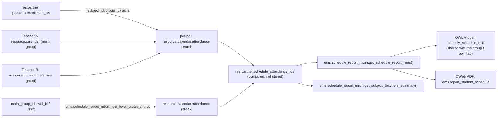

# Technical Reference: Student Schedule (read-only aggregation)

## Overview

Read [Group schedule (read-only aggregation)](group_schedule.md) first — this is the exact
same mechanism (real teaching slots live on a *teacher's* `resource.calendar`; the Schedule
tab is a read-only "photo" of a search over `resource.calendar.attendance`, with a PDF
export) applied one level down, to a **student's own** subjects instead of a whole group's.
Everything from `ems.schedule_report_mixin` onward (report-line building, the OWL widget, the
PDF template's structure) is shared verbatim; this doc only covers what's actually different.



## Why a student needed its own search, not just "the group's own reused"

A student is `res.partner` with `contact_type == 'student'` — there is no separate
`ems.student` model (see `models/contacts/contact.py`). A student's group affiliation is
`main_group_id` (their homeroom) plus `enrollment_ids` (`ems.enrollment`, one row per
`(student_id, subject_id, group_id)` — every subject they take, `group_id` defaulting to
`main_group_id` but able to point at a **different** group for electives/reinforcement).

`ems.group.schedule_attendance_ids` aggregates **every** `resource.calendar.attendance` row
whose `group_ids` includes that one group, regardless of subject — correct for a group, whose
own Schedule tab is meant to show its *entire* week. A student only ever takes *some* of a
group's subjects, so reusing that same "any subject taught to my main group" search would
leak in subjects the student was never actually enrolled in (a real risk verified by
`TestStudentSchedule.test_schedule_attendance_ids_only_includes_enrolled_subjects`, which
seeds an extra, unenrolled subject on the student's own main group specifically to catch this
class of bug). The search has to be **scoped per enrollment pair** instead:

```python
for enrollment in student.enrollment_ids:
    teaching |= Attendance.search([
        ('subject_id', '=', enrollment.subject_id.id),
        ('group_ids', '=', enrollment.group_id.id),
    ])
```

One `search()` per enrollment (small numbers per student, no batching concern) instead of a
single OR-domain — kept this way for readability, matching the group's own equally simple
single-`search()` style rather than building a dynamic domain tree for a handful of rows.

## Model changes

**`res.partner`** (new file `models/contacts/student_schedule.py`, a further
`_inherit = ['res.partner', 'ems.schedule_report_mixin']` alongside `contact.py`'s own
`_inherit = ['res.partner']` — same "2-item `_inherit` needs an explicit `_name`" gotcha as
`ems.group`'s own `group_schedule.py`):
- `schedule_attendance_ids` (Many2many `resource.calendar.attendance`, computed, not stored,
  `@api.depends('contact_type', 'main_group_id', 'enrollment_ids.subject_id', 'enrollment_ids.group_id')`) —
  union of the per-enrollment search above and `_get_break_entries()`. A non-student contact
  (family, applicant, ...) always gets an empty recordset — the field is meaningless off the
  student form, but harmless to compute for any `res.partner`.
- `shift` (`Selection`, `related="main_group_id.shift"`, `readonly=True`) — a student has no
  shift of their own, only their main group does. Exposed purely so the shared OWL widget can
  read `record.data.shift` for its axis-bounds calculation exactly the way it already does for
  `ems.group.shift` (a real field there), with **zero model-specific branching needed in the
  JS component** — the same "smuggle a helper field in via an invisible view field" pattern
  already used for `hr.employee.can_edit_schedule`. Because `shift` is itself a related field
  onto `main_group_id.shift`, `ems.schedule_report_mixin._schedule_report_shift()`'s default
  (a plain `self.shift` read) already resolves correctly — no Python override needed either,
  unlike what an earlier draft of this field assumed.
- `_get_break_entries()` — delegates to `ems.schedule_report_mixin._get_level_break_entries()`
  with the student's **main group's** `level_id`/`shift` (not the student's own — they have
  neither). A student enrolled through several groups still only ever has one break, derived
  from their homeroom, not from every group they touch.

**The `@api.depends` staleness trap (found the hard way):** same structural limitation as
`ems.group`'s own version — a cross-model search can't be a real Odoo dependency, so this
`@api.depends` can never fully describe when the field should be recomputed. It still matters
for one concrete reason: `TestStudentSchedule`'s own `setUpClass` creates the student record,
then **separately** creates its `ems.enrollment` rows right after — and an intervening read of
`schedule_attendance_ids` (before those enrollments existed) cached an empty value that, with
no `@api.depends` at all, nothing ever invalidated for the rest of that test class's
transaction; every later test kept reading the same stale empty recordset regardless of what
had since been enrolled. Declaring the dependency on `enrollment_ids.subject_id`/
`enrollment_ids.group_id`/`main_group_id` fixes exactly this: creating an enrollment now
correctly invalidates the cached value. It does **not**, and can't, cover a *calendar* entry
being added/changed afterwards (still a cross-model search) — but that was never the failure
mode here, and matches the group's own accepted limitation. A real web-client request is
unaffected either way (a fresh transaction has an empty cache to begin with).

## View

`views/community/contact/form.xml`, a new `<page name="schedule" string="Schedule"
invisible="contact_type != 'student'">` alongside the existing student-only pages (`studies`,
`secretary`, `documentation`) — following the same "trace the `<menuitem>` chain, don't
assume `models/`'s folder name" placement rule as every other view in this repo, this page
lives in `views/community/` because the whole student form does (`menu_community`). Embeds
the invisible `shift` field plus `schedule_attendance_ids` with
`widget="readonly_schedule_grid"` — the exact same widget name, same sub-`<list>` shape
(`dayofweek`, `hour_from`, `hour_to`, `day_period`, `subject_id`, `non_teaching`,
`non_teaching_is_break`, `employee_id`, `space_id`) as the group form's own Schedule tab.

## PDF report (`ems.report_student_schedule`)

`reports/contacts/report_student_schedule.xml` — a `qweb-pdf` `ir.actions.report` on
`res.partner` (`binding_model_id` = `base.model_res_partner`, since `res.partner` is a core
Odoo model, not one EMS owns — unlike `ems.group`'s own report, whose `ref="model_ems_group"`
resolves against the `ems` module implicitly), bound so it appears in the student form's
native Print menu. A near-verbatim copy of `report_group_schedule.xml`'s structure, with the
header showing the student's name and (when set) their main group instead of a tutor.

## Access control

| Action | `base.group_user` (teacher, secretary, tutor, ...) | `ems.group_department_chief` and above |
|--------|------------------------------|------------------------------|
| Read a student's aggregated schedule (`schedule_attendance_ids`, `get_schedule_report_lines()`, `get_subject_teachers_summary()`) | Yes | Yes |
| Export a student's schedule to PDF | Yes | Yes |
| Edit a student's schedule | No (not possible from this tab at all — edit from the relevant teacher's own Schedule tab) | No (same) |

No new ACL rows needed: `res.partner` is already readable by every internal role that opens
the student form (`ems.access_res_partner_admin`/`_teacher`/`_secretary`), and
`resource.calendar`/`resource.calendar.attendance` are already readable by every internal
user (base Odoo ACL) — same as the group's own tab. This tab is reached from the **backend**
student form only; portal-facing roles (`ems.group_student_data_reader`, families/students
via `base.group_portal`) have no access to it and are out of scope for this feature, matching
the group tab's own scoping.
