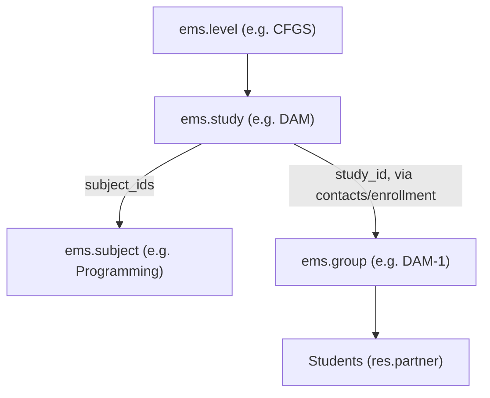
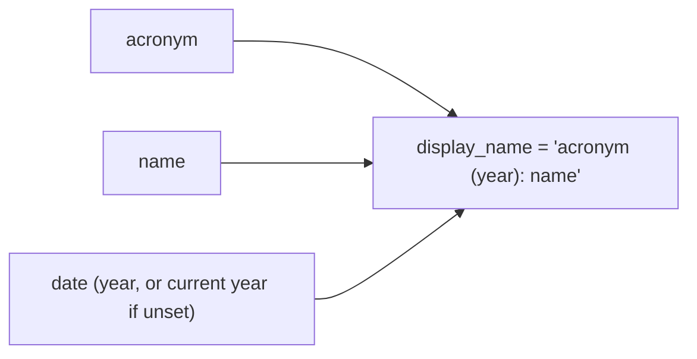
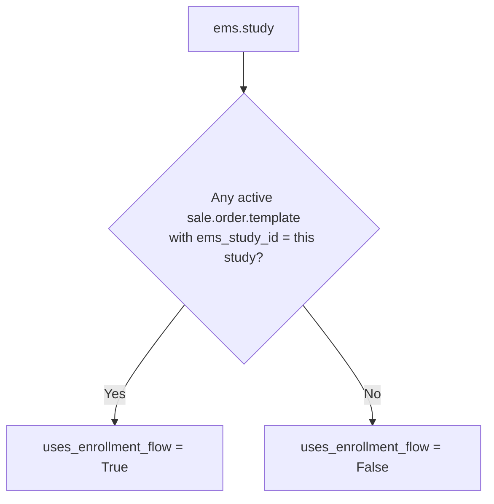
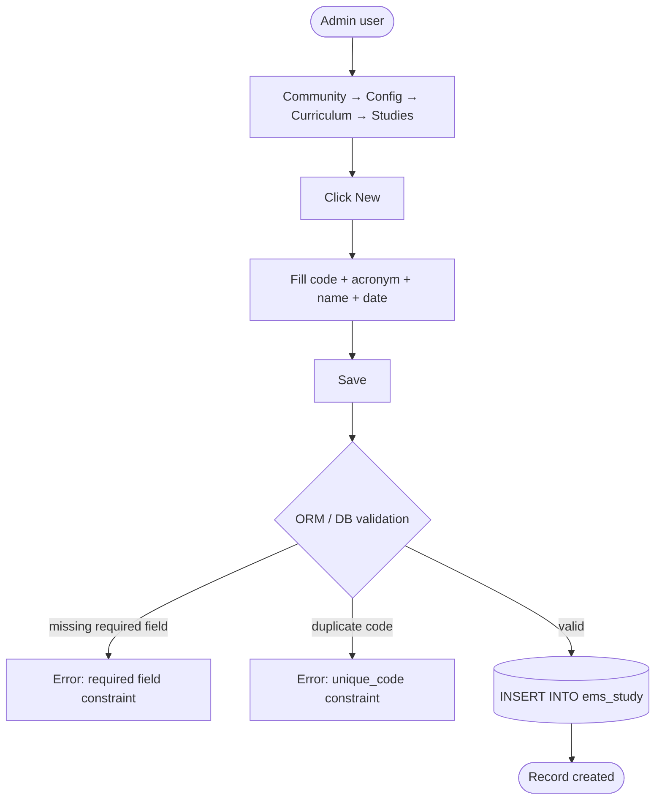
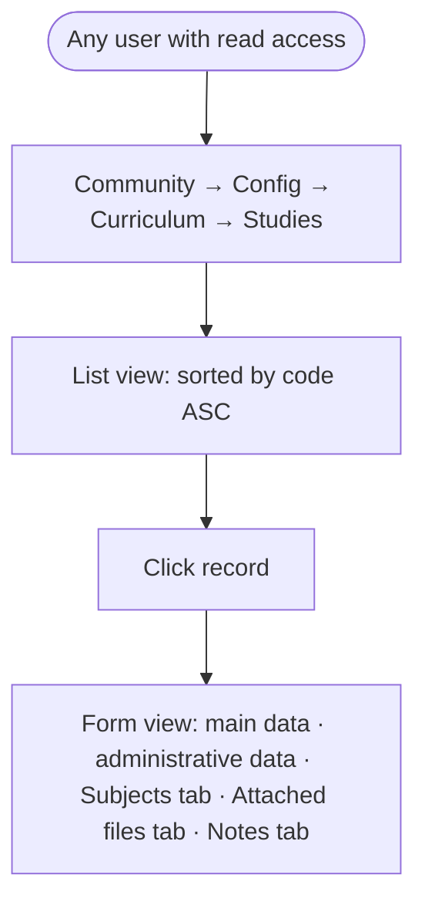
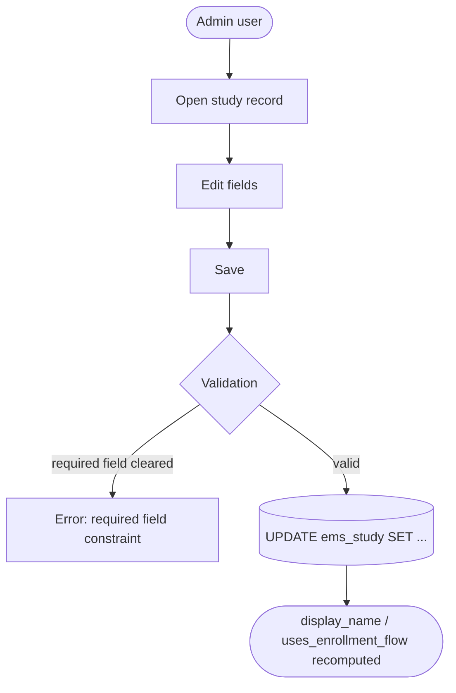
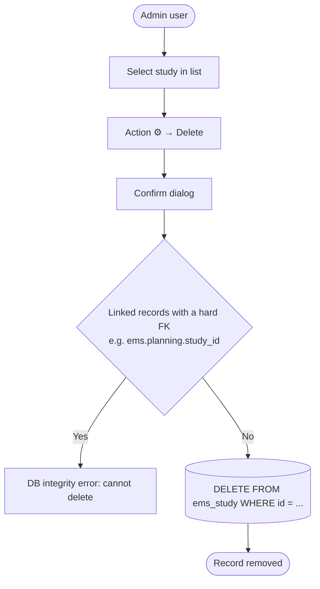

# Technical Reference: `ems.study`

## Overview

`ems.study` is a configuration model in the EMS curriculum hierarchy, one level below `ems.level`. It represents a concrete study programme (e.g., DAM, DAW, ASIX) offered under a given educational level, and links it to the subjects that make it up.

**Module file:** `models/curriculum/study.py`

---

## Data Model

### Fields

| Field | Type | Required | Stored | Description |
|-------|------|----------|--------|-------------|
| `code` | `Char` | Yes | Yes | Official code, unique (e.g., `CFGS_ICB0`) |
| `acronym` | `Char` | Yes | Yes | Short code (e.g., `DAM`) |
| `name` | `Char` | Yes | Yes | Full descriptive name |
| `date` | `Date` | Yes | Yes | Release/curriculum publication date |
| `deprecated` | `Boolean` | Yes | Yes | Marks a study as no longer offered, without deleting historical data |
| `level_id` | `Many2one → ems.level` | No | Yes | The level this study belongs to |
| `subject_ids` | `Many2many → ems.subject` | No | Yes | Subjects that make up this study — see "Editing `subject_ids` from here" below |
| `follow_ids` | `One2many → ems.tracking` | No | No | Follow-up/tracking records for this study |
| `attachment_ids` | `Many2many → ir.attachment` | No | Yes | Curriculum documents (BOE/DOGC references, guidance docs) |
| `notes` | `Text` | No | Yes | Free-form administrative notes |
| `display_name` | `Char` (computed) | — | No | Format: `ACRONYM (Year): Name` |
| `uses_enrollment_flow` | `Boolean` (computed, searchable) | — | No | Whether the study has at least one active `sale.order.template` |

### Curriculum Hierarchy

### Editing `subject_ids` from here

The **Subjects** tab on this model's own form (`views/community/study/form.xml`) lets an admin
add/remove subjects directly, writing the same many2many relation as `ems.subject.study_ids`
from its other side. `ems.subject`'s own code-reuse rule (see `ems.subject`'s technical
reference, "Code uniqueness: per-study, not global") must still hold after such an edit, but
Odoo does not automatically re-run `ems.subject`'s constrains just because the relation changed
from this side (confirmed empirically 2026-09-06). `_check_subject_codes_unique_per_study`
(`@api.constrains('subject_ids')`) exists purely to close that gap — it delegates to
`ems.subject._check_code_unique_per_study()` on the subjects that just changed, rather than
duplicating the check.

### `display_name` Computation

Triggered by `@api.depends('acronym', 'name')`. Note `date` is read but not declared as a dependency — the year only changes when a new record is created with a different `date`, so this is intentional (matches the model's original design; not a bug worth fixing without a behaviour change).

### `uses_enrollment_flow` Computation

Single source of truth for whether a study manages admissions through the matrícula (`sale.order`) flow. Derived — not a manual flag — from whether the study has at least one active [enrollment template](../enrollment/enrollment_template.md) (`sale.order.template`) pointing at it via `ems_study_id`. Consumed by the "no destination" report, the transition-status computation, and the transition wizard preview.

---

## CRUD Operations

### Create

### Read

### Update

### Delete

In practice, production studies are rarely deleted — the `deprecated` flag is the intended way to retire a study while keeping its historical enrolments, groups and grades intact.

---

## Access Control

Defined in `security/ir.model.access.csv` (lines 46–48, 229).

| Role | Create | Read | Write | Delete | Group XML ID |
|------|:------:|:----:|:-----:|:------:|--------------|
| Administrator | ✓ | ✓ | ✓ | ✓ | `ems.group_academic_admin` |
| Teacher | — | ✓ | — | — | `ems.group_teacher` |
| Secretary | — | ✓ | — | — | `ems.group_secretary` |
| Portal | — | ✓ | — | — | `base.group_portal` |

No record-level rules exist for this model. Teacher/Secretary/Portal read access exists so studies can be displayed (selectors, tags, filters) in other screens — none of these roles has a dedicated "Studies" menu entry of their own.

---

## Integration Map

`ems.study` is referenced by the following models:

| Model | Field | Relation | Description |
|-------|-------|----------|--------------|
| `ems.level` | `study_ids` | One2many | Inverse of `study.level_id` |
| `ems.subject` | `study_ids` | Many2many | Subjects can belong to multiple studies |
| `ems.group` | `study_id` | Many2one | Each class group belongs to one study |
| `ems.contact` (`res.partner`) | `study_id` / `preinscription_study_id` | Many2one | Student's current and pre-registration study |
| `ems.planning` | `study_id` | Many2one (required) | Planning is scoped to a study |
| `ems.tracking` | `study_id` | Many2one | Follow-up records scoped to a study |
| `ems.enrollment` | `ems_study_id` | Many2one | Enrolment header targets a study; derives `ems_level_id` |
| `ems.authorization` / `ems.authorization.template` | `ems_study_id` / `ems_study_ids` | Many2one / Many2many | Authorization scope |
| [Enrollment template](../enrollment/enrollment_template.md) (`sale.order.template`) | `ems_study_id` | Many2one | Drives `uses_enrollment_flow` |
| `ems.attendance_template` | `study_ids` | Many2many | Attendance scheduling; can span several studies (co-teaching) |
| `ems.attendance_session_header` / `_line` | `study_ids` | Related (`store=True`) | Inherited from the attendance template |
| `ems.student.year_record` | `study_id` | Many2one | Historical academic record |
| `ems.em_grading_wizard` | `study_id` | Many2one | Work-placement grading scope |
| `ems.grade_session_state_wizard` | `study_ids` | Many2many | Bulk grade-session state changes |
| `ems.limesurvey_header` | `study_ids` | Many2many | Survey targeting by study |

---

## Views

| View | File | Notes |
|------|------|-------|
| List | `views/community/study/list.xml` | Sorted by `code` |
| Form | `views/community/study/form.xml` | Main + administrative data groups; Subjects / Attached files / Notes tabs |
| Search | `views/community/study/search.xml` | — |
| Action + Menu | `views/community/study/menu.xml` | `action_study_tree`, under Community → Configuration → Curriculum (sequence 2) |

`study_ids`/`study_id` are also rendered as `many2many_tags` on `ems.authorization.template`, `ems.enrollment.authorization`, `ems.minute` and the grading wizard forms — these are simple tag pickers, not custom widgets, so they don't require dedicated tour coverage beyond the model's own CRUD screen.

---

## Data Files

| File | Purpose |
|------|---------|
| `data/cat/ems.study.csv` | Production catalog: Catalan VET/Baccalaureate studies |
| `data/custom/ccff/ems.study.csv`, `data/custom/btx/ems.study.csv`, `data/custom/eso/ems.study.csv` | Centre-specific extensions reusing the shared `data/cat` ids (see CLAUDE.md "extending a `data/cat/` record" exception) to attach the centre's own optional subjects |
