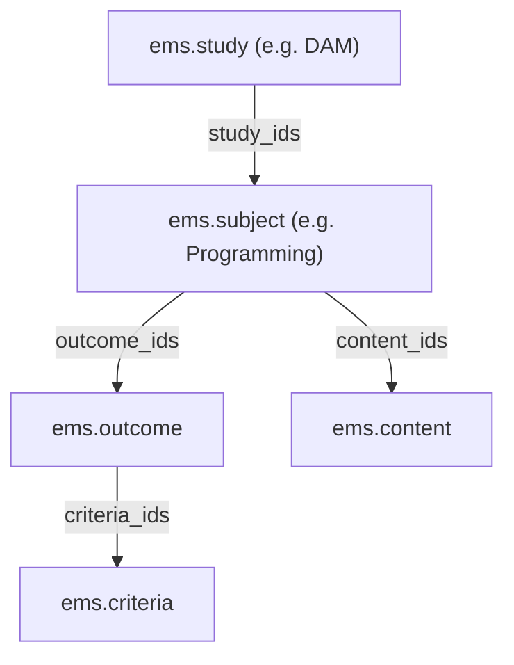
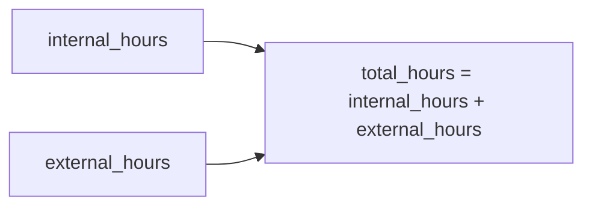
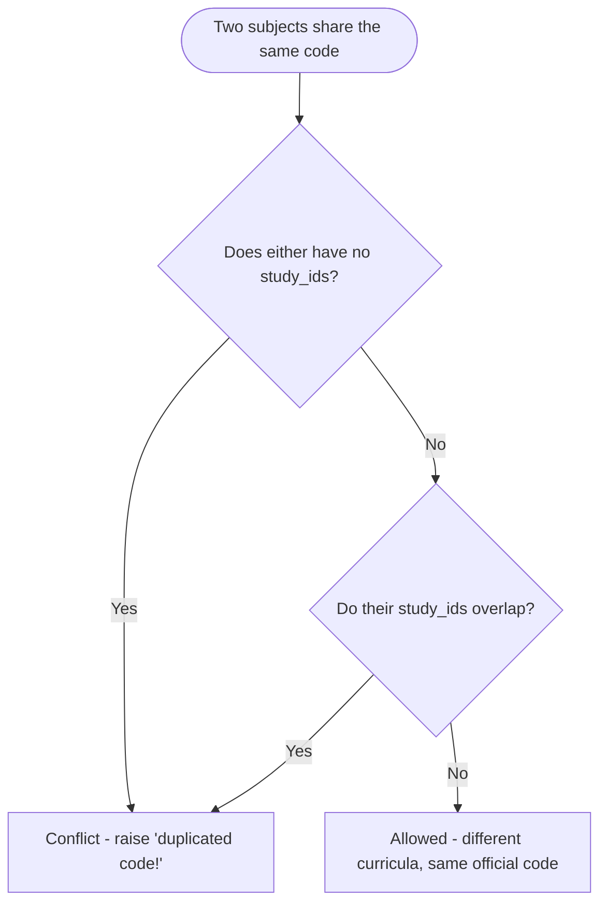
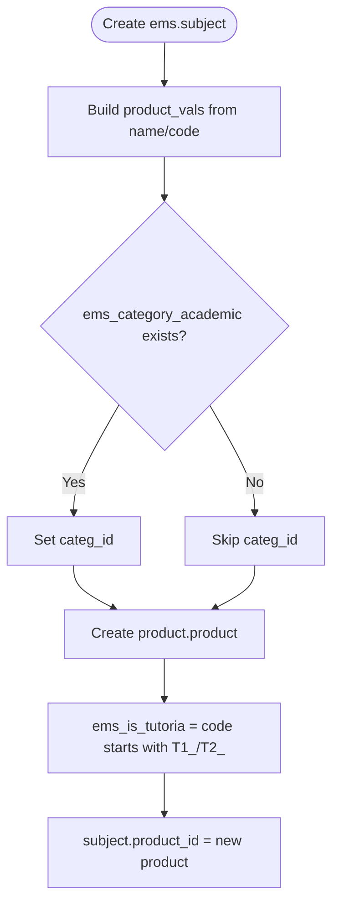
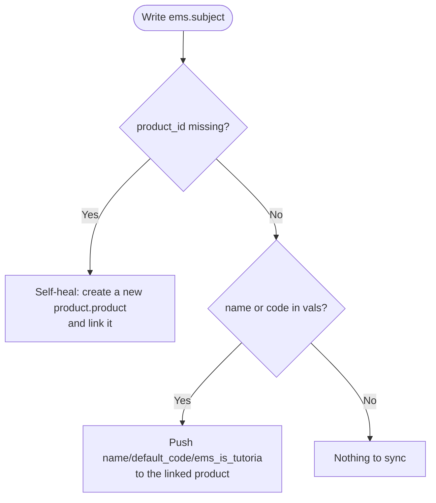
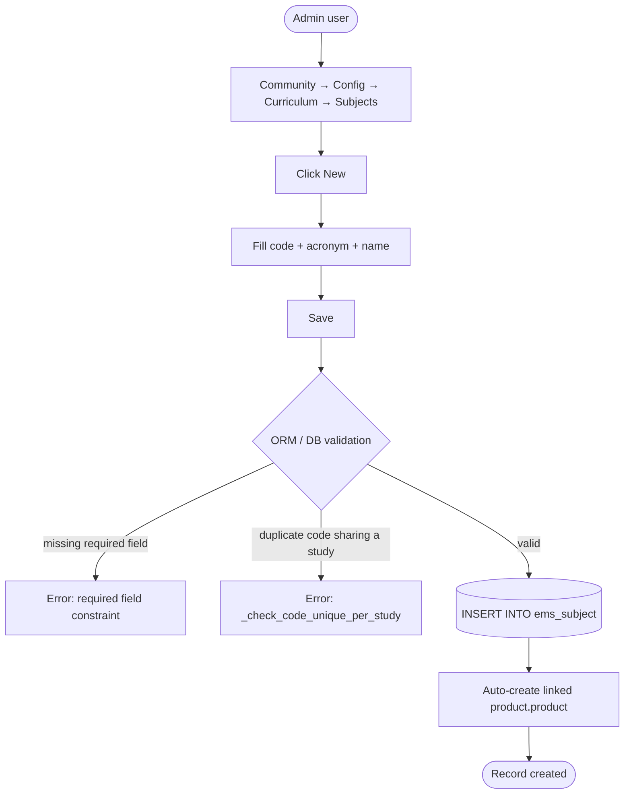
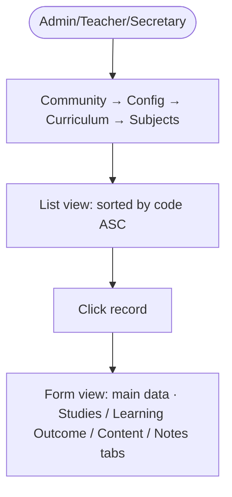
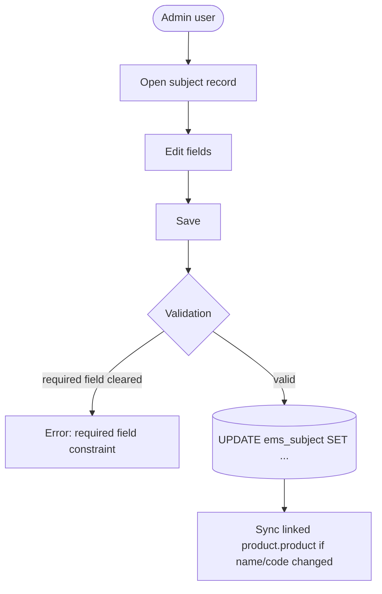
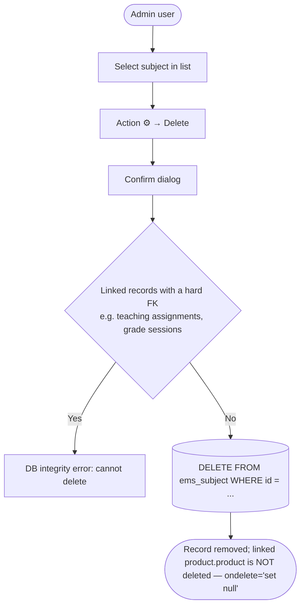

# Technical Reference: `ems.subject`

## Overview

`ems.subject` represents an individual subject (course unit) that makes up one or more studies. It is the most widely referenced node in the curriculum hierarchy: teaching assignments, timetabling, planning, grading and attendance all key off `subject_id`. Every subject is automatically backed by a `product.product` (used to bill it through enrolments/`sale.order`), kept in sync by the model's `create()`/`write()` overrides.

**Module file:** `models/curriculum/subject.py`

---

## Data Model

### Fields

| Field | Type | Required | Stored | Description |
|-------|------|----------|--------|-------------|
| `code` | `Char` | Yes | Yes | Official code — unique per study, not globally (see below) |
| `acronym` | `Char` | Yes | Yes | Short code |
| `name` | `Char` | Yes | Yes | Full descriptive name |
| `ects` | `Integer` | No | Yes | ECTS credits |
| `is_tutorship` | `Boolean` | No | Yes | Marks a subject as a tutoring slot |
| `internal_hours` | `Integer` | No | Yes | Hours taught at the centre |
| `external_hours` | `Integer` | No | Yes | Hours in a work placement / external setting |
| `total_hours` | `Integer` (computed) | — | No | `internal_hours + external_hours` |
| `product_id` | `Many2one → product.product` | No | Yes | Auto-managed billing product for this subject |
| `outcome_ids` | `One2many → ems.outcome` | No | No | Learning outcomes (inverse of `outcome.subject_id`) |
| `content_ids` | `One2many → ems.content` | No | No | Content items (inverse of `content.subject_id`) |
| `study_ids` | `Many2many → ems.study` | No | Yes | Studies this subject belongs to |
| `notes` | `Text` | No | Yes | Free-form administrative notes |
| `display_name` | `Char` (computed) | — | No | Format: `Acronym: Name` |

`_rec_names_search = ['name', 'acronym']` — the name-search box matches on both fields, not just `display_name`.

### Curriculum Hierarchy

### `total_hours` Computation

### Code uniqueness: per-study, not global

The official code assigned to a professional module by the education department is not
guaranteed unique across every curriculum it's ever used in — the same code can mean two
genuinely different subjects (different learning outcomes, different internal/external hours)
when each belongs to a different study (e.g. MP 3003 in a CFGB vs. the same code in a PFI —
see `ems.subject_3003_sa` and `ems.subject_3003_pfi` in `data/cat/ems.subject.csv`). A plain
`unique(code)` SQL constraint (the model's behaviour before 2026-09-06) would force a fake
suffix onto one of them, which would then no longer match the real code used by any external
import or grade file, or by a convalidation request against the official curriculum.

`_check_code_unique_per_study` (an `@api.constrains('code', 'study_ids')` method, replacing the
old `_sql_constraints = [('unique_code', ...)]`) enforces a narrower rule instead: a duplicate
code is only a real conflict when the two subjects could actually be confused for one another —
either one of them has no study at all (nothing to disambiguate by, so treated as a genuine
duplicate — this preserves the original behaviour for a subject not yet assigned to a study),
or they share at least one study.

Declared on `study_ids`, not just `code`, so re-validation also fires when a study is added to
or removed from a subject via the **study's own** "Subjects" tab
(`views/community/study/form.xml`) — that tab writes the exact same many2many relation from its
other side, but Odoo does not automatically re-run `ems.subject`'s own constrains for that write
direction (confirmed empirically 2026-09-06). `ems.study` therefore declares its own mirroring
`_check_subject_codes_unique_per_study` (`@api.constrains('subject_ids')`,
`models/curriculum/study.py`), which delegates to `ems.subject`'s method on the changed
subjects rather than duplicating the logic.

**Skipped entirely during data-file loading** (`self.env.context.get("install_mode")`, the same
pattern already used by `ems.planning.check_ponderation`): a data-file-created subject's
`study_ids` can only be populated by `ems.study.csv`, a separate file loaded *after*
`ems.subject.csv` — so a brand-new subject's own `create()` always fires this constraint first,
with no study yet. Skipping it under `install_mode` avoids a false positive on every clean
install/upgrade; it never skips a real interactive edit through the UI.

### The `product.product` Sync (`create()` / `write()`)

Every subject needs a matching `product.product` so it can be sold/invoiced through an enrolment (`sale.order`). This is fully automatic — there is no manual "create product" step for an administrator.

---

## CRUD Operations

### Create

### Read

### Update

### Delete

---

## Access Control

Defined in `security/ir.model.access.csv` (lines 111–113).

| Role | Create | Read | Write | Delete | Group XML ID |
|------|:------:|:----:|:-----:|:------:|--------------|
| Administrator | ✓ | ✓ | ✓ | ✓ | `ems.group_academic_admin` |
| Teacher | — | ✓ | — | — | `ems.group_teacher` |
| Secretary | — | ✓ | — | — | `ems.group_secretary` |

No record-level rules exist for this model. No portal access — subjects aren't shown on the family/student portal directly.

---

## Integration Map

`ems.subject` is one of the most referenced models in EMS. Selected consumers by area:

| Area | Model(s) | Field | Description |
|------|----------|-------|--------------|
| Curriculum | `ems.study` | `subject_ids` | Studies group their subjects |
| Curriculum | `ems.outcome`, `ems.content` | `subject_id` | Learning outcomes / content scoped to a subject |
| Contacts | `ems.group` | `subject_ids` | Group's taught subjects |
| Contacts | `ems.enrollment` | `subject_id` | Enrolment line item |
| Employees | `ems.teaching`, `ems.tracking` | `subject_id` | Teaching assignments and follow-up |
| Employees | `resource.calendar` (working schedule) | `subject_id` | Weekly schedule slot |
| Attendance | `ems.attendance_template`, `ems.attendance_session_header/_line` | `subject_id` | Scheduling and roll-call |
| Planning | `ems.planning` | `subject_id` (required) | Planning scoped to a subject |
| Grades | `ems.grade_session`, `ems.grade_subject_line`, `ems.grade_outcome_line`, `ems.student.year_record`, `ems.em_grading_wizard` | `subject_id` | Grading flows |
| Communications | `ems.limesurvey_recipient` | `subject_id` | Survey targeting by subject |

---

## Views

| View | File | Notes |
|------|------|-------|
| List | `views/community/subject/list.xml` | Sorted by `code`; shows `study_ids` as tags |
| Form | `views/community/subject/form.xml` | Main data group; Studies / Learning Outcome / Content / Notes tabs |
| Search | `views/community/subject/search.xml` | — |
| Action + Menu | `views/community/subject/menu.xml` | `action_subject_tree`, under Community → Configuration → Curriculum (sequence 3) |

---

## Data Files

| File | Purpose |
|------|---------|
| `data/cat/ems.subject.csv` | Production catalog: Catalan VET/Baccalaureate subjects |
| `data/custom/btx/ems.subject.csv`, `data/custom/ccff/ems.subject.csv`, `data/custom/eso/ems.subject.csv` | Centre-specific subject catalogs |
