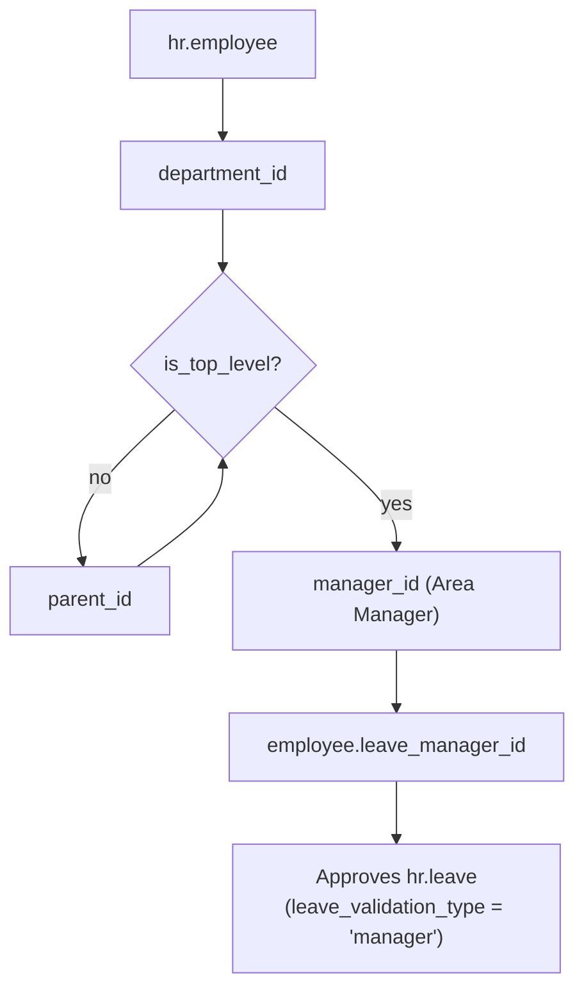
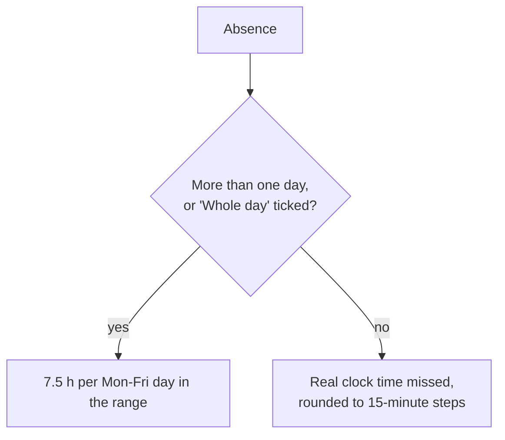

# Staff absences (`hr_holidays` EMS extension)

Replaces the Google Form + Sheet + Apps Script application the centre used to manage staff
absences, with three parallel copies (VET/CCFF, ESO/BTX, ASP) that differed only in who approved
them. EMS builds on Odoo's native `hr_holidays` rather than a bespoke model: the request
workflow, approval, hour computation against the employee's `resource.calendar`, attachments,
calendar event and reporting all come from the framework.

> **Current scope:** the `hr_holidays` dependency, the absence type catalogue, the derived
> approver, the access model (cycle 1), and the EMS request fields, hour rules and health
> allowance (cycle 2). The guard-duty integration and the notification rework land in later
> cycles — see `plans/absence_management.md`.

## Who approves: derived, never configured

The Google sheet held a `Config` tab mapping each department to its "Gestor d'absencies". EMS
already models that relationship: the approver is the **Area Manager of the employee's top-level
department**, which the role hierarchy keeps current on its own (see
[role_hierarchy.md](role_hierarchy.md) and [department.md](department.md)).



| Top-level department | `top_level_role` | EMS role | Approves absences for |
|---|---|---|---|
| VET | `dhos` | Deputy head of studies | Vocational training staff |
| ESO / BTX | `hos` | Head of studies | Secondary and baccalaureate staff |
| ASP | `secretary` | Secretary | Administrative and services staff |

`hr.department._top_level_department()` walks `parent_id` up to the `is_top_level` ancestor.
`ems_employee_base._compute_leave_manager()` overrides the native compute — which follows
`parent_id.user_id`, i.e. the Seminar Chief or Department Chief, the wrong person here — and
resolves that department's `manager_id.user_id` instead. Like `_compute_parent_id()`, it depends
only on `department_id` and is re-triggered explicitly from
`ems_department._cascade_department_heads()`, so replacing an Area Manager re-points every
affected employee in one write.

The field stays `readonly=False` (a stored editable compute, as Odoo defines it), so an
administrator can override a single employee's approver by hand; the override holds until the
next recompute — that employee changing department, or their Area Manager being replaced.

**The approver is a `res.users`, not an `hr.employee`.** An Area Manager with no user account
therefore leaves every employee in their area with an empty `leave_manager_id`, which Odoo
degrades to "approved by an officer" — the Head of Studies chain — rather than failing. Worth
checking when an area's absences appear to have no approver.

## Absence type catalogue

`data/cat/hr.leave.type.csv` — Catalonia-specific, because the catalogue follows the Generalitat's
own staff-absence regulations (ATRI is its personnel portal), same rationale as
`data/cat/hr.job.csv`.

**The nine names are the original form's own option texts, verbatim.** They are long
sentences rather than short labels because several carry the legal wording the employee is
declaring when they pick one ("I was absent from my workplace for health reasons, a
circumstance I reported immediately to the centre's director"). English is the source language;
`i18n/ca_ES.po` holds the Catalan exactly as the Google form had it, character for character.

**No type is preselected.** Odoo ticks the first available one on a new request; here the type
is the legal ground the employee is declaring, so it has to be a deliberate choice. Turned off
through hr_holidays' own `holiday_status_display_name` context switch rather than by picking the
default apart afterwards.

**The form shows them as a radio list, not a dropdown** (`widget="radio"` on
`holiday_status_id`, which Odoo supports on many2one fields), exactly as the Google form did.
That is not decoration: several of the nine options *are* the legal wording the employee is
declaring by choosing them, so they have to be readable in full at the moment of choosing.

**Everywhere else shows a short name.** `hr.leave.type.ems_short_name` is the text up to the
colon - `Salut`, `ATRI`, `Assistència a Consulta mèdica` - which is what the Apps Script itself
displayed in the calendar and its emails (`type.substring(0, colonIndex)`). The absence list
shows it through the related `hr.leave.ems_type_short_name`, and `hr.leave._compute_display_name`
substitutes it into whatever Odoo builds, the calendar chip above all. Deliberately *not* done
by shortening the type's own `display_name`: the radio widget reads exactly that field, so
shortening it there would empty out the one place the full text matters. `ems_short_name` is not
stored, because `name` is translatable and a stored copy would freeze one language.

Odoo's own five types (`Paid Time Off`, `Sick Time Off`, `Unpaid`, `Compensatory Days`, and
`Extra Hours` from `hr_holidays_attendance`) are archived by
`hr.leave.type._ems_deactivate_native_types()`. That has to be code, not a data file: all five
carry `ir_model_data.noupdate = True`, and it is that stored flag - not the loading file's own
context - that decides whether an existing record is written.

| Type | Supporting document | Counts in monthly report | Notes |
|---|---|---|---|
| Baixa laboral | yes | **no** | Formal sick leave; excluded from the monthly hours report (2 of 53 real rows counted) |
| Salut | no | yes | Self-declared health absence; the only type consuming the 15 h/course allowance |
| Assistència a consulta mèdica | yes | yes | |
| Prova mèdica invasiva | yes | yes | Whole day by default |
| Flexibilitat per menstruació o climateri | no | yes | Its own legal cap (8 h/month) is out of scope |
| Formació | no | yes | Courses, Erasmus+ |
| Absència justificada | no | yes | |
| Encàrrec de serveis | no | yes | Field trips, official travel |
| ATRI | no | yes | Filed by the employee on the Generalitat portal; Direction confirms it |

All nine share `request_unit = 'hour'`, `requires_allocation = 'no'` (the 15 h cap warns, it
never blocks — see the plan) and `leave_validation_type = 'manager'`, which routes approval to
`leave_manager_id` above.

## The request: what EMS adds to `hr.leave`

| Field | Seeded from | Who edits it |
|---|---|---|
| `ems_full_day` "Whole day" | `hr.leave.type.ems_full_day_default` | Employee, while the request is unapproved |
| `ems_counts_hours` "Adds the hours to the monthly report" | `hr.leave.type.ems_counts_hours` | The approver only |
| `ems_needs_atri` "Filed through ATRI" | `hr.leave.type.ems_needs_atri` | Employee, while unapproved |
| `ems_responsible_declaration` | — | Employee; required when the type demands it |
| `ems_direction_state` "Direction check" | — | Read by everyone, set by Direction only; hidden until the request exists |
| `ems_health_hours_used` / `ems_health_allowance_exceeded` | computed | read-only |

The first three are **stored editable computes**: picking an absence type proposes a value and
any later manual change survives. That is deliberate, and it reproduces what the Apps Script did
— it ticked `Suma Hores?` on submit and left the manager free to correct it afterwards, which
they do, because employees miscategorise their own absences.

`ems_direction_state` (`Not done` / `Missing document` / `Done`) is **independent of the approval
workflow**, not a second validation step: a request can be approved and still be waiting for its
document. For ATRI absences it is also where Direction confirms the request was really filed on
the Generalitat's portal.

The Direction check is hidden on a request still being written (`invisible="not id"`): Direction
cannot have verified a justification for something that does not exist yet.

**The Direction check shows in every absence list** - the employee's own included, so they can
see their justification is still pending - decorated like the state column beside it: grey for
*Not done*, red for *Missing document*, green for *Done*. Because it is now readable by
everyone, hiding the field in a view stops being a barrier: `hr.leave.write()` rejects any
change to it from outside `ems.group_director`, and `create()` drops it, so the form's readonly
is only the UI half of a rule that also exists server-side.

**The employee never picks the ATRI flag or the monthly-report flag.** Both are derived from the
absence type and shown only to the approver, who corrects them when the employee chose the wrong
type - which is also why `holiday_status_id` itself stays editable for the approver after
approval, overriding Odoo's own readonly (`is_absence_manager` drives that).

## The request form

Three deliberate departures from how Odoo would lay this out, all of them to match the form the
centre already knew:

- **The absence type is a radio list in a full-width block of its own**, moved out of the
  half-width left column with `position="move"`. Nine options, several of them a whole sentence,
  wrapped into half a screen meant scrolling past the question before reaching the dates.
- **Everything below it is laid out in two columns.** The native form puts the whole request in
  a half-width column and leaves the other half empty, so it needed scrolling for no reason: EMS
  widens that column to the full sheet (`col-md-6` → `col-md-12`) and sets `col="4"` on its
  group, which gives two label/field pairs per row. On the manager form the leave-stats widget
  wraps underneath instead of sitting beside it.
- **The short name is bold inside each option.** `ems_absence_type_radio`
  (`static/src/js/backend/absence_type_radio_field.js`) is Odoo's radio field with one change: it
  splits the label at the colon and sets the first half in bold, so there is something to scan
  without losing the declaration that follows. Its template inherits `web.RadioField` in
  **primary** mode - an extension inherit would repaint every radio field in the application.
- **Nothing is filed until the employee presses "Send request".** Odoo saves a form by itself
  after a while, *even one nobody typed into* - so a teacher who merely opened the request screen
  to look at it ended up with a real absence on record. The fix is a field rather than a fight
  with the web client: `ems_submitted` is required by a `@api.constrains`, and the only thing
  that ever sets it is the `ems_absence_submit` widget
  (`static/src/js/backend/absence_submit_widget.js`), behind a confirmation dialog.

  It has to be a widget, not a `type="object"` button: the web client saves the record *before*
  calling a button's method, and at that point the record is not saveable yet. The widget sets
  the field on the record in memory and then saves, in that order.

  The button stays **disabled** until the request is actually sendable - an absence type chosen,
  a real span of time (either "Whole day?" or an end time later than the start), and the
  responsible declaration accepted - and a tooltip says which of those is missing - carried on a wrapper around the
  button, because a disabled button emits no hover events, so neither `title=` nor Odoo's own
  `data-tooltip` would ever fire on the button itself. That is not
  only politeness: pressing it while something was missing used to set the flag, fail to save,
  and then hide the button, stranding the employee on a request they could no longer send. The
  widget also puts the flag back if the save does not go through for any other reason, so a
  server-side refusal cannot strand them either.

  The side effect is deliberate: an autosave on an unsent form now raises a validation message
  telling the reader to use the button or discard, instead of quietly creating a request.

### The first state is "Pending"

Odoo calls it "To Approve", which reads as an instruction to whoever is looking at it; from the
employee's own list it is simply the state their request is in, and the spreadsheet this
replaces called it `Pendent`. Relabelled with `selection_add=[('confirm', 'Pending')]` - for a
value that already exists, `fields.py` merges the added label over the inherited one, so this
renames just that one state and leaves the rest in Odoo's hands.

### The responsible declaration

Carried over verbatim, both halves: the paragraph naming the absence types it covers, and the
sentence the employee signs. **Required for every absence type**, not only the ones the intro
enumerates - it is the employee asserting that the reason they gave is true, which applies
whatever they picked. Enforced by `required=` in the view and by the same `@api.constrains` that
checks the request was sent.

## "Whole day?" is the only control over how an absence is entered

The original form asked for `Data inici` and `Data final` as full datetimes and carried a
`Dia Sencer?` column. EMS reproduces exactly that, with one checkbox:

| `ems_full_day` | The employee gives | Counted as |
|---|---|---|
| unticked (the usual case) | one day, a start time and an end time | the real time missed, rounded to 15 minutes |
| ticked | a start date and an end date | a full working day per working day |

Odoo expresses the same thing the other way round and in two fields, both of which are dropped
from the form: `request_unit_hours` ("Custom Hours") is now **derived** from `ems_full_day`
(`request_unit_hours = not ems_full_day`), and `request_unit_half` ("Half Day") has no use at
the centre. Both stay in the view as invisible fields rather than being removed, because other
parts of the form still reference them in `<label for="...">` and `invisible=` expressions, and
Odoo refuses to validate a view whose label points at a field it does not contain.

Ticking the box copies the start date into the end date
(`_onchange_ems_full_day_dates`), since a whole-day absence is usually a single day - the
employee only touches the end date when they want several.

The type still seeds the flag: `Salut` and `Prova mèdica invasiva` start ticked
(`ems_full_day_default`), reproducing the Apps Script's flat 7.5 h, and the employee unticks it
when they were only away for part of the day.

## Menu

Absences hang from **Employee Attendances**, not a root app menu of their own: staff attendance
and staff absence are the same subject at the centre, and that menu already gathers the guard
duty schedule and the correction requests. `ems.group_secretary` is added to that parent menu,
because administrative and services staff hold neither the teacher nor the attendance officer
group and would otherwise not be able to reach their own absences at all.

**"Absences" carries the My Time Off action itself, and every entry under it is restricted to
absence managers.** That is not tidiness: Odoo renders a menu entry as a clickable link only when
it has no children the reader can see (`web.NavBar.SectionsMenu`,
`t-if="!section.childrenTree.length"`). So an employee, who can see none of the sub-entries,
gets a single click straight to their own list; a manager sees the sub-entries and therefore the
usual dropdown - which is why My Time Off keeps its own entry there, restricted, rather than
being archived.

| Entry | Who sees it | Why |
|---|---|---|
| (the "Absences" entry itself) | everyone | Carries the My Time Off action, so one click lands an employee on their own list |
| My Time Off | `group_hr_holidays_responsible` | Only a manager needs it as an entry: for them the parent is a dropdown header, not a link |
| Overview | `group_hr_holidays_responsible` | The centre-wide absence calendar: what an absence manager uses to see who is missing. Meaningless to an employee, whose record rules would empty it anyway |
| Management, Reporting, Configuration | native groups | Unchanged |

The action behind My Time Off also drops Odoo's default `search_default_group_date_from`: the
centre's own list is short and already sorted by date, so grouping it by month only buries a
handful of requests under a fold each.

Odoo's own employee dashboard (`hr_leave_menu_new_request`) is archived: it shows the same
records as My Time Off in a calendar, and the centre works from the list. Its parent level
("My Time") is archived with it, since the dashboard and the allocations were all it held.

## The supporting document is asked for on every request, at any time

Odoo shows the attachment only when the absence type carries `support_document`, and only while
the request is `confirm` or `validate1`. EMS drops both conditions from the inherited form
(`invisible="0"` on the label and the field alike).

- **By type.** The flag says which types *require* a justification, not which ones accept one.
  The centre files whatever the employee has for any absence: somebody who can document a
  "Justified absence" or a training day had nowhere to attach it.
- **By state.** Direction's own check (`ems_direction_state`) happens *after* the approval, and
  a medical certificate is usually handed in days after the absence itself. With the field
  hidden from the moment a request was approved, the `Missing document` state could never be
  cleared by anybody.

The second one needed a matching change in security, because two different mechanisms were
hiding it:

- `hr.leave.write()` already exempts `attachment_ids`, `supported_attachment_ids` and
  `message_main_attachment_id` **by name** from every restriction it puts on an approved or
  already-started request, so Odoo's own intention here is clear.
- Its **record rule** is not, and cannot be, that precise: `hr_leave_rule_employee_update`
  scopes an employee's write access to `state not in ('validate', 'validate1')`, and an
  `ir.rule` cannot name fields. So an employee could see the field on their approved request and
  still be refused when they filed anything into it.

`security/rules/attendance.xml`'s `rule_absence_own_request_write` widens that (rules of the
same group are OR-ed) to the employee's own requests whatever their state, and
`hr.leave._ems_check_own_approved_write()` closes it back down to the attachment fields above -
the field-level half an `ir.rule` cannot express. Everything else about an approved request
stays the approver's to change, and raises an `AccessError` naming the justification as the one
thing still open.

## The chatter entry an employee sees after filing

hr_holidays schedules an approval activity (`mail_act_leave_approval`) on every request awaiting
a decision, and the chatter prints it above everything else. Two things about it were wrong for
this centre, and neither could be fixed with a data file or a translation:

- **The note carried the type's whole legal wording.** It is built inline in `activity_update()`
  as `New %(leave_type)s Request created by %(user)s` from `holiday_status_id.name`, which here
  is a full sentence - so the first thing the employee read after filing was a paragraph of
  legalese. `hr.leave.activity_update()` rewrites the note with `ems_short_name` afterwards
  rather than reimplementing forty lines of state handling and deadline arithmetic that have
  nothing to do with it. The note is read as `str()`, not as the `Markup` the Html field
  returns: `Markup.replace()` escapes both arguments, so a type name carrying an apostrophe
  would stop matching itself.
- **Its Catalan name was machine-translated nonsense**: `Temps de desaprovació` for "Time Off
  Approval" (and `Temps d'apagada de la segona aproximació` for the second approval - "apagada"
  is a power cut, "aproximació" an estimate). `mail.activity.type
  ._ems_fix_approval_activity_names()` replaces both with `Aprovació d'absències` /
  `Segona aprovació d'absències`, leaving English and Spanish alone.

  **A `.po` entry cannot do this**, even though a `.po` reference may name a record another
  module owns: both activity types carry `ir_model_data.noupdate = True`, and
  `TranslationImporter.save()` overwrites an existing translation on such a record only under
  `force_overwrite`, which no module load ever passes (`_load_module_terms` passes plain
  `overwrite`). Same reason `_ems_deactivate_native_types()` has to be code. Called from both
  `post_init_hook` and `migrations/18.0.0.24.0/post-migrate.py`, and a no-op when Catalan is not
  installed.

The activity's **deadline** is Odoo's, untouched: `date_from` minus the type's `delay_count`
(15 days), floored at today - which is why a request filed well in advance shows "Finalitza en
N dies" and one filed for tomorrow shows today.

## Removing a justification asks first

The stock `many2many_binary` widget drops an attachment the moment its "x" is clicked - no
confirmation, no undo. On an absence that file is the justification itself, often the only copy
of a certificate the employee handed in, and the people most likely to click it are working
through dozens of requests in a row. `ems_attachment_confirm`
(`static/src/js/backend/absence_attachment_field.js`) is the same widget with a confirmation
dialog in front of the removal; the form uses it in place of the stock one.

Covered by the `ems_absence_justification` tour, which checks both halves: that the dialog
appears at all, and that cancelling it really leaves the file alone. It runs on a request that
is approved *and* of a type requiring no document, so it doubles as the browser-side proof that
neither condition hides the field any more.

## Refusing asks first too, because nobody can undo it

`action_reset_confirm` puts a refused request back to `Pending`, but Odoo reserves that to its
Time Off Administrator group: `_check_approval_update` raises *"Only a Time Off Manager can
reset a refused leave"* for anybody else, an officer included. Nobody at the centre holds that
group - `res.users._ems_sync_time_off_groups()` takes it back from everyone, deliberately, since
it also grants read access to every colleague's absence reason and attachment. **A refused
request is therefore final: the employee has to file a new one.**

The button that causes it sits next to Approve on three different screens, and on two of them it
is a bare icon in a row. All three confirm first, through Odoo's own `confirm` attribute rather
than any code:

| View | Attributes |
|---|---|
| `hr_leave_view_form` (header) | `confirm`, `confirm-title`, `confirm-label` |
| `hr_leave_view_kanban` | `confirm`, `confirm-title`, `confirm-label` |
| `hr_leave_view_tree` | `confirm` only |

**The list gets only `confirm` on purpose.** A list view is validated against a RelaxNG schema
(`base/rng/list_view.rng`; there is no `form_view.rng` at all, which is why form and kanban are
unconstrained here), and its `button` definition allows `confirm` but neither `confirm-title`
nor `confirm-label`. Adding them makes the whole view invalid and the module upgrade fails.

Covered by the `ems_absence_refuse_confirm` tour, which cancels the dialog from the list button
and confirms it from the form one, and by
`test_refusing_is_not_reversible_at_the_centre`, which asserts the rule the wording rests on.

## Allocations and accrual plans are hidden

Odoo's allocations grant an employee a quota of a type up front and refuse requests once it runs
out. Every EMS type sets `requires_allocation = 'no'` deliberately - the health allowance warns,
it never blocks - so allocations can only confuse here, and accrual plans (rules that grow an
allocation over time) are meaningless without them. Both menus are archived in
`views/attendance/absence/menu.xml`, and the dashboard's own "Pending Requests / New Allocation
Request" card is removed by an OWL template inherit
(`static/src/xml/backend/absence_dashboard.xml`) - it was the last remaining way into them. The
same file renames the dashboard's create button from a bare "New" to "Absence request".

Both changes are covered by the `ems_absence_dashboard` tour: an OWL template inheritance error
surfaces only in a browser, never in `./upgrade.sh`, which merely checks the XML parses.

## Hour computation

Odoo counts a leave against the employee's `resource_calendar_id` — in EMS, their real teaching
timetable. That is the wrong measure here: a teacher with a single lesson on a Tuesday who
misses the whole day would be credited one hour. The centre counts the opposite way, so
`hr.leave._get_durations()` (the method `hr_holidays` itself factored out to be hooked) is
overridden with one rule and no per-type exception:



`Salut` is not special-cased: the Apps Script's flat 7.5 h for it was a shortcut, which is why
the manager hand-corrects it down to 0.5-3 h in 14 of the 41 real rows, whenever the employee
did come in for part of the day. It simply defaults to `ems_full_day_default = True`.

Both quantities are settings, not constants: `res.company.ems_full_day_hours` (7.5) and
`res.company.ems_health_allowance_hours` (15). Read them through `_ems_full_day_hours()` /
`_ems_health_allowance_hours()`, which fall back to the field default — a zero would make every
absence worth nothing and divide by zero in the duration computation.

Public holidays are not deducted from a multi-day range.

## The health allowance

Only types flagged `ems_counts_health_allowance` (just `Salut`) consume it. `ems_health_hours_used`
sums that employee's hours over the current course's window — `ems.course.date_range()`, 1
September to 31 August — and `ems_health_allowance_exceeded` flags going over.

**It warns, it never blocks.** An `@api.onchange` tells the employee they are over the limit and
the request is flagged in the approver's list view, but nothing refuses the request: going over
is the centre's problem to resolve with the employee, not the software's to decide. This is also
why no type uses an `hr.leave.allocation`, whose whole semantics are the block we do not want.

## Translating this feature's JavaScript and Python strings

Worth knowing before adding any string here, because nothing warns you when it is wrong: Odoo
only serves a translation to the browser, or to Python's `_()`, when its `.po` block carries the
right kind marker (`odoo/tools/translate.py::_load_web_translations`, whose filter is
`JAVASCRIPT_TRANSLATION_COMMENT in row['comments']`).

```
#. module: ems
#. odoo-javascript                 <- required for code:addons/ems/static/... references
#: code:addons/ems/static/src/js/backend/absence_submit_widget.js:0
msgid "Send request"
msgstr "Envia la sol·licitud"
```

A block with the reference and the translation but no marker loads into the database, exports
cleanly, and still renders in English. Use `#. odoo-python` for `code:` references outside
`static/`. To check rather than hope:

```python
CodeTranslations().get_web_translations('ems', 'ca_ES')      # what the browser receives
CodeTranslations().get_python_translations('ems', 'ca_ES')   # what _() resolves
```

## The per-employee report

Odoo's "Time Off Analysis" (`hr_holidays.action_hr_available_holidays_report`), reshaped into the
spreadsheet's own `Total per profe` tab: one line per employee with the hours that count against
the health allowance.

| Change | Why |
|---|---|
| `ems_health_hours` column, with `sum=` | The figure the centre has to keep under the yearly allowance. A stored field of its own so the list totals it per employee group - `ems_health_hours_used` on the request is a per-request running total and cannot be aggregated |
| "Current Course" filter, default | Odoo's own "Current Year" is the calendar year, which cuts a school year in half: a September absence and a February one would never be counted together |
| `create="0"` | Filing an absence belongs on the employee's own screen, which is where the send button and its confirmation live |

The filter needs a field to work on, so `hr.leave.ems_course_id` resolves each absence to the
`ems.course` whose window (`date_range()`, 1 September to 31 August) contains its start date. It
is stored, which also makes it groupable. A course created later does not retro-assign old
absences, which is correct: they already carry the course they were filed in.

## The monthly report

`Absences > Reporting > Monthly totals` (`ems.action_absence_monthly_report`), the spreadsheet's
`Totals per mes` tab: absences grouped by month, with the hours that count towards what each
Area Manager reports summed on the column and the number of absences coming from the group
itself.

Its domain is `ems_counts_hours = True` plus a state that is neither refused nor cancelled. That
last part is a deliberate departure: the spreadsheet's `SUMIFS` ignored the status column
entirely, so a cancelled request still contributed hours nobody was ever absent for.

`ems_counted_hours` is the summable counterpart of the flag - the absence's hours when it counts,
zero when it does not - for the same reason `ems_health_hours` exists on the other report: a
per-request figure has to be a stored column of its own before a list can total it per group.

### One compute per field, on purpose

`ems_counts_hours`, `ems_needs_atri` and `ems_full_day` all derive from the absence type and
were once a single compute method. They are three now: **Odoo skips a compute method entirely
for a record whose `create()` values mention any one of the fields it assigns.** Creating a
request with `ems_full_day` set - an import, an API client, the guard-duty automation to come -
therefore left `ems_counts_hours` false and quietly dropped that absence out of the monthly
report. Nothing fails; the number is just wrong.

## Who gets told

Most of this is Odoo's, and deliberately left alone:

| When | Who | Mechanism |
|---|---|---|
| A request is sent | The approver | Native activity scheduled on the request (`activity_update` → `_get_responsible_for_approval`) |
| Approved or refused | The employee | Native message on the request |
| Approved or refused | The employee's **own department chief** | EMS: `_ems_inform_department_chief()` subscribes them just before the state change |
| Approved or refused | Everyone following the request | EMS: `_ems_post_outcome()` posts a summary - who, which type, the dates, the hours, the outcome |

Odoo's own note on validation ("Your `<type>` planned on `<date>` has been accepted", with the
type's full legal wording dropped mid-sentence and nothing else) is **suppressed** and replaced
by that summary. It cannot be reworded through translation: `_()` resolves against the module
the string is emitted from, so an entry in EMS's catalogue is never consulted for a sentence
`hr_holidays` prints. Overriding `_validate_leave_request()` outright would mean copying its
calendar-meeting logic, so instead the note alone is stopped, through a context flag read by a
`message_post` override and set only for the duration of that one call.

The department chief is the one piece Odoo has no notion of. It is also the reason the Google
form asked every employee which department they belonged to: purely to look up who to copy, the
`Informat d'absencies` rows of its `Config` tab. EMS already knows the employee's chief, so the
question left the form and the answer is derived.

They are **informed, not given access**: `private_name` still masks the written reason for
anyone who is not the employee, their approver or an officer. The chief learns that a colleague
is away and of what kind - what covering a department needs - without the reason behind it.

Mail leaves through the company's configured server, which is the other half of what this
replaces: the Apps Script sent from the personal Google account of whoever last ran its
"Identificar-me com a remitent d'emails" menu entry, and stopped working when that person left.

## Access control

| Group | `hr.leave` records visible | Reason and attachment | Can |
|---|---|---|---|
| Any employee | Own requests; colleagues' via the native calendar/dashboard | Own only — `private_name` renders as `*****` for everyone else | Create, edit and cancel their own while unapproved; file the supporting document at any time, approved included |
| Area Manager (`hr_holidays.group_hr_holidays_responsible`) | Only employees whose `leave_manager_id` is them, via the native rule `[('employee_id.leave_manager_id', '=', user.id)]` | Yes, for those employees | Approve, refuse |
| Head of Studies, Director, academic admin (`hr_holidays.group_hr_holidays_user`) | All, centre-wide | Yes | Approve, refuse, manage the catalogue |

Two native mechanisms carry most of this:

- **`hr.leave.private_name`** (`groups='hr_holidays.group_hr_holidays_user'`) with
  `_compute_description()` masking `name` as `*****` unless the reader is the employee, their
  `leave_manager_id` or an officer. That is the confidentiality requirement — absence *type* is
  public, the written reason is not — with no EMS code at all.
- **`group_hr_holidays_responsible`**, whose record rule is scoped entirely by
  `leave_manager_id`.

EMS adds exactly one record rule of its own here, `rule_absence_own_request_write` (see the
supporting document section above), paired with a field-level check in `write()`.

  **Who holds it is derived from the approval relation, not from a group chain.** The three
  approvers sit in two different EMS chains (`group_head_of_studies` for VET and ESO/BTX, the
  Secretary for ASP), and the ASP one is a single person - not the secretariat as a body, whose
  members are ordinary employees as far as absences go. There is no group that means "approves
  absences", so `res.users._ems_sync_time_off_groups()` grants it to whoever is currently named
  as some employee's `leave_manager_id` and takes it back from everyone else. That stays exact
  on its own as Area Managers change.

Two things about that method are easy to get wrong, and both were:

- **It has to read archived users** (`active_test=False`). `base.default_user` - the template
  `res.users._default_groups()` copies onto every new user - *is* an archived user, and it is
  the record hr_holidays grants its Administrator group to in the first place. Skipping it left
  every account created afterwards born as a Time Off Administrator, able to read every
  colleague's reason and attachment: the exact thing this method exists to prevent, arriving
  through the back door.
- **On upgrade it has to run *after* `leave_manager_id` is recomputed**, which is why
  `migrations/18.0.0.24.0/post-migrate.py` calls `_recompute_leave_managers()` first (archived
  employees included). During that upgrade the field still holds Odoo's own value, derived from
  `parent_id` - the Department or Seminar Chief. Granting the approver group from it before the
  recompute handed the group to every Department Chief and left it there.

### hr_holidays grants the approver group behind EMS's back

Not only on upgrade: `hr.employee.write()` in hr_holidays grants
`group_hr_holidays_responsible` to whoever a **written `parent_id`** names, and takes it back
only from users who were previously somebody's `leave_manager_id`. In EMS `parent_id` is the
Department or Seminar Chief, a stored compute that `_cascade_department_heads()` refreshes
whenever an Area Manager, a Chief or a department's shape changes - and it does so *before*
`_compute_leave_manager()` has said who really approves. The Chief was therefore left holding a
group nothing would ever take back: four of them still had it on the development database, which
means read access to every absence reason and supporting document in their area - the exact
confidentiality rule this feature exists to enforce.

`_cascade_department_heads()` now finishes by calling Odoo's own
`res.users._clean_leave_responsible_users()` on the users that write could have touched, which
removes the group from anyone who is nobody's `leave_manager_id`. Covered by
`test_a_department_chief_never_keeps_the_approver_group`, which fails without it.

## Related

- `plans/absence_management.md` — full design plan, including the cycles not yet implemented.
- [department.md](department.md) — the top-level department / Area Manager model this builds on.
- [role_hierarchy.md](role_hierarchy.md) — how the three approver roles are assigned.
