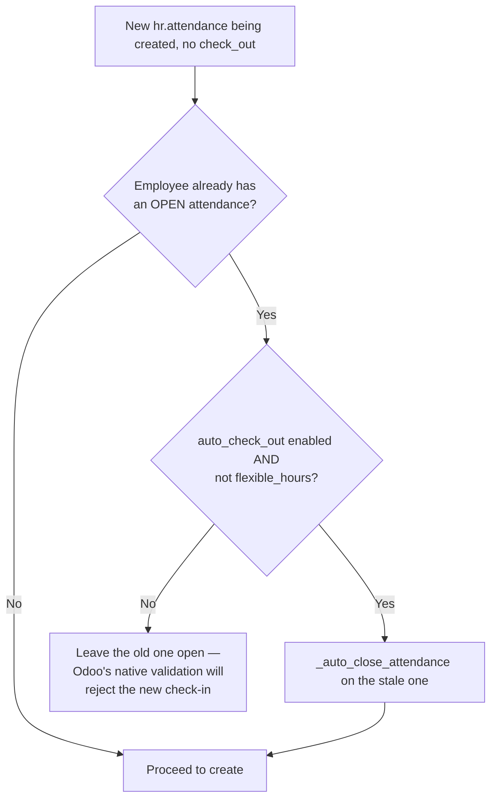
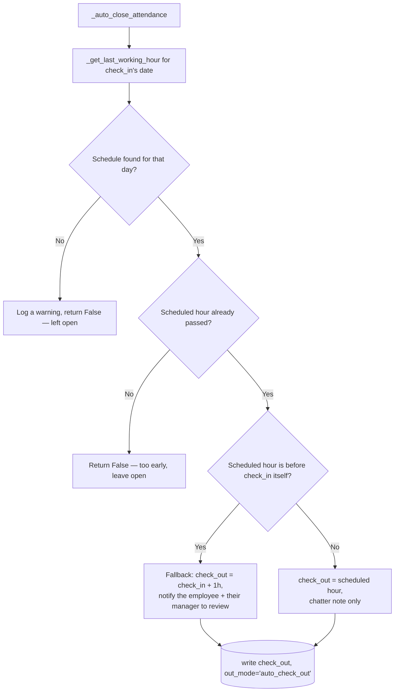

# Technical Reference: `hr.attendance` auto-checkout (EMS extension)

## Overview

`models/employees/employee_autocheckout.py` extends `hr.attendance` with two related behaviours: closing a **stale** open attendance the moment a new one is checked in (so Odoo's own "already checked in" block never fires for a forgotten previous day), and an EMS-specific nightly cron mode that closes any still-open attendance using the employee's **actual working schedule** for that day, instead of Odoo's native fixed-hours logic.

**Module file:** `models/employees/employee_autocheckout.py`

Both paths are gated by `res.company.auto_check_out` (native `hr_attendance` field) and only ever touch employees whose `resource_calendar_id.flexible_hours` is `False` — an employee on a flexible schedule is deliberately left to native Odoo behaviour.

---

## `create()` — closing a stale attendance before opening a new one

## `_auto_close_attendance()` — the shared close logic

`_get_last_working_hour(employee, work_date)` returns the end of the last stretch the employee was actually **expected** to work that day, as a naive UTC datetime — `None` if they have no calendar, never work that weekday, or an approved absence covers the whole of it.

**It asks the calendar what was expected; it does not read the raw weekly timetable** (changed 2026-09-08, when `hr_holidays` first made absences visible to Odoo — see [Staff absences](absence.md)). An approved absence becomes a `resource.calendar.leaves` row on the employee's own calendar, and Odoo's `hr.employee._get_expected_attendances()` already subtracts those (it calls `_work_intervals_batch` with `compute_leaves=True`). The earlier version filtered `resource_calendar_id.attendance_ids` by weekday and took the latest `hour_to`, which knew nothing about leave: a teacher who left at 14:00 with the afternoon approved off and forgot to check out had their attendance closed at 18:00, crediting four hours they had permission to miss. Only an **approved** absence counts — a request still awaiting its approver never becomes a resource leave, so it correctly changes nothing.

Both cases that yield `None` mean the same thing to the caller: there is no scheduled hour to close at, so the attendance is left open (with a `WARNING` in the log) for a human to correct. That is deliberate — inventing an end time for a day the employee was wholly on leave is exactly the behaviour this replaced. Covered by `TestEmployeeAutocheckout`.

## `_cron_auto_check_out()` — the nightly EMS mode

Delegates straight to Odoo's native `_cron_auto_check_out()` unless `res.company.auto_checkout_mode == 'ems'` (see [res.company](../settings/company.md)). When EMS mode is active:

1. Only runs inside the configured retry window (`auto_checkout_time` → `auto_checkout_retry_until`, wrapping past midnight if `start > end`) — a cron that runs more often than once a night would otherwise keep re-evaluating "not yet passed" attendances pointlessly.
2. Finds every open attendance across every employee (not just one), gated the same way as `create()`.
3. Calls `_auto_close_attendance()` per record inside a `try/except`, logging and skipping on error rather than letting one bad record abort the whole batch.

---

## Access Control

No EMS-specific `ir.model.access.csv` rows — inherits `hr_attendance`'s own access rules unchanged.

---

## Data/Config

| Field | Model | Purpose |
|-------|-------|---------|
| `auto_check_out` | `res.company` (native) | Master switch for both behaviours above |
| `auto_checkout_mode` | `res.company` (EMS) | `'native'` (default) or `'ems'` — selects which `_cron_auto_check_out()` logic runs |
| `auto_checkout_time` / `auto_checkout_retry_until` | `res.company` (EMS) | The nightly retry window |

See [res.company](../settings/company.md) and [res.config.settings](../settings/settings.md) for how these are exposed/activated (the `res.config.settings.set_values()` cron-activation logic documented there is the other half of this feature).
