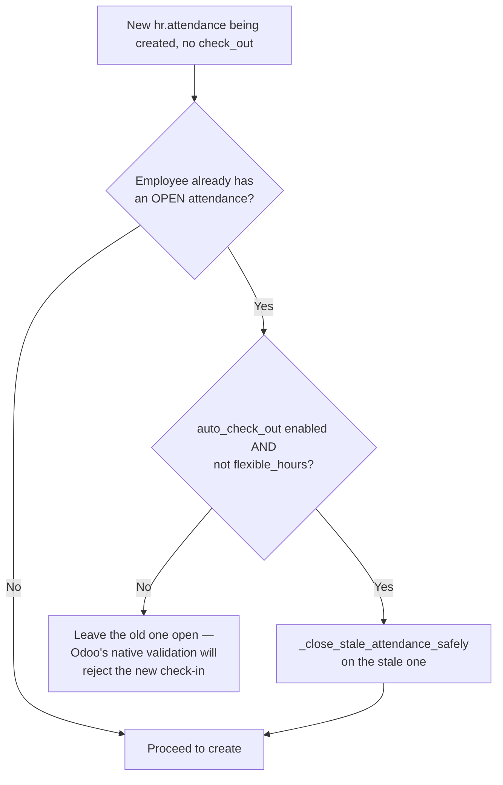
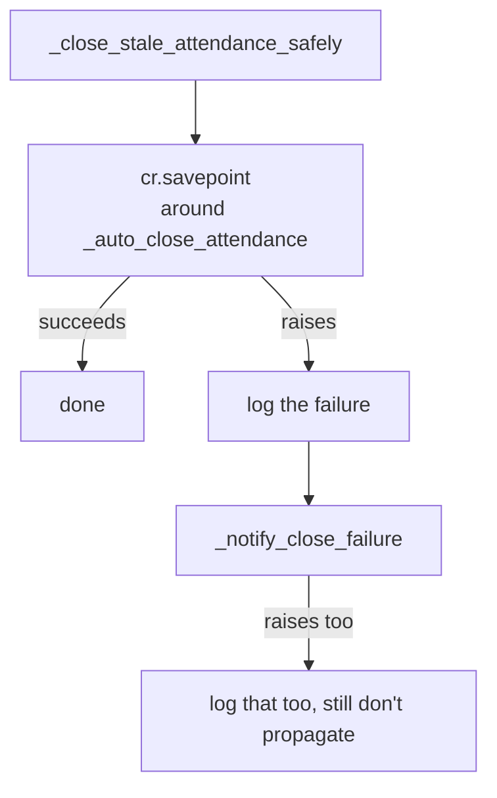
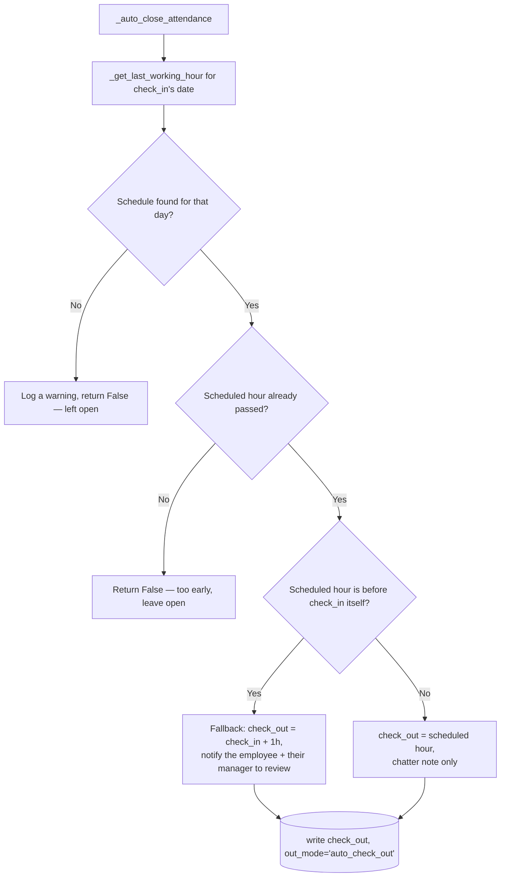

# Technical Reference: `hr.attendance` auto-checkout (EMS extension)

## Overview

`models/employees/employee_autocheckout.py` extends `hr.attendance` with two related behaviours: closing a **stale** open attendance the moment a new one is checked in (so Odoo's own "already checked in" block never fires for a forgotten previous day), and an EMS-specific nightly cron mode that closes any still-open attendance using the employee's **actual working schedule** for that day, instead of Odoo's native fixed-hours logic.

**Module file:** `models/employees/employee_autocheckout.py`

Both paths are gated by `res.company.auto_check_out` (native `hr_attendance` field) and only ever touch employees whose `resource_calendar_id.flexible_hours` is `False` — an employee on a flexible schedule is deliberately left to native Odoo behaviour.

---

## `create()` — closing a stale attendance before opening a new one

This is the **check-in-triggered backup** for the nightly cron below: if the cron missed a
run (a bug, a server restart mid-window, a misconfigured retry window), the very next time
that same employee checks in for real, the stale attendance gets a chance to close right
then — visibly, since a failure here surfaces through the *same* check-in request instead of
silently at 3am with nobody watching. It does **not** replace the cron: an employee who
doesn't come back soon (leave, absence, departure) still needs the cron as the only
mechanism that eventually corrects the data regardless of employee action.

## `_get_stale_attendance_domain()` / `_close_stale_attendance_safely()` — shared by both paths

`create()`'s per-employee lookup and the cron's company-wide one both build their search
from `_get_stale_attendance_domain()` (`create()` adds `('employee_id', '=', employee_id)`
on top; the cron uses it as-is) — the three eligibility conditions
(`check_out = False`, `company.auto_check_out = True`, `not resource_calendar_id.flexible_hours`)
are written in exactly one place.

Once a stale attendance is found, both paths hand it to `_close_stale_attendance_safely()`
rather than calling `_auto_close_attendance()` directly:

The `cr.savepoint()` is what actually isolates one bad record from whatever else is going
on in the same transaction: a bare `try/except` alone does **not** undo Postgres's own
"transaction aborted" state once a genuine DB-level error occurs — every subsequent
statement in that same run would fail too without it (this is exactly the blast radius the
microsecond bug below used to have, every single night).

## `_auto_close_attendance()` — the shared close logic

`_get_last_working_hour(employee, work_date)` returns the latest `hour_to` among that weekday's `resource_calendar_id.attendance_ids`, converted to a naive UTC datetime via `ems.datetime_utils` — `None` if the employee has no calendar or no slot that day.

## `_cron_auto_check_out()` — the nightly EMS mode

Delegates straight to Odoo's native `_cron_auto_check_out()` unless `res.company.auto_checkout_mode == 'ems'` (see [res.company](../settings/company.md)). When EMS mode is active:

1. Only runs inside the configured retry window (`auto_checkout_time` → `auto_checkout_retry_until`, wrapping past midnight if `start > end`) — a cron that runs more often than once a night would otherwise keep re-evaluating "not yet passed" attendances pointlessly.
2. Finds every open attendance across every employee (not just one) via `_get_stale_attendance_domain()`.
3. Hands each one to `_close_stale_attendance_safely()` — see above.

## `_notify_close_failure()` — telling someone, not just the log

Schedules a `mail.mail_activity_data_todo` activity for every user in `ems.group_academic_admin`.
Scheduled on `employee_id`, not on the attendance itself: `hr.attendance` only inherits
`mail.thread` (no `mail.activity.mixin`), while `hr.employee` already does.

**Known, accepted gap (2026-09, verified empirically, not chased further):** when this runs
*nested* inside the very `create()` call that goes on to raise its own native "already
checked in" validation right after — i.e. the failure is discovered during the *employee's
own* check-in attempt, which Odoo's own validation then blocks anyway — the scheduled
activity is not reliably kept; something in that specific combination (schedule an activity,
then have the *same* top-level ORM call fail right after) discards it. Calling this from the
cron's own loop (one call per record, never followed by a same-call failure) is unaffected.
Low impact either way: the underlying safety guarantee (the transaction never gets corrupted,
the stale attendance is never wrongly half-closed, the new check-in stays correctly blocked)
holds regardless — the same stuck attendance gets picked up by the next cron run or the
employee's next real check-in either way, just without that one immediate notification.

### The microsecond bug (issue #422, fixed 2026-09)

Odoo core's `hr.attendance._get_day_start_and_day()` computes a "day start" instant via `dt.replace(hour=0, minute=0, second=0)` — it never resets **microseconds**. A `check_in` stamped with `datetime.now()` (has microseconds, typical of any real kiosk/systray punch) and a `check_out` set to a "clean" value (no microseconds — typed by hand in the form, or computed by `_auto_close_attendance()`) on the **same calendar day** therefore produce two distinct day-start instants for the exact same date. `hr.attendance._update_overtime()` treats those as two different days to recompute, and both independently decide to `create()` a new `hr.attendance.overtime` row for the same `(employee_id, date)` — a self-collision against that table's own `UNIQUE(employee_id, date) WHERE NOT adjustment` index (`psycopg2.errors.UniqueViolation`).

This model's own override of `_get_day_start_and_day()` fixes it at the single source every write path (`create()`, `write()`, both crons, the native absence-detection cron) goes through: `day_start.replace(microsecond=0)`.

**Blast radius before the fix:** because the nightly cron processed every open attendance in one shared transaction without a savepoint, the first record to hit this bug poisoned the transaction for every attendance processed afterward in that same run — silently, every night, for as long as at least one stale open attendance's `check_in` happened to carry microseconds and land on the same calendar day as its computed `check_out`. See `migrations/18.0.0.23.6/post-migrate.py` for the one-off repair of the production data this left behind (stuck-open attendances, and attendances closed days late via a different-day kiosk badge-in, producing nonsensical multi-day `worked_hours`).

---

## Access Control

No EMS-specific `ir.model.access.csv` rows — inherits `hr_attendance`'s own access rules unchanged.

---

## Data/Config

| Field | Model | Purpose |
|-------|-------|---------|
| `auto_check_out` | `res.company` (native) | Master switch for both behaviours above |
| `auto_checkout_mode` | `res.company` (EMS) | `'native'` (default) or `'ems'` — selects which `_cron_auto_check_out()` logic runs |
| `auto_checkout_time` / `auto_checkout_retry_until` | `res.company` (EMS) | The nightly retry window |

See [res.company](../settings/company.md) and [res.config.settings](../settings/settings.md) for how these are exposed/activated (the `res.config.settings.set_values()` cron-activation logic documented there is the other half of this feature).
