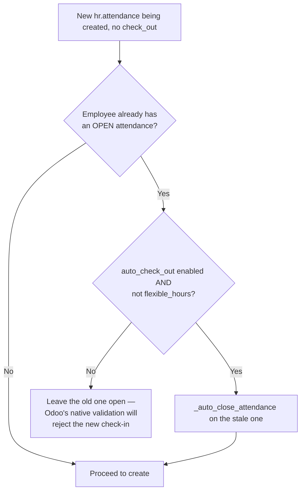
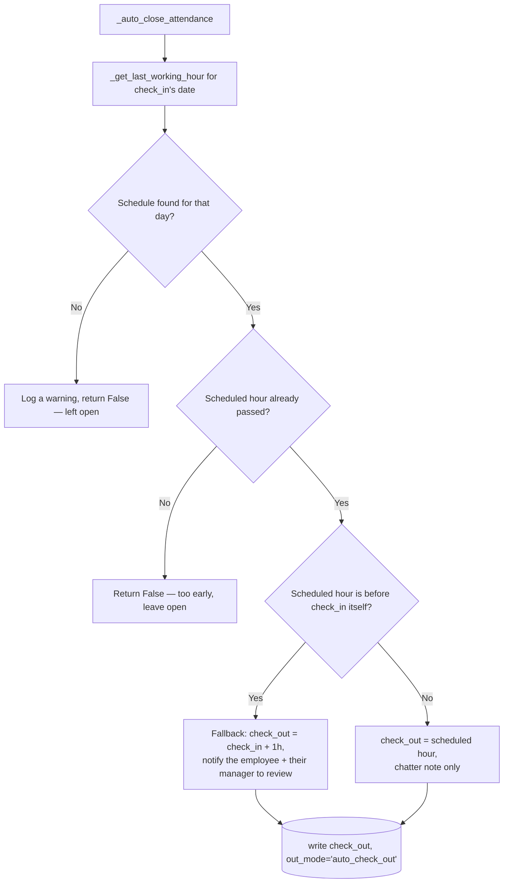

# Technical Reference: `hr.attendance` auto-checkout (EMS extension)

## Overview

`models/employees/employee_autocheckout.py` extends `hr.attendance` with two related behaviours: closing a **stale** open attendance the moment a new one is checked in (so Odoo's own "already checked in" block never fires for a forgotten previous day), and an EMS-specific nightly cron mode that closes any still-open attendance using the employee's **actual working schedule** for that day, instead of Odoo's native fixed-hours logic.

**Module file:** `models/employees/employee_autocheckout.py`

Both paths are gated by `res.company.auto_check_out` (native `hr_attendance` field) and only ever touch employees whose `resource_calendar_id.flexible_hours` is `False` — an employee on a flexible schedule is deliberately left to native Odoo behaviour.

---

## `create()` — closing a stale attendance before opening a new one

## `_auto_close_attendance()` — the shared close logic

`_get_last_working_hour(employee, work_date)` returns the latest `hour_to` among that weekday's `resource_calendar_id.attendance_ids`, converted to a naive UTC datetime via `ems.datetime_utils` — `None` if the employee has no calendar or no slot that day.

## `_cron_auto_check_out()` — the nightly EMS mode

Delegates straight to Odoo's native `_cron_auto_check_out()` unless `res.company.auto_checkout_mode == 'ems'` (see [res.company](../settings/company.md)). When EMS mode is active:

1. Only runs inside the configured retry window (`auto_checkout_time` → `auto_checkout_retry_until`, wrapping past midnight if `start > end`) — a cron that runs more often than once a night would otherwise keep re-evaluating "not yet passed" attendances pointlessly.
2. Finds every open attendance across every employee (not just one), gated the same way as `create()`.
3. Calls `_auto_close_attendance()` per record inside its own `cr.savepoint()`, itself inside a `try/except` — logging, notifying the Academic Admins (`_notify_close_failure()`), and skipping on error. The savepoint is what actually isolates one bad record from the rest of the batch: a bare `try/except` alone does **not** undo Postgres's own "transaction aborted" state once a DB-level error occurs mid-loop, so every attendance processed *after* the first failure would silently fail too without it (see the bug below).

### The microsecond bug (issue #422, fixed 2026-09)

Odoo core's `hr.attendance._get_day_start_and_day()` computes a "day start" instant via `dt.replace(hour=0, minute=0, second=0)` — it never resets **microseconds**. A `check_in` stamped with `datetime.now()` (has microseconds, typical of any real kiosk/systray punch) and a `check_out` set to a "clean" value (no microseconds — typed by hand in the form, or computed by `_auto_close_attendance()`) on the **same calendar day** therefore produce two distinct day-start instants for the exact same date. `hr.attendance._update_overtime()` treats those as two different days to recompute, and both independently decide to `create()` a new `hr.attendance.overtime` row for the same `(employee_id, date)` — a self-collision against that table's own `UNIQUE(employee_id, date) WHERE NOT adjustment` index (`psycopg2.errors.UniqueViolation`).

This model's own override of `_get_day_start_and_day()` fixes it at the single source every write path (`create()`, `write()`, both crons, the native absence-detection cron) goes through: `day_start.replace(microsecond=0)`.

**Blast radius before the fix:** because the nightly cron processed every open attendance in one shared transaction without a savepoint, the first record to hit this bug poisoned the transaction for every attendance processed afterward in that same run — silently, every night, for as long as at least one stale open attendance's `check_in` happened to carry microseconds and land on the same calendar day as its computed `check_out`. See `migrations/18.0.0.23.6/post-migrate.py` for the one-off repair of the production data this left behind (stuck-open attendances, and attendances closed days late via a different-day kiosk badge-in, producing nonsensical multi-day `worked_hours`).

---

## Access Control

No EMS-specific `ir.model.access.csv` rows — inherits `hr_attendance`'s own access rules unchanged.

---

## Data/Config

| Field | Model | Purpose |
|-------|-------|---------|
| `auto_check_out` | `res.company` (native) | Master switch for both behaviours above |
| `auto_checkout_mode` | `res.company` (EMS) | `'native'` (default) or `'ems'` — selects which `_cron_auto_check_out()` logic runs |
| `auto_checkout_time` / `auto_checkout_retry_until` | `res.company` (EMS) | The nightly retry window |

See [res.company](../settings/company.md) and [res.config.settings](../settings/settings.md) for how these are exposed/activated (the `res.config.settings.set_values()` cron-activation logic documented there is the other half of this feature).
