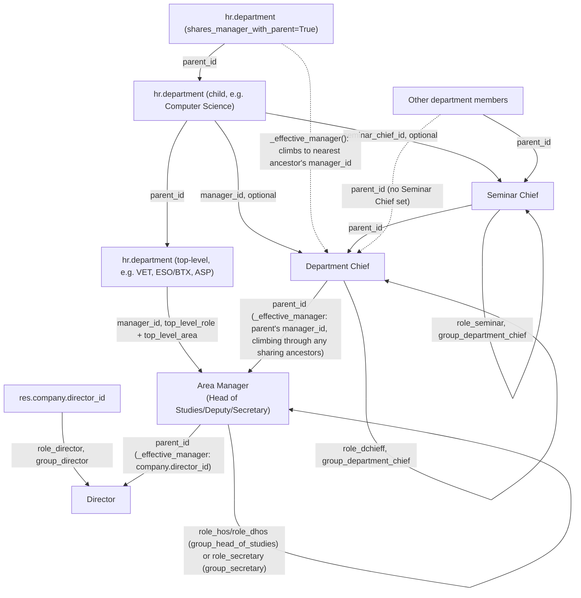
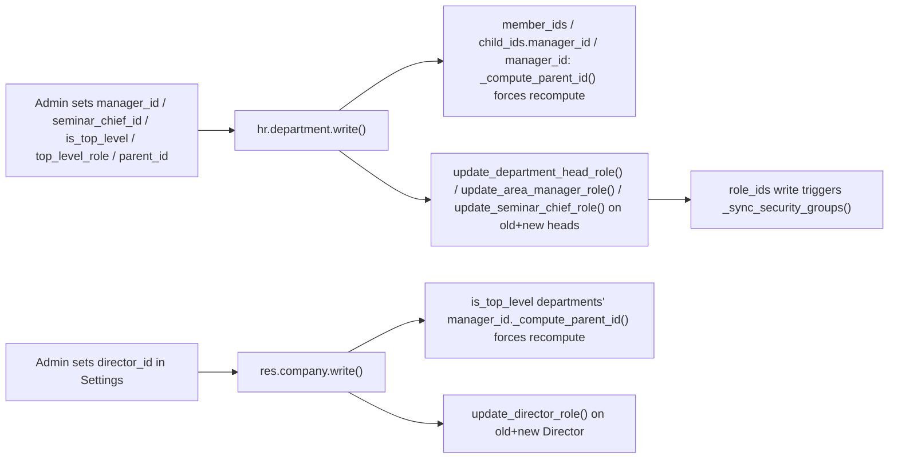

# Technical Reference: Department Chief / Seminar Chief / Head of Studies / Director Cascade

## Overview

`hr.department` (extended by `models/employees/department.py`) is the single source of truth for a department's chain of command: its native `manager_id` field is used as the **Department Chief** (optional — a regular department can be left with no Chief, e.g. mid course-transition when the outgoing Chief has been removed but a replacement hasn't been assigned yet; see point 7 below), and a new `seminar_chief_id` field (Many2one to `hr.employee`, optional) is the **Seminar Chief**. A department can also be marked `is_top_level`: it then has no `parent_id`, no `seminar_chief_id`, and `manager_id` is relabelled **Area Manager** and holds `role_hos`, `role_dhos` or `role_secretary` instead of `role_dchieff` (selected via `top_level_role` — "Head of studies", "Deputy head of studies" or "Secretary" — constrained by `top_level_area`: `hos`/`dhos` require `top_level_area = 'academic'`, `secretary` requires `top_level_area = 'asp'`, so an Academic top-level department can never pick "Secretary" and vice versa). A regular (non-top-level) department can instead be marked `shares_manager_with_parent`: it then has no `manager_id` of its own, and every member (including its own children's Chiefs) uses the nearest ancestor department's Manager instead — see `_effective_manager()` below. Above all departments, `res.company.director_id` (Ajustes/Settings > EMS Management, not any department form — deliberately: a fake global department to hold the Director was considered and rejected, see `models/settings/company.py`) is the **Director**, holding `role_director`. From these fields, EMS derives:

- Every other member's `hr.employee.parent_id` ("Manager"), including a cascade **between** departments (a department's own Chief/Area Manager gets their own Manager set to the parent department's Manager) and from the top-level departments up to the Director.
- The `role_dchieff` ("Department chieff") / `role_seminar` ("Seminar leader") / `role_hos` ("Head of studies") / `role_dhos` ("Deputy head of studies") / `role_secretary` ("Secretary") / `role_director` ("Director") entries in `role_ids`, and (via the existing `_sync_security_groups()` mechanism — see [Academic role hierarchy](role_hierarchy.md)) `group_department_chief`/`group_head_of_studies`/`group_secretary`/`group_director` membership. Note `role_secretary`'s group (`group_secretary`) belongs to a *separate* permission block (Secretary), independent from the Academic chain the other top-level roles feed into — see [Academic role hierarchy](role_hierarchy.md) for how the blocks stay independent.

All of these are computed, never editable by hand from the employee form — they must be set on the department's own form (Chief/Seminar Chief/Area Manager) or in Settings (Director).

## Cascade rules

0. **The Director (`res.company.director_id`) always has `parent_id` cleared, unconditionally, before any other rule below is even considered** — checked via `employee.directed_company_ids` at the very start of `_compute_parent_id()`'s per-employee loop. The Director sits above the whole hierarchy by definition; this is what makes it impossible for a Department Chief, Seminar Chief, or Area Manager to ever outrank them, even when the Director is merely a plain (non-heading) `department_id` member of some department — the case that motivated this rule (Issue #416: a real Director nominally belonged to a department chiefed by someone else, and rule 1 below was silently assigning that Chief as the Director's own Manager). `res.company.write()` force-recomputes `_compute_parent_id()` for the (old|new) Director explicitly when `director_id` changes, mirroring the existing forced recompute for `is_top_level` departments' own managers just above it in that method — needed because this compute only `@api.depends` on `department_id`, which doesn't change just because `director_id` did.
1. Every member of the department, **except its own Chief/Area Manager**, gets `parent_id` = the department's `seminar_chief_id` (or `manager_id` directly if no `seminar_chief_id` — see rule 5).
2. The Seminar Chief's own `parent_id` = the department's `manager_id` (Department Chief).
3. **Anyone who chiefs *any* department** (`headed_department_ids` non-empty — Department Chief of a regular department, or Area Manager of a top-level one) is excluded from every *other* department's own intra-cascade entirely, including their own nominal `department_id` if it differs from what they head (e.g. an employee nominally in "Computer Science" who actually heads "VET" — see the worked example in `role_hierarchy.md`/the admin manual). Their own `parent_id` instead comes from rule 4.
4. **Cross-department cascade**, resolved via `hr.department._effective_manager()`:
   - **4a.** A department's own Chief/Area Manager gets `parent_id` = the *parent* department's effective Manager — the parent's own `manager_id` if set, otherwise (when the parent itself has `shares_manager_with_parent` set) climbing further up the ancestor chain until a department with its own `manager_id` is found, or a top-level department is reached.
   - **4b.** If the department at which the climb ends is itself top-level (no parent by definition), `parent_id` = `res.company.director_id` instead, if set.
   - **Self-reference guard:** at every step, a candidate is only used if it is not the employee themselves — this applies uniformly whether the candidate comes from a parent's `manager_id`, a climbed ancestor's `manager_id`, or `company.director_id` (e.g. the same teacher can validly be both a top-level Area Manager and the Chief of one of that area's own child departments — without this guard, `_effective_manager()` would resolve back to themselves and `parent_id` would self-reference).
   - If none of the above applies (no parent chief anywhere up the chain, not top-level with a Director set, or every candidate found is the employee themselves), `parent_id` is cleared.
5. A department with no `seminar_chief_id` falls back to `parent_id` = `manager_id` directly for every other member — the Seminar Chief level is simply skipped, it is never left unset.
6. If `manager_id` and `seminar_chief_id` happen to be the same employee, that employee is caught by rule 3 first and never reaches the seminar-chief branch — no self-referencing `parent_id` is possible.
7. **`manager_id` and `seminar_chief_id` can only be a real member of staff** (`employee_type` in `('teacher', 'asp')`) — enforced by a `domain` on both fields (view-level convenience, filters the selection dropdown) and, for real enforcement against RPC/import/`odoo shell` bypasses, an `@api.constrains('manager_id', 'seminar_chief_id')` (`_check_head_employee_type`, `models/employees/department.py`). Added after Issue #416 found the technical `hr.employee` backing the superuser account (`employee_type` left at Odoo's own stale native default, not even in EMS's `('asp', 'teacher')` selection) was selectable — and had actually been picked — as a Department Chief. The constrain is safe to add without a migration: it only fires on a future `create()`/`write()` of these two fields, never retroactively against already-existing rows, so it can't fail `./upgrade.sh` over data that predates it — it just blocks the *next* attempt to (re)save a bad value. Both `teacher` and `asp` are allowed everywhere this domain applies, including a top-level department's own "Area Manager" (Secretary role) — nothing in the codebase actually requires an ASP-area manager to be `employee_type='asp'` specifically, so restricting the domain to `teacher` only would have been an unjustified extra restriction.
8. `manager_id` is **not required** for a regular (non-top-level) department, at either the view or the model level — a Department Chief can be removed and the form saved with none, and `_effective_manager()` already tolerates this by design (rule 4's own "if none of these applies" branch, above, returns an empty recordset rather than erroring). This was a deliberate change (Issue #416): an earlier version of this view *did* mark `manager_id` required (`views/community/department/form.xml`, `required="not is_top_level and not shares_manager_with_parent"`) once a department wasn't sharing its Manager with a parent — but that blocked a real, legitimate case: mid course-transition, an admin removing an outgoing Chief before a replacement is assigned, with no ORM/model-level barrier ever actually requiring one (several pre-existing departments already had no `manager_id` for the same reason the old comment gave: they predate this feature, and a DB-level constraint would have failed the module upgrade for them). The `required` attribute was removed instead of narrowed further, since the model was already designed to leave the gap "for an admin to configure" rather than to error. **Only the top-level department's own `manager_id` instance (relabelled "Area Manager" further down the same form, rule 9 below) is still required** — that one was never part of this change.
9. A top-level department (`is_top_level`) cannot have a `parent_id`, a `seminar_chief_id`, or `shares_manager_with_parent` set — enforced by an onchange (clears all three when checked, mirroring `ems.group`'s `_onchange_group_type`), a `write()`/`create()` sanitize (real guarantee against RPC/import bypass, mirroring `_sanitize_group_type_vals`), and a backstop `@api.constrains` (mirroring `_check_group_type_fields`). The constrain deliberately does **not** require `top_level_role`/`top_level_area` when `is_top_level` is set — `data/custom/hr.department.csv` seeds the three known top-level departments with `is_top_level=1` and no `manager_id`/`top_level_role` (set manually via the UI post-deploy, same precedent as `seminar_chief_id`), but with `top_level_area` pre-filled (VET/ESO-BTX = `academic`, ASP = `asp`) since that value is intrinsic to what the department *is*, not to who currently manages it.
10. **`shares_manager_with_parent`** (regular, non-top-level departments only): a department with no Chief of its own — every member, and any of its own children's Chiefs, uses `_effective_manager()`'s climb instead (rule 4a). Requires a `parent_id` (there is nothing to share with otherwise) and excludes `manager_id` in the same record — enforced by the same onchange/sanitize/constrain triple as rule 9. The climb can span multiple levels: a department can share with a parent that *also* shares with its own parent, and so on, up to the nearest department (or top-level department / Director) that actually has a Manager set.

## CRUD flow

- **`hr.department._effective_manager()`** (`models/employees/department.py`) is the single helper that resolves rule 4's climb: starting at a department, it returns `manager_id` if set, else `company_id.director_id` if the department is top-level, else — if `shares_manager_with_parent` is set — recurses onto `parent_id`; otherwise returns an empty recordset (nothing to infer, left for an admin to configure). A `seen` recordset guards against revisiting a department, purely defensive — Odoo's own `parent_id` recursion constrain already prevents a genuine cycle through normal writes.
- **`hr.employee._compute_parent_id`** (`models/employees/employee.py`, overriding the native `hr.employee.base` compute) implements rules 1–6 above, `@api.depends('department_id')`, calling `_effective_manager()` for every cross-department candidate (both the "headed department" branches and the regular-member branch) and applying the `candidate != employee` self-reference guard uniformly to each one. Because it depends only on `department_id`, Odoo automatically re-triggers it whenever an employee's own `department_id` changes — no extra code needed on that side. Every branch explicitly (re)assigns `parent_id`, including to `False`/an empty recordset when no rule applies — a stale value from a *previous* cascade state must be cleared, not silently kept, when an employee transitions (e.g. into heading a top-level department with no parent above it).
- **`hr.department.write()`/`create()`** (`models/employees/department.py`) detects a change to `manager_id`/`seminar_chief_id`/`parent_id`/`is_top_level`/`top_level_role`/`shares_manager_with_parent` and explicitly forces a recompute of `_compute_parent_id()` on every employee attached (as `department_id`, as a Chief, or as a Seminar Chief) to **the whole descendant subtree** (`search([('id', 'child_of', self.id)])`), not just direct children — needed because a `shares_manager_with_parent` chain can span multiple levels, so a change several levels up can affect a department several levels down. It also updates roles on the union of the old and new Chief/Seminar Chief (so a person who stops heading *this* department but still heads *another* one keeps the role — none of `role_dchieff`/`role_seminar`/`role_hos`/`role_dhos` are unipersonal *per department*; `role_hos`/`role_dhos` remain globally unipersonal via `ems.role.check_limit()`, unchanged). This is also what demotes the previous holder of a role when a department is reassigned to someone else.
- **`hr.employee.update_department_head_role()`** adds/removes `role_dchieff` based on `headed_department_ids` **excluding** top-level ones (a top-level Chief never gets `role_dchieff`).
- **`hr.employee.update_seminar_chief_role()`** adds/removes `role_seminar` based on `seminar_department_ids`, unchanged.
- **`hr.employee.update_area_manager_role()`** adds/removes `role_hos`/`role_dhos`/`role_secretary` based on `headed_department_ids.filtered('is_top_level')` and each one's `top_level_role` — a single method covering all three options (renamed from `update_head_of_studies_role()` when `role_secretary` was added as a third option, since it's no longer specific to Head of Studies).
- **`hr.employee.update_director_role()`** adds/removes `role_director` based on `directed_company_ids` (One2many inverse of `res.company.director_id`, same pattern as `headed_department_ids`).
- **`res.company.write()`** (`models/settings/company.py`) mirrors `hr.department.write()`'s pattern for `director_id`: forces a recompute of every `is_top_level` department's `manager_id._compute_parent_id()` for that company (rule 4b), forces the same recompute on the (old|new) Director employee's own record (rule 0 — needed for the same reason, `_compute_parent_id` doesn't `@api.depends` on anything company-related), and calls `update_director_role()` on the union of the old and new Director. Exposed via Ajustes/Settings > EMS Management > Center Data (`models/settings/settings.py`'s related field + `views/settings/form.xml`'s `ems_email_settings` block), the same mechanism already used for `current_course_id`/`default_schedule_framework_id` — no fake "Direction" department, and no `create()` override (a second `res.company` is never created in practice; single-company deployment).
- **`hr.employee._onchange_role_ids`** blocks manual add *and* remove of `role_dchieff`/`role_seminar`/`role_hos`/`role_dhos`/`role_secretary`/`role_director` from the employee form (reverts + shows a warning either way), the same UI-level enforcement already used for `role_tutor`. **Behavioural change:** `role_hos`/`role_dhos`/`role_director` used to be manually assigned by an admin (see `role_hierarchy.md`), and `role_secretary` used to be a freely, non-unipersonal assignable role — they all now become fully department/Settings-driven, exactly like `role_dchieff` before them; no role in this chain remains manually assignable. If someone already holds one of these roles today without being linked to the corresponding department/company, that assignment sits untouched until their `role_ids` is next edited in the UI, at which point it's reverted — audit `ems.role.employee_ids` for these roles around deploy time (in particular: `role_secretary` was not unipersonal before this change, so multiple pre-existing holders are possible — check for that specifically before someone edits their `role_ids` and unexpectedly hits the new unipersonal constraint).

## Access control

| Model | Group | Access |
|-------|-------|--------|
| `hr.department` | `group_academic_admin` | Full CRUD |
| `hr.department` | `group_teacher`, `group_secretary` | Read-only |
| `hr.employee` | `group_academic_admin` | Full CRUD |
| `hr.employee` | `group_teacher` | Read-only |
| `res.company.director_id` (via Settings) | `base.group_system` (reached here only through `ems.group_settings_admin`/root) | Read/write |

`group_academic_admin` can set the department-level fields, so that part of the feature has a single operating role (see the admin user manual, `docs/en/admin/teacher-roles.md`). **`director_id` is a deliberate exception:** it lives on `res.config.settings`/`res.company`, gated by Odoo's native Settings access (`base.group_system`, granted in this module only via `ems.group_settings_admin` or root/admin) — a *different*, independent permission from `group_academic_admin`. Someone with full academic control is not guaranteed Settings access; this mismatch was raised with and accepted by the developer rather than widening either group's `implied_ids` as part of this feature.

## Display color (`custom_color`)

`hr.department` also carries `custom_color` (`Char`, hex), a free-pick display color shown on the department's own form/list/kanban — added *alongside* Odoo's native `color` (`Integer`) rather than replacing it, since the native field still drives the kanban's `highlight_color` card-tinting mechanism and other installed modules may assume it stays an `Integer`. See [Free-pick color widget](../shared/color_widget.md) for the full rationale and how the other two color-picking models (`ems.role`, `ems.attendance_template`) differ from this one (they own their field outright and converted it in place).

## Known limitations

- No automatic backfill: existing departments keep `seminar_chief_id` empty, and some predate this feature with no `manager_id` either, until an admin opens the form and sets one — nothing forces this anymore (see point 7 above). All three known top-level departments (VET, ESO/BTX, ASP) are seeded with `is_top_level=1` and `top_level_area` but no `manager_id`/`top_level_role` — set manually post-deploy. `director_id` similarly starts empty — no employee is seeded as Director. `shares_manager_with_parent` defaults to unset for every existing department (an explicit opt-in, never inferred from an empty `manager_id` — see below).
- If an employee heads more than one department whose parents have different Managers, rule 4a's "last one wins" (iteration order) — acceptable since none of these roles are unipersonal per department.
- `role_secretary` was changed from non-unipersonal to unipersonal (`data/cat/ems.role.csv`) as part of adding it to `top_level_role` — there is only ever one ASP Area Manager centre-wide. Confirmed safe at the time of writing (only one existing holder in the working database), but worth a quick check (`ems.role.employee_ids` for `role_secretary`) before deploying to any other environment.
- **`shares_manager_with_parent` is an explicit flag, not an implicit fallback:** a department with no `manager_id` and `shares_manager_with_parent` unset simply leaves its members' `parent_id` unset (rule 4's "if none of the above applies" branch) — it does **not** silently climb to the parent's Manager. This was a deliberate design choice over the alternative (inferring "no manager set" as "share with parent" automatically): the explicit flag disambiguates "not yet configured, needs an admin to set a Chief" from "deliberately structured to have no Chief of its own," and pairs naturally with `_effective_manager()`'s cycle guard.
- The self-reference guard in `_effective_manager()`/`_compute_parent_id()` was added after a real production case: the same teacher was both a top-level department's Area Manager and the Department Chief of one of that area's own child departments, which (before the fix) resolved their own `parent_id` back to themselves. The fix applies the `candidate != employee` check uniformly to every candidate source, not only the Director one.
