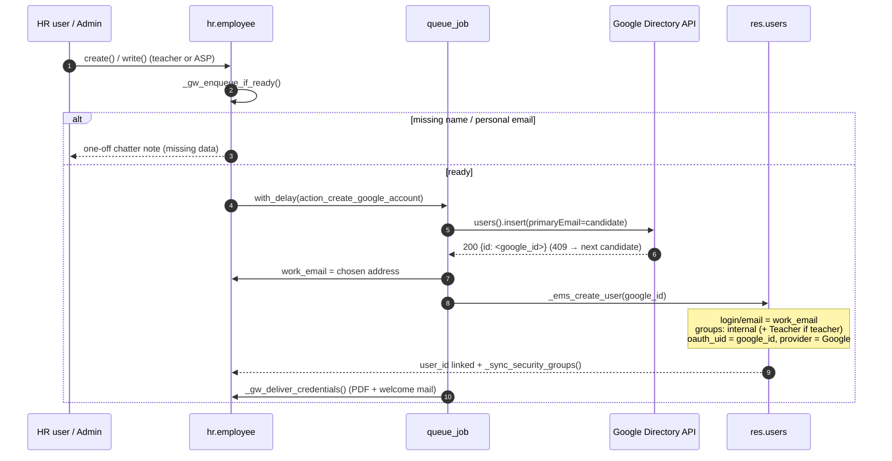
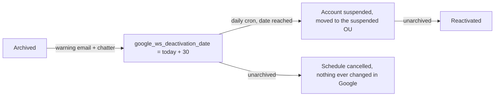
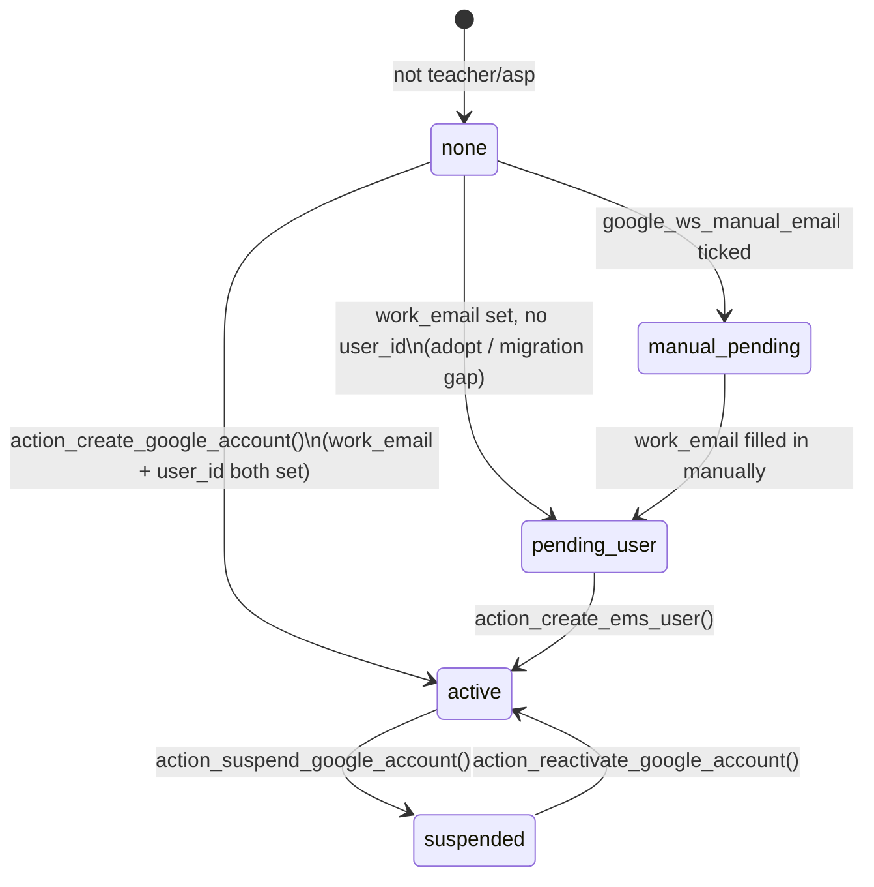

# Google Workspace staff integration & EMS user auto-creation

Automates the two accounts every staff member (teacher / ASP) needs:

1. **Corporate Google Workspace account** (issue 304) — created through the Admin SDK
   Directory API; the resulting address is stored in `work_email`.
2. **EMS user** (`res.users`, issue 342) — created right after the Google account, with
   login = corporate email and Google OAuth **pre-linked** (`oauth_uid` = the numeric
   Google user id returned by the Directory API), so staff sign in with the
   *Sign in with Google* button without ever receiving a password email.

Both live in `models/employees/google_workspace_integration.py`
(`HrEmployeeGoogleWorkspace`, `_inherit = 'hr.employee'`), with shared helpers in
[`google.workspace.mixin`](../shared/google_workspace_mixin.md).

## Flow



### `_ems_create_user(google_id=False)`

Idempotent; everything runs `sudo()` (callers are queue jobs or buttons limited to
`ems.group_academic_admin` / `hr.group_hr_user`). In order:

1. Guard: `employee_type in ('teacher', 'asp')` and `work_email` ends with the
   corporate domain — otherwise no-op.
2. Employee already has `user_id` → only backfill the OAuth fields if empty
   (and the `(provider, oauth_uid)` pair is free).
3. A `res.users` with `login = work_email` exists (archived included) and is not
   linked to another employee → re-link: unarchive, realign `login`/`email` to the
   corporate address, add missing groups, backfill OAuth. Linked to another
   employee → skip with a chatter note.
4. Otherwise create the user: `login`/`email` = corporate address (load-bearing —
   see *pitfalls*), `firstname`/`lastname` from `_gw_split_name()` (res.users
   inherits res.partner, which uses OCA `partner_firstname`), `mobile`, `tz`,
   explicit `company_id`/`company_ids` and groups, all under
   `no_reset_password=True`.
5. `_ems_link_google_signin(user, google_id)` sets `oauth_uid` + `oauth_provider_id`
   when the id is known and not taken by another user (auth_oauth unique constraint).
6. Link `employee.user_id`, call `_sync_security_groups()` so role/job-mapped
   groups apply immediately (the `write()` trigger only fires on
   `role_ids`/`job_id`/`tutorship_ids`), and post a chatter summary
   (created/re-linked + whether Google sign-in was pre-linked).

Call sites inside `action_create_google_account()`:

- **Success path** — right after `work_email` is written, before
  `_gw_deliver_credentials()`, with the `id` from the `users().insert` response.
- **Adopt path** (employee already had a corporate `work_email`, e.g. manual email or
  data migrated from before the integration) — delegates to `action_create_ems_user()`
  (below) instead of calling `_ems_create_user` inline, so the same code runs whether
  it is reached automatically or by the user pressing the dedicated button.

### `action_create_ems_user()`

Public action (no Google API call): `_ems_create_user(google_id=self._gw_google_user_id())`,
guarded by the same `employee_type`/`work_email` checks. This is the header button shown
in the `pending_user` state (below) — a corporate account already exists but no `res.users`
is linked yet — and it is what `action_create_google_account()`'s adopt path now calls
internally, so there is a single implementation either way.

In **dry-run** (`company.google_ws_dry_run`) no API call is made, so there is no
Google id: the EMS user is created without OAuth fields.

### `action_relink_google_signin()`

Repairs "Sign in with Google" for an employee who **already has** an EMS user whose
OAuth fields were lost (`oauth_uid` / `oauth_provider_id` emptied by hand, by a bad
import, or by a partial restore). Without them the user cannot log in at all:
`auth_oauth` matches an incoming login exclusively by `(oauth_uid,
oauth_provider_id)`, and its fallback path (`signup`) fails because the login already
exists — so Google answers correctly and Odoo still returns *Access Denied*. There is
no e-mail-based fallback.

The action resolves the numeric Google id through the Directory API
(`_gw_google_user_id(raise_on_error=True)`) and hands it to the same
`_ems_link_google_signin()` used by the creation paths, so there is one implementation
of the link itself. It never overwrites a link that is already there — the button is
hidden in that case — and it never touches the Google account.

Unlike the automatic paths, every failure is raised instead of swallowed: pressing a
button and getting no feedback is worse than an error message. `_gw_google_user_id()`
therefore takes a `raise_on_error` flag (default `False`, preserving the silent
behaviour the queue jobs rely on) and, when set, reports dry-run and API failure as
distinct errors. It deliberately does **not** try to tell "no such account" from
"account outside my scope": the service-account role is scoped to the managed OUs and
Google answers **403, not 404**, for anything outside them, so the two are not
reliably distinguishable from the response — the message names both causes instead. A
`oauth_uid` already claimed
by a different `res.users` (the `auth_oauth` unique constraint) is reported naming
that user, since the fix there is to clear the stale record first.

## Lifecycle

Archiving a member of staff does **not** suspend the Google account straight away. It opens
a 30-day grace period (issue #388): the account keeps working, a warning email goes out,
and a daily cron does the actual suspension once the date arrives. The EMS user, in
contrast, is still archived immediately — losing Odoo access is the point of archiving, and
it is reversible.



| Employee event | Google account | EMS user (`res.users`) |
|---|---|---|
| Created / completed (ready) | created (queued) | created + OAuth pre-linked |
| Archived (`active = False`) | **nothing yet**: `google_ws_deactivation_date` set to today + `GW_DEACTIVATION_DELAY_DAYS`, warning email sent, chatter note posted | archived immediately (`_ems_sync_user_active`) |
| Deactivation date reached (daily cron) | suspended, moved to suspended OU (queued) | unchanged (already archived) |
| Unarchived before the deactivation date | schedule cancelled; the account was never touched | unarchived |
| Unarchived while suspended | reactivated (queued) | unarchived |
| Deleted (`unlink`) | suspended synchronously | archived |

Unlike the student side, staff accounts are **never deleted** — the issue only asks for
deletion of student accounts. `GW_DELETION_DELAY_DAYS` and `action_delete_google_account()`
exist only on `res.partner`.

The delay is a fixed constant in `models/shared/google_workspace_mixin.py`
(`GW_DEACTIVATION_DELAY_DAYS`, 30), not a company setting.

### The daily cron

`ems.ir_cron_gw_staff_lifecycle` (`data/main/ir_cron_google_workspace.csv`) runs
`hr.employee._gw_cron_process_lifecycle()` once a day, searching with `active_test=False`
(every candidate is archived by definition) and enqueuing the existing
`action_suspend_google_account` job rather than calling the Directory API itself:

```python
[('active', '=', False), ('google_ws_deactivation_date', '<=', today),
 ('google_ws_suspended', '=', False), ('work_email', '!=', False)]
```

### `unlink()` keeps suspending synchronously

A hard delete leaves no record to hold `google_ws_deactivation_date`, so there would be
nothing for the cron to find later — and it is not the archive path the grace period is
about. It therefore keeps suspending immediately, exactly as before.

### The warning email

`ems.mail_template_google_deactivation_employee`
(`data/main/mail.template-google_lifecycle.csv`) is sent once, when the schedule is
created, to **both** `private_email` and `work_email`: the corporate mailbox is still alive
during the grace period and is the one actually read day to day. An employee with neither
address gets the chatter note only.

The user archiving is deliberately **synchronous and independent** of
`google_ws_enabled` and of the job queue: a former employee must lose Odoo access
immediately even if the Google integration is disabled or the queue is down.
`_ems_sync_user_active` skips `self.env.user` and the superuser.

## Header button state (`google_ws_state`)

The employee form (`views/community/employee/form.xml`) shows at most **one** of four
mutually-exclusive header buttons, driven entirely by one computed, stored `Selection`
field — `google_ws_state` — instead of each button evaluating its own combination of
`work_email`/`user_id`/`google_ws_suspended`/`google_ws_manual_email`. This replaced an
earlier version where two independently-computed `invisible` expressions could disagree
and show two buttons at once for a teacher whose account was adopted from
pre-integration/migrated data (`work_email` set, `user_id` not yet linked) — the bug that
motivated the consolidation.



| `google_ws_state` | Header button shown | Meaning |
|---|---|---|
| `none` | Create Google account | No corporate email yet |
| `manual_pending` | *(none)* | `google_ws_manual_email` ticked, waiting for the email to be typed in |
| `pending_user` | Create EMS User | Corporate email exists, no `res.users` linked (adopt / migration gap) |
| `active` | Suspend Google account (+ Re-link Google sign-in when `google_signin_missing`) | Fully set up |
| `suspended` | Reactivate Google account | `google_ws_suspended = True` |

The one button that is **not** part of that mutually-exclusive set is **Re-link Google
sign-in**, driven by its own non-stored computed boolean, `google_signin_missing`
(`google_ws_state == 'active'` and the linked user has no `oauth_uid`). It is a repair
offered *alongside* Suspend rather than another state of its own: the account is
genuinely active and fully set up, only the sign-in link is broken, so hiding Suspend
while it shows would misrepresent the account. The compute reads `user_id.oauth_uid`
through `sudo()` — an `hr.group_hr_user` who is not an Odoo administrator cannot read
`res.users` OAuth fields, and the button must still render for them.

`res.partner` (students) has the analogous `google_ws_state` in
`models/contacts/google_workspace_integration.py` — see
[Google Workspace student integration](../contacts/google_workspace_student.md) — with
only three values (`none` / `active` / `suspended` — students never get a `pending_user`
state since account creation there never involves a separate `res.users`).

A one-off migration (`migrations/18.0.0.22.0/post-migrate.py`,
`_backfill_google_ws_suspended`) marks `google_ws_suspended = True` for employees/students
that were already archived/withdrawn before the field existed (added in 18.0.0.19.0 /
18.0.0.19.2), so they land in `suspended` instead of the wrong `active` state.

## Access control

| Action | Who |
|---|---|
| Create employee / trigger account creation (buttons, incl. `action_create_ems_user`) | `ems.group_academic_admin`, `hr.group_hr_user` |
| Auto-created user groups (teacher) | `base.group_user` + `ems.group_teacher` |
| Auto-created user groups (ASP) | `base.group_user` only (role/job sync adds the rest) |
| res.users creation itself | `sudo()` inside the flow |

`ems.group_teacher` does **not** imply `base.group_user`, so the internal-user group
is granted explicitly.

## Required fields

| Step | Required data |
|---|---|
| Plain employee creation | `name` (plus `private_email` at view level for **new** teacher/ASP records) |
| Google account creation | `name`, `private_email` (recovery + credentials email); phone/NIF optional |
| EMS user creation | corporate `work_email` (produced by the previous step) |

## Interplay with pending-identification placeholders

A teacher created by the working-schedule importer from a not-yet-staffed post's code
(`hr.employee.schedule_import_code` set, `pending_identification` computed `True` — see
`docs/en/developers/employees/working_schedule.md`'s "Pending-identification teachers"
section) is just a normal `employee_type='teacher'` record with `name`/`private_email`
still blank. `_gw_missing_fields()` already requires both, so `action_create_google_account()`
raises its existing `UserError` for a still-unidentified placeholder exactly like it would
for any other incomplete employee — **no special-casing was needed for this integration
itself.**

The clearing itself lives in `_ems_create_user()`'s shared helper, `_gw_clear_pending_identification()`
— called once a real `res.users` is actually linked, right after `emp.write({'user_id': user.id})`.
It posts a chatter note naming the original code, then clears the field
(`emp.write({'schedule_import_code': False})`). Since `_ems_create_user()` is the single method
both `action_create_google_account()` (full creation) and `action_create_ems_user()` (adopt an
existing corporate account) end up calling, this is what lets an admin's normal flow — open the
placeholder record, fill in the real `name` + `private_email`, click **Generate Google account**
(or, for the adopt path, **Create EMS User**) — double as the "confirm this teacher's real
identity" step, with no separate action needed. The schedule/`ems.teaching`/`ems.attendance_template`
rows created at import time are untouched; they were already attached to this same `hr.employee` id.

**Bug fixed while investigating #378 (2026-09-01):** this used to live as a few lines at the very
end of `action_create_google_account()`'s success path only — the adopt branch (`work_email`
already corporate) returned via `action_create_ems_user()` *before* ever reaching that code, so a
pending teacher whose corporate account already existed (adopted, not freshly created) stayed
stuck "pending" forever even after getting a working EMS login. Moving the clear into
`_ems_create_user()` itself (the one place both callers converge on) fixes both paths at once.

For a pending teacher that will genuinely never get an account through this record at all (e.g.
duplicate/unmerged employee, or the post never ends up needing one), `hr.employee.action_mark_as_identified()`
(`models/employees/employee.py`) is a manual, standalone escape hatch: it just clears
`schedule_import_code` (with the same chatter note) and does nothing else — no Google API call, no
`res.users` creation. Exposed as the **Mark as identified** header button
(`views/community/employee/form.xml`), visible only while `pending_identification` is `True`,
behind a `confirm=` dialog since it can't be undone (the original placeholder code is gone once
cleared, so this is a one-way action, not a toggle).

## Pitfalls (native hr v18)

- `work_email` is a stored compute on `work_contact_id.email`, and writing
  `user_id` swaps `work_contact_id` to the user's partner (`_sync_user`). Creating
  the user **without `email`** would wipe the just-written corporate address.
  Same for `mobile_phone` → pass `mobile` in the create values.
- With `email` set, `auth_signup` sends the invitation mail on user creation unless
  `no_reset_password=True` is in the context.
- Re-entrancy is safe: linking `user_id` re-enters `write()` but `_gw_ready()` is
  `False` once `work_email` is set.

## Tests

`tests/test_employee_ems_user.py` (`TestEmployeeEmsUser`) — user creation, groups per
type, OAuth capture/backfill, idempotence, re-link of archived users, `work_email`
survival regression, lifecycle sync, no invitation mail, and `action_create_ems_user`
(links the user without touching the Google API, idempotent, no-op without
`work_email`). The SMTP transport is patched class-wide (see `tests/test_strike.py`
pattern). Google-side behaviour, the `google_ws_state` compute for every state, and the
`google_ws_suspended` migration backfill are covered by
`tests/test_employee_google_workspace.py`; the analogous student-side `google_ws_state`
and backfill tests live in `tests/test_exit_management.py`.
`tests/test_employee_google_workspace_tour.py` +
`static/tests/tours/employee_google_workspace_tour.js` open the employee form in a real
browser for each state and assert exactly one header button renders — the client-side
render that a `TransactionCase` cannot exercise. That tour also covers the grace period's banner and its
"Cancel scheduled deactivation" button on an archived teacher, reached through the search
panel's Archived filter.

`TestEmployeeGoogleWorkspaceLifecycle` (same file as the other backend tests) covers the
grace period itself (#388): scheduling on archive rather than suspending, the warning
email, the first date winning over a second archive, cancelling on unarchive and via the
button, the schedule being cleared once the account is actually suspended, the cron's
date/active guards and idempotence, and `unlink()` still suspending immediately.

The student-side integration has its own
`tests/test_student_google_workspace.py` — see
[Google Workspace student integration](../contacts/google_workspace_student.md#tests).
