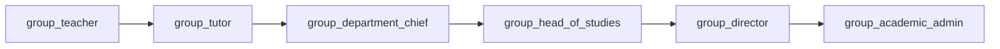
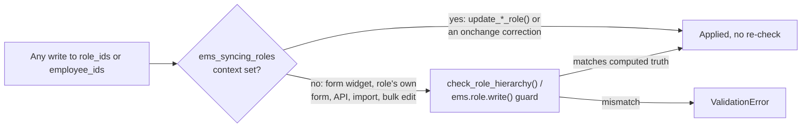
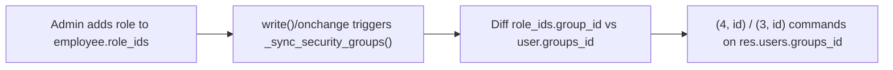
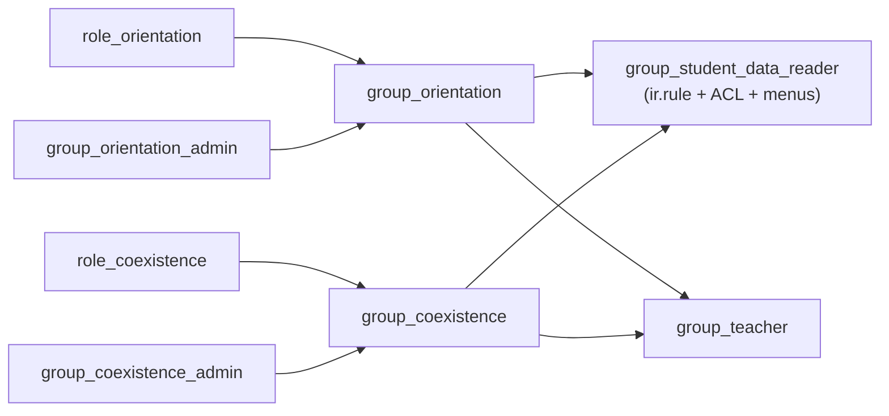
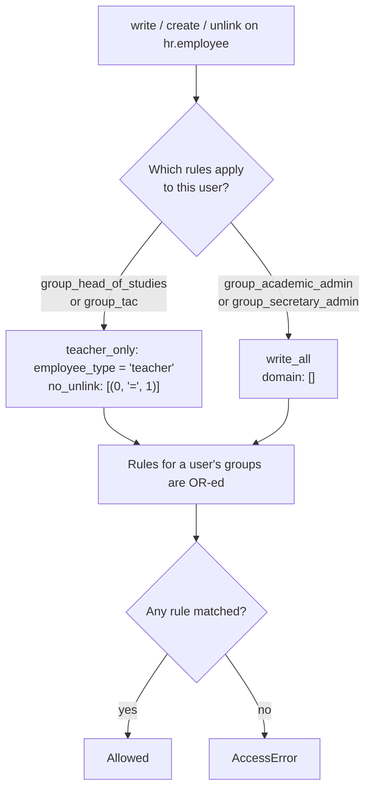

# Technical Reference: Academic Role Hierarchy

## `ems.role` model reference

| Field | Type | Notes |
|-------|------|-------|
| `name` | `Char`, translatable, required | Role label (e.g. "Head of studies") |
| `color` | `Char` (hex) | Free-pick display color — see [Free-pick color widget](../shared/color_widget.md) |
| `notes` | `Text` | Free-form admin notes |
| `unipersonal` | `Boolean` | If set, `check_limit()` raises when a second employee would be assigned this role |
| `employee_type` | `Selection` | `teacher`/`asp` — restricts which employees `employee_ids` can hold |
| `employee_ids` | `Many2many → hr.employee.public` | Who currently holds this role (manual `hr_employee_public_ems_role_rel` relation — see the in-code comment for why) |
| `group_id` | `Many2one → res.groups` | If set, holding this role auto-adds the employee to this security group — see "Role → Group Sync" below |

CRUD is plain: `group_academic_admin` has full read/write/create/unlink on the role catalog (`security/ir.model.access.csv`); `group_teacher`/`group_secretary` are read-only, so a teacher can see which role a colleague holds but not edit the catalog. The catalog itself (`data/cat/ems.role.csv`) seeds 17 built-in roles; a centre can add its own from the UI.

## Overview

EMS grants teachers escalating access through a chain of `res.groups` implication (`security/groups.xml`, category `ems.category_roles`). Each group in the chain implies (and therefore includes all permissions of) the one before it, via `implied_ids`.

`group_department_chief` was added identical to `group_tutor` (`implied_ids = [group_tutor]`, no extra rights of its own yet). `group_head_of_studies` implies `group_department_chief` instead of `group_tutor` directly, so the chain is unbroken.

## Role → Group Sync

Group membership is not edited directly by admins in normal operation; it is derived from data:

- **`ems.role`** (`models/employees/role.py`) is a role catalog. Each role may carry a `group_id`: employees holding that role are automatically added to the linked `res.groups`.
- **`data/cat/ems.role.csv`**'s own `group_id/id` column wires each role catalog entry to its security group, e.g. `role_tutor → group_tutor`, `role_dchieff → group_department_chief`, `role_seminar → group_department_chief`, `role_hos`/`role_dhos → group_head_of_studies`, `role_secretary → group_secretary` (Secretary block, independent from this chain — see the Access Control table below), `role_director → group_director`, `role_tac → group_tac_admin` (TAC block, likewise independent). Roles with an empty `group_id` (`role_catskills`, `role_orc`, `role_erasmus`, `role_vetcoord`, `role_schieff`, `role_cchieff`) are purely descriptive and grant nothing.
- **`ems_employee_base._sync_security_groups()`** (`models/employees/employee.py`) diffs an employee's `role_ids`/`job_id` derived groups against `res.users.groups_id` and issues `(4, id)`/`(3, id)` commands, called from `write()` and the relevant `@api.onchange` handlers.
- **`ems.role.write()` calls it too**, for the other direction. The role's own "Assigned to" list writes `ems.role.employee_ids` and never reaches `hr.employee.write()`, so until this was added (issue #391) a role linked to a security group could be granted from that screen with none of its permissions actually applied - the holder saw the role on their record and got an `AccessError` the moment they used it. It affects every manually-assignable role carrying a `group_id` (`role_quality`, `role_coexistence`, `role_secretary_admin`, `role_tac`); it stayed hidden because those roles happen to have been assigned from the employee side. Both the employees losing the role and the ones gaining it are re-synced, so the membership is captured on both sides of `super().write()`.
- `role_tutor`, `role_dchieff`, `role_seminar`, `role_hos`, `role_dhos`, `role_secretary` and `role_director` are **not** manually assignable — no role in this chain remains manual: `update_tutor_role()` links/unlinks `role_tutor` based on whether the employee is referenced as `tutor_id` on any `ems.group`; `update_department_head_role()`/`update_seminar_chief_role()` do the same for `role_dchieff`/`role_seminar` based on `hr.department.manager_id`/`seminar_chief_id` (labelled "Department Chief"/"Seminar Chief" on the department form); `update_area_manager_role()` does the same for `role_hos`/`role_dhos`/`role_secretary` based on a *top-level* department's `manager_id`/`top_level_role` (labelled "Area Manager" on the department form — `role_secretary` is how the `ASP` top-level department's manager is handled, a teacher coordinating administrative/secretariat staff); `update_director_role()` does the same for `role_director` based on `res.company.director_id` (Ajustes/Settings > EMS Management — deliberately not a department field, see [Department Chief / Seminar Chief / Head of Studies / Director cascade](department.md)). Note `role_secretary` was changed from non-unipersonal to unipersonal in `data/cat/ems.role.csv` when it joined `top_level_role` — there is only ever one ASP Area Manager centre-wide, same as Head of Studies/Deputy/Director.

## Enforcement: a real server-side guard, not just the onchange (issue #373, 2026-08-31)

The paragraph above states these 7 roles are "not manually assignable" — until this fix, that was only true from the employee form's own tag widget, and even there, incompletely:

- `_onchange_role_ids` (`employee.py`) is client-side UX only: it fires solely when `role_ids` is edited from the employee form, and, before this fix, `return`ed as soon as it corrected the *first* mismatched role it found in a given call — any *other* role simultaneously out of sync (e.g. an employee who is both a Department Chief and a top-level Area Manager, with both tags stale at once) silently went uncorrected. It now loops every role via the shared `_ems_role_hierarchy_truth()` helper (below) and corrects/warns for all of them in one pass.
- Nothing validated `role_ids` at all when written from anywhere else: `ems.role`'s own `employee_ids` reverse field (the role's "Assigned to" tab), a direct `write()`/API call, an import, or a list-view bulk edit. A role assigned this way could sit with no backing department/company/group data indefinitely.

**The real barrier is now server-side, symmetric in both directions, and independent of which side of the relation is written:**

- `ems_employee_base._ems_role_hierarchy_truth()` is the single source of truth: for each of the 7 roles, `(role, should_be_assigned, message)` computed straight from `headed_department_ids`/`seminar_department_ids`/`tutorship_ids`/`directed_company_ids` — the exact same predicates `update_*_role()` already used, now shared instead of duplicated.
- `ems_employee_base.check_role_hierarchy` (`@api.constrains('role_ids')`) calls it on every `write()`/`create()` of `hr.employee`/`hr.employee.public`, from any code path, and raises `ValidationError` on any mismatch.
- `ems.role.write()` independently rejects any attempt to touch `employee_ids` on one of the 7 roles (`HIERARCHY_MANAGED_ROLE_XMLIDS`) — writing from the role's own side never touches `hr.employee.write()` at all (different model), so it needs its own guard, not just the employee-side constrains.
- `EMS_ROLE_SYNC_CONTEXT_KEY` (`'ems_syncing_roles'`, same pattern as the pre-existing `EMS_PHOTO_SYNC_CONTEXT_KEY`) marks a write as the one legitimate source: the 5 `update_*_role()` methods, and each individual correction inside `_onchange_role_ids` itself (a correction is itself a `role_ids` write, immediately re-validated - marking it lets every mismatch in one onchange pass get fixed instead of the first correction's own write raising because a *later* role is still mismatched at that intermediate moment). `check_role_hierarchy`/`ems.role.write()` both skip validation when this context key is present; everything else is held to the real computed truth.

**UI**: `ems.role`'s own form (`views/community/role/form.xml`) shows a role-specific `hierarchy_managed_message` (computed, naming the exact screen to use) and sets `employee_ids`'s `readonly` to `is_hierarchy_managed`. The kanban card's own delete button (a bespoke EMS addition in `views/community/employee/kanban.xml`, not a native Odoo affordance) also respects this via the standard `read_only_mode` kanban template variable, which already reflects the embedding field's `readonly` - see that file's own comment for the exact framework source (`kanban_record.js::renderingContext`) this relies on. (An earlier attempt at a dynamic `class` expression directly on the `<field>` node crashed the form's entire OWL template compilation - Odoo's view compiler only accepts a static string for a `class` attribute on `<field>`/generic nodes, not a Python-dict-style expression; caught by `static/tests/tours/role_color_tour.js`'s `ems_role_hierarchy_lock_smoke` tour, not by `./upgrade.sh` or the backend test suite.)

## Access Control

| Group | Implies | Comment |
|-------|---------|---------|
| `ems.group_teacher` | `hr_attendance.group_hr_attendance_own_reader` | Base teacher access |
| `ems.group_tutor` | `ems.group_teacher` | Teacher in charge of a group; row-level access to their group's students is granted via record rules in `security/rules/*.xml` that filter on `group_teacher` + a domain on `tutor_id`, not on `group_tutor` itself |
| `ems.group_department_chief` | `ems.group_tutor` | Department head. Grants full read/write/create/unlink access to `ems.group` (see `access_ems_group_department_chief`), otherwise currently identical to Tutor |
| `ems.group_head_of_studies` | `ems.group_department_chief`, `hr_attendance.group_hr_attendance_manager`, `hr.group_hr_user` | Full read/write access to all employees' attendance records, plus create/edit on teachers - see [Staff management](#staff-management-issue-391) below |
| `ems.group_director` | `ems.group_head_of_studies` | Currently identical to Head of Studies |
| `ems.group_academic_admin` | `ems.group_director` (+ Secretary/Quality/Settings admin chains) | All access rights |
| `ems.group_tac` | `ems.group_teacher`, `hr.group_hr_user` | TAC (Learning and Knowledge Technologies) team. Own category, transversal to the chain above: same create/edit rights on teachers as the Head of Studies, and nothing else |
| `ems.group_tac_admin` | `ems.group_tac` | The TAC coordinator (`role_tac`). Currently identical to `group_tac` |
| `ems.group_coexistence` | `ems.group_student_data_reader` | Coexistence team. Own category, transversal: reads every strike centre-wide, plus the whole student dataset - see [Transversal read-only access to student data](#transversal-read-only-access-to-student-data-issue-393) below |
| `ems.group_coexistence_admin` | `ems.group_coexistence` | The coexistence coordinator (`role_coexistence`). Currently identical to `group_coexistence` |
| `ems.group_orientation` | `ems.group_teacher`, `ems.group_student_data_reader` | Guidance (Orientació) team. Own category, transversal: a teacher who additionally reads the whole student dataset, and nothing else |
| `ems.group_orientation_admin` | `ems.group_orientation` | The guidance coordinator (`role_orientation`). Currently identical to `group_orientation` |
| `ems.group_student_data_reader` | - | Technical group, no category of its own: carries the read-only record rules, ACL lines and menu visibility for the whole student dataset. Never assigned directly - granted only by implication from the two groups above |

No new record rules or views were needed for `group_department_chief`: because it implies `group_tutor`, every rule/view gated on `group_teacher` (with a `tutor_id` domain) or on `group_tutor` directly is automatically satisfied.

## Transversal read-only access to student data (issue #393)

Two posts sit outside the teacher → tutor → department chief → Head of Studies chain but still
need to see every student's file, not just their own tutees': the **guidance team**
(*Orientació*, new in this issue) and the **coexistence coordinator** (already modelled, but
until now able to read strikes and nothing else). Both are transversal in exactly the sense
`category_quality`/`category_coexistence`/`category_tac` already are - the post is held by a
teacher, but it does not sit anywhere on the academic chain, so it gets its own independent
Manager/Administrator pair rather than being wired into it.

### Why a shared technical group instead of duplicating the rules

The two posts need the *same* read-only view of the student dataset, for different reasons
(guidance follows a student's academic and personal trajectory; coexistence needs the full
disciplinary and attendance context behind an incident). Writing one `ir.rule` per model per
group would mean ~17 rules duplicated twice, and a third post later would duplicate them a
third time. Instead, a single technical group owns the whole permission surface:

`group_student_data_reader` has **no `category_id`**, so it never shows up as a role selector on
the user form - it is granted only by implication, never picked by hand. It is deliberately
self-sufficient (it carries its own ACL lines rather than relying on `group_teacher`'s):
it never depends on another group happening to be granted alongside it.

`group_coexistence` gained `group_teacher` in this issue, matching `group_tac` and
`group_orientation`. That is not a courtesy: the Students screen is served by an
`ir.actions.server`, and Odoo requires **write** access on the action's own model (`res.partner`)
to execute a server action at all - so without `group_teacher` a coexistence coordinator hit an
`AccessError` opening the screen however complete their read permissions were. It is safe because
`role_coexistence` is `employee_type='teacher'`: the post is always held by a teacher already.

Odoo ORs record rules across the groups a user belongs to, so a domain of `[]` on
`group_student_data_reader` widens whatever `group_teacher`'s own `tutor_id`-filtered rules
already allow, rather than fighting them. Nothing narrows: every rule below is `perm_read` only,
with write/create/unlink left to the groups that already own them.

### Models covered

Read-only (`domain_force` `[]`, `perm_read` only), in `security/rules/student_data_reader.xml`:

| Area | Models | Was previously limited to |
|------|--------|---------------------------|
| Contacts and enrolment | `res.partner`, `ems.enrollment`, `ems.authorization` | Already readable by any teacher - covered here only so the technical group stands alone |
| Grades | `ems.grade_session`, `ems.grade_subject_line`, `ems.grade_outcome_line` | The teacher who owns the session, or the group's tutor |
| Academic record | `ems.student.year_record`, `.subject`, `.outcome` | Admin, secretary, Head of Studies, or the student's tutor |
| Daily attendance | `ems.attendance_session_header`, `ems.attendance_session_line`, `ems.attendance_justification` | The session's own teacher, or the student's tutor |
| Attendance issues | `ems.attendance_issue_tutor`, `ems.attendance_issue_student`, `ems.attendance_issue_status` | The student's tutor |
| Coexistence | `ems.strike`, `ems.strike.reason` | The issuing teacher, the student's tutor, or `group_coexistence` (strikes only) |

`ems.strike.reason` deliberately gets an ACL line but **no** record rule: no group row-filters
that catalog in the first place, so a rule would add noise without changing what anyone sees.

Financial data (`sale.order`, `sale.order.line`, invoices, payments) is deliberately **out of
scope**: neither post has a reason to see what a family paid, and it stays with secretary,
admin and the student's own tutor.

### Menus: permissions with no way in are invisible

Three menu entries gate the screens this data actually renders in, and none of them listed a
group either post holds - so without this, both roles would have the records and no route to
them. Each gains `ems.group_student_data_reader` alongside its existing groups:

| Menu | File | Previously visible to |
|------|------|-----------------------|
| `menu_ems_academic_management` (root) | `views/academic_management/menu.xml` | admin, secretary, tutor |
| `menu_students_tutor` | `views/academic_management/enrollment/menu.xml` | admin, secretary, tutor |
| `menu_year_record` | `views/planning_grading/grading/year_record/menu.xml` | admin, secretary, Head of Studies |

The attendance, coexistence and grading menus carry no `groups` attribute at all, so they follow
their children's own access and need no change - `menu_grade_sessions` ("Evaluation by group and
subject", a plain `ems.grade_session` list) therefore becomes reachable on the ACL alone, and is
the screen these posts consult grades from.

**Two menus were deliberately left alone**, both initially opened up in this issue and then
reverted once their actual target was traced:

- `menu_ems_enrollments` points at a **`sale.order`** list, not `ems.enrollment` - financial data,
  explicitly out of scope.
- `menu_grade_tutor` is the tutor's own OWL matrix, whose client-side loader filters on
  `group_id.tutor_id.user_id = uid` (`static/src/js/backend/grade_tutor_matrix.js`). It would
  render empty for a guidance or coexistence user, so it is the wrong entry point regardless of
  permissions.

### The screen filter that record rules alone cannot reach

`action_student_group_enrollment` (`views/academic_management/enrollment/list_tutor.xml`) is an
`ir.actions.server` that rewrites its own domain in Python: admin and secretary get every student,
everyone else gets `('tutor_id.user_id', '=', env.uid)`. Row-level permission therefore was not
enough - a guidance user with full read access still saw an **empty list**, because the narrowing
happens in the action, not in the rules. `group_student_data_reader` is now recognized there too.
This is worth remembering as a class of bug: grepping `security/` finds every rule, but a screen
can still filter itself in server-side action code or in a client-side OWL loader.

### Role catalog entry

`data/cat/ems.role.csv` gains one row: `role_orientation`, `employee_type` `teacher`,
`unipersonal` **false** (the post is held by a team, like `role_coexistence` and `role_tac`),
wired to `group_orientation`. It has no department/company backing, so it is manually
assignable - `is_hierarchy_managed` is false and it never appears in
`HIERARCHY_MANAGED_ROLE_XMLIDS`. `role_coexistence` keeps pointing at `group_coexistence`
unchanged; it inherits the new access purely through that group's new `implied_ids`.

No migration is needed: every XML ID here is new, and the role row is added to a
`noupdate=False` CSV that re-syncs on upgrade.

## Staff management (issue #391)

Until this issue only `group_academic_admin` could write to `hr.employee`; `group_teacher` (and
therefore the whole tutor → department chief → Head of Studies chain, which implies it) was
read-only. The Head of Studies / Deputy Head of Studies and the TAC coordinator now create and edit
teachers, and manage a teacher's record in full - private information included, since these posts
are the ones responsible for that data.

**Both groups get that by implying `hr.group_hr_user`**, Odoo's own HR officer group, rather than
EMS re-declaring the staff-management surface ACL by ACL. Two reasons, one practical and one that
leaves no alternative:

- It is a single, well-understood grant instead of a growing list that has to track every model a
  staff record touches (see the create path below - it is five models, and the fifth is not
  discoverable by reading the ACL file).
- It is the **only** thing that lifts a field-level restriction. `hr.employee.private_email` is
  declared `groups="hr.group_hr_user"` on the field itself, and the whole "Private Information" /
  "HR Settings" pages carry the same gate. A field-level `groups` cannot be relaxed by any ACL or
  record rule - only by holding the group, or by EMS redefining the field.

Odoo's own Employees app does not appear as a side effect: EMS deactivates `hr.menu_hr_root` in
`views/menu.xml`.

### Why `private_email` matters here

It is not one field among many: it is the address the Google Workspace credentials are delivered to.
`_gw_missing_fields()` (`models/employees/google_workspace_integration.py`) makes it required for
account creation alongside `name`, and `_gw_send_credentials` mails the welcome template there.

Before this issue that produced a silent dead end. A Head of Studies could create a teacher, but the
field carried `groups="hr.group_hr_user"`, so Odoo stripped it from their form entirely - **and with
it the `required` the EMS employee form puts on it** (`required="not id and employee_type in
('teacher', 'asp')"`, `views/community/employee/form.xml`). The record saved happily with no
personal address, the account was never created, and the only trace was a chatter note. The view's
constraint existed but was invisible to precisely the people now creating the records.

`views/community/employee/form.xml` additionally renders the field **a second time** on the main
screen, last in the right-hand column under Department/Job Position/Manager: a required field buried
in a tab means every new teacher starts with a validation error on a screen that does not show what
is wrong. It is a genuine duplicate, not a `position="move"` - it must stay in its original place in
the tab as well, where anyone maintaining an existing record expects it. Both nodes bind to the same
field, so editing either updates the other live, and Odoo 18 raises no view-validation complaint
about the repetition.

Two details worth keeping in mind if this is ever touched:

- **`required` has to be repeated on the new node.** The `<field name="private_email"
  position="attributes">` that carries it resolves against the first matching node at the time it is
  applied - the tab's - so the second occurrence would otherwise render without it.
- **Sitting outside the page's group gate protects nothing less.** `private_email` carries
  `groups="hr.group_hr_user"` on the field itself, which is what actually gates it.

### What the record rules narrow back down

`hr.group_hr_user` is broader than this issue asked for, so `security/rules/employees.xml` bounds it
on two axes. Rules are evaluated per operation, which is what makes this possible: every rule there
leaves `perm_read` `False`, so **nothing changes about who can see a staff record** - ASP records
included, exactly as before.

| Rule | Groups | Effect |
|------|--------|--------|
| `rule_hr_employee_write_teacher_only` | `group_head_of_studies`, `group_tac` | `write`/`create` only where `employee_type = 'teacher'` |
| `rule_hr_employee_no_unlink_staff_manager` | `group_head_of_studies`, `group_tac` | `unlink` with an unsatisfiable domain: never deletes |
| `rule_hr_employee_write_all` | `group_academic_admin`, `group_secretary_admin` | The unrestricted counterpart, on all three operations |

Two things about that table are easy to get wrong:

- **The unsatisfiable domain is deliberate.** Record rules only ever grant; there is no "deny" rule.
  A rule that matches nothing therefore contributes nothing to the OR, which is how you express
  "this group never deletes" against an ACL that does grant it.
- **The counterpart rule is not optional, and must not name `hr.group_hr_user`.**
  `group_academic_admin` implies `group_director` → `group_head_of_studies`, so without
  `rule_hr_employee_write_all` the academic Administrator would inherit both restrictions and
  silently lose its ASP write access and its ability to delete. And since the two restricted groups
  now imply `hr.group_hr_user` themselves, writing the counterpart against that native group would
  cancel out both bounds entirely.

### Creating a teacher writes to five models

`hr.employee` inherits `resource.mixin`; EMS's own `create()` override gives every new teacher a
personal calendar (`_ems_create_personal_calendar`, seeded from the company's schedule framework);
and `hr_skills`' own `create()` override seeds an "Experience" resume line. `hr.group_hr_user`
covers `hr.employee`, `resource.resource` and `hr.resume.line` (including `hr_skills`' own record
rule, which otherwise only lets an internal user create the resume line of *their own* record - the
misleading failure mode here, since the ACL is wide open and the rule is what refuses). What it does
**not** cover is `resource.calendar` and `resource.calendar.attendance`, so those keep their own EMS
ACL lines:

| Model | Where the right comes from |
|-------|----------------------------|
| `hr.employee` | `hr.group_hr_user` |
| `resource.resource` | `hr.group_hr_user` |
| `hr.resume.line` | `hr.group_hr_user` (ACL *and* `hr_resume_rule_employee_hr_user`) |
| `resource.calendar` | `ems.access_resource_calendar_*`, this issue |
| `resource.calendar.attendance` | `group_department_chief` for the Head of Studies; `ems.access_resource_calendar_attendance_tac` for the TAC block |

No `queue.job` ACL is required even though `create()` enqueues the Google Workspace account job -
`queue_job` stores its jobs with `.sudo()`.

### Deleting an employee is still nobody's job below `base.group_system`

Worth knowing before anyone reads the rules above as "administrators can delete staff": they can
pass `hr.employee`'s own check, but a real delete cascades into `resource.calendar` (every teacher
has a personal one), where **only `base.group_system` has `unlink`**. An academic Administrator
holding nothing else has therefore never been able to delete an employee end to end. That is
structural and predates this issue, which is why `tests/test_employee_staff_permissions.py` asserts
the administrator's `unlink` permission on `hr.employee` itself rather than calling `unlink()`.
In practice staff are archived, not deleted.

### `read_only` is now a per-record answer

`ems_employee_base.read_only` (used to present the whole form as read-only) used to call
`check_access_rights('write')`, which only consults the model-level ACL. With these rules in place
the honest answer differs per record - a teacher is writable, an ASP is not - so it now calls
`_filtered_access('write')`, which applies the rules too. A record still being created carries a
`NewId`, which `_check_access` deliberately skips the rule pass for, so a brand-new form stays
editable.

## Key Migrations

| Version | Change | File |
|---------|--------|------|
| 18.0.0.19.3 | Renamed role catalog id `role_dchieff_cs` → `role_dchieff` (was incorrectly scoped to a single department) and wired it to the new `group_department_chief` (then named `group_head_of_department`) | `migrations/18.0.0.19.3/pre-migrate.py` |
| 18.0.0.21.0 | Renamed security group XML ID `group_head_of_department` → `group_department_chief`; granted the group full write/create/unlink access on `ems.group` | `migrations/18.0.0.21.0/pre-migrate.py` |
