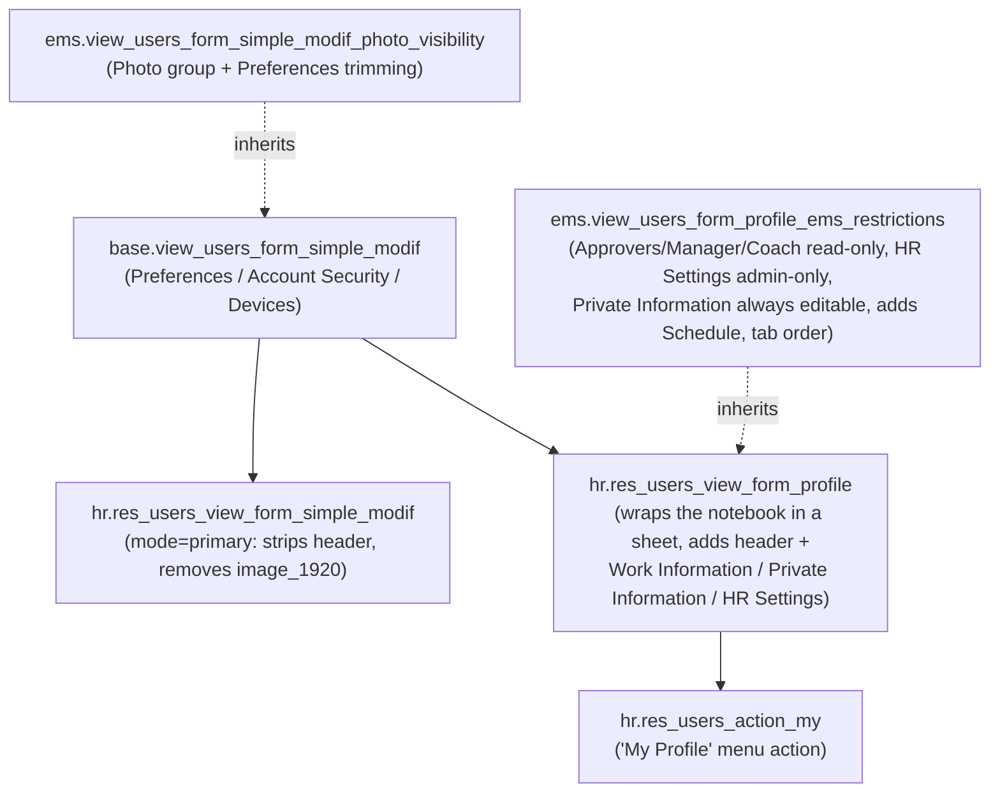

# "My Profile" screen restructuring (issue #440)

## Overview

"My Profile" (`hr.res_users_action_my`, reached from the top-right user menu) is native
Odoo, assembled from three layered views — see the diagram below. EMS does not replace any
of them; it only adds two `ir.ui.view` inherits (`views/community/employee/
user_profile_form.xml`) that restrict what a self-viewing user can see or change, plus a new
"Schedule" tab. The underlying `hr.employee`/`res.users` fields and their own read/write
access rules (native Odoo's `can_edit`/`SELF_WRITEABLE_FIELDS` machinery) are untouched —
this is a **presentation-layer restriction on top of them**, not a new authorization layer.



## What changed, tab by tab

**Revised 2026-09-10** after developer feedback on the first pass: the header/Location/HR
Settings fields must stay editable/visible for an administrator, not be forced
read-only/hidden unconditionally — only the Approvers group is unconditionally read-only.

| Tab | Before | Now |
|---|---|---|
| Header (name, job title, phone, work email, work location) | Editable whenever `can_edit` was `True` (HR officer, or the `hr.hr_employee_self_edit` system parameter) | **Unchanged** — still `readonly="not can_edit"`, native as-is. Already read-only for an ordinary user, still editable for an administrator (the intended behaviour) — see "Why no override was needed" below |
| Header → Manager (`employee_parent_id`), Coach (`coach_id`) | Editable whenever `can_edit` was `True` | **Unconditionally read-only**, even for an administrator — both are set from the department screens (`employee_parent_id` is in fact computed from `department_id.manager_id`, see [Employee](employee.md)), never hand-edited from "My Profile" |
| Preferences | Email, Language, Timezone, Signature, `calendar`'s own "Calendar Default Privacy" (+ two already-invisible native groups) | For an ordinary user: only **"Disable profile picture"** (EMS's own `image_disabled`, see [Photo visibility](photo_visibility.md)) and **Language** remain visible. For an administrator: **everything stays visible**, same `invisible="not can_edit"` gating as the rest of this table (developer feedback 2026-09-10 — an earlier pass hid these unconditionally, missed when the rest of the screen was corrected to the `can_edit` pattern) |
| Work Information → Location (`department_id`, `address_id`) | Editable whenever `can_edit` was `True` | **Unchanged**, same as the header above |
| Work Information → Approvers (`attendance_manager_id`, `leave_manager_id`) | `leave_manager_id` auto-derived (see [Absence](absence.md)), plain text, editable when `can_edit`; `attendance_manager_id` native, never set by anything in EMS — permanently empty, so `hide-group-if-empty` hid the whole group's "Attendance" line for virtually every employee | Both **unconditionally read-only** (`readonly="1"`, regardless of `can_edit` — who approves what is derived from the department hierarchy, never hand-edited even by an administrator) and both shown with the `many2one_avatar_user` widget (native `hr_holidays` only gives `leave_manager_id` that widget on the plain employee form, not on this profile view — added here for consistency with `attendance_manager_id`, which already had it). `attendance_manager_id` is now a stored compute mirroring `leave_manager_id` (see below) |
| HR Settings (`employee_type`, `pin`, `barcode`) | Editable whenever `can_edit` was `True` | Tab itself now `invisible="not can_edit"` (hidden for an ordinary user, visible for an administrator) — the fields' own native `readonly="not can_edit"` is untouched |
| Private Information (address, citizenship, marital status, education, dependants, emergency contact, work permit — 31 fields) | Editable whenever `can_edit` was `True` | **Unconditionally editable for everyone**, including an ordinary user without `can_edit` (developer feedback 2026-09-10: this is the user's own personal, not professional, data — they're always free to modify it). Each field individually flipped to `readonly="0"` (a single xpath matching all 31 at once was tried and silently only affected the first one — see "31 individual overrides, not one bulk xpath" below) — and `res.users.write()`'s own separate access check (unrelated to the view) needed its own carve-out too, see below |
| Schedule (new) | Did not exist | Shows the linked employee's weekly schedule, via the exact same `schedule_grid` OWL widget as the teacher's own "Schedule" tab (see [Working schedule](working_schedule.md)) |

Account Security/Devices are unchanged — out of scope for issue #440.

## Tab order

Developer feedback 2026-09-10: **Schedule, Work Information, HR Settings, Private Information,
Account Security, Devices, Resume, Preferences** — Schedule first, which (Odoo's notebook
activates the first visible page on a fresh load) also makes it the tab shown by default. Built
in the view as a chain of `position="move"` operations (`<xpath expr="//page[@name='X']"
position="after"><xpath expr="//page[@name='Y']" position="move"/></xpath>`, moving `Y` right
after `X`), one per consecutive pair in the target order — each step only assumes the
*previous* pair is already correctly placed, so it doesn't matter what order the tabs started
in. `position="move"` relocates the existing node instead of copying it (Odoo 17+). For an
ordinary user, "HR Settings" is genuinely absent from the DOM (its own `invisible="not
can_edit"`), not just skipped by the reorder — the tour accounts for this (see
`static/tests/tours/user_profile_tour.js`'s `tabOrderSteps(hasHrSettingsTab)`).

## Why no override was needed for the header/Location/HR Settings

Odoo's native `readonly="not can_edit"`/`page[@name='hr_settings']` (no restriction at all,
natively) pattern already gives exactly the behaviour asked for once correctly understood:
`can_edit` (`hr/models/res_users.py`) is `True` only for `hr.group_hr_user` members or when
the (unset, on this box) `hr.hr_employee_self_edit` system parameter is enabled. On this box,
only 6 of 531 active internal users hold `hr.group_hr_user` — real administrator accounts on
this box already hold it too (confirmed empirically), so the native mechanism already reads as
"read-only for an ordinary teacher, editable for an administrator" **without EMS touching it
at all**. An earlier version of this change hard-forced `readonly="1"`/hid the HR Settings tab
unconditionally, which broke this for the 6 privileged accounts — reverted once the developer
clarified an administrator must keep full access here, same as before. Only the HR Settings
**tab's own visibility** needed an EMS override (`invisible="not can_edit"`), since natively
the tab is always visible with only its fields individually gated.

**Preferences hit the exact same mistake, one pass later** (developer feedback 2026-09-10,
after the header/Location/HR Settings had already been corrected): the fields hidden from an
ordinary user (email, timezone, signature, `calendar`'s own "Calendar Default Privacy") were
still unconditionally `invisible="1"`, so an administrator lost sight of them too - missed
because these hides live in a *different* record (`view_users_form_simple_modif_photo_visibility`,
inheriting `base.view_users_form_simple_modif`), reviewed separately from the `can_edit`-aware
fixes applied to the other record. Fixed the same way: `invisible="not can_edit"`. One
complication specific to this record: `can_edit` isn't otherwise present on this particular
combined view - it's added by `hr.res_users_view_form_profile`, a *later* composition layer (see
the diagram above) - so referencing it here needed its own explicit `<field name="can_edit"
invisible="1"/>` node first (Odoo's view compiler rejects `invisible="not can_edit"` if `can_edit`
isn't a real node somewhere in that same arch, even though it's a real field on the model).

## `attendance_manager_id` now mirrors `leave_manager_id`

`models/employees/employee.py`'s `ems_employee` class turns `attendance_manager_id`
(native `hr_attendance` field, previously a plain manually-set Many2one) into a stored
compute:

```python
@api.depends("leave_manager_id")
def _compute_attendance_manager_id(self):
    for employee in self:
        employee.attendance_manager_id = employee.leave_manager_id
```

`leave_manager_id` is EMS's own compute (`models/employees/absence.py`'s
`_compute_leave_manager` — the Area Manager of the employee's top-level department; see
[Absence](absence.md)). Nothing in EMS ever set `attendance_manager_id` before this: the
whole "Approvers" group is hidden on the teacher/employee form itself
(`view_employee_form_inherit_hr_attendance`), so there was no admin UI path to set it either
— confirmed empty (`NULL`) for every employee on this dev DB prior to this change. Since an
absence and an attendance correction are meant to be approved by the same person in this
centre, there is no reason for the two fields to diverge, so this makes `attendance_manager_id`
track `leave_manager_id` unconditionally rather than leaving it as dead, always-empty native
behaviour.

**No migration needed.** Converting an existing plain field into a newly-computed, stored
one is a case Odoo's own module-upgrade machinery already recomputes for every existing
record on its own (verified empirically on this dev DB: 60/63 active employees went from
`NULL` to a real value matching `leave_manager_id`, with zero mismatches, right after a plain
`./upgrade.sh` — no explicit backfill). This is different from `leave_manager_id`'s own
history (`migrations/18.0.0.24.0`), which needed an explicit `env.add_to_compute()` step
because that field was *already* a stored compute before EMS changed only its Python
implementation — a case Odoo's upgrade machinery does **not** re-detect on its own.

## "Private Information" is always self-editable

Developer feedback 2026-09-10: this tab holds the user's own personal (not professional) data —
address, citizenship, marital status, education, dependants, emergency contact, work permit —
and they must always be free to edit it, regardless of `can_edit`/administrator status. Two
separate fixes were needed, at two separate layers:

**View layer:** every field on this tab natively carries `readonly="not can_edit"`
(`hr/views/res_users.xml`). All 31 are flipped to `readonly="0"` in
`views/community/employee/user_profile_form.xml` — as 31 individual `<field name="X"
position="attributes">` overrides, **not** one xpath matching all of them at once. A single
`<xpath expr="//page[@name='personal_information']//field[@readonly='not can_edit']"
position="attributes">` was tried first and looked plausible (it matched all 31 nodes when
tested standalone against the composed arch) — but Odoo's actual inheritance mechanism
(`locate_node()`, `odoo/tools/template_inheritance.py`) does `nodes = xPath(arch); return
nodes[0] if nodes else None` for **every** spec tag, `xpath` included — only the *first* matched
node ever gets the position directive applied, regardless of how many the expression matches.
Confirmed empirically: `get_view()` showed only the first field in the page actually changed to
`readonly="0"`, the other 30 silently kept `readonly="not can_edit"`.

**Model layer — the one a view fix alone can't cover:** `res.users.write()`
(`hr/models/res_users.py`) independently blocks writing *any* `hr.employee`-related field
(private info included) for a self-edit unless `can_edit` is `True` — a check completely
separate from what the view shows, so making the fields *look* editable without this second fix
would let a plain user open an editable-looking field, then hit an `AccessError` on Save.
`models/employees/user.py`'s `PRIVATE_INFO_SELF_EDITABLE_FIELDS` (kept in sync with the 31 view
overrides above) carves this tab's fields out: `ems_users.write()` pops any of them out of
`vals` before the normal `super().write()` call, then re-submits just that subset via
`self.with_user(SUPERUSER_ID).write(private_vals)`. That re-entrant call safely skips this same
branch on its own (`self.env.user` is then the superuser, not this record, so `self ==
self.env.user` is `False`) — no separate recursion guard needed — and, inside `hr`'s own
`write()`, `self.env.user.has_group('hr.group_hr_user')` resolves `True` for the superuser,
satisfying `can_edit_self` without touching anything else the same write might also be doing.
Verified with a real browser tour: a genuinely non-privileged teacher edits "Emergency Contact"
and saves with no `AccessError`, value persisted (`TestUserProfileTour`'s ordinary-user tour).

`additional_note` (also in `hr`'s own `HR_WRITABLE_FIELDS`) is deliberately excluded from both
lists — it's an HR-authored note about the employee, not shown on this tab at all, and not
something the employee should be able to freely rewrite about themselves.

## The new "Schedule" tab

Reuses the `schedule_grid` widget (`static/src/js/backend/schedule_grid_field.js`) exactly
as the teacher's own form does (see [Working schedule](working_schedule.md)) — same embedded
list columns, same empty-state and edit-permission behaviour. The widget hardcodes
`resource_calendar_id` and `can_edit_schedule` as the field names it reads off the record.

`res.users` already has its **own native** `resource_calendar_id` (from the `resource`
module's `resource.mixin`, `related='resource_ids.calendar_id', readonly=False` —
`hr/models/res_users.py`'s own `employee_resource_calendar_id` is a *different*, third field,
not this one). Re-declaring `resource_calendar_id` in `models/employees/user.py` to point at
`employee_id.resource_calendar_id` instead was tried and reverted: it would have hijacked
that unrelated native mechanism (used by the generic Resource/Planning apps, and by
`resource/models/res_users.py`'s own `write()`) for every internal user, not just this
screen. It turned out to be unnecessary anyway — verified empirically against every teacher
on this dev DB, `res.users.resource_calendar_id` (native) and
`hr.employee.resource_calendar_id` **already resolve to the same `resource.calendar`
record**, because `hr.employee`'s own `resource_id` (itself a `resource.mixin` field) always
carries the same `user_id` as the linked user — so the native field is used as-is, unchanged.

Only two related fields, bridging through `employee_id`, were actually added
(`models/employees/user.py`):

- `can_edit_schedule` (related `employee_id.can_edit_schedule` — `True` only for
  `ems.group_department_chief`, same as the teacher's own record)
- `schedule_attendance_ids` (related `employee_id.schedule_attendance_ids`)

Since a self-viewing user reads their own `res.users` record through the self-read carve-out
(`SELF_READABLE_FIELDS`), both of these — plus the native `resource_calendar_id`, which
`base`'s own default `SELF_READABLE_FIELDS` does not include — are added to EMS's own
`SELF_READABLE_FIELDS` override. Without that, a non-HR-officer user would get an
`AccessError` reading their own profile.

## Access control

| Actor | Header / Location | Manager / Coach | Approvers | Preferences | Private Information | HR Settings | Schedule |
|---|---|---|---|---|---|---|---|
| Any user, viewing their own profile | Read-only (`not can_edit`) | Read-only | Read-only | Only photo + language | Editable (unconditional) | Hidden | Read-only, unless also `ems.group_department_chief` |
| A Department Chief, viewing their own profile | Read-only, unless also HR officer | Read-only | Read-only | Only photo + language, unless also HR officer | Editable (unconditional) | Hidden, unless also HR officer | Editable (same `can_edit_schedule` as their own employee record) |
| An HR officer (`hr.group_hr_user`)/administrator (including `ems.group_academic_admin`, which already transitively implies `hr.group_hr_user` — see below), viewing their **own** profile | Editable | Read-only (unconditional, even for an administrator) | Read-only (unconditional) | Everything visible — nothing hidden for an administrator | Editable (was already the case natively) | Visible, fields editable | Read-only, unless also `ems.group_department_chief` |
| Anyone with `hr.employee`/employee-form write access, editing **someone else's** record | Unaffected — this screen only restricts self-viewing "My Profile", not the employee/admin forms | Unaffected | Unaffected | n/a | Unaffected — the `write()` carve-out only applies to a genuine self-edit (`self == self.env.user`) | n/a | Unaffected |

No new `ir.model.access.csv`/`ir.rule` entries were added — this is a view-level (and,
for `attendance_manager_id`, a compute-level) change on top of existing access rules.

## `ems.group_academic_admin` already gets full access - no override needed

Point 1/1b/3's "still editable/visible for an administrator" already covers `ems.group_academic_admin`
without any EMS-side code: that group implies `ems.group_director` → `ems.group_head_of_studies`,
and the latter directly implies `hr.group_hr_user` (`security/groups.xml`) - so `can_edit` is
already `True`, transitively, for any academic admin. Verified empirically (a throwaway user with
only `ems.group_academic_admin` reads `has_group('hr.group_hr_user') == True` and `can_edit ==
True`). `base.user_admin`/`base.user_root` are also directly assigned `ems.group_academic_admin`
(`security/groups.xml`), so the same chain covers Odoo's own superuser/admin account too.

## Migration

None beyond `attendance_manager_id`'s automatic recompute (above) — every other change is a
view/field addition with no XML ID renames.

## A false "bug" found and retracted (2026-09-10) - a lesson on reproduction methodology

An earlier pass of this work claimed any internal user without `hr.group_hr_user` couldn't open
"My Profile" at all - reproduced (twice, independently) via `odoo shell`, and seemingly confirmed
by an actual failing browser tour. **This was wrong**, caught only after the developer reported
logging in as a genuinely plain teacher (`caridadcastillo@elpuig.xeill.net`) with no problem at
all. Re-verified with a corrected browser tour using an equivalent plain fixture: the page loads
perfectly, no `AccessError`, every intended read-only/hidden field behaves correctly.

**What actually happened, as far as this could be pinned down:** the very first browser tour
attempt genuinely *did* fail with a real `AccessError` - but at that point in the session, the
tour was still navigating via a direct URL to the bare action, which (a separate, real bug -
see the `action_get()`/direct-URL-navigation note below, fixed the same session) opened a blank
"New" record instead of the logged-in user's own profile. Computing default values for a
hypothetical new record genuinely doesn't get the self-read bypass (`self` is never `==
self.env.user` for a record with no real id yet), so *that* failure was real - just a symptom of
the navigation bug, not of the profile screen's own self-read logic on an actual existing
record. Every reproduction attempted afterwards - both in `odoo shell` and in a second, corrected
tour - kept "confirming" the same AccessError for a plain fixture, which is what made the wrong
conclusion feel solid. The shell reproductions built their field list by regex-matching
`name="..."` across the view's arch string, which turned out to also catch things that were never
real `<field>` nodes in the request the actual web client sends (confirmed once: three
false-positive names - `id`, `create_date`, `city` - turned up as "not in `SELF_READABLE_FIELDS`"
purely from that regex, not from anything a real form actually reads) - the most likely
explanation for why those shell calls kept failing too, though the exact mechanism was never
pinned down with full certainty. The one test that couldn't lie - a real browser tour, with the
navigation bug already fixed, logged in as a genuinely non-privileged, freshly-created teacher
fixture - loads "My Profile" perfectly, no `AccessError`, every intended read-only/hidden field
behaving correctly. That is what settled it, not a full explanation of why the earlier
reproductions failed.

**Lesson for next time:** a shell-built reproduction of "can a user open this record" needs the
*exact* field list/call shape the real web client sends - not a regex reconstruction of the view
arch, which can silently include names that were never actually part of the real request. When a
real browser tour and a shell reproduction disagree, or when a report from an actual person
contradicts a reproduction, trust the real browser/real person over the shell approximation, and
go find out why they disagree rather than assuming the shell result is authoritative.
