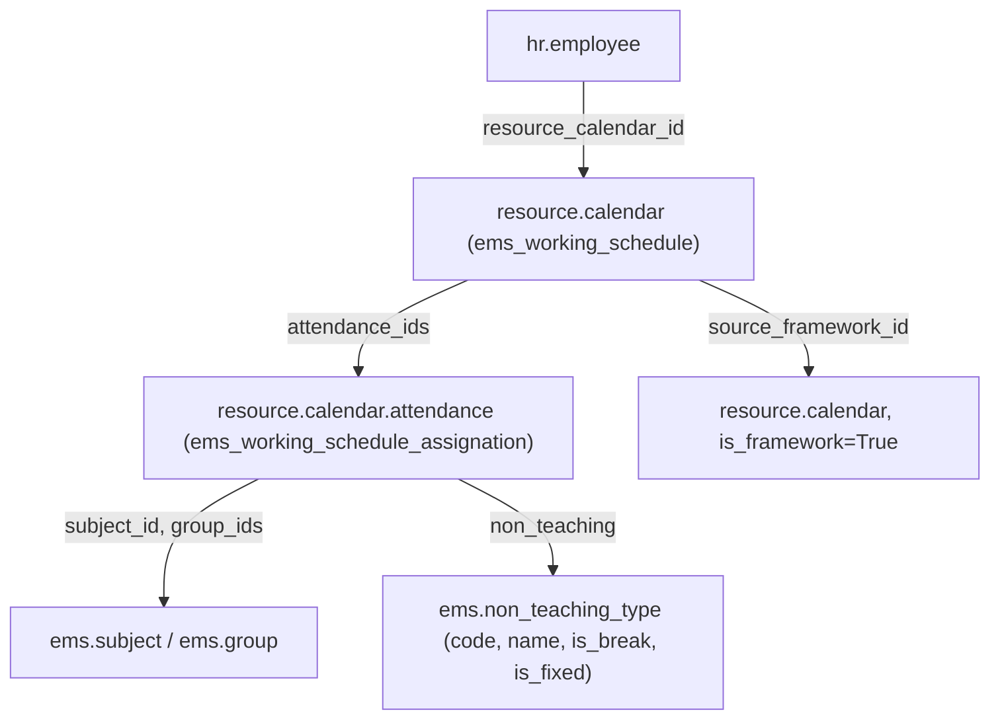
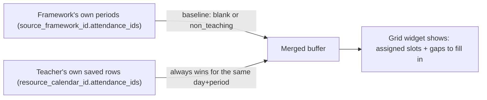
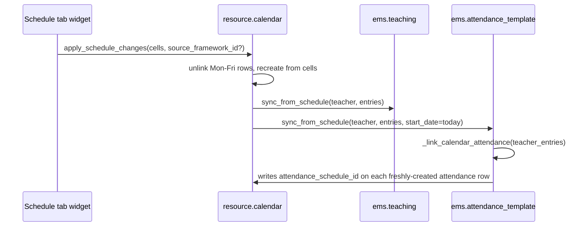
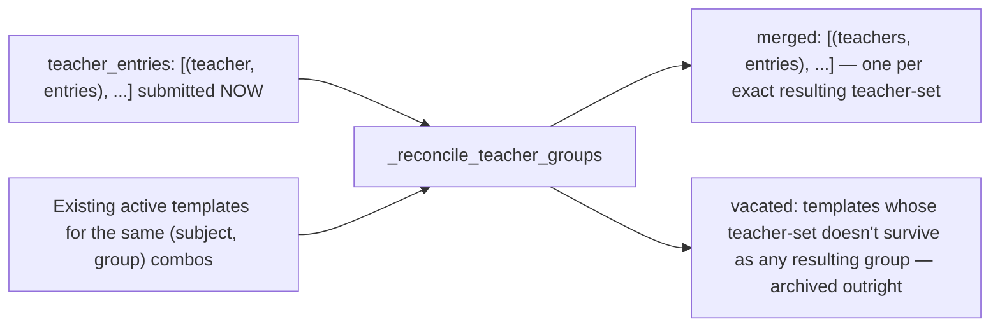
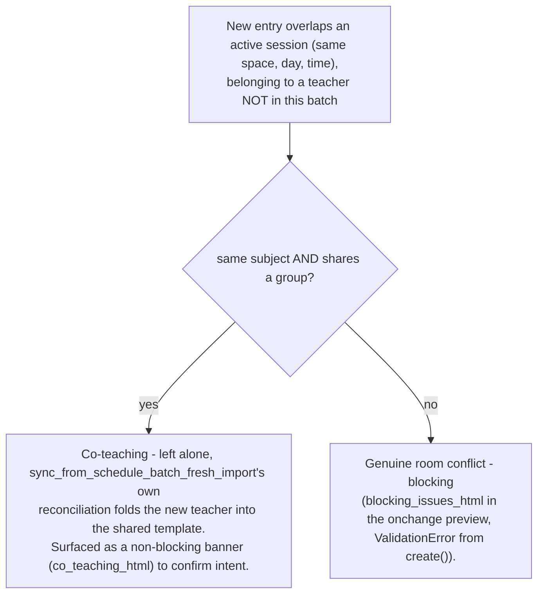
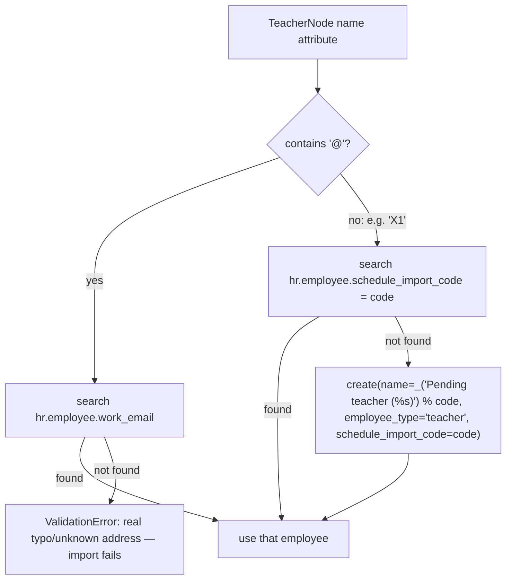
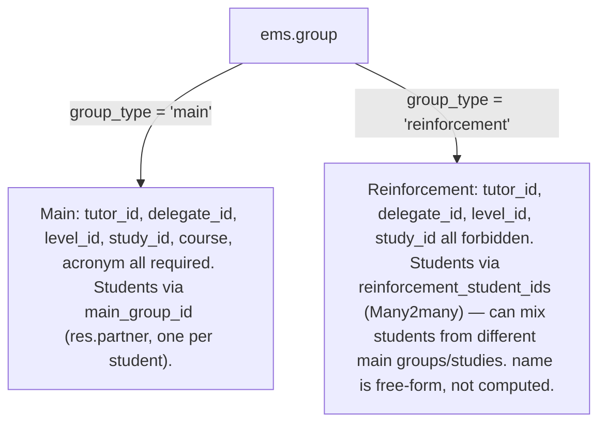

# Technical Reference: Teacher Working Schedules & Schedule Frameworks

## Overview

Every teacher's weekly timetable is their `hr.employee.resource_calendar_id` (a `resource.calendar`, extended by EMS), whose weekly slots live in `resource.calendar.attendance` rows (also extended). The whole system exists to let admins visually build/edit that timetable from the employee's own **Schedule** tab, instead of hand-editing raw attendance lines, while still supporting bulk XML import for centres that already export data from an external planner.



## Model extensions

**`resource.calendar`** (`models/employees/working_schedule.py`, class `ems_working_schedule`):
- `is_framework` (Boolean) — marks a calendar as a reusable **schedule framework** (a level's bell-schedule template) instead of a real teacher's personal calendar.
- `level_id` (Many2one `ems.level`) — which level a framework belongs to (ESO, BTX, CFGM...). Not required — one framework can also be the centre-wide default with no level.
- `source_framework_id` (Many2one `resource.calendar`, domain `is_framework=True`) — which framework a *personal* calendar was built from. This is the only thing that lets the "Schedule" tab keep showing a teacher's still-unassigned periods on every future edit (see "The empty-slot rule" below) — it is set by `seed_from_framework()` and by `apply_schedule_changes()`'s `source_framework_id` argument, never edited by hand.
- `employee_id` (Many2one `hr.employee`), `course_id` (Many2one `ems.course`) — added 2026-08-06 (see `plans/course_transition_teacher_schedule_archival.md`) so a personal calendar is a permanent, queryable historical record of "who taught, in which course" on its own terms, independent of `hr.employee.resource_calendar_id` (which only ever points at an employee's *current* calendar — see `get_employee()` below). Both are set once at creation (`ems_employee.create()`) and left alone afterwards; blank for a framework calendar, which has no employee/course of its own. Not yet backfilled on pre-existing rows — a calendar created before this phase has neither set, and its `get_employee()`/`_refresh_personal_name()` both fall back to the pre-existing reverse-search mechanism for that case (see below).
- `unique_name` SQL constraint (pre-existing).
- **`create()` override** — auto-derives `name` (`"<employee_id.name> (<course_id.name>)"`, or just `employee_id.name` if no `course_id`) from `employee_id`/`course_id` when the caller sets those but not an explicit `name`, so the naming convention has a single source of truth instead of every caller building the string by hand. An explicit `name` in `vals` always wins.
- **`get_employee()`** — prefers the stored `employee_id` (keeps working once this calendar is no longer any employee's *current* one, e.g. after a course transition supersedes it), falling back to the original reverse search (`hr.employee.search([('resource_calendar_id', '=', self.id)])`) for a calendar predating this field. That reverse search only returns a match when it's unique: any employee never assigned a personal calendar (every non-teacher, and a teacher predating `_ems_create_personal_calendar()`) still carries `resource.mixin`'s shared company-default `resource_calendar_id`, so several employees can legitimately share the same calendar — an ambiguous match returns an empty recordset instead of the several employees found, matching every caller's own "no owner" handling. Bug fixed 2026-09-01: an unguarded reverse search used to raise `ValueError: Expected singleton` (via `_refresh_personal_name()`'s `employee.name` read) the moment two employees shared a calendar, e.g. any employee `write()`-renamed while still on the shared default.
- **`_refresh_personal_name()`** — rebuilds `name` from the calendar's own `employee_id`/`course_id` (falling back to `get_employee()`'s reverse search for a legacy calendar); no-op for a framework calendar. Called by `ems_employee.write()` whenever the linked employee's own `name` changes.
- **`action_archive()` override** (added 2026-09-01) — cascades to every remaining active
  `attendance_ids` row, mirroring `ems.attendance_template.action_archive()`'s own cascade to its
  schedule lines. Needed because `_apply_calendar_rollover()` (`course_transition_wizard.md`) only
  ever archives a calendar once its teaching blocks are gone — a non-teaching row left on it at
  that point (guard duty, a coordination meeting) was never in scope for that step, and without
  this cascade stayed `active=True` forever on a calendar nobody's `resource_calendar_id` points
  to any more (see `plans/course_transition_stale_teacher_assignments.md` — found via the Guard
  Duty Board still showing a departed/reassigned teacher).

**`resource.calendar.attendance`** (`ems_working_schedule_assignation`):
- `subject_id` (Many2one `ems.subject`), `group_ids` (Many2many `ems.group`) — what's being taught in that slot.
- `non_teaching` (Many2one `ems.non_teaching_type`) — a non-teaching commitment instead of a subject (guard duty, break, coordination meeting...). See "Non-teaching types" below.
- `space_id` (Many2one `ems.space`, plain stored field since 2026-08-05 — was a compute) — the classroom. Defaulted from `group_ids[:1].space_id` at creation (`create()`, same "first group wins when several share a slot" simplification as before), but a one-off divergence from the group's own room now survives instead of being silently re-derived on every load — see "Room granularity" below.
- `active` (Boolean, default `True`, added 2026-08-06) — core `resource.calendar.attendance` has no `active` field of its own; added here so a course transition can *archive* a teacher's migrating blocks instead of `unlink()`-ing them, which would destroy the exact per-block history (`subject_id`/`group_ids`) a later "who taught what, which course" query needs (see `plans/course_transition_teacher_schedule_archival.md`). Odoo's own generic `action_archive()`/`action_unarchive()` (`odoo/models.py`) already work for any model carrying this field — no override needed. As of this phase, nothing writes `active=False` here yet; `apply_schedule_changes()` still `unlink()`s the Mon–Fri rows on every Schedule-tab save, unaffected until a later phase of that same plan changes the transition wizard's own call sites.

**`ems.non_teaching_type`** (`models/employees/non_teaching_type.py`) — a configurable vocabulary of non-teaching activities, replacing what used to be a hardcoded `Selection` so an admin can add a new code from **Configuration → Teachers → Non-teaching types** without a developer deploying code (the planner app that feeds the XML importer is outside our control and can introduce new codes at any time):
- `code` (Char, required, unique) — the stable, external-planner-facing identifier (e.g. `G`, `BR`, `CM`); what the XML import and the CM+Wednesday special case key off.
- `name` (Char, required, translatable) — the display label.
- `is_break` (Boolean) — dropped entirely from both `get_schedule_hours_summary()` columns (e.g. a lunch/patio break).
- `is_fixed` (Boolean) — always routed to the "fixed" hours-summary column (e.g. guard duties). The Wednesday-only "coordination meeting is fixed" rule doesn't reduce to a plain boolean, so it stays as an explicit `code == 'CM'` check in Python (see `get_schedule_hours_summary()` below) — this is why `code` is kept even though `name` alone would cover display.
- `sequence` (Integer), `active` (Boolean).

Seeded by `data/main/ems.non_teaching_type.csv` with the original 12 codes (`AC`, `BR`, `CM`, `CT`, `G`, `MM`, `MT`, `R`, `S`, `SC`, `TT`, `WIC`), `ems.non_teaching_<lowercase code>`-prefixed xmlids.

**`hr.employee`** (`models/employees/employee.py`, `ems_employee_base`): `schedule_attendance_ids` — a **related** One2many to `resource_calendar_id.attendance_ids`, used purely so the "Schedule" tab's widget field can be declared on the employee form (Odoo view archs can't reference a dotted `many2one.one2many` path directly).

## The empty-slot rule: nothing unassigned is ever stored

**A `resource.calendar.attendance` row only exists if it is real** — a subject assignment, or a non-teaching commitment (patio, a meeting...). An empty/unassigned period is *never* written to the database, even though the "Schedule" tab visually shows it as an editable gap. This was a deliberate correction after an earlier version *did* persist blank "Free" placeholder rows: they collided (Odoo's own `resource.calendar._check_overlap` constraint) with genuinely different times added by hand for the same teacher on the same day, and there was no clean way to tell "a real but still-unassigned slot" apart from "nothing is supposed to happen here".

Since unassigned slots aren't stored, the "Schedule" tab's grid widget re-derives them on every `Edit`/`New` by **merging two sources**:



- The **baseline** comes from the calendar's `source_framework_id` (fetched live, never stored on the teacher's own calendar) — including the framework's *own* non-teaching rows (patio, coordination meeting), which are real commitments every teacher following that framework inherits.
- The **real overlay** is the teacher's actually-saved rows, which always win for a given (weekday, exact hour_from/hour_to) pair, and can introduce periods the framework never had (a manually added "Add period" block, or a period copied from a colleague — see below).
- On **Save**, only cells that ended up with a real subject or a real `non_teaching` value are sent to `apply_schedule_changes` — genuinely-empty and still-unassigned ("blank") cells are both skipped.
- A manually added period ("Add period" in the widget) that's left unassigned in a given edit session simply **disappears** the next time you edit — it was never saved, so there's nothing to remember. This is intentional: only the framework's own structure is guaranteed to reappear.

## Room granularity (2026-08-05)

The room a class meets in no longer has to be a single value derived purely from its group.
Three fields, three different roles:

```mermaid
flowchart LR
    G["ems.group.space_id\n(the group's own 'home' room)"] -->|default at creation only| RC["resource.calendar.attendance.space_id\n(the weekly block - plain stored field)"]
    RC -->|entry['space_id'], via sync_from_schedule*| AS["ems.attendance_schedule.space_id\n(the recurring line - AUTHORITATIVE)"]
    AT["ems.attendance_template.space_id\n('Session's default space' - seed only)"] -.->|default for a manually-created line| AS
    AS -->|_compute_space_id| ASH["ems.attendance_session_header.space_id\n(read here for attendance-taking/reporting)"]
```

- **`ems.attendance_schedule.space_id`** (the recurring weekly line) is the one field everything
  else ultimately defers to — `check_overlap`/`classify_external_conflicts` already read from it,
  not from the template. `_schedule_lines` (`ems.attendance_template.py`) writes each line's room
  from that line's own resolved entry (`entry.get("space_id", space_id)`), preferring an explicit
  per-entry override over the group-derived fallback — so a one-off reassignment for a single
  weekly slot survives a future resync instead of being silently overwritten.
- **`resource.calendar.attendance.space_id`** (the Schedule tab/importer's own weekly block, one
  level upstream of `ems.attendance_schedule`) stopped being a compute — `ems_working_schedule_
  assignation.create()` defaults it from `group_ids[:1].space_id` only when the incoming vals
  don't already specify one, so it can independently diverge afterwards too.
- **`ems.attendance_template.space_id`** ("Session's default space", not the plain "Space" label
  it used to have) is no longer authoritative for anything — conflict detection and
  attendance-taking both read the *line's* room. It only serves as the seed value Odoo's own
  `default_<field>` context convention pre-fills for a schedule line created **by hand** through
  the template's own form (`context="{'default_space_id': space_id, ...}"` on
  `attendance_schedule_ids` in `views/attendance/attendance_template/form.xml`) - confirmed this
  existing context mechanism already covers that case on its own, no dedicated onchange needed.
- **`ems.attendance_session_header.space_id`** (`_compute_space_id`, `attendance_session.py`)
  reads `attendance_schedule_id.space_id` directly (the line) — it used to skip straight past the
  line to the template's own `space_id`, harmless only because both were always forced identical
  under the old design; once a line's room can genuinely diverge, that stale read would have shown
  the wrong room to a teacher taking attendance.

**Not yet built:** an actual UI path for setting a per-line room override (the wizard's planned
"reasignar aulas" resolution, `plans/working_schedule_import_redesign.md`) and the "Nueva versión"
lock/clone-archive mechanism (`plans/attendance_template_multi_study.md`) that will let an admin
safely correct an already-used template/line's fields without disturbing historical attendance.
This section only covers the model-level foundation those two features will build on.

## Server methods (`models/employees/working_schedule.py`)

- **`seed_from_framework(self, framework)`** — points a calendar's `source_framework_id` at `framework` and clears its own Mon–Fri attendance rows. Writes *nothing* else (per the empty-slot rule) — the framework's periods only become real rows the first time the Schedule tab actually saves something.
- **`apply_schedule_changes(self, cells, source_framework_id=None)`** — the single write path used by the Schedule tab's "Save": unlinks all Mon–Fri rows and recreates them from `cells` (a list of dicts shaped like `resource.calendar.attendance` create-vals), then re-derives `ems.teaching` and `ems.attendance_template` from the same `cells` (see below) and, if `source_framework_id` was passed (only when `New` picked/inherited a different framework), updates the calendar's own reference.
- **`ems.teaching.sync_from_schedule(self, teacher, entries)`** (`models/employees/teaching.py`) — diffs `teacher.teaching_ids` against `entries` (subject_id + group_ids pairs) by a `"subject.group"` key: creates what's missing, unlinks what's no longer there, leaves the rest untouched. Shared by both the XML importer and `apply_schedule_changes`.
- **`ems.attendance_template.sync_from_schedule(self, teacher, entries, start_date=None)`** (`models/attendance/attendance_template.py`) — a single-teacher sync, keyed by `"subject.sorted(group_ids).sorted(teacher_ids)"`, creating/archiving `ems.attendance_template` + their `attendance_schedule_ids`, and calling `fill_students()` on new ones. `start_date` defaults to September 1st (a fresh XML import assumes a brand-new course) but the Schedule tab's grid always passes *today* (a live mid-course edit shouldn't imply retroactive attendance). Internally delegates to `sync_from_schedule_batch()` wrapping its single `(teacher, entries)` pair, so a solo live edit is reconciled for co-teaching exactly like the XML importer's own multi-teacher batch — see "Co-teaching" below. Also links each freshly-written `resource.calendar.attendance` row to the `ems.attendance_schedule` line it now represents (`_link_calendar_attendance`, 2026-08-11) — see [`attendance_schedule.md`](../attendance/attendance_schedule.md)'s own section on `attendance_schedule_id` for the mechanism.
- **`get_schedule_hours_summary(self)`** — not stored, computed on demand (see "The 'Schedule' tab widget" below for why). Sums each Mon–Fri attendance row's duration (`hour_to - hour_from`, rounded UP with `math.ceil` — a period that only partially overlaps an hour still counts as a full hour), split into `{'teaching': {'rows': [...], 'total': int}, 'fixed': {'rows': [...], 'total': int}, 'total': int}`. `teaching` rows are keyed by `attendance.group_ids[:1].level_id` for subject periods taught to a `'main'` `ems.group` — or, for a `'reinforcement'` group (no single `level_id` of its own, see "Reinforcement groups" below), keyed and labelled by the group itself instead — plus any non-teaching activity not routed to `fixed`; `fixed` rows are activities with `non_teaching.is_fixed` (any day, e.g. guard duties) plus coordination meetings (`non_teaching.code == 'CM'`) specifically on Wednesday (`dayofweek == '2'`) — the centre's fixed non-teaching commitments. Activities with `non_teaching.is_break` are dropped from both. Reuses `get_report_label()` for translated activity names, same as the PDF report.



## Employee lifecycle hooks (`models/employees/employee.py`, `ems_employee`)

- **`create()`** — every new `employee_type='teacher'` gets their **own** `resource.calendar` (never shared, never the company's own calendar — `resource.mixin`'s client-side default pre-fills `resource_calendar_id` with the company's calendar before `create()` even runs server-side, so that value can't be used to detect "nothing was chosen"; it's unconditionally overridden), seeded from `company.default_schedule_framework_id` (required field, see Settings below). Passes `employee_id`/`course_id` (the new employee, `company.current_course_id`) to the calendar's own `create()`, which derives `name` from them (see above) — no name string built here by hand.
- **`write()`** — renaming an employee calls the calendar's own `_refresh_personal_name()`, which rebuilds `name` from its `employee_id`/`course_id` (or the reverse-search fallback for a legacy calendar) and no-ops for a framework calendar.
- **`unlink()`** — deletes the employee's personal calendar (cascading its attendance rows), unless it's a framework, still referenced by another employee, or is the company's own base calendar.
- **`action_archive()`/`action_unarchive()`** (added 2026-09-06) — cascades to the employee's own
  personal calendar (`resource_calendar_id.employee_id == employee`; never a framework or a
  calendar shared with another employee, same guard as `unlink()` above). Archiving calls the
  calendar's own `action_archive()`, reusing its existing cascade to `attendance_ids` (see the
  "Model extensions" section above) for free. Unarchiving only flips the calendar itself back to
  active — it deliberately does **not** reactivate `attendance_ids`, since some of those rows
  could have gone inactive earlier for an unrelated reason (e.g. superseded by a later room
  change via `_write_or_new_version()`); a returning teacher gets a fresh schedule
  import/assignment regardless. Fixes a real gap distinct from the course-transition-rollover
  cascade (`ems_working_schedule.action_archive()`, 2026-09-01/02, see above): archiving a
  teacher **directly** — a mid-course departure, never going through `_apply_calendar_rollover()`
  — left their calendar, and every row still on it, active indefinitely, keeping them visible on
  any screen that aggregates across every teacher's calendar (e.g. the Guard Duty Board) rather
  than going through this one employee's own `resource_calendar_id`. Found via a real departed
  teacher (David Tomás) still showing on the Guard Duty Board; pre-existing affected data backfilled
  by `migrations/18.0.0.23.4/post-migrate.py`'s `_archive_departed_teacher_calendars` (ORM-based,
  not raw SQL, so it reuses the calendar's own cascade — had to live in **post**-migrate, not
  pre-migrate, since `resource.calendar.employee_id` isn't yet a resolvable ORM field from within
  pre-migrate's own environment, confirmed empirically).

**Backfill for employees that predate the `create()` auto-calendar (2026-08-11).** The override
above only started running with commit `bc29e04b` (`18.0.0.20.0`, 2026-07-12) — any
`employee_type='teacher'` row already in the database before that (or one whose `employee_type`
only became `'teacher'` later, which `write()` has no equivalent logic for) can have
`resource_calendar_id` falsy. `_write_teacher_schedule()` (the import wizard, above) silently
no-ops on an empty `resource_calendar_id.write(...)` — no exception, `ems.teaching.
sync_from_schedule()` runs independently right after and correctly creates the teaching rows
regardless, which is what let this go unnoticed until a real import for a real teacher (Óscar
Bagan, this dev DB) left an empty Schedule tab despite real `ems.teaching` rows. `post_init_hook`
(`__init__.py`) and `migrations/18.0.0.22.0/post-migrate.py`'s `_backfill_missing_teacher_
calendars` both create a personal calendar (mirroring `create()`'s own logic exactly) for every
`hr.employee` with `employee_type='teacher'` and no calendar, active or archived — the same
one-time-setup-needs-both-paths rule as every other backfill in this codebase (see the module's
own `README`/`CLAUDE.md` "Migrations" section for why both are required).

## The "Working Schedules" list: history browsing (2026-08-06, phase 8 of `plans/course_transition_teacher_schedule_archival.md`)

Personal calendars (`is_framework=False`) are listed under **Configuration → Teachers → Working
schedules** (`action_working_schedules_tree`). Since this action never overrides
`search_view_id`, it resolves `resource.calendar`'s own default search view — Odoo core's
`resource.view_resource_calendar_search`, which already ships an `<filter name="inactive"
string="Archived">` — so browsing an *archived* calendar (a past course's, rolled over by
`_apply_calendar_rollover()`) already worked with no EMS code at all, unlike
`ems.attendance_template`/`ems.attendance_session_header` (see their own docs) which needed the
filter added by hand.

What genuinely didn't exist: a way to search/group by the historical fields phases 3+ added.
`views/community/working_schedules/search.xml` (new) inherits the native search view, adding
`employee_id`/`course_id` as searchable fields and a **"Course"** group-by option — this is what
actually exposes the "who taught, in which course" query (see decision 4 of the plan) from the
UI. `views/community/working_schedules/list.xml` also gained the same two fields as
`optional="hide"` columns (`name` already encodes both for a quick glance).

**The Schedule tab's grid widget rendering an archived calendar was verified, not (as it turned
out) broken**: the widget is only ever bound to `hr.employee.schedule_attendance_ids` (the
employee's *current* calendar) — the only realistic way to see it render an archived one is an
archived *employee* whose calendar was never rolled over (a course transition rolls calendars,
leaving mid-course doesn't). At the time this was written, that was still a live scenario — since
2026-09-06 `hr.employee.action_archive()` cascades to the employee's own calendar (see "Employee
lifecycle hooks" above), so this widget now renders an *archived* calendar precisely in this case
by design, not as a leftover gap. `employee_archived_reason_tour.js`/`test_employee_archived_reason_tour.py`
extended to seed a real attendance row and open the Schedule tab — passed on the first try, no
fix needed.

## Schedule frameworks & the default-framework setting

A **framework** is just a `resource.calendar` with `is_framework=True` and an optional `level_id` — reusing the model rather than inventing a parallel one. Frameworks are managed like any other working schedule (**Configuration → Teachers → Schedule frameworks**, `views/community/working_schedules/menu.xml`), editing their `attendance_ids` with the same base Odoo list Odoo already ships for `resource.calendar`.

`res.company.default_schedule_framework_id` (`models/settings/company.py`, required, domain `is_framework=True`) is the framework every new teacher is seeded from. Exposed in **Settings → Employees** as `res.config.settings.schedule_framework_id` — note the settings-side field can't be named `default_*`, since `res.config.settings` treats that prefix as a special "set an `ir.default` value" field (requiring a `default_model` attribute), not a plain related field.

`data/main/ems.schedule_framework_default.xml` ships a generic default framework (hourly 8–14h/15–21h blocks, `noupdate="1"` since its child `resource.calendar.attendance` rows are `(0,0,...)` create commands — reloading them on every upgrade would duplicate/overlap). `data/custom/resource.calendar[.attendance].csv` ships the centre's real per-level frameworks (ESO, BTX, CFGM/CFGS/CFGB/EFPS/PFI), `__import__`-prefixed per the data-folder convention.

**Auto-fill pitfall:** `resource.calendar._compute_attendance_ids` (base Odoo, `resource_calendar.py`) auto-fills a brand-new calendar's `attendance_ids` from `company.resource_calendar_id` whenever `create()` doesn't include `attendance_ids` in the same call. Since our frameworks are seeded via two separate CSV files (parent record, then child attendance rows), the parent's own `create()` call has no inline `attendance_ids` and gets contaminated. Every legitimate row we create carries a real xmlid (CSV `id` or, for the default framework's XML, individually-`id`'d `<record>` elements — never inline `eval` tuples, which are anonymous and indistinguishable from the auto-fill); the module's `post_init_hook` (fresh installs) and `migrations/18.0.0.20.0/post-migrate.py` (upgrades) both purge any framework attendance row that has no matching `ir_model_data` entry.

## The "Schedule" tab widget

`static/src/js/backend/schedule_grid_field.js` (OWL field widget, `widget="schedule_grid"`, registered on `schedule_attendance_ids`) + `static/src/xml/backend/schedule_grid_field.xml` + `static/src/css/backend/schedule_grid.css`.

- **Read-only view**: entries positioned absolutely by exact `hour_from`/`hour_to` (not hour-rounded) inside an hourly-tick background grid. Blank/unassigned rows are filtered out of the read view entirely (nothing to show). The grid's own vertical axis (`computeBounds()` in `schedule_grid_geometry.js`, shared with the group widget) fits tightly to the teacher's actual entries — an afternoon-only teacher (e.g. 14h–22h) sees exactly that window, not a wider one padded out to a generic default; `DEFAULT_START`/`DEFAULT_END` (8h–20h) only apply as a fallback canvas when the calendar has no entries yet.
- **Derived break** (view mode only): a break the teacher's own calendar has no real saved row for yet is filled in from `hr.employee._get_derived_break_entries()`. The algorithm is deliberately **gap-based, not level-based**: it checks *every* break defined on *any* level's framework — a candidate is included only if it doesn't overlap any of that specific weekday's real entries; two frameworks defining the exact same break collapse into one result. This deliberately never tries to guess "the" level a teacher belongs to — a teacher can plausibly teach several levels, even within the same day (e.g. an English teacher covering ESO, Batxillerat and cicles), each with its own break time.

  **Candidates are scoped to the level(s) the teacher actually teaches (added 2026-08-11).** `teaching_ids.group_id.level_id` (kept in sync with the real calendar by `apply_schedule_changes`/`sync_from_schedule` - it reflects what the teacher genuinely teaches right now, not a UI convenience field like `source_framework_id`) drives which framework(s)' break rows are even considered - `self.env['resource.calendar'].search([('is_framework', '=', True), ('level_id', 'in', levels.ids)])`. Falls back to searching every framework, unscoped, only when the teacher has no identifiable level at all (no active teaching assignment, or their level(s) have no framework configured yet). A teacher spanning several levels whose frameworks happen to define the exact same break (ESO and Batxillerat, at this centre) needs no special-casing - the per-slot dedup below already collapses it to one; a teacher genuinely spanning DIFFERENT break configurations (ESO and a CCFF program) sees every one of their own relevant breaks, still never an unrelated program's. Real-world bug this fixed: a teacher genuinely teaching only a CCFF program (CFGS/EFPS) was shown that program's own break correctly, but ALSO two unrelated ESO breaks that happened to fit by time alone, since candidates were searched across every framework unconditionally before this. Developer's own spec: *"si el docente solo da clase en CCFF, se muestran los patios de CCFF [...] si es de ESO, los patios de la mañana de la ESO [...] si da clase en una mezcla [...] debería verse un hueco sin docencia donde encaja un patio."*

  **Containment is a WHOLE-WEEK span per half of the day, not a per-day one (redesigned 2026-08-11).** A candidate break is classified "morning" or "afternoon" by its own `hour_from` (`DAY_PERIOD_SPLIT_HOUR = 13`, matching the Schedule tab widget's own `card.hourFrom < 13` convention — see below), and checked against the teacher's own aggregate morning/afternoon span (earliest `hour_from` to latest `hour_to` among ALL the teacher's real entries classified into that same half, across ALL 5 weekdays, not just the one being evaluated). A half the teacher never works AT ALL during the week (no real entry falls into that classification on any weekday) contributes no break, ever. Otherwise, every matching candidate is shown on **every** weekday, including a day the teacher happens to be off entirely — only the per-day overlap-with-a-real-entry check still applies per weekday. Real-world bug this replaced (2026-08-11): the original per-day design used each individual DAY's own span, so a teacher whose real classes only ever started in the afternoon on some days (or only in the morning on others — a common dual-shift vocational-program pattern) could see their OWN break missing entirely on the days that didn't happen to literally span into the break's own hour, even though the school genuinely has that break every day the teacher works that half. Developer's own spec: *"si el docente trabaja de mañana, se muestra siempre el patio de la mañana [...] de tarde [...] de mañana y tarde, se muestran ambos [...] aunque ese día el docente no trabaje."* Classification deliberately does **not** trust the stored `day_period` field on the teacher's own real rows — two different write paths populate it with two different, equally arbitrary thresholds of their own (13h here; 15h in the XML planner importer, `working_schedule.py`'s `_parse_schedule_entries`) and have been found disagreeing with each other on a real boundary entry (a 14:25 entry stored as `'morning'` by the importer's own rule while genuinely being that teacher's only afternoon work) — recomputing from `hour_from` with one consistent rule, applied uniformly to both the teacher's real entries and every candidate break, stays immune to that pre-existing inconsistency.

  **Reloads on every record change, not just once on mount (fixed 2026-08-11).** Both `_loadSummary()`/`_loadDerivedBreaks()` were only ever called from `onWillStart` - a mount-only hook. Odoo's form view reuses this exact same widget component instance across a pager/breadcrumb navigation to a DIFFERENT employee (no remount, a deliberate web client optimization), so a mount-only load left the PREVIOUSLY viewed teacher's own hours summary/derived breaks still showing on a newly navigated-to one - found while manually re-checking several real teachers' calendars in a row after the whole-week-span redesign above. Fixed with `useRecordObserver` (`@web/model/relational_model/utils`) instead, which reloads on mount AND whenever `props.record` genuinely changes. **Gotcha that cost a first, silently-broken attempt:** the hook's callback must use the `record` argument IT passes in, not `this.props.record` - at the exact moment the callback fires, OWL may not have reassigned `this.props` to the new record yet, so reading `this.props` there can still return the PREVIOUS employee (confirmed empirically: an initial fix that ignored the callback's own `record` argument still fetched the previous teacher's data on the very first RPC after paging - passing `record` through explicitly as a parameter to both methods, defaulting to `this.props.record` for other callers like `save()` where it's already guaranteed current, is what actually fixed it). Regression-tested by `static/tests/tours/working_schedule_stale_breaks_tour.js` - two fixture teachers (one morning-only, one afternoon-only), opens the first, pages to the second via `.o_pager_next`, and asserts the first's own break is no longer showing.

  **Fetched via RPC, not exposed as a form field.** An earlier version returned this from a computed Many2many field (`derived_break_attendance_ids`, hidden with its own embedded `<list>` sub-view) — it computed correctly server-side (proven by the PDF report, which calls the same method directly in Python) but never actually rendered in the widget. The most plausible explanation, after ruling out the data itself (a `web_read`-shaped RPC simulated against real teacher data showed nothing wrong), is that an *invisible* x2many field with its own embedded list doesn't reliably load its sub-fields client-side, unlike a plain `Many2one`/`Boolean` field (`resource_calendar_id`/`can_edit_schedule` are hidden the same way and work fine). The fix: `hr.employee.get_derived_break_attendance_data()` is a plain public method (RPC-callable, no leading underscore) returning `.read()` dicts (Many2one as a `(id, name)` tuple — matches the array shape `entry.data.non_teaching[1]` already expects), fetched explicitly by the widget's `_loadDerivedBreaks()` in `onWillStart` and again after `save()` — the exact same `orm.call`/`useState` pattern this component already uses for `catalog.subjects`/`get_schedule_hours_summary`. `entriesForDay()` merges the fetched list with the real entries client-side, view-mode only, skipping any derived slot a real entry already occupies. Server-side, `get_schedule_report_lines()` does the equivalent merge for the PDF, calling `_get_derived_break_entries()` directly.

  **Float-rounding tolerance.** A framework break's own `hour_to` and the real period that immediately follows it can represent the exact same clock time (e.g. 11:25) as two slightly different floats — `11.416667` (a literal, as typically entered/imported) versus `11 + 25/60 == 11.416666666666666` (computed) — a difference far too small to matter but enough to make a strict `<` overlap check misfire and silently drop a break that should have shown up. `_get_derived_break_entries()`'s weekly-span and overlap checks both use `HOUR_EPSILON` (1/120 hour, 30 seconds — comfortably bigger than any float noise, comfortably smaller than any real, meaningful gap) instead of an exact comparison.

  **Visually distinct from every other non-teaching activity.** A break renders with its own CSS class, `o_schedule_grid_entry_break` (a diagonal brown stripe pattern, `schedule_grid.css`) — gated on `non_teaching_is_break` specifically, not on `non_teaching` in general, so a guard duty or coordination meeting keeps getting its own colour instead (see below). Without that distinction a break in the teacher's own grid was visually indistinguishable from a meeting, which read as "wrong" once breaks started reliably appearing. Same compact single-line block either way (time + label together, see above) — there is no other visual difference between an explicitly-saved break and a derived one. The group PDF's own break cell (`reports/contacts/report_group_schedule.xml`, `.gs-break`) uses the same brown/stripe treatment for consistency; the teacher's own PDF (`report_working_schedule.xml`) still colours every cell — including a break — from the same rotating palette as subjects, unchanged for now.

- **Per-subject/activity colour, not one flat colour for everything.** `schedule_grid_geometry.js` exports `REPORT_COLOR_PALETTE` (mirrors the identically-named Python constant in `ems.schedule_report_mixin` — kept in sync by hand, cross-language) and `buildColorMap(items)`, which assigns each distinct `items[].key` its own colour from that palette, reused every time the same key reappears, in first-seen `(dayofweek, hour_from)` order — the exact same "same subject always gets the same colour" rule `resource.calendar.get_schedule_report_lines()`/`ems.group.get_schedule_report_lines()` already use for the PDF. Both widgets build a `colorByKey` getter from their own currently-displayed entries only (a schedule with 3 subjects gets (at most) 3 colours, not one slot per subject that exists in the whole catalogue) and read it back per entry/block (`entryColor()`/`blockColor()`), appending `background-color` to the block's own inline `style` — the CSS classes (`.o_schedule_grid_entry`'s flat blue, the old flat grey on `.o_schedule_grid_entry_nonteaching`) now only serve as a fallback for the rare case nothing computed a colour. A break opts out of this (its `_colorKey`/`blockColor` equivalent returns `null`) since it already has its own fixed, deliberately-different brown/stripe look.
- **Edit mode** (`Edit`, or after `New`): rows are the **distinct real periods** found in the merged baseline+real buffer (see "The empty-slot rule"), not a fixed hourly grid — each row shows its own exact `HH:MM–HH:MM`, editable via two `<input type="time">` (moving the start shifts the end too, preserving duration, so a block can't accidentally balloon across the day), plus a subject+group dropdown pair (or a non-teaching reason) per (day, period) cell. `Add period`/the trash icon let an admin introduce or remove a period the loaded source didn't have — this is how a teacher who genuinely mixes two levels' bell schedules (e.g. an English teacher covering both ESO and CFGS classes) gets a slot at a time neither framework defines.
- **New**: choose a schedule framework (blank baseline) or another teacher (their real schedule as the overlay, plus *their* reference framework as the baseline too — a substitute inherits the same future gaps) — entirely replaces the buffer, but nothing is written until `Save`. This is also how a teacher joining mid-year gets their schedule (see "Import wizard" below — there is no per-employee file upload any more, deliberately).
- **PDF**: calls `this.actionService.doAction("ems.action_report_working_schedule", { additionalContext: { active_ids: [this.props.record.resId] } })` — downloads the printable weekly schedule for the currently open employee (see "PDF report" below). No buffer/dirty-state interaction; available in both view and edit mode.
- **Hours summary** (below the grid, view mode only, hidden while editing): `resource.calendar.get_schedule_hours_summary()` returns two columns — mirrors the real external schedules this data is modelled on:
  - **"Weekly teaching hours"**: rows grouped by `ems.group.level_id` (teaching periods) — or, for a reinforcement group, one row per group (see "Reinforcement groups" below) — plus any non-teaching activity that isn't fixed or a Wednesday coordination meeting.
  - **"Other fixed-schedule hours"**: activities with `non_teaching.is_fixed` (e.g. guard duties, any day) and coordination meetings (`non_teaching.code == 'CM'`) specifically on Wednesday (`dayofweek == '2'`) — the centre's fixed non-teaching commitments. Activities with `non_teaching.is_break` (e.g. the lunch/patio break) are dropped from both columns entirely.
  Each column ends with its own `Total` row; the block below both shows the combined `Overall total` (should read 24 — `full_time_required_hours` — for a full-time teacher). The widget's `_loadSummary()` calls the method via RPC on initial mount (`onWillStart`) and again after `save()` — it deliberately does **not** recompute from the in-progress edit buffer, so it always reflects the last-saved schedule, not unsaved changes. See "Server methods" below for the aggregation itself.

  **Date-split slots count once, not twice (fixed 2026-08-11, same day as found):** `_dedupe_date_split_blocks()` runs before the bucketing loop, clustering `weekday_entries` per weekday by TIME OVERLAP (a sorted-interval merge, not exact `(hour_from, hour_to)` equality) and keeping only the LONGEST entry per cluster (developer's own call: *"si hay 2 sesiones en el mismo bloque con fechas distintas, hay que contarlo como una sola sesión - la más larga"*) - a weekday/time slot legitimately split across the year into several `date_from`/`date_to`-scoped rows (see "Mid-course subject handoff" below) now counts once toward the weekly total, not once per row. Deliberately does **not** need to check dates itself to be safe: two rows can only ever genuinely overlap in TIME on the same calendar if their DATE ranges don't overlap - core Odoo's own `_check_overlap` constraint already forbids two active, date-overlapping rows from coexisting at all, so a same-time cluster found here can never accidentally hide a real, still-unresolved double-booking.

## Mid-course subject handoff: date-scoped calendar blocks (2026-08-11)

See `plans/calendar_driven_attendance_templates.md`'s own section on this. Real scenario: a
weekday/time/room slot is a regular module until February, then becomes the end-of-course project
for the rest of the year - both known and set up on the calendar UPFRONT (in September), rather
than requiring someone to remember to edit the calendar on the actual handoff day in March.

**Reuses core Odoo's own `date_from`/`date_to` fields on `resource.calendar.attendance`
(`odoo/addons/resource/models/resource_calendar_attendance.py`) - not new EMS fields.** Found the
hard way: a first draft added EMS-specific `start_date`/`end_date` fields instead, and hit core's
own `resource.calendar._check_overlap()` (`_check_attendance`, an `@api.constrains('attendance_ids')`
that runs BEFORE any EMS-level validation ever gets a chance) raising `"Attendances can't
overlap."` - that check's own scan explicitly **excludes** any attendance row that already has
`date_from`/`date_to` set (core's own way of marking a row as an exception to the recurring-pattern
overlap rule), so a genuinely dated split only avoids the "can't overlap" error when using core's
real fields, not a parallel EMS-only pair.

**How it flows through to the derived templates:**
- `resource.calendar.attendance.date_from`/`.date_to` (blank by default - "valid all course year",
  unchanged behavior) are read by `ems.attendance_template.regenerate_all_from_calendars()` and by
  the live-edit path (`apply_schedule_changes` → `sync_from_schedule`) into each entry dict under
  the SAME key names (`date_from`/`date_to` - matching the established convention that an entry
  dict's keys mirror the underlying calendar field names directly, same as `dayofweek`/`hour_from`/
  `hour_to`/`space_id`).
- `ems.attendance_template._plan_schedule_sync` reads `entries[0].get('date_from')`/`.get('date_to')`
  and uses them (when set) instead of the full-course-year default when creating a new template -
  same "first entry/group wins" convention already used for `space_id`.
- `ems.attendance_schedule.check_overlap()` already filters candidates by TEMPLATE date-range
  overlap (`attendance_template_id.start_date <= template.end_date AND ...end_date >=
  ...start_date`) - unchanged; two templates derived from non-overlapping-dated calendar blocks
  simply never appear as candidates for each other, no special-casing needed there.
- `ems.attendance_template._drop_unresolved_conflicts` (the `regenerate_all_from_calendars()`
  migration-time conflict-dropper, see `docs/en/developers/attendance/attendance_template.md`) was
  also made date-aware (`_entry_dates_overlap`) - two entries whose dates genuinely don't overlap
  were never going to collide once synced, so must not be treated as an unresolved conflict either.

**The "Schedule" tab widget's own UI for this (per-day CARDS, 2026-08-11 redesign):** edit mode is
5 independent day columns (Monday-Friday), each holding its own list of self-contained CARDS - one
per real or still-blank slot, each carrying its own start/end time, its own optional `date_from`/
`date_to` (two `<input type="date">`, blank = whole course year), its own subject-or-non-teaching
reason, group and room (`space_id`, newly exposed as its own editable field on the card - previously
only ever inferred server-side, never shown/editable in this widget at all). A day column's own
"+ Add" button (`addCard()`) appends a blank card to that day; each card has its own remove button
(`removeCard()`). There is no drag-and-drop between cards/days, deliberately - developer's own call:
*"creo que hacer drag-n-drop de las tarjetas complica demasiado y solo serviria para moverlas de
columna, no creo que compense"* (moving a card to a different weekday only ever needs a remove +
re-add, not a dedicated gesture). This replaces an earlier design (still described by the git
history around this date) where periods were **shared rows across all 5 weekdays at once** and a
"Split" button added a second such row at the same time - abandoned after developer feedback that a
date-scoped block only ever applies to ONE weekday, so forcing it into an all-days-shared row read
as confusing and cramped in practice: *"no me gusta el widget, porque las fechas de inicio/final son
para toda la fila y queda raro. Además todo queda demasiado apretado."*

Two cards on the SAME weekday can share the exact same time (that's what actually implements the
mid-course handoff - no dedicated "split" action anymore, just add a second card and set its start/
end time to match the first one's) - cards within a day sort by `(hourFrom, hourTo, startDate)`
(`_sortCards`), matching the developer's own spec: *"se ordenan por hora de inicio y hora de final,
si dos se hacen a la misma hora, sale una seguida de la otra (el orden es por fecha)"*. One
consequence worth knowing when writing a tour against this: giving one of two time-tied cards a
`startDate` while its sibling still has none re-triggers this sort immediately (an empty date sorts
before any real one), so the two cards can swap DOM position mid-edit - a tour must not assume a
card's position stays fixed once it starts touching dates (see
`static/tests/tours/working_schedule_split_period_tour.js`'s own date-setting step, which looks a
card up by which subject its own select currently holds instead of by position, for exactly this
reason). `save()`'s cell-building loop iterates each day's cards, carrying each card's own dates
(`date_from`/`date_to`, only when set) and room (`space_id`, only when explicitly picked - otherwise
still server-auto-derived from the group, unchanged) into the written vals. Read-only VIEW mode is
**unchanged** by this redesign: two entries sharing the exact same `(hour_from, hour_to)` still
render side by side (`entriesForDay()` groups by slot and assigns a column/columnCount, `entryStyle()`
splits `left`/`width` accordingly) instead of one silently hiding the other underneath it - the
weekly grid still looks exactly as before, only the edit-mode layout underneath "Edit"/"New" changed.

Framework scaffolding (baseline blank cards from the calendar's `source_framework_id`, including its
own non-teaching rows like patio/meetings) is still merged in on every "Edit"/"New" session, same as
before the redesign - kept deliberately rather than starting edit mode from a blank slate, developer's
own call: *"eso hará más fácil mostrar los patios en el modo edición"* (a future feature, not yet
built). A baseline slot matched by more than one real entry (a date-split pair sharing the exact same
`hour_from`/`hour_to`) becomes one card per real entry (`_seedBufferFromEntries`), each keeping its
own date range.

**Not implemented in this pass:** the XML planner import format has no per-entry date concept at
all (`_parse_schedule_entries` builds one flat weekly grid, no date attribute in the source
`<TeacherNode>/<DayNode>/<HourNode>` structure) - a date-scoped slot can currently only be set up
via the live "Schedule" tab grid, not through a bulk file import. The group schedule widget
(`group_schedule_grid_field.js`/`.xml`, read-only, aggregates several teachers for one group) does
not share any of the CSS classes touched here and was not extended to render split slots side by
side - it would show them overlapping today, same pre-existing behavior as before this feature.

## PDF report (`ems.report_working_schedule`)

`reports/employees/report_working_schedule.xml` — a `qweb-pdf` `ir.actions.report` on `hr.employee`, bound (`binding_type="report"`) so it also appears in the employee form's native Print menu, not just the Schedule tab's own `PDF` button.

- `resource.calendar.get_schedule_report_lines()` (`models/employees/working_schedule.py`) builds the printable rows server-side: one row per **distinct** `(hour_from, hour_to)` pair found across the calendar's Mon–Fri `attendance_ids`, each with a 5-slot `cells` list (Monday→Friday) holding either the matching `resource.calendar.attendance` record or an empty recordset. Since unassigned slots are never stored (see "The empty-slot rule"), every non-empty cell is already a real subject or non-teaching entry — the template does no filtering of its own.
- The template just iterates `employee.resource_calendar_id.get_schedule_report_lines()`, keeping all business logic in Python per the project's coding standards.
- **Header** (`hr.employee.get_report_role_lines()`): H1 is the employee's name + current course; H2 (only if set) is `department_id.name`; H3 (only if the employee has any `role_ids`) lists one line per role, in `role.name` order as returned by `get_report_role_lines()`. Two roles get extra context appended, resolved by fixed xmlid (same pattern as `role_tutor` used elsewhere in `employee.py`): `ems.role_tutor` → the tutored group(s)' `name` (from `tutorship_ids`); `ems.role_dchieff` → the employee's own `department_id.name` — **there is no per-department link for the "department chief" role** in the data model (it only implies the `ems.group_department_chief` security group, with no scoping to a specific `hr.department`), so the employee's own department is reused for this line rather than introducing a new field.

## Co-teaching (`ems.attendance_template.teacher_ids`)

`ems.attendance_template.teacher_ids` is a **Many2many** to `hr.employee` (relation table `ems_attendance_template_teacher_rel`), not a Many2one — two teachers can genuinely co-teach the same class (same subject, same group(s), same room, same time) and share **one** template, one set of `attendance_schedule_ids`, and therefore the same jointly-visible, jointly-editable `ems.attendance_session_header` records (any co-teacher can mark attendance; see "Access control" below). `hr.employee.attendance_template_ids` is the matching Many2many on the other side, pointing at the same relation table.

A template's identity is therefore `(subject_id, group_ids, teacher_ids)` — the **same** `(subject, group)` combination can have several active templates simultaneously, one per distinct exact set of co-teachers, split at the exact `(weekday, hour_from, hour_to)` slot level. Example: teacher A teaches "Programació"/DAW1A on Monday and Wednesday; teacher B joins only for the exact same Wednesday slot. The result is **two** templates: a shared A+B template for Wednesday, and A's own solo template for Monday — not one shared template covering both days.

`ems.attendance_template._reconcile_teacher_groups(self, teacher_entries)` is the single algorithm behind this, used by **both** `sync_from_schedule` (one teacher, the Schedule tab's live editor) and `sync_from_schedule_batch` (several teachers, the XML importer's normal case — `sync_from_schedule` just wraps its one pair and delegates to the batch version):



For every `(subject_id, group_ids)` combination touched by the submitting teacher(s) — including combos they used to teach but dropped entirely this call — it merges each **exact time slot** across:
- the newly submitted entries, and
- the still-existing slots of any OTHER teacher on the same template who is **not** submitting data in this call (an "untouched" co-teacher).

Slots are then grouped by their final teacher set. A template whose **current** exact teacher-set matches one of these groups survives (its schedule lines get refreshed in place, same archive-then-recreate pattern as the rest of the sync). A template whose teacher-set does **not** match any resulting group — because it shrank (a co-teacher dropped out), grew, split, or vanished entirely — is archived outright (`vacated`) and superseded by whichever new/updated template(s) now cover its slots.

This is what lets a **solo** live edit correctly reclassify another teacher's data: if A already has a Monday+Wednesday template and B (submitting alone) starts teaching that exact Wednesday slot, Wednesday splits out of A's template into a new shared A+B template, while Monday stays solo-A, untouched — without any special-casing between the live editor and the batch importer.

`ems.attendance_template.classify_external_conflicts` (room-collision detection against teachers **outside** the current batch) and `check_overlap`'s `same_teacher` check (`ems.attendance_schedule.py`) both moved from equality to **set intersection** on `teacher_ids` for the same reason.

**`_reconcile_teacher_groups` is only correct when `entries` is the teacher's ENTIRE current
schedule** (the live editor's own assumption, baked into its `touched_templates` step: any of a
submitting teacher's existing active templates *not* re-submitted this call is treated as
deliberately dropped and folded/archived accordingly). The XML importer's `entries` is never
that — a file only ever describes **one slice** of the centre's schedule (e.g. one department),
imported incrementally alongside other files over time. Reusing `_reconcile_teacher_groups` (via
`sync_from_schedule_batch`) for the importer was tried and found (2026-08-01) to silently archive
a shared teacher's already-imported *other* department the moment a second department's file
mentioning that same teacher was imported — zero error raised, pure data loss, since from
`touched_templates`' point of view the first department's combo simply "wasn't resubmitted this
call" and was there for the taking.

**Fix: `_reconcile_fresh_import` + `sync_from_schedule_batch_fresh_import`** — the importer's own
entry point, structurally identical to `_reconcile_teacher_groups`/`sync_from_schedule_batch` but
**without** the `touched_templates` pre-scan: it only ever reconciles a `(subject, group-set)` key
that is actually present in the batch's own submitted entries, never a submitting teacher's
untouched other combos. `vacated` is still computed (needed for a co-teaching merge to correctly
archive an external teacher's now-superseded solo template), but scoped to those same keys only.
The identical "full replace" assumption was independently found in `ems.teaching.sync_from_
schedule` too (it unconditionally unlinked any teaching pair not in `entries`) — fixed by adding a
`replace` parameter: `True` (default) for the live editor, `False` for the importer's `create()`.
`sync_from_schedule_batch`/`_reconcile_teacher_groups` themselves are untouched — the live editor
keeps relying on their "this call = the whole schedule" semantics, which is correct there.

## Import wizard (`ems.working_schedules_import_wizard`)

**`_write_teacher_schedule` simplified (2026-08-06, phase 6 of
`plans/course_transition_teacher_schedule_archival.md`)**: it used to search for an existing
`resource.calendar` by a `"<teacher> (<course>)"` name string, minting a new one if none matched —
the exact mechanism that silently orphaned a teacher's previous calendar every time the name
string changed (decision 5 of that plan). It now just writes onto `teacher.resource_calendar_id`
directly, full stop — every teacher already has one (auto-created at `hr.employee.create()` time,
see `employee.md`), and rolling it onto a fresh calendar for a new course is the **transition
wizard's** own job now (`ems.course_transition_wizard._apply_calendar_rollover()`, see
`course_transition_wizard.md`), not the importer's. The importer (and the live Schedule-tab editor,
which never had this logic to begin with) simply trust whatever `resource_calendar_id` currently
is.

**Redesigned 2026-08-01** to remove complexity that only existed to reconcile against an
already-populated, still-current schedule. The key fact that makes this possible: `ems.group`
records are **permanent and reused across academic years** — a course transition (see
`models/settings/course_transition_wizard.py`) never recreates them, it only archives the
*outgoing* `ems.attendance_template`s for the studies it transitions (per-study/department, not
all at once). So by the time a study's groups are due for a fresh import, there is genuinely
nothing active left to reconcile against for that scope — an active overlap found during import
is always either legitimate co-teaching or a real problem, never something to silently resolve.

Parses a planner XML export (`<TeacherNode name="email ...">` → `<DayNode name="N ...">` → `<HourNode name="N HH:MM">` → `<Subject>`/`<NonTeaching>`/`<Students>`/optional `<Space>` children) via `_parse_schedule_entries()`, writes the calendar (`_write_teacher_schedule`, see "`import_mode`" below), then calls `ems.teaching.sync_from_schedule`/`ems.attendance_template.sync_from_schedule_batch` reading straight off each affected teacher's calendar — the SAME entry points the Schedule tab's own live-edit grid widget uses (unified 2026-09-02, see below; there used to be a separate, importer-only pair here).

**Explicit per-entry classroom override (`<Space name="<ems.space code>">`, added 2026-09-06):**
found live-debugging a real merge-mode import - some groups share their own permanent `space_id`
because they normally attend as one class, but occasionally split ("desdoblen") into two physical
rooms for a specific session. The group's own `space_id` has to stay the shared default (it's
correct for every other session), so a one-off room for a specific hour has to live in the file
itself, per entry, not on the group. `_parse_schedule_entries` reads an optional `<Space>` sibling
of `<Subject>`/`<Students>` inside `<Hour>`, resolves its `name` against `ems.space.code` (raising
a clear `ValidationError` immediately if not found, same treatment as an unresolvable `<Subject>`
code), and sets it as the entry's own `space_id`. Nothing new needed on the write side: an entry
carrying its own `space_id` already took priority over the group-derived default everywhere a
room actually gets used or written - `_entry_default_space_id` (conflict detection, room-conflict
line pre-fill) and `ems.attendance_template._schedule_line_vals` (the final schedule sync,
originally built for the wizard's own "Reassign rooms" resolution) - this is the new READ side of
that same, already-existing preference, not a new mechanism. Two groups that would otherwise
collide on their shared default room simply stop colliding at all once both sides carry their own
distinct `<Space>` override, since `_find_internal_conflicts`'s room-based slot key differs.

### `import_mode`: combine vs. replace (2026-09-02, see `plans/calendar_pipeline_simplification.md`)

Chosen once on the Welcome screen (`ems_working_schedules_import_wizard.import_mode`, Selection
`combine`/`replace`, default `combine`), applying uniformly to every teacher this run touches.
Developer's own framing: *"cuando se importa el calendario de un docente... eso debe sustituir a
su antiguo horario. Si se quieren hacer ajustes, se deben hacer a mano"* (`replace`) - but a
teacher genuinely shared between two departments, each with their own file, imported at different
times, must keep both (`combine`, confirmed with a concrete example the same day) - *"en caso de
conflicto, lo nuevo prevalece"* either way.

`_write_teacher_schedule(teacher, attendance_ids)` does a per-weekday-slot diff against the
teacher's CURRENT calendar, not a blind wipe:
```python
entries = [command[2] for command in attendance_ids if command != [5]]
existing = calendar.attendance_ids.filtered(lambda a: a.dayofweek in ('0', '1', '2', '3', '4'))
new_slots = {(e['dayofweek'], e['hour_from'], e['hour_to']) for e in entries}
superseded = existing.filtered(lambda a: (a.dayofweek, a.hour_from, a.hour_to) in new_slots)
(existing if self.import_mode == 'replace' else superseded).unlink()
calendar.write({'attendance_ids': [(0, 0, e) for e in entries]})
```
Any weekday slot this batch also describes is always superseded, in both modes - "lo nuevo
prevalece" is unconditional, not gated by the mode. `import_mode` only decides what happens to a
slot this batch does **not** mention at all: `combine` leaves it; `replace` removes it too.

**Before this (2026-09-02), every call unconditionally emitted a leading `(5,)` ("unlink
everything on this calendar") before creating this batch's own rows** - correct for a teacher
mentioned in exactly one file, ever, but silently wiped a DIFFERENT, earlier, unrelated import's
own contribution the moment the SAME teacher was imported again in a separate wizard run (found
while investigating a broader pipeline-simplification effort - see the plan file for the full
history, including a genuine within-batch variant of the same bug, fixed the same day: two XML
nodes resolving to the same real teacher within ONE run - e.g. informática's own file and
administración's own file, uploaded together, both mentioning a teacher who teaches in both -
must have their `attendance_ids` MERGED into a single call (`_apply_import`'s own
`teacher_attendance_ids` dict), never written per node; a per-node `replace` write would let the
second node's own "replace everything" wipe the first node's just-written rows).

**A genuine slot clash against a DIFFERENT, earlier import** (the same teacher, same weekday/time,
different subject/group, from a file imported at another time) is resolved interactively, BEFORE
`_write_teacher_schedule` ever runs, by the existing "Existing schedule conflicts" screen (Screen
6 below, `_find_external_conflicts`'s own `self_candidates` branch) - defaulting to "left
prevails" (the new import wins), same as it already did before this change; nothing about that
screen needed to change. `ems.attendance_template.find_self_conflicts`, called once more at
`_apply_import` time, is a last-resort safety net only for a genuine race (the DB changed after
that screen ran) - it should essentially never fire in normal use.

`sync_from_schedule_batch_fresh_import`/`_reconcile_fresh_import` (the importer's former,
separate reconciliation pair) are deleted - their whole reason to exist was that the calendar
couldn't be trusted to reflect the true current state between separate import runs; now that
`_write_teacher_schedule` gets that right, the importer reads the calendar back exactly like a
live Schedule-tab edit already does, through the same `sync_from_schedule_batch`
(`attendance_template.md`) - one reconciliation method for both callers instead of two
near-duplicates.

**Every screen gets its own one-sentence intro paragraph (2026-08-10, developer feedback: *"Quiero
una breve introducción o resumen de lo que sucede en cada paso del asistente... quiero que el
usuario lo tenga muy claro"*).** Before this, only the Welcome screen had a plain `<p>` explaining
itself - every later screen jumped straight into either a success alert or a resolution list, with
nothing telling the admin *why* that screen exists or what to do with it. Since this is a long,
strictly-linear flow with no way to go back once past a step, each screen now opens with a plain
`<p>` (same style as Welcome's own, no alert coloring) stating what that screen checks and what to
do about it - added as a static, hardcoded sentence per `state`, not a computed field, since the
text is generic per-step guidance, not data-dependent (the actual data still renders below, in the
existing success-alert-or-list pattern).

**The developer also asked to look at simplifying Welcome itself, moving out whatever content fits
better elsewhere** (*"la sección wellcome se pueda simplificar... si parte de su contenido se
reparte entre los otros"*). Welcome's original paragraph did two things at once: explained what the
wizard does, and warned that running it against a course already in progress (rather than right
after a course transition) can produce conflicts needing manual resolution "in the following
steps" - a forward-reference that only actually pays off once the admin reaches the conflict
screens. Split accordingly: Welcome keeps the general framing (what this import does, when to run
it, and - new - the reassurance that nothing is written until the final Import click, useful
context for the whole flow, stated once up front rather than implied); the specific "why a DB
conflict can happen" explanation moved into the "Existing schedule conflicts" screen's own new
intro, where it's actually relevant. `views/community/working_schedules/import_wizard.xml`'s
comment above the Welcome `<div>` updated to reflect this (no longer references the old plan file
by name or step numbers, which had already drifted from the current `state` order per the
screen-reordering above).

### Screen 2 — "Resolve groups" (2026-08-05) — deferred group-name resolution

**Decision confirmed with the developer 2026-08-05, resolving a real conflict found before
implementing:** the intro-screen redesign above says an unresolvable group/subject *code* "still
blocks leaving the welcome screen, since there is no later step (yet) that could resolve it" —
phrasing that could mean either "permanently, by design" or "only until step 2 exists". Several
already-passing tests (`test_import_group_still_not_found_after_fallback_raises`,
`test_continue_from_intro_placeholder_code_unresolved_group_raises`) asserted the permanent
reading. Asked explicitly rather than guessing which reading was intended (per this repo's
"full-scenario exploration before implementing" rule) — confirmed: build screen 2 as originally
designed in `plans/working_schedule_import_redesign.md`, an unresolved **group** name (not
subject code — there is still no resolution screen for that) is deferred instead of blocking, and
the tests above are adapted to the new behavior rather than treated as authoritative.

**Mechanism:** `_parse_schedule_entries()`'s group-name lookup is unchanged (same three-heuristic
match: exact full name, acronym + trailing letter, unique acronym-prefix match — extracted into
its own `_resolve_group_name()` for reuse), but a name that still doesn't resolve no longer raises.
Instead the entry is tagged with `pending_group_names` (the raw, unresolved `<Students>` text) and
carries whatever groups it) did resolve in `group_ids`, deferring the rest. This tag is a
**transient, JSON-cache-only marker** — it must never survive into the `(0, 0, {...})` command
dicts actually passed to `resource.calendar.attendance.create()` (those dict keys must all be real
model fields), so `_continue_from_groups()` strips it from every entry before advancing past the
`groups` state; nothing reaches `_apply_import()` with the marker still attached.

- **`_classify_attachments()`** additionally collects the distinct set of unresolved raw names
  across the whole batch (dedup by raw text — the same typo appearing in 20 hour-nodes is one
  correction, not 20) and `_continue_from_intro()` materializes one
  `ems.working_schedules_import_wizard.group_line` per name (`raw_name` readonly, `group_id`
  Many2one to `ems.group` with native create-on-the-fly allowed) before advancing to `groups` —
  every batch visits this state, whether or not it has anything to show.
- **`_continue_from_groups()`** (state `groups`'s `action_continue()` handler): raises if any line
  still has no `group_id` picked (inline "must pick one" validation, same raised-`ValidationError`
  convention as the rest of this wizard); otherwise builds a `raw_name → group` map from the
  lines, walks the cached `node_cache` substituting every `pending_group_names` reference (via the
  shared `_finalize_pending_groups()` helper, which normalizes the two different `group_ids` shapes
  — a plain int list on `entries` items vs. a `[(6, 0, ids)]` command on `attendance_ids`' inner
  dicts — into the same resolved id set, and rebuilds the "(group names)" display suffix on `name`
  that intro deliberately skipped while resolution was still pending), re-serializes the cache, and
  advances to `teachers`.
- View: a new `state == 'groups'` screen shows `group_line_ids` as an editable list when non-empty,
  or a plain success alert when empty (no unresolved names in this batch) — same "list, or a
  success message" shape the plan describes for every resolution screen.

**"Continue" renders enabled/disabled instead of appearing/disappearing (2026-08-05, developer
feedback):** *"¿Se puede hacer que no te deje continuar hasta que no se hayan seleccionado
grupos?... Creo que quedará más claro si los botones de continuar, en lugar de aparecer u
ocultarse, aparecen como 'enabled' o 'disabled'."* Odoo's form-view buttons have no native,
domain-bindable "disabled" attribute the way fields have `readonly`/`required` (confirmed by
reading `view_button.js`'s own `disabled` getter — it only ever reads a static `props.disabled`
boolean prop, never a per-record expression; a literal `disabled="..."` in the arch is compiled as
a static STRING prop via `BUTTON_STRING_PROPS`, not evaluated per-record). Rather than risk an
unproven `t-att-disabled="..."` passthrough, this reuses the exact `invisible=` mechanism already
proven everywhere else in this wizard, applied to **two** buttons occupying the same spot:
- `action_continue` (the real, actionable button): `invisible="state == 'summary' or
  continue_disabled"`.
- A second, purely cosmetic button, same label, `type="button"` (no server call), static
  `disabled="disabled"`, and its own distinct `name="action_continue_disabled"` (Odoo's view
  validator requires every button to have *a* `name`, even a dead one - deliberately different
  from `action_continue`'s so existing tour selectors matching `button[name='action_continue']`
  keep working unambiguously): `invisible="state == 'summary' or not continue_disabled"`.

Since `invisible` fully removes a node from the DOM (not just CSS-hides it), only one of the two
is ever actually present — from the user's point of view "Continue" never disappears from that
spot while `state != 'summary'`, it just visually toggles enabled/disabled (Bootstrap's own
`.btn:disabled` styling, no extra CSS needed). New computed `continue_disabled` (`@api.depends
("state", "ready_to_import", "group_line_ids.group_id")`): `not ready_to_import` at `intro`, "any
`group_line_ids` row still missing a `group_id`" at `groups`, `False` for every other (placeholder)
step. Verified in a real browser, not just by reasoning about the source: the resolve-group tour
asserts `button[name='action_continue_disabled'][disabled]` is actually present before a group is
picked, and `button[name='action_continue']:not([disabled])` right after.

**A group missing a classroom is caught here too (2026-08-12).** Developer feedback, after hitting
this exact error on a real import (`SA2A` had no `space_id`): *"These groups have no classroom
assigned, so their schedule cannot be imported: SA2A ... Quiero que podamos arreglarlo desde
'Resolve groups'"* - `ems.attendance_schedule.space_id` is required, but `ems.group.space_id` (what
it's fed from) is optional, so a group missing one used to fail only at the very last "Import"
click, with a generic-sounding error and no obvious way to fix it in place. Now surfaces as a
SECOND list on this same screen, right below `group_line_ids`:

- **`_groups_without_space(entries_lists)`** (renamed/generalized from a `teacher_entries`-only
  helper `_apply_import()` already had): every distinct `ems.group` referenced by a teaching entry
  across whatever `entries_lists` iterable is passed - accepts either `node_cache` items' own
  `entries` (this screen) or `teacher_entries` pairs' `entries` (the final safety net, below) -
  that has no `space_id`.
- **`_continue_from_intro()`** now also computes this against the freshly-parsed `node_cache` and
  materializes one `ems.working_schedules_import_wizard.space_line` per group found (`group_id`
  readonly, `space_id` editable Many2one to `ems.space`) - same "populate before advancing,
  validate on the next click" transactional shape `group_line_ids` already uses - a server action
  can't safely write a correction line AND raise to block the SAME call: the raise rolls the whole
  transaction back, including that write, so the admin would never actually see the line that was
  supposedly just added. Only catches a group whose name **already** resolves directly
  in the file (the common case, `SA2A` included) - a group that only becomes known once an
  unresolved name gets picked/created on THIS screen itself (via `group_line_ids.group_id`) is a
  narrower case, covered instead by the pre-existing final safety net in `_apply_import()` (now
  documented as such in its own NOTE comment), not pre-emptively here.
- **`_continue_from_groups()`** raises (same convention as the `group_line_ids` check right above
  it) if any `space_line_ids` row still has no `space_id` picked; once every row is filled, each
  pick is written straight onto the real `line.group_id.space_id` **before** the rest of the
  method's own group-name substitution runs - permanent, not wizard-scoped: fixed for this import
  and every future one, matching how a real admin would expect "assign this group's classroom" to
  behave regardless of which screen prompted it.
- View: a second `<p>`/`<field name="space_line_ids">` pair, `invisible="not space_line_ids"`,
  right after the existing `group_line_ids` block - both lists render together when a batch has
  both kinds of problems (no mutual exclusivity, no extra step).
- `continue_disabled`'s own `groups`-state branch (see above) now also checks `space_line_ids` for
  an unset `space_id`, alongside `group_line_ids`' own check - both `@api.depends` on
  `space_line_ids.space_id` too, so the button's enabled/disabled state stays accurate for either
  kind of unresolved row.
- Interactive tour: `ems_working_schedules_import_resolve_missing_classroom` - deliberately uses a
  REINFORCEMENT group (matches by literal name, no acronym/level ambiguity to route around) so the
  group resolves directly and only the classroom-list ever shows, proving the two lists are
  genuinely independent of each other.

### Screen 3 — "Resolve subjects" (2026-08-11) — subject/study mismatch resolution

**Code-level disambiguation added 2026-09-06:** `ems.subject.code` is no longer globally unique
(see `ems.subject`'s own technical reference, "Code uniqueness: per-study, not global") — the
same code can now resolve to more than one `ems.subject` row. `_parse_schedule_entries` resolves
groups (and therefore their study) *before* the subject code for exactly this reason: its
`_resolve_subject_code(code, groups)` helper returns the single match directly when the code
isn't ambiguous (the common case, unchanged), and only when it is, narrows to the candidate(s)
taught in the entry's own groups' study — same "don't guess, refuse instead" rule as
`_resolve_group_name`'s own prefix heuristic. An ambiguity that still can't be resolved this way
(no groups, or more than one candidate even after narrowing) falls through to the same "Subject
with code '%s' not found" error already shown for a genuinely unknown code — this screen (built
for a *different* problem, see below) never sees a code-level ambiguity at all, only a resolved
subject that turns out not to be taught in its own group's study.

Real error the developer hit importing a real batch: `"The subject 'MP C056: Català / Aranès
professional' is not available in the following selected studies: AD (2024): Assistència a la
direcció (template for group(s) AD1A, AD1B, teacher(s) Óscar Bagan)."` — `ems.attendance_template.
_check_subject_valid_for_all_studies`'s own constraint, only ever raised at the very end
(`import_planner_data()`), with nothing earlier in the wizard checking for it. Unlike every other
resolution screen in this wizard, the file's subject CODE already resolves correctly to a real,
existing `ems.subject` (`_parse_schedule_entries` already raises immediately, at the intro screen,
for a genuinely unknown code) — the problem here is that the resolved subject isn't taught in the
entry's own group(s)' study, only discoverable once the group(s) are already resolved (hence this
screen sitting right after "Resolve groups", not before it).

**Design, confirmed with the developer via two explicit questions before writing any code:**
1. **Row granularity for a multi-group entry** (the real example above has TWO groups, AD1A and
   AD1B, sharing one class): one row per mismatched **entry** (not one per group).
2. **Which entries appear:** only genuine mismatches, matching the "only show what's actually
   wrong" convention already established by "Resolve groups"/"Resolve teachers" (a batch with
   nothing to resolve shows a plain success message, not an empty list to scroll through).

The first version built from this made `group_ids` read-only (plain-text context, `widget=
"many2many_tags"`) with only `subject_id` editable, reasoning the groups were "already resolved on
the previous screen." **Corrected the same day, after the developer actually used it on a real
batch** (*"Resolve subject debería dejarme cambiar también los grupos. Me he encontrado las dos
variantes durante las pruebas: el error era el (o los) grupo, o el error era la asignatura."*):
either side of the pair can be the genuine mistake — a real "resolved" group can still be the WRONG
one, distinct from "unresolved" (the previous screen's own problem). `group_ids` is editable too
now, same widget, defaulting to the file's own value like `subject_id` already did.

**Does either dropdown's domain hide the file's own (wrong) default?** No — confirmed by how Odoo's
Many2one/Many2many `domain` actually works before writing any code, not assumed: a `domain` only
restricts what's *searchable/selectable* when the field is reopened to change it, it never hides an
already-set value that happens to fall outside it (confirmed for `subject_id` per the developer's
own explicit question, *"Si esto impide que el default sea el del fichero, dímelo"* — `group_ids`
has no domain of its own at all, so the question doesn't even apply there).

**`ems.working_schedules_import_wizard.subject_line`** (new TransientModel): `raw_group_ids`
(Many2many `ems.group`, readonly — the file's own groups, kept as the correction's own matching
key, never edited itself), `group_ids` (Many2many `ems.group`, editable, `no_create`/
`no_create_edit` in the view — a mismatch means an already-resolved group was simply the WRONG
one, unlike "Resolve groups"' own `group_id`, which genuinely may need creating a brand-new record
— defaults to `raw_group_ids`), `raw_subject_id` (Many2one `ems.subject`, readonly — the file's own
value, the other half of the matching key), `subject_id` (Many2one `ems.subject`,
`domain="[('id', 'in', allowed_subject_ids)]"`, editable — defaults to `raw_subject_id`),
`allowed_subject_ids` (computed Many2many, `@api.depends('group_ids.study_id.subject_ids')` — note
depends on the EDITABLE `group_ids`, not `raw_group_ids`, so correcting the group alone can make an
already-correct file subject valid again with nothing else to touch — delegates to the new shared
`ems.study._subjects_common_to_all()`).

**`ems.study._subjects_common_to_all()`** (new shared method, `models/curriculum/study.py`):
the subject intersection across every study in a recordset — extracted out of `ems.attendance_
template._compute_allowed_subject_ids` (unchanged in behavior, same `search()`-based
implementation preserved exactly, including the NewId/`.ids` handling a still-unsaved form
needs) once this wizard needed the identical rule for a *different* input shape (a group's own
single `study_id`, not a template's `study_ids`). DRY, not a new algorithm.

**Detection (`_build_subject_lines`, called from `_continue_from_groups` right before advancing —
this now builds `subject_line_ids` instead of `teacher_line_ids` directly; that responsibility
moved to `_continue_from_subjects` below, one step later):** for every teaching entry (skips
non-teaching, and any entry with no `subject_id` at all) with a resolved `group_ids`, collects the
distinct `study_id` values across those groups (a reinforcement group's own empty `study_id` is
simply not included — `mapped()` on a Many2one naturally skips empty values). No studies at all
(every involved group is a reinforcement type) → nothing to validate against, matching
`_check_subject_valid_for_all_studies`'s own skip-if-no-study rule exactly — no line. Otherwise,
checks the entry's `subject_id` against `studies._subjects_common_to_all()`; a genuine mismatch
gets a line (`raw_group_ids`/`group_ids` both seeded to the same original set, same for the subject
pair), deduped by `(group_ids, subject_id)` so the same real mismatch repeated across several
days (a class meeting the same slot every day of the week) produces exactly one correction line,
not one per occurrence — same convention as `group_line`/`teacher_line`.

**Resolution (`_continue_from_subjects`):** raises if any line's `subject_id` is still outside its
own (possibly already-corrected-by-group) `allowed_subject_ids`; otherwise builds a corrections
dict keyed by each line's ORIGINAL `(raw_group_ids, raw_subject_id)` pair — never the edited
`group_ids`/`subject_id`, which are the correction's own VALUE, not its matching key — mapping to
whatever the admin actually picked, and substitutes every matching entry across the whole cached
batch (`_finalize_subject_correction`, mirroring `_finalize_pending_groups`'s own dual-shape
handling for `entries` list items vs. `attendance_ids` command dicts) with BOTH the corrected
groups and corrected subject, rebuilding the cached `name` string from the CORRECTED groups/
subject's own current records rather than string-splitting the old cached value — robust
regardless of what characters a subject/group name happens to contain. Then builds
`teacher_line_ids` exactly as `_continue_from_groups` used to (unchanged logic, just relocated one
step later in the flow) and advances to "Resolve teachers".

`_STATE_SEQUENCE` is now `intro, groups, subjects, teachers, internal_conflicts, db_conflicts,
summary` — every downstream screen number in this doc shifted up by one (Resolve teachers: Screen
3 → Screen 4; File conflicts: Screen 4 → Screen 5; Existing schedule conflicts: Screen 5 → Screen
6; Overall summary: Screen 6 → Screen 7) to make room. Every pre-existing backend test/tour driving
the wizard state by hand (`action_continue()  # groups -> teachers` style comments, or a tour's own
click-through sequence) needed an extra step inserted for the new state — done via a scripted
regex pass across both the backend test file and the tour file, mirroring the exact "two-call
sequence" fallout-handling technique already established by the 2026-08-10 "Pending teachers"
merge (see its own entry, further down this doc) — plus one tour (`ems_working_schedules_import_
resolve_group`) whose own differently-worded "Continue" step text didn't match the scripted
anchor and needed a manual, one-off fix.

New dedicated tour, `ems_working_schedules_import_resolve_subject_mismatch`, covers BOTH real
variants in one run: teacher 1's row (subject wrong — a deliberately unrelated subject with no
`study_ids` at all) is fixed via the `subject_id` Many2one dropdown, searching for and selecting
the correct subject (proving the domain genuinely offers it, not just that the field is editable);
teacher 2's row (group wrong — a genuinely correct subject assigned to a group belonging to an
unrelated study) is fixed via the `group_ids` `many2many_tags` widget, removing the wrong group tag
(`.o_tag:has(.o_tag_badge_text:contains(...)) .o_delete`) and adding the correct one, proving the
group correction alone (subject left untouched) resolves that row. Completes the import,
confirming the resulting `ems.attendance_template` records reflect the corrected values, not the
file's original wrong ones. The two scenarios deliberately use separate classrooms despite sharing
the same weekday/time — otherwise the two different teachers would collide on "File conflicts"
instead of exercising the "Resolve subjects" screen this tour is actually about.

### Screen 4 — "Resolve teachers" (2026-08-05) — deferred e-mail resolution, merged with "Pending teachers" (2026-08-10)

Unlike screen 2, this one needed no developer check-in first: the plan already fully specified an
unresolved e-mail as this screen's job, distinct from a pending-identification *code* (no `@`,
see `_is_email_like`) - originally handled silently, with only a separate, later preview screen
("Pending teachers") showing what would happen. Building it does change what "an unknown e-mail"
means for tests/tours written before this screen existed - it now surfaces as a resolvable line
here instead of always reaching an error dialog at the final Import - adapted the same way screen
2's pre-existing tests were, since this is an unambiguous, intended consequence of the screen
actually existing now, not a design question to re-litigate.

**"Pending teachers" merged into this screen (2026-08-10, developer feedback): *"¿Ves factible
fusionar los pasos 'Resolve teachers' y 'Pending teachers' en 'Resolve teachers'? Todo funcionaría
como en 'Resolve teachers': marcado el new por defecto, para crearlo como pending, pero que me
deje asignarlo a mano."*** Until this change, a bare placeholder code (no `@`) never got a
correction row at all - it fell straight through to `_get_or_create_pending_teacher()` at Import,
with no way to tell the wizard "actually, this code is the same real person as that other code/
e-mail" before the fact. The developer ran into exactly this: the same real teacher sent under two
different raw identifiers (two different placeholder codes, or a code and a mistyped e-mail
attempt), each independently minting its own new pending employee. Rather than add a dedicated
"same person as" cross-reference field (analyzed and offered, but declined for now - *"creo que de
momento esto que pido es más sencillo y cubre el 99% de los casos"*), the fix folds the old
"Pending teachers" preview screen's own identifiers into this screen's correction rows: **both**
e-mail-shaped identifiers and bare codes now get a `teacher_line` here, `create_new` defaulting to
`True` either way, so a genuinely new hire needs no action while an admin who recognizes a code or
e-mail as an already-known person can assign the SAME existing employee to two (or more) different
rows by hand, right here - `_continue_from_teachers()`'s own `identifier → employee` map (below) has
no uniqueness constraint on the employee side, so this already resolves correctly with no further
code change (confirmed by a dedicated regression test,
`test_continue_from_teachers_same_employee_assigned_to_two_different_identifiers`, not just by
reading the code). The old, separate `pending_info` state, its `pending_teachers_html` preview
field, and the now-unused `_teacher_preview_html`/`_bullet_html` helpers were all removed outright
- see "Screen 5" below (now folded in) for what this preview used to show, and the "Overall
summary" section for where its underlying classification logic (`_classify_teacher_item`,
`_teacher_preview_items`, `_teacher_preview_line`) still lives on, unchanged, now only feeding that
final screen.

**Mechanism**, deliberately mirroring screen 2's shape:

- **`_pending_teacher_identifiers(node_cache)`**: every distinct identifier with no matching
  existing employee - an e-mail-shaped one (`_is_email_like`) checked against
  `hr.employee.work_email`, a bare code checked against `hr.employee.schedule_import_code` (the
  same field a re-import already reuses for idempotency, see "Pending-identification teachers"
  above) - both kinds get a line since the 2026-08-10 merge. Computed **after** group picks are
  applied, inside `_continue_from_groups()` (not `_continue_from_intro()` - unlike screen 2's own
  lines, which are built leaving `intro`), materializing one `ems.working_schedules_import_
  wizard.teacher_line` (`raw_identifier` readonly, `employee_id` Many2one to `hr.employee` domain
  `employee_type = 'teacher'`) per name, before advancing to `teachers` - matches the flow diagram's
  own `groups --> teachers: Continue (apply group picks, reclassify)` transition.
- **`_continue_from_teachers()`**: raises if any line still has neither `employee_id` picked nor
  `create_new` ticked (same convention as screen 2); otherwise builds an `identifier → employee`
  map (from every line with an `employee_id`, regardless of whether that employee already appears
  under a different identifier - the "assign the same person twice" case above) and a
  `identifiers_to_create` set (from every line with `create_new` ticked), then writes an
  `employee_id` or `create_pending` key straight onto every matching `node_cache` item (not into
  `entries`/`attendance_ids` like screen 2's group substitution - a *teacher* isn't part of those
  dicts at all, it's the item's own top-level `identifier`), re-serializes the cache, builds
  `internal_conflict_line_ids` (screen 4's own content, below - this used to be the separate
  "Pending teachers" screen's job, now folded into this same handler since neither conflict screen
  depends on anything this classification writes), and advances to `internal_conflicts`.
- **`_apply_import()`** checks `item.get('employee_id')` **first**, before falling back to the
  original `work_email`/`schedule_import_code` lookups (still the correct path for an identifier
  that resolved on its own, with no line ever created) or `_get_or_create_pending_teacher()` for a
  `create_pending`/bare-code item. The original `raise ValidationError(_("Teacher with email '%s'
  not found."))` stays as a safety net for a direct ORM/API caller bypassing the wizard's own
  step-by-step UI - by the time a real user reaches Import through the wizard, every identifier
  that could need a line already got one.
- **Many2one create explicitly disabled** (`context="{'no_create': True, 'no_create_edit': True}"`,
  the developer's own call from the plan): a brand-new teacher record is created by ticking
  `create_new` on this SAME row (pending-identification, automatic at Import), not by creating one
  through this selector - it only ever *attaches* the schedule to an already-existing employee.
- View: a new `state == 'teachers'` screen, same "editable list, or a success alert" shape as
  `groups` (success message reworded from "Every teacher e-mail mentioned..." to "Every teacher
  mentioned..." with the 2026-08-10 merge, since it now also covers bare codes). `continue_disabled`
  has its own `teachers` branch (any `teacher_line_ids` row still missing an `employee_id` AND not
  `create_new`) - same enabled/disabled "Continue" mechanism as screen 2, no new UI concept needed.

**"Create new" checkbox for a genuinely never-hired teacher (2026-08-05, developer feedback after
using it for real):** the original design above assumed every unresolved e-mail was a typo/mismatch
of an *already-existing* teacher. In practice, some rows are a genuinely new hire whose e-mail
simply doesn't exist in EMS yet - forcing a pick from the (create-disabled) Many2one made no sense
for those. `teacher_line` gains `create_new` (Boolean) - a checkbox shown *before* `employee_id` in
the list, which the field's own `readonly="create_new"` then locks once ticked (an `@api.onchange`
also clears any already-picked `employee_id`, so the two can never disagree). A row is valid if
*either* `employee_id` is set *or* `create_new` is ticked - never neither.

The resulting employee is created exactly like a placeholder-code teacher (same "Pending teacher
(...)" naming, same `schedule_import_code` re-import-dedup guarantee - reusing the raw e-mail
string as the code, so re-importing the same file before this teacher's real identity is resolved
finds and reuses the same record instead of creating a duplicate), plus one difference: the
developer's own framing - *"esa dirección de correo no se puede dar por buena, porque quizás está
ocupada, pero me gustaría intentarlo"* - means the file's e-mail IS worth trying, just not as an
immutable, auto-generated value. `google_ws_manual_email` (the existing Google Workspace
integration field, `models/employees/google_workspace_integration.py` - already means "edit Work
Email by hand instead of letting EMS generate it") is set `True` on creation, with `work_email`
pre-filled to the attempted address - editable from the start, never silently overwritten by the
normal auto-generation flow, exactly matching "intentarlo" (try it) without pretending it's been
confirmed.

Extracted `_get_or_create_pending_teacher(identifier, manual_email=False)` out of `_apply_import`'s
previously-inline placeholder-code branch, so both paths (a placeholder code, and now a
create-new-ticked e-mail) share the exact same get-or-create-by-`schedule_import_code` mechanism -
`manual_email` is the only behavioral difference between the two callers.

**Label shortened to "New" (2026-08-06, developer feedback):** the field's own `string` was
originally "Create new teacher" - too wide for a narrow checkbox column, crowding the row. Odoo's
list renderer has no arch-level hook to center a column *header*'s text - `getColumnClass`
(`list_renderer.js`) never consults the field's own `class` attribute the way `getCellClass` does
for data cells, only the cell content can be aligned that way - so centering just the checkbox
while leaving "New" left-aligned above it would look mismatched, and centering the header instead
would need bespoke CSS targeting this specific column by name (not the "Odoo way": every other
column in this codebase relies on Odoo's own default alignment, matching field type). Left both the
label and the checkbox at Odoo's default left alignment instead - no `class="text-center"` on the
field, simplest fix with no custom CSS.

### Former Screen 5, "Pending teachers" — merged into Screen 4 (removed 2026-08-10)

This used to be its own screen, moved right after "Resolve teachers" earlier the same day (2026-
08-10, developer feedback: *"El paso 6, no puede hacerse tras 'resolve teachers' o fusionarse con
este?"*) before being merged into it outright, later that same day - see Screen 4's own section
above for the merge itself and why it made resolving a duplicate-teacher mention finally possible.
It was purely informational (nothing to resolve, no line model of its own - a plain `Html` field,
`pending_teachers_html`, since deleted along with the now-unused `_teacher_preview_html`/
`_bullet_html()` helpers and the `pending_info` state) - all it ever did was preview, before
dealing with any room conflicts, which teachers Import was about to create.

**The underlying classification this screen previewed is still very much alive - it just lost its
own dedicated screen.** `_classify_teacher_item(item)` remains the single source of truth both the
"Overall summary" screen's own existing/pending-teacher blocks (below) and `_apply_import` (the
real write path) branch on - unchanged in spirit, only fixed to keep telling a `create_pending`
e-mail apart from a `create_new`-ticked bare code (both now reachable from the exact same "New"
checkbox on Screen 4, where before only an e-mail could reach `create_pending` at all). Returns one
of four fates per `node_cache` item:
- `resolved`: an existing `hr.employee` picked on the "teachers" step (screen 4).
- `create_pending`: "New" ticked on that same step for an **e-mail-shaped** identifier - a
  genuinely never-hired teacher worth pre-filling the attempted e-mail for.
- `email_match`: an e-mail that already matched an existing `hr.employee.work_email` on its own,
  never even needing a screen-3 correction line.
- `placeholder`: a bare code, never an e-mail - resolves to a pending-identification teacher at
  Import, same outcome as `create_pending` but with no e-mail to pre-fill. Reached either because
  the code already matched an existing `schedule_import_code` (nothing to resolve) or because "New"
  was left ticked (the default) for a genuinely new one.

`_teacher_preview_items(node_cache, fates)` (same "one correction/line per occurrence, not per
mention" dedup convention every earlier screen already uses) and `_teacher_preview_line(item)` (one
human-readable label per item, worded per its own fate) both survive unchanged, now used only by
the "Overall summary" screen's own blocks, below.

### Screen 5 — "File conflicts" (2026-08-05, renamed from "Internal conflicts" 2026-08-06; renumbered to Screen 4 on 2026-08-10 once "Pending teachers" merged into "Resolve teachers", then to Screen 5 on 2026-08-11 once "Resolve subjects" was inserted, see above) — within-batch room collisions

**Genuinely new check, unlike screens 2/3** (which mainly relocated existing validation) - no
prior single-screen wizard equivalent existed. Confirmed the UI/validation shape with the
developer first, per the plan's own "Complexity flag" section (which explicitly asked to be
revisited here): a flat `resolution` Selection with all options always visible, validated
server-side on `Continue` (same raised-`ValidationError` convention as every other step), rather
than a fancier widget hiding invalid options per row - the plan itself offered both as equally
valid ("Green-phase call, not a design one"), and the flat/validated shape needs no new client-side
state machine.

**What does NOT need building:** two different teachers in this batch submitting the exact same
`(subject, group-set, slot)` already merge into one shared co-teaching template automatically,
today, via `_reconcile_fresh_import`'s own `by_slot`/`by_teacher_set` grouping (keyed on
`(subject_id, tuple(group_ids))`) - nothing about that merge mechanism changes. What screen 4 adds
is *visibility*: the developer's explicit 2026-08-01 call was that this auto-merge should still be
**shown and confirmed**, not silently assumed, since a same-subject/same-group collision can
equally be a genuine typo in the source file coincidentally producing the same shape.

**Detection (`_find_internal_conflicts`):** groups every **teaching** entry (`non_teaching` ones
are excluded - they carry no classroom, there's no room concept to collide over) across every
`node_cache` item by `(space_id, dayofweek, hour_from, hour_to)` - the room comes from
`_entry_default_space_id` (the entry's first `group_id`'s own `space_id`, same "first group wins"
convention used everywhere else in this file; an entry lacking a resolvable room is skipped, that
gap is caught elsewhere - see `_groups_without_space`). Within each occupied slot, every pairwise
combination of entries from **different** items (a teacher can't conflict with their own entry;
`find_self_conflicts` at Import already covers a teacher double-booked against their own *existing*
DB schedule - a distinct, unrelated case) becomes one conflict. **Only pairwise combinations are
handled** - a slot with 3+ colliding entries produces multiple pairwise lines rather than one
n-way line; not expected to matter in practice (a genuine 3-way room collision within one import
batch would be a very unusual planning error), documented here as a known simplification rather
than engineered for speculatively.

**Classification (`_classify_conflict_kind`)**, shared by screen 4 (file-internal) and screen 5
(against an existing DB session):
- same `subject_id` **and** a shared `group_id` → `co_teaching_eligible`.
- same `subject_id`, **no** shared `group_id`, **same** teacher on both sides → `join_session`.
- same `subject_id`, **no** shared `group_id`, **different** teacher (or teacher not yet resolved)
  → `plain_conflict`.
- different `subject_id` → `plain_conflict` (pick one side, no other option makes sense).

`kind`'s own `string` was renamed from "Type" to "Conflict" (2026-08-06, developer feedback) - the
column sits next to `left_label`/`right_label` describing the two colliding sides, so "Conflict"
reads more naturally as "what kind of conflict is this" than the more generic "Type".

**`desdoble_eligible` ("Split session") merged into `plain_conflict`, `join_session` added
(2026-09-06, developer feedback while live-debugging a real merge-mode import stuck with no
visible cause):** the original rule above used to classify same-subject/no-shared-group as its own
`desdoble_eligible` kind unconditionally, on the assumption that this shape reliably meant a
genuine split session (one group's class divided into two, needing two different rooms). The
developer pushed back on that assumption directly: *"no puedo garantizar si se trata ciertamente de
eso o no (no siempre hacen la misma materia cuando se separan)"* - a real split doesn't reliably
keep the same subject on both halves, so "same subject, no shared group" was never a trustworthy
enough signal on its own; it just as easily describes two unrelated groups coincidentally
scheduled into the same room for the same subject. Rather than try to guess harder, the two former
outcomes were reduced to one: `desdoble_eligible` was deleted as a `kind` value and folded into
`plain_conflict` ("Room conflict") - both already shared the exact same allowed-resolution set
(`reassign_rooms`/`prevail_left`/`prevail_right`) and the same `reassign_rooms` default at every
call site, so the merge is a pure card/label consolidation, not a behavior change for that case.

A NEW `join_session` kind was added the same day for the one sub-case that IS a reliable,
intentional signal: same subject, no shared group, but the **same real teacher** on both sides -
one teacher deliberately running an identical session for two different groups at once (developer:
*"cuando dos grupos distintos hacen la misma materia en la misma aula con el mismo profe, lo
mostraremos como un join session (lo contrario del split) y por defecto estará en confirmar (mismo
tratamiento que el co-teaching)"*). `join_session` reuses `co_teaching_eligible`'s own
allowed-resolution set and default (`co_teaching`/"Confirm", `prevail_left`, `prevail_right`, no
`reassign_rooms` - there's nothing to reassign, both entries are meant to coexist as-is). "Same
teacher" is computed differently per screen since the two call sites have differently-shaped inputs
- screen 4 compares both `node_cache` items' own resolved `employee_id`; screen 5 compares the
file item's resolved teacher (`_resolve_teacher_for_classification`) against the DB candidate's own
`attendance_template_id.teacher_ids` - both recomputed at build time in `_build_internal_conflict_
lines`/`_build_external_conflict_lines` rather than threaded through the two `_find_*_conflicts`
search methods, since `_classify_conflict_kind` itself stays a plain, cache-free classifier taking
the flag as a parameter.

**Per-row valid/invalid color coding (same day, same developer feedback session):** added directly
to `EmsGroupedConflictLinesField` (`isRowValid()`, mirroring `_resolution_is_valid` client-side) and
`grouped_conflict_lines_field.css` (`.ems_conflict_row_valid`/`_invalid`, a soft green/red
background tint) - a genuinely reactive win found live: while debugging a stuck import with 100
rows and no visible cause, 7 rows turned out to visually show two different-looking classroom names
while their actual `left_space_id`/`right_space_id` were identical (see
`plans/working_schedule_room_picker_display_desync.md` for that separate, still-open display/data
desync bug) - reading the DOM alone could never have told the two states apart, but color-coding
directly off `record.data` (the same reactive source every other binding in this widget already
reads) would flag that row as invalid on sight regardless of what its text happens to display.

**State renamed "Internal conflicts" → "File conflicts" (2026-08-06, developer feedback):** clearer
against screen 5's "Existing schedule conflicts" - both entries colliding here come from the same
imported *file*, not some internal/external EMS distinction. `internal_conflict_line_ids`'s own
field `string` was renamed to match (the technical model name `ems.working_schedules_import_wizard.
internal_conflict_line` and the `state` value `internal_conflicts` were deliberately left
unchanged - renaming either would be an XML-ID/technical-identifier change needing a migration,
far more than this ask called for; only the two *display* strings moved).

**`left_label`/`right_label`/`left_space_id`/`right_space_id` headers overridden per screen
(2026-08-06, developer feedback, refined same day after the first wording read ambiguously since
both label columns said just "File"):** on this screen, **"File (left)"/"File (right)"** (both
sides are entries from the same imported file, disambiguated by side) and **"Classroom
(left)"/"Classroom (right)"**; on screen 5 below, **"File"/"Database"** (no "(left)"/"(right)"
needed there - the two sides are never ambiguous, one's always the file and the other's always the
existing DB record) and **"Classroom (file)"/"Classroom (DB)"**. The shared mixin's own field
`string`s ("Left"/"Right"/"Left classroom"/"Right classroom") stay the generic default, only ever
overridden via `string="..."` on the `<field>` in this specific view (same `<field string="...">`
override pattern already used elsewhere in this arch, e.g. `raw_identifier`'s "E-mail found in
file") - no model-level split needed for a purely view-level label difference.

**`resolution`'s `co_teaching` option renamed "It's co-teaching (keep both)" → "Confirm" (2026-08-06,
developer feedback: too long for the column) - paired with a genuinely necessary small custom
widget** (`static/src/js/backend/conflict_resolution_selection_field.js`,
`ems_conflict_resolution`): "Confirm" only makes sense for a `co_teaching_eligible` line - showing
it as pickable for e.g. a `plain_conflict` ("Room conflict") line is confusing, even though picking
it there was already rejected server-side via `_resolution_is_valid`. Odoo's Selection field has no
declarative, per-record way to vary its own options within the same list (the options list is
defined once per field, not per row - confirmed by reading `web/static/src/views/fields/selection/
selection_field.js`), so this is a genuinely necessary widget override, not a shortcut around an
existing mechanism: `EmsConflictResolutionField extends SelectionField`, overriding only `get
options()` to filter out `'co_teaching'` whenever `this.props.record.data.kind !== 
'co_teaching_eligible'` - every other option stays available for every kind, unchanged. `kind` is
already a plain visible column in the same list, so no extra `relatedFields` plumbing is needed to
read it (contrast `archived_reason_ribbon_field.js`'s own `color_field` gotcha, which needed exactly
that because its field *isn't* otherwise rendered).

**Column width rebalancing (2026-08-06, developer feedback):** `left_label`/`right_label` (free
text) were hogging space at the expense of `kind`/`resolution`/the two room pickers, which kept
showing an ellipsis. `<field class="...">` only ever lands on the *data* cell, never the header
(`getColumnClass` in Odoo's `list_renderer.js` never consults a column's own class the way
`getCellClass` does for `<td>` - confirmed by testing `class="w-25"` first, which had no visible
effect at all), so `static/src/css/backend/working_schedules_import_wizard.css` sets a plain pixel
`max-width` on the two label columns (`ems_conflict_label` class on the `<field>`) instead of a
Bootstrap width utility - the browser's table layout gives the freed-up space to the other columns.
An initial version of this also set an explicit `min-width` on `kind`/`resolution`/the room
pickers - removed the same day once the header-shortening above made it actively counter-productive
once combined with a real classroom's long `display_name` (developer-reported "columns look
misaligned"); a `max-width` on just the two wide free-text columns turned out to be enough on its
own.

**Pre-existing i18n gap fixed while renaming these (2026-08-06):** every `kind`/`resolution` option
translation had only ever referenced `internal_conflict_line`'s own selection value, never
`external_conflict_line`'s (the two models share the option VALUES via the `conflict_mixin`, but
Odoo's translation loader binds by *exact* `#:` reference, not shared value - see CLAUDE.md's own
"msgid diff alone is not enough" note) - screen 5 ("Existing schedule conflicts") had been
rendering every `kind`/`resolution` label in English regardless of app language since screen 5 was
first built, undetected until this rename pass touched the same `.po` blocks and the gap became
visible by inspection. Fixed by adding `external_conflict_line`'s own reference to all 7 existing
blocks (3 `kind` options + 4 `resolution` options) rather than just the ones being renamed -
verified via `ir_model_fields_selection` directly (both models' rows now carry `ca_ES`/`es_ES`
keys, not just `en_US`).

**Positional references, not content matching:** each `ems.working_schedules_import_wizard.
internal_conflict_line` stores `left_item_index`/`left_entry_index`/`right_item_index`/
`right_entry_index` (plain integers into `node_cache`'s own list structure) rather than trying to
re-match entries by content later - built once, leaving `teachers`, from the very `node_cache`
`_continue_from_internal_conflicts` re-reads unchanged, so the indices stay valid. `left_label`/
`right_label` (prebuilt Char, reusing the existing teacher-name/subject/group/weekday/time
formatting conventions from `_conflict_lines`) are what the view actually shows - no need to
re-derive them from the raw entry at resolution time.

**`resolution`** (Selection: `co_teaching`/`prevail_left`/`prevail_right`/`reassign_rooms`),
defaulted per `kind` at line-creation time: `co_teaching` for co-teaching-eligible,
`reassign_rooms` for desdoble-eligible **and** for `plain_conflict` (changed 2026-08-06, developer
feedback: every `plain_conflict` pair found *here* is, by construction, a genuine same-room clash -
`_find_internal_conflicts` only ever pairs entries that already matched on `space_id` - so picking
a different room is the actual fix, not an afterthought behind `prevail_left`/`prevail_right`; the
plan's original "left default" call for this kind is superseded by this change). `left_space_id`/
`right_space_id` (Many2one `ems.space`) are pre-filled with the colliding room - the group's own
currently-assigned classroom, the same value on both sides since that's exactly why they collided
in the first place - for every desdoble-eligible **or** plain-conflict line regardless of its
current resolution, so they're ready the moment "reasignar aulas" is picked.

**`_continue_from_internal_conflicts()`**: raises (naming every offending line's labels) if any
line's `resolution` isn't valid for its own `kind`, or if `reassign_rooms` has a blank or
identical left/right room (picking the *same* room again wouldn't actually resolve anything).
Otherwise, re-reads `node_cache` fresh and applies every line:
- `co_teaching`: no-op - the existing auto-merge mechanism already handles it correctly.
- `prevail_left`/`prevail_right`: deletes the losing side's one specific hour-entry (and its
  matching `attendance_ids` command - the two lists stay index-aligned 1:1, `entries[i]` ↔
  `attendance_ids[i+1]`, since `_parse_schedule_entries` appends to both in lockstep) - never the
  whole teacher/item, just that one slot.
- `reassign_rooms`: writes `entry['space_id']` directly onto both sides' entries **and** their
  `attendance_ids` commands - `ems.attendance_template._schedule_line_vals` already prefers
  `entry.get("space_id", space_id)` over the group-derived default (built earlier this same day,
  during the `has_sessions`/room-granularity model work), and `resource.calendar.attendance`'s own
  `create()` override only defaults `space_id` when the vals dict doesn't already provide one - so
  this one dict key is all that's needed for the reassignment to actually reach both the written
  schedule line and the teacher's own calendar block, no further plumbing required.
- Deletions across **all** lines are collected first (grouped by item, as a set of entry indices)
  and applied in reverse-index order per item only after every line's in-place room writes have
  happened - so one line's deletion can never shift another still-unprocessed line's stored index
  within the same item (only relevant for the rare 3+-way collision case above, where the same item
  could appear in more than one line).

View: same "editable list, or a success alert" shape as screens 2/3; the placeholder "not
implemented yet" alert's `invisible` grew a fourth excluded state (`'internal_conflicts'`).
`continue_disabled` grew its own `internal_conflicts` branch (any line whose resolution isn't
currently valid for its kind) - same enabled/disabled "Continue" mechanism as before.

**Row color by alert level (2026-08-06, developer feedback):** not every conflict kind deserves the
same visual weight - `co_teaching_eligible`/`desdoble_eligible` are only asking for a quick
confirmation (the plan's own defaults already handle them sensibly), while `plain_conflict` is a
genuine decision the admin must actively make. `decoration-warning="kind in
('co_teaching_eligible', 'desdoble_eligible')"`/`decoration-danger="kind == 'plain_conflict'"` on
the `<list>` (standard Odoo row-decoration attributes, same pattern as e.g. `account.move`'s own
`payment_state` coloring) drive this - but decorations only ever produce a `text-<color>` class
(`getClassNameFromDecoration` in Odoo's own `list_renderer.js`/`utils.js`), i.e. colored *text*,
not a background - too subtle across six columns of already-dense text. `static/src/css/backend/
working_schedules_import_wizard.css` adds a soft background tint on top, keyed off those same
`.text-warning`/`.text-danger` classes Odoo already applies (`.o_data_row.text-warning > td`
etc.), scoped to `.o_field_widget[name="internal_conflict_line_ids"]`/`[name=
"external_conflict_line_ids"]` specifically (these two field names are unique to this wizard) so
it can never affect any other decorated list elsewhere in EMS. Tried the built-in Bootstrap 5.3
`.text-bg-warning`/`.text-bg-danger` utility classes first (via `decoration-bg-warning`/
`decoration-bg-danger`, which `getClassNameFromDecoration` happily turns into those exact class
names) - visually confirmed via a real browser screenshot that they render with **no visible
effect at all** in this Odoo install (bundled/trimmed Bootstrap build likely doesn't ship those
specific utilities), which is why the small custom CSS file exists instead of a zero-CSS
declarative-only fix.

**SUPERSEDED 2026-08-10 — the flat editable `<list>` described in every paragraph above (row-color
decorations, the dedicated `working_schedules_import_wizard.css`, the `ems_conflict_resolution`
selection-field widget) was replaced outright by a grouped-cards widget, `ems_grouped_conflict_
lines` (`static/src/js/backend/grouped_conflict_lines_field.js` + `static/src/xml/backend/
grouped_conflict_lines_field.xml`), on both this screen and Screen 6 below.** Developer feedback,
resolving a large real batch by hand: *"me iría bien que estuvieran agrupadas por tipo (co-
teaching, etc) y por 'left', y que cada grupo me permitiera escoger el resolution que se aplica al
grupo entero. Si escojo ese resolution, se aplica a todos los desplegables (aunque luego yo cambie
uno a mano). Para agrupar, quizás el formato tarjetas que hemos usado en el resumen final nos pueda
venir bien."* Everything the old paragraphs above describe about the underlying DATA (positional
`left_item_index`/`right_item_index` references, `resolution`'s per-kind defaults, `_continue_from_
internal_conflicts()`'s own apply logic) is unchanged and still accurate - only the VIEW changed.

**Same real gap that motivated the merge, from the SAME actual import** (the "same person as"
merge from earlier this session, see Screen 4 above): resolving dozens of conflicts one row at a
time in a flat list, each needing its own click, was the developer's own stated bottleneck
("tardo mucho en corregirlos todos a mano") - directly prompted by hitting the new `self_conflict`
kind (below) on a real, large planner file. Two related, developer-approved asks:
1. **Detect same-teacher-different-room double-booking within the batch** (new `self_conflict`
   kind, this screen only - see below).
2. **Group + bulk-resolve** (this widget, both screens).

**Grouping (two levels, exactly matching the developer's own words):** the widget reads
`this.props.record.data[this.props.name].records` (the o2m's already-loaded sub-records - no new
RPC) and groups **client-side**, in JS:
- **Outer: by `kind`** - one Bootstrap `card` per kind actually present, in a fixed order
  (`co_teaching_eligible`, `join_session`, `plain_conflict`, `self_conflict` - `join_session` added
  and `desdoble_eligible` merged into `plain_conflict` 2026-09-06, see the "Classification" section
  above), reusing the exact card/`card-header`/`card-body` classes the "Overall summary" screen's
  own cards already use (`_summary_block_html()`) - "quizás el formato tarjetas... nos pueda venir
  bien."
- **Inner: by `left_group_key`** (changed from the originally-shipped `left_label` a few hours
  later the SAME day, once the developer actually saw it rendered for real: *"veo una targeta por
  vila [sic, fila], no hay agrupación ninguna... creo que la forma más práctica de agrupar es por
  docente y materia, ignorando el resto de valores."* Grouping by the FULL `left_label` (teacher +
  subject + group + weekday + time) turned out too specific in practice - two different conflicts
  almost never share the exact same group/weekday/time too, only rarely the same teacher+subject,
  so every sub-section ended up with exactly one row, i.e. no visible grouping benefit at all.
  New `left_group_key` (Char, `conflict_mixin`, populated by a new shared `_entry_group_key(item,
  entry)` helper - literally just `"%(teacher)s — %(subject)s"`, no group/weekday/time) is a
  DELIBERATELY coarser identity used **only** for grouping - `left_label`/`right_label` themselves
  are unchanged, still the full, specific per-row description (a row's own two sides can genuinely
  have different teachers/subjects - e.g. a plain room clash between two unrelated classes - so
  only the GROUPING key was made coarser, never what a row actually displays). Populated at all 3
  line-creation sites (`_build_internal_conflict_lines`'s two loops, `_build_external_conflict_
  lines`) alongside the existing `left_label`.

**Left/right wording removed from the UI entirely (same follow-up round, same developer
feedback session): *"tampoco queda claro quien es left... quien es right. Habría que aclararlo, o
cambiar left/right por otra cosa."*** The technical field names (`left_label`/`right_label`/
`left_space_id`/`right_space_id`) are unchanged (renaming them would ripple through every
`_build_*_conflict_lines`/`_continue_from_*_conflicts` call site and every existing test for no
real benefit) - only what the WIDGET shows changed. `rowText(record)` branches on `this.props.
name` (`internal_conflict_line_ids` vs `external_conflict_line_ids`, the only two callers of this
widget):
- **"File conflicts" (internal) - no asymmetry worth naming** (both sides are file entries): a row
  just joins the two full descriptions with a plain `"vs."`, e.g. `"<left_label> vs. <right_label>"`
  - no "left"/"right" word appears anywhere.
- **"Existing schedule conflicts" (external) - genuinely asymmetric** (one side is the new file
  entry, the other an already-active DB session): each side gets an explicit prefix, `"File: ..."` /
  `"Database: ..."`, reusing the exact words the OLD list's own column headers already used for
  this - a wording the developer had already found clear, just relocated from a column header
  (which a grouped-cards layout has no equivalent of) to inline row text.

**Bulk-apply, per sub-section:** a small `<select>` next to the sub-section's own `left_group_key`
header, filtered to the resolutions valid for that KIND (same `allowedResolutionsByKind` mapping
kept in sync by hand with `_resolution_is_valid`'s own `allowed_by_kind`, server-side) - picking a
value calls `record.update({resolution: value})` on **every** record in that sub-section at once,
then resets itself back to the placeholder (`"— apply to all —"`) so it never looks like a bound
field, matching "cada grupo me permitiera escoger el resolution que se aplica al grupo entero."
Every row keeps its OWN, independently-editable `resolution` `<select>` right below - "aunque luego
yo cambie uno a mano" - a bulk pick is a starting point, never a lock. Verified with a dedicated
tour (`ems_working_schedules_import_bulk_apply_resolution`) seeding 3 groups sharing one classroom
so the anchor's own entry collides with both others, forming a 2-row sub-section - proven
functionally via "Continue" only enabling once every row (both bulk-applied at once) has a valid
resolution, the same idiom every other tour in this file already uses, rather than inspecting each
row's own `<select>` value directly (fragile, since Owl sets the DOM `.value` PROPERTY on a
`<select>`, not a `value=` HTML attribute a tour selector could match).

**Room pickers (`left_space_id`/`right_space_id`, only shown once a row's own `resolution` is
`'reassign_rooms'`) use Odoo's generic `AutoComplete` component directly** (`@web/core/
autocomplete/autocomplete` - the same one the standard Many2one field widget itself is built on),
driven by a plain `ems.space` `name_search` RPC, rather than the generic per-record `Field`
component (`@web/views/fields/field`, used e.g. by Odoo's own calendar event popover to render an
arbitrary field of an arbitrary record outside of a list/form root). **Confirmed empirically, not
assumed:** `Field`'s Many2one only renders as genuinely editable once `record.isInEdition` is
true, which requires the record's own `config.mode === 'edit'` (`Record.isInEdition`,
`web/static/src/model/relational_model/record.js`) - a plain o2m load leaves every row's mode at
its default (`'readonly'`), unlike the flat list this replaces, which only ever put ONE row at a
time into edition via its own `editable="bottom"` mechanism. Explicitly calling `record.
switchMode("edit")` for every row on mount was tried first and visually confirmed (real screenshot)
to render the Many2one as inert text regardless - not worth chasing further given `AutoComplete`
has no such dependency at all: it is a fully self-contained input, and `onSelect` writes
`record.update({ [fieldName]: [id, label] })` - the exact `[id, display_name]` tuple shape
`Many2OneField`'s own `updateRecord()` writes internally, confirmed by reading that file directly
rather than guessing the payload shape.

**`ems_conflict_resolution` (the old per-kind option-filtering Selection widget) and its own
`working_schedules_import_wizard.css` (row-color decorations, column `max-width`) are both deleted
outright**, superseded respectively by `resolutionOptions(kind)` (the same filtering logic, now
inline in the new widget) and by which CARD a row appears under (which kind it is is now conveyed
by the grouping itself, not a per-row background tint). The `<list>` sub-arch inside each `<field
widget="ems_grouped_conflict_lines">` in `import_wizard.xml` is kept, stripped down to bare `<field
name="...">` declarations with no `string=`/`class=`/`widget=` attributes - it is never rendered
directly any more (confirmed the exact same "keep a `<list>` purely for sub-field declaration"
convention `em_matrix_field.js`/`em_wizard.xml` already established elsewhere in this codebase),
so any view-level attribute on it would be silently ineffective, misleading to a future reader.
Six now-fully-orphaned `.po` blocks (`"File (left)"`/`"File (right)"`/`"Classroom (left)"`/
`"Classroom (right)"`/`"Classroom (file)"`/`"Classroom (DB)"`, plus a `view_working_schedules_
import_wizard`-only `"Database"` block) were removed from both `ca_ES.po`/`es_ES.po` rather than
left dangling; a shared `"File"` block (still needed by `ems.student_document.doc_file`/
`view_contact_form`) had just this view's own now-stale `#:` reference trimmed off, not the whole
block. Every new JS-side label (`_t()` calls in the new widget: the 4 kind names, the 4 resolution
names, the bulk placeholder, the room-picker placeholder) got its own `#. odoo-javascript`-tagged
`.po` block in both languages - reusing the exact already-proven translated text from the
pre-existing Python/view-arch entries for the 8 labels that already existed elsewhere (JS-sourced
`_t()` and Python/view-sourced `_()`/arch strings are looked up from separate, source-type-tagged
catalog entries even for byte-identical text - see CLAUDE.md's own i18n note on this).

### `self_conflict` — a teacher double-booked across two rooms, within the SAME batch (2026-08-10)

**The actual gap, found against a real import:** the developer manually merged two DIFFERENT raw
identifiers (two placeholder codes) to the SAME existing employee (Screen 4's "same person as"
merge, confirmed working with no code change needed) - that one real teacher turned out to be
double-booked at the same time in two DIFFERENT rooms. Neither this screen's own room-based
`_find_internal_conflicts` (which only ever pairs entries sharing a `space_id`) nor `ems.
attendance_template.find_self_conflicts` (the pre-existing DB-side self-conflict check, whose own
docstring already says *"it does not catch two overlapping entries for the same teacher within
the single batch being submitted right now"*) could ever catch this - it surfaced as a raw,
unworded `check_overlap` `ValidationError` at the final Import click instead of a resolvable line.

**New `_find_self_conflicts_in_batch(node_cache, excluded_pairs)`:** pairs every two TEACHING
entries from DIFFERENT `node_cache` items both explicitly resolved to the SAME `employee_id`
(the only way two distinct identifiers can be confirmed as one physical teacher - a bare code left
on "New"/a genuinely new e-mail always mints its own DISTINCT pending employee, never collides with
another identifier this way) whose weekday/time overlap, **regardless of room**. `excluded_pairs`
(built from `_find_internal_conflicts`'s own room-based pairs first) skips anything already
surfaced as a room-based conflict of another kind, so the same collision is never listed twice.
Called from `_build_internal_conflict_lines()` (Screen 4's own `_continue_from_teachers()` handler
- by that point every item already has `employee_id`/`create_pending` resolved) right after the
room-based pairs, appending `kind='self_conflict'` lines with no room pre-fill.

**New `kind` option, `self_conflict` ("Same teacher, different room"), allows only `prevail_left`/
`prevail_right`** (`_resolution_is_valid`'s `allowed_by_kind`, and `_RESOLUTION_DEFAULTS['self_
conflict'] = 'prevail_left'`) - never `co_teaching` (there is no shared room to co-teach in) or
`reassign_rooms` (a room swap fixes nothing when the real problem is one teacher needed in two
places at once - the exact same reasoning already applied to the DB-side self-conflict case, now
finally also applied here). The JS widget's own `allowedResolutionsByKind` mirrors this by hand.

5 new backend tests (`test_continue_from_teachers_builds_self_conflict_line_when_two_identifiers_
resolve_to_same_employee`, a same-shape regression guard for two DIFFERENT employees, both
`prevail_left`/`prevail_right` completing the import correctly, and `reassign_rooms` correctly
rejected) plus a dedicated tour (`ems_working_schedules_import_resolve_self_conflict`, two
placeholder codes merged into one seeded employee with entries in two different rooms).
`TestWorkingSchedulesImportWizard` (94/94) and `TestWorkingSchedulesImportWizardTour` (10/10, incl.
the bulk-apply tour above) both green.

### Screen 6 — "Existing schedule conflicts" (2026-08-05; renumbered to Screen 5 on 2026-08-10 once "Pending teachers" merged into "Resolve teachers", then to Screen 6 on 2026-08-11 once "Resolve subjects" was inserted, see above) — within-batch entries vs. already-active DB schedules

Same classification/resolution shape as screen 4 (`_classify_conflict_kind`, the flat `resolution`
Selection, the enabled/disabled "Continue"), but **left** = a new entry from this import,
**right** = an already-active `ems.attendance_schedule` DB record - no fresh check-in needed here,
the plan had already fully speced this screen (including the `has_sessions` interaction, found and
resolved in an earlier same-day session) before this pass began.

**Deliberately reimplements its own detection rather than reusing `ems.attendance_template.
classify_external_conflicts`/`find_self_conflicts` as black boxes** (those two methods remain in
place, unchanged, as `_apply_import`'s own pre-existing safety net - see its `teacher_entries`
pass) - found while first building this screen, not planned upfront: those methods only ever
return the *aggregate* colliding recordset (all they need for their original yes/no blocking-check
purpose), and `find_self_conflicts` in particular matches purely on weekday/time overlap with
**no room restriction at all** (the same teacher physically can't be in two rooms at once,
regardless of which rooms) - so trying to re-derive the (item, entry) pairing afterward by
matching on room, the way screen 4 safely can (every one of *its* candidates was already
room-matched by construction), would silently miss every genuine self-conflict whose colliding
room differs from the new entry's own. `_find_external_conflicts` tracks the (item_index,
entry_index, candidate) pairing itself instead, via its own two ORM searches:
- `external_candidates`: same classroom + weekday + time-overlap, held by a teacher **not** in
  this batch at all - a genuine room clash.
- `self_candidates`: the entry's own resolved teacher (via `_resolve_teacher_for_classification` -
  mirrors `_apply_import`'s per-item teacher resolution, but deliberately **read-only**, never
  creating a pending teacher here) already has an active session overlapping in weekday/time, for
  a different `(subject, group-set)` combo, **no room restriction** - a genuine double-booking in
  *time*, independent of whichever rooms are involved.

**Known simplification, same spirit as screen 4's pairwise-only detection:** if the same existing
DB record would collide with more than one new entry, only the first one found becomes a line -
not engineered further for a scenario this unlikely.

- **`_build_external_conflict_lines`**: for every triple from `_find_external_conflicts`,
  `_classify_conflict_kind` classifies the pair (identical rules to screen 4), and one
  `ems.working_schedules_import_wizard.external_conflict_line` is created - `right_schedule_id`
  (Many2one to the actual `ems.attendance_schedule` record) instead of screen 4's positional
  right-side indices, since the right side here is a real, already-persisted record, not a
  node_cache position. **A `plain_conflict` triple can come from either search above, and only one
  of them is actually a room problem** - `same_room_conflict = kind == 'plain_conflict' and
  candidate.space_id.id == space_id` (the new entry's own default room) distinguishes them: true
  for an `external_candidates` hit (room-matched by construction), sometimes true/sometimes false
  for a `self_candidates` hit (matched on time alone, so the candidate's room may or may not
  happen to also match). Only when `same_room_conflict` is true does the line default to
  `reassign_rooms` with both `left_space_id`/`right_space_id` pre-filled with that shared room
  (changed 2026-08-06, same reasoning as screen 4's own plain-conflict default change above) - a
  genuine self-time-conflict with differing rooms keeps the older `prevail_left` default and no
  room pre-fill, since reassigning rooms fixes nothing when the actual problem is the same teacher
  needed in two places at the same time, not a shared room.
- **`_continue_from_db_conflicts()`**, per resolution:
  - `co_teaching`: no-op, same as screen 4 - `_reconcile_fresh_import`'s own merge already folds an
    external teacher's exact-match slot into the shared group correctly on its own.
  - `prevail_left` (the new entry wins): `right_schedule_id.action_archive()` - archiving a single
    schedule line is always allowed regardless of `has_sessions` (only in-place field edits on a
    line with real history are locked - see `ems.attendance_mixin`), freeing the slot for the new
    entry to be written into on Import. Matches the plan's own "archives/trims the existing DB
    session's template" wording literally: archiving the one line is the "trim"; if that was the
    template's *only* active line, the now-empty template is archived too (checked via
    `template.attendance_schedule_ids`, which - like any One2many - only ever lists active records
    unless the context says otherwise) rather than left behind as an orphaned, lineless record -
    found empirically while testing the self-conflict scenario below, where the first version of
    this code only archived the line and left the (now pointless) parent template active.
  - `prevail_right` (the existing session wins): deletes the new entry, exactly like screen 4's own
    `prevail_left`/`prevail_right` (same index-collection-then-reverse-delete mechanism, shared
    with `_continue_from_internal_conflicts`).
  - `reassign_rooms`: the **left** (new entry) side writes `space_id` into `node_cache` exactly like
    screen 4. The **right** (existing DB record) side calls
    `right_schedule_id._write_or_new_version({'space_id': ...})` directly - **not** its
    `action_new_version()` button wrapper (that one is hardcoded to no field changes, since it only
    ever exists for the manual "make this locked line editable again" action) - the shared mixin
    method already does exactly what's needed here: write in place if `not has_sessions`, or
    archive-and-clone with the new room if a real session history already exists. This was the one
    piece of real forward-planning from an earlier same-day session (see the plan's "Interaction
    with the `has_sessions` lock" note) that made this screen's own Green phase noticeably
    smaller than it would otherwise have been.

View/`continue_disabled`: same shape as screen 4, `internal_conflicts` excluded state on the
placeholder alert becomes `db_conflicts`, `right_space_id`/column visibility identical.

**Dialog widened to `extra-large` (2026-08-06, developer feedback):** these two conflict screens'
6-column lists (left/right label, conflict, resolution, two room pickers) crowded badly at Odoo's
default dialog width. Odoo has no per-step dialog sizing - the wizard is one single `target: "new"`
dialog reused across every statusbar step (content swapped via `invisible`, not separate dialogs),
so the size is set once, for the whole flow, via `context: {dialog_size: "extra-large"}` on the
`doAction()` call in `import_planner_cog_menu.js` (`DIALOG_SIZES` mapping in Odoo's own
`action_service.js`) - the same mechanism `base.document.layout`'s own wizard already uses in this
database. The earlier, narrower steps (2/3, a two-column list) simply get some extra breathing room
as a side effect, not a problem.

### Screen 7 — "Overall summary" (2026-08-10; renamed from "Existing teachers"/`override_info`, expanded with a counts recap, per developer feedback - see below; renumbered from Screen 7 to Screen 6 later the same day once "Pending teachers" merged into "Resolve teachers", then to Screen 7 again on 2026-08-11 once "Resolve subjects" was inserted, see above) — final preview + confirmation before Import

The last step, purely informational, immediately before the real "Import" click. One field,
`overall_summary_html`, built by `_continue_from_db_conflicts()` right before advancing (the same
point that already builds every other cached-batch derivation) - a category-by-category recap laid
out as a responsive row of Bootstrap cards (`_summary_blocks_html`/`_summary_block_html`), not a
flat list:

- **6 blocks, one per category**: unresolved group names resolved, unresolved teacher e-mails
  resolved, pending teachers to be created, file conflicts resolved, existing schedule conflicts
  resolved, existing teachers affected. Each block's `<div class="card">` header is the same
  count-sentence the flat list used to show verbatim (e.g. `"%s unresolved group name(s) resolved"
  % len(self.group_line_ids)`); its `<div class="card-body">` holds a bulleted list of concrete
  detail lines for that count, or a muted `_("Nothing to show here.")` when the count is zero.
  Laid out via `d-flex flex-column gap-3` - one full-width card per row (Bootstrap utilities
  already bundled - no bespoke CSS). Originally a wrapping horizontal row (several cards per
  line) - changed the same day, after seeing 6 cards side by side at the dialog's actual width
  ("La primera fila tiene 4 tarjetas y se ven muy apretadas... vamos a poner una tarjeta por
  fila").
- **Detail-line content, per block:**
  - Groups: `"%(raw)s resolved to %(group)s"` per `group_line_ids` row.
  - Teachers: `"%(raw)s resolved to %(teacher)s"`, or `"%(raw)s will be created as a new pending
    teacher"` for a `create_new`-ticked row, per `teacher_line_ids` row.
  - Pending teachers: reuses `_teacher_preview_line()` (see "Former Screen 5", above) for the
    `create_pending`/`placeholder` fates - the exact same wording that screen used to preview on
    its own, intentionally duplicated here as part of the final recap. Also gets its own `note`
    (added 2026-08-10, developer feedback: *"que quede claro que significa que son 'pending' y que
    después se les podrá cambiar el nombre, crear su cuenta, etc."*) - explains once that these are
    placeholder employees whose real name/personal e-mail/Google account get filled in afterwards
    from each one's own record, via the pre-existing "Generate Google account" button (see "Teachers
    Not Yet Hired" in the admin manual) - same mechanism as any other new teacher, nothing wizard-
    specific about resolving a pending identity.
  - File/db conflicts: `_conflict_detail_line(line)` - `"%(left)s vs. %(right)s --> %(kind)s:
    resolved as %(resolution)s"`, plus `" - rooms: %(left_space)s / %(right_space)s"` when the
    resolution was `reassign_rooms`. `kind`/`resolution` labels are resolved via
    `_selection_label()`, a thin wrapper around the Selection field's own `convert_to_export()` -
    the ORM's idiomatic, translation-aware way to turn a stored Selection value into its
    current-language label (NOT the field's raw `.selection` attribute, which is always the
    untranslated English list from the field's own Python definition). The `-->` before `kind`
    (changed 2026-08-10, same day, from an initial `(%(kind)s)` in parentheses) makes the conflict
    *type* stand out from the two colliding labels either side of it, once seeing a real, long
    left/right pair rendered showed the parenthesised kind blending into the rest of the line
    ("se veria mejor destacando el co-teaching").
  - Existing teachers affected: reuses `_teacher_preview_line()` for the `resolved`/`email_match`
    fates - a heads-up on every teacher this import is about to *override* (attach the new schedule
    onto an already-existing employee) rather than create. This block also gets `_summary_block_
    html()`'s optional `note` parameter (added 2026-08-10, developer feedback: "deberíamos aclarar
    cómo se verán afectados" - the count and the list of names alone didn't say what "affected"
    actually means): one explanation, shown once above the names (never per-line, since it applies
    identically to every one of them), of what `_apply_import()` actually does to an existing
    teacher - `_write_teacher_schedule()` syncs their weekly `resource.calendar` with this file's
    content, and `sync_from_schedule_batch_fresh_import()`'s own per-line diffing (`_write_schedule_
    sync`, see "Reconciliation" above) updates an affected attendance template's line in place if it
    has no real session history yet, or archives it and writes a fresh version otherwise - the
    original's own history is never lost either way. Deliberately a block-level generality, not a
    per-teacher specific: which of a given teacher's own lines end up updated-in-place vs.
    archived-and-recreated is only actually decided by `_write_schedule_sync`'s own diff *at Import
    time* - computing that ahead of time just for this preview would mean running the same diff
    logic twice for no benefit, so the note explains the *mechanism* once instead of pretending to
    predict its per-line outcome.
- **No more standalone `existing_teachers_html` field.** The original design (see the "Why renamed
  and expanded" note below) had a separate `Html` field just for the existing-teachers preview,
  shown below the counts. Once that same preview became one of the 6 blocks above, keeping the
  standalone field too would have shown the identical content twice on the same screen - removed
  instead, along with its own dedicated success alert (now the block's own "Nothing to show here."
  covers that case, consistently with every other block rather than as a one-off).
- **Auto-downloaded CSV twin (2026-08-12), same pattern as `course_transition_wizard`'s own
  `audit_file`/`audit_file_name`.** Developer feedback: *"Mi compañero Juan lo ha hecho en la
  transición y creo que es cómodo: cuando lleguemos al final del asistente (overall), se descarga
  un fichero con ese resumen"* - Juan's own `course_transition_wizard` already auto-downloads a CSV
  the moment its own last screen renders, so this wizard's last screen replicates the identical
  mechanism rather than inventing a new one:
  - `summary_file` (`Binary`) / `summary_file_name` (`Char`) fields, populated by
    `_continue_from_db_conflicts()` in the SAME call that builds `overall_summary_html`, from the
    SAME `sections` list (a `[(title, lines, note), ...]` built once and fed to both renderers - so
    the on-screen cards and the downloaded file can never drift out of sync with each other).
    `_build_summary_csv(sections)` flattens it to two columns (`Category`, `Detail`) via
    `io.StringIO()` + `csv.writer`, one row per detail line (or one `"Nothing to show here."` row
    for an empty category) - `base64.b64encode(...).decode()`, `utf-8-sig` encoding (Excel-friendly
    BOM), same shape as `course_transition_wizard._build_audit_csv()`.
  - View: `<field name="summary_file" widget="auto_download_binary" filename="summary_file_name"
    string="Download the import summary (CSV)"/>` on the `state == 'summary'` block, next to
    `overall_summary_html`. `auto_download_binary` (`static/src/js/backend/auto_download_binary_
    field.js`) is a generic `BinaryField` subclass already used by 4 wizards (`course_transition_
    wizard`, contact import, grading import, applicant import) - its `onMounted()` hook fires the
    browser download automatically the first time the field mounts with data already present, no
    click needed. It fires here specifically because every "Continue" handler in this wizard
    (`_reopen_self_action()`) returns a fresh `ir.actions.act_window` targeting the same wizard
    record, forcing a full remount - the `summary` screen's fields (including this one) mount for
    the first time with `summary_file` already populated, exactly like every other screen
    transition in this wizard, no wizard-specific plumbing needed.
  - Test coverage: `test_summary_attaches_a_downloadable_csv` (mirrors `test_course_transition.py`'s
    own `test_apply_attaches_the_rollback_csv`) decodes the base64 content and asserts the expected
    teacher/e-mail appear in it. No tour assertion - none of the 4 pre-existing `auto_download_
    binary` usages in this codebase have one either, since a headless tour can't meaningfully verify
    a real browser download completed; the backend test is the established coverage for this widget.

**Why renamed and expanded (2026-08-10, developer feedback):** the screen was originally just a
plain existing-teacher preview, labelled "Existing teachers". Feedback in order:
1. *"El último paso, 'existing teachers' creo que no es claro. 'Override info' me parece mejor."*
   - the existing-teacher list's actual point is warning about an *override*, not just naming who
   already exists; "Override info" said that more directly.
2. *"¿... en el paso 'Override info' se permite al usuario escoger si mantener la versión actual o
   aplicar la nueva?"* - no: confirmed there has never been a per-teacher keep-vs-override choice
   anywhere in this wizard; the screen (under any name) is purely informational. The underlying want
   behind the question was still valid though: with 6+ steps and no way to go back, a final,
   purely-informational recap of everything the run is about to do is genuinely useful before the
   irreversible "Import" click - recommended expanding this already-final screen to cover that,
   rather than adding an 8th step (avoids an extra click and content duplication with the
   existing-teacher preview already living here).
3. *"Vamos a ampliar Override info, pero lo cambiaremos por 'Overall summary'... si crees que hay un
   título mejor"* - confirmed: expand in place, renamed to "Overall summary" once it's no longer
   *only* about overrides.
4. *"Quiero decir, que la clave técnica coincida con la etiqueta... Sino nos liaremos."* - unlike
   this wizard's own established precedent of keeping the technical `state` key stable when only the
   label changes (e.g. "Internal conflicts" → "File conflicts" kept `internal_conflicts`, see screen
   5 above), the developer explicitly asked for the technical key to track the label here too, to
   avoid confusion between the two names during this same conversation - `override_info` (the
   original key, matching the original label) was renamed to `summary` (an abbreviation of "Overall
   summary", as explicitly permitted - "puede estar resumida, eso si").

**Why blocks instead of a flat count list (2026-08-10, same day, next round of feedback after
actually seeing the counts-only version):** *"Creo que la última pantalla, la del resumen, no se
entiende demasiado... Si se ha resuelto 1 grupo, quiero saber cómo. Si se han resuelto dos correos,
quiero saber cómo. Entiendo que los profes que veo son los 26 afectados, pero no queda claro."* The
first version of this screen showed only 6 plain count sentences (`"1 unresolved group name(s)
resolved"`, etc.) - accurate, but told the admin nothing about *how* each thing was resolved, and
the pre-existing existing-teachers list sat disconnected from its own "N existing teacher(s)
affected" count with nothing visually tying the two together (exactly the "no queda claro" the
developer flagged). Fixed by making every count sentence a block's own header, with that category's
concrete detail lines directly underneath it - a count and its "how" can no longer be read as
unrelated facts. Also explicitly asked for clearly-separated blocks ("bloques horizontales, bien
diferenciados") rather than one more flat vertical list - Bootstrap's own `card` class gave this for
free, no custom CSS needed (this repo's "Odoo way first" rule). The very first layout attempt at
this packed all 6 cards into a wrapping horizontal row (several per line, via `flex-wrap`) - changed
the same day, once actually seeing it rendered showed the first row's 4 cards too cramped to read
comfortably at the dialog's real width; switched to one full-width card per row (`flex-column`)
instead.

### Multi-step wizard skeleton (2026-08-05) — all 6 screens now have real logic

Rebuilt into a guided flow (statusbar `state` field, one screen per step) per `plans/
working_schedule_import_redesign.md`'s "Multi-step wizard" design - originally 7 screens, then 6
once "Pending teachers" merged into "Resolve teachers" (2026-08-10, see above). **As of the
2026-08-10 pass, every step has real behavior** - what were then the last two still-placeholder
steps ("Pending teachers"/"Existing teachers") have since also been reordered, one merged into
"Resolve teachers" and the other expanded into "Overall summary" (see "Former Screen 5" and Screen
6, above) - `_STATE_SEQUENCE` is currently `['intro', 'groups', 'teachers', 'internal_conflicts',
'db_conflicts', 'summary']`.

**The most important structural change: `create()` no longer does any real work.** Before this
pass, the wizard's `create()` override parsed every attached file and wrote everything
(resource.calendar, ems.teaching, ems.attendance_template) in one shot, since the old single-screen
wizard only ever had one button ("Import") and clicking it both saved the record and did the
import. With a multi-step flow, the record gets saved on the **very first** "Continue" click
(leaving the intro screen) - if `create()` still did the heavy lifting, that first click would
already perform the entire import, defeating the point of the later resolution steps. So:

- `create()` is back to Odoo's own plain default (no override at all) - it only ever materializes
  an empty wizard record.
- **`_continue_from_intro()`** (called by `action_continue()` when `state == 'intro'`) parses every
  attached file via the new **`_classify_attachments()`** helper, then JSON-serializes the
  parsed-but-not-yet-written per-teacher-node data (`parsed_entries_json`, a plain `Text` field - a
  `TransientModel` record survives its own several `write()` calls across steps, so a stored field
  is enough, no cleverer caching needed) and advances `state`.
- **`import_planner_data()`** (the final step's button, name kept for JS-controller/tour
  continuity) deserializes `parsed_entries_json` and calls the new **`_apply_import()`** - the
  actual writing logic, a straight port of the old `create()` body, just reading from the cache
  instead of re-parsing XML (re-parsing at this point would also re-resolve teachers/pending-codes
  against data this same call is about to change).
- **`action_continue()`** is the single "Continue" button's handler for every non-final step -
  dispatches to `_continue_from_intro()` for `state == 'intro'`, and to a plain `_advance_state()`
  (`self.state = self._STATE_SEQUENCE[index + 1]`) for every placeholder step.

**The intro screen shows no validation output at all (changed 2026-08-05, developer feedback right
after actually using it):** the very first version of this screen ported over the old single-screen
wizard's four banners (red "blocking issues" - unknown e-mail, unresolved group/subject, missing
classroom, room conflict; blue "pending teachers"; yellow "already has a schedule"/"co-teaching")
verbatim, gated behind an `@api.onchange('attachment_ids')` that re-ran the full classification live
as files were attached. The developer's read, after trying it: *"al cargar el fichero, no salga
nada en esta primera ventana, solamente que se active el botón 'Continue'... o que se pueda
cancelar"* - resolving an unresolved e-mail/group **is** what steps 2-3 exist for, so showing (or
blocking on) that problem at the welcome screen pre-empts what those screens are for. Confirmed
explicitly: `ready_to_import` (gating `action_continue`) should activate the moment *any* file is
attached, full stop - every real problem (unresolved e-mail, missing classroom, room/schedule
conflicts) is deferred all the way to `_apply_import()` at the final step; today, since steps 2-6
are still placeholders, that means the problem surfaces at the final "Import" click instead of
whichever screen will eventually own it. Concretely, this removed:

- The four banner `Html` fields (`blocking_issues_html`, `info_html`, `overrided_teachers_html`,
  `co_teaching_html`) and the `_onchange_attachment_ids` method entirely - `ready_to_import` is now
  a plain `compute="_compute_ready_to_import"` field, `@api.depends("attachment_ids")`, just
  `bool(wizard.attachment_ids)`. No XML parsing happens at all until the real "Continue" click.
- `_bullet_html()` (the `<ul><li>` banner-rendering helper) - unused now, but deliberately not
  ported to a different helper file either; it's simple enough to rebuild in a few minutes once
  steps 2-7 need their own bullet lists again (the `.ems_wizard_bullet_list` CSS rule in `ems.css`
  - including its hard-won `break-inside: avoid` fix - was left in place for exactly that reason).
- `classify_external_conflicts`/`find_self_conflicts`/`_groups_without_space` calls out of
  `_classify_attachments()` - these still run, just only inside `_apply_import()` now, so they're
  no longer computed twice (once uselessly at every file attach, once for real at Import).

**One thing that still can't be deferred:** `_classify_attachments()` still catches (and blocks
leaving the intro screen on) a `ValidationError` raised by `_parse_schedule_entries()` itself - an
unresolved SUBJECT or GROUP *code* (as opposed to an unresolved *e-mail*, which is deferred) has no
entries to cache in the first place, so there is genuinely nothing to carry forward to a later
step; letting it through silently would just lose that teacher's schedule data. Collected as
`unparseable_issues` (folded into `_continue_from_intro`'s `ValidationError` message, same "also
reachable from a direct ORM call with no banner to look at" reasoning as before). The "no current
course configured"/"no file attached" checks stay at intro too, for the same reason - no later step
could ever resolve either one.

**Gotcha worth knowing before touching any of this (found empirically 2026-08-05, cost real
debugging time):** a `type="object"` button whose Python method returns a falsy value (`None`, the
implicit return of a method with no explicit `return`) gets converted client-side into
`{'type': 'ir.actions.act_window_close'}` - see `odoo/addons/web/static/src/webclient/actions/
action_service.js`'s own `doActionButton`: `action = action && typeof action === "object" ? action
: {type: "ir.actions.act_window_close"}`. For a wizard opened as `target: "new"` (this one, from
the cog menu), that silently **closes the dialog** the moment it fires - which happened on the very
first "Continue" click, since `action_continue()` had no explicit return at all. Chased down
several wrong leads first (`props.onSave`/`clickParams.closable`, `record.save({reload: true})`'s
own dialog-wrapping) before finding the real cause in `doActionButton` itself - confirmed with a
diagnostic tour step logging `document.querySelectorAll(".modal").length` right after the click
(came back `0`). **Fixed by having `action_continue()` always return an explicit action dict** -
`_reopen_self_action()` re-opens this exact wizard record (`res_id: self.id`) as a fresh `target:
"new"` window action, so the same dialog stays open showing whatever state was just written.
Any future step's own "Continue"/resolution method must do the same (return a real action dict,
never fall through to an implicit `None`) or it will silently close the wizard instead of advancing
to the next screen.

**Action buttons belong in `<footer>`, not `<header>`, or Odoo's own generic Save/Discard shows up
too (found 2026-08-05, developer feedback: "los botones Continue y Cancel deberían estar donde
aparecen ahora Save y Discard").** The first cut of this arch put `action_continue`/
`import_planner_data`/`cancel` inside `<header>` alongside the `state` statusbar field - the
buttons rendered fine there, but for a `target: "new"` dialog, `web.FormView`'s own template
independently renders a `layout-buttons` slot that gets portaled straight into the modal's
`.modal-footer` (`web/static/src/core/layout.xml`: `t-portal="'#' + env.dialogId + ' .modal-footer'"`).
That slot falls back to Odoo's generic `web.FormView.Buttons` template (plain Save/Discard/Remove)
**whenever the arch has no `<footer>` element** (`footerArchInfo` is falsy) - completely independent
of whatever buttons `<header>` already has. So the dialog showed both: our own statusbar buttons
*and* Odoo's generic Save/Discard underneath, which reads as a duplicate control, not a replacement.
An initial attempt at this same complaint misdiagnosed it as `web.FormStatusIndicator` (a different,
unrelated small icon-pair shown in the control panel for dirty records) and tried hiding it via a
`className` override + scoped CSS - reverted once testing showed zero visible change, since that
component isn't even what was rendering here. **Fix:** move the 3 buttons into a real `<footer>`,
keep only `<field name="state" widget="statusbar"/>` in `<header>` - matches how every other
target-new wizard in this codebase already does it (e.g. `ems.grade_import_wizard`'s
`import_wizard.xml`). Browser-tour selectors for these buttons must therefore target
`.modal .modal-footer button[name='...']`, not `.modal .o_form_statusbar button[name='...']`
(the latter is still correct for a field that's genuinely only a statusbar with no header buttons,
as in other EMS wizards that don't need this dialog-footer distinction).

**Teaching vs. non-teaching is decided by code, not by tag or by the `Students` sibling:** both `<Subject>` and `<NonTeaching>` are accepted as the hour's activity node; whichever one is present, its `name` attribute's leading code is looked up against `ems.non_teaching_type.code` — a hit means the hour is non-teaching (`NonTeaching` is only kept for older exports; some planner apps outside our control send non-teaching hours as a `<Subject>` node too, whose only observable difference from a real subject is the missing `<Students>` sibling). A miss falls through to the `ems.subject` lookup by code. `<Students>` is unrelated to this decision — it's always just a third, independent sibling that attaches `group_ids` when present, regardless of which activity node it sits next to. An unrecognized code (neither a known `ems.non_teaching_type.code` nor an `ems.subject.code`) raises a `ValidationError` — the fix, when the planner introduces a genuinely new non-teaching activity, is adding it once from **Configuration → Teachers → Non-teaching types**, not a code change.

**Batch import only — no per-employee file upload.** `attachment_ids` (a `Many2many` to
`ir.attachment`, the "Working Schedules" list's cog menu, `import_planner_cog_menu.js`) is the
only way in: **several files can be attached at once**, each one free to describe **several
teachers** by e-mail. A teacher joining mid-year gets their schedule via the Schedule tab's own
`New` panel (blank framework or copy from another teacher) or by hand — a single-file upload
scoped to one employee used to exist (`teacher_id`/`file` fields, skipping the e-mail lookup) and
was removed: onboarding one person doesn't need a file format built for a whole department, and
dropping it also removed the `email_mismatch_warning`/scoped-specific-error code paths entirely.

**Overlap handling — two independent checks:**

`ems.attendance_template.classify_external_conflicts` looks for **other** teachers (outside the
current batch) occupying the same space/day/time as a new entry:



There is no third, automatic case for "same subject + same group but a different space" yet: the
wizard itself doesn't offer a room-reassignment resolution today (still planned — see
`plans/working_schedule_import_redesign.md`'s "Room reassignment" section). The **model-level
foundation** for it already exists (2026-08-05): a session's space no longer has to match its
group's own `space_id` — `ems.attendance_schedule.space_id` (the weekly recurring line, not the
template) is the actual authoritative room, defaulted from the group at creation but free to
diverge afterwards, and `_schedule_lines` already prefers an entry's own `space_id` over the
group-derived default when syncing. `attendance_template.space_id` is no longer authoritative
either — it's just the "Session's default space" seed value for a manually-created line. See
"Room granularity" below for the full mechanism. `_write_schedule_sync` still re-derives a
persisting template's own `space_id` from the group's current one on every sync (unchanged, since
that field is just a default/seed, not read by anything downstream any more).

`ems.attendance_template.find_self_conflicts` catches a different, complementary case:
**the same teacher**, submitted in this batch, double-booked against **their own** already-active
schedule for a genuinely different `(subject, group-set)` combination — e.g. two departments'
files, imported separately over time, both scheduling that one teacher Monday 09:00, in two
different rooms. `classify_external_conflicts` cannot see this at all (it only ever searches for
*other* teachers sharing the *same* space); left unchecked, this surfaced only as Odoo's raw
`check_overlap` `ValidationError` (`same_teacher` set-intersection check on
`ems.attendance_schedule`) — correct in that it stopped the import (no data loss), but with none
of the wizard's own naming/formatting. A candidate sharing a `(subject, group-set)` with one of
that same teacher's own submitted entries is never flagged — that's just this exact combination
being moved/updated in place, which `_reconcile_fresh_import` already handles by refreshing the
existing template rather than creating a conflicting new one. Known limitation: this only compares
new entries against already-written DB data (i.e. across separate imports) — two overlapping
entries for the same teacher **within the single file/batch being submitted right now** (a
malformed source export) still falls through to the raw `check_overlap` error instead of a named
banner.

**Loading feedback:** the `attachment_ids` field uses a custom widget
(`ems_blocking_many2many_binary`, `static/src/js/backend/working_schedule_import_blocking_upload.js`)
instead of the plain `many2many_binary` one — a thin subclass wrapping the upload's
`onFileUploaded()` call with Odoo's own `env.services.ui.block()`/`.unblock()`. The onchange this
triggers (`_onchange_attachment_ids`) parses the whole XML server-side and was slow enough, with
zero visual feedback otherwise, to look hung (reported 2026-08-01). No bespoke spinner: `ui.block()`
is the same reference-counted overlay Odoo already uses for long button actions, just wired to the
file input instead.

**The "Continue"/"Import" buttons share this wizard's own `js_class`
(`ems_working_schedules_import_wizard_form`, `static/src/js/backend/working_schedules_import_wizard_form_controller.js`) — rewritten 2026-08-10** (developer feedback: *"durante la
importación... debería aparecer el loading modal que bloquea toda la ventana, el mismo que usamos
durante la migración"*) to reuse `blockingActionFormView()`
(`static/src/js/backend/blocking_action_form.js` — the exact same factory `ems_course_transition_form`
already uses for the course transition wizard) instead of a bespoke implementation. The earlier
version blocked in `beforeExecuteActionButton` and unblocked immediately in a `finally` right after
- covering only the record *save* that precedes the button's own server-side RPC call, on the
assumption that "the button's own server method runs after the save and is comparatively cheap."
True for "Continue" leaving the intro screen (the slow XML parsing happens *during* that save, via
`_continue_from_intro`) — **false for "Import"**: `import_planner_data()` (`_apply_import()`) IS the
slow part, and it runs entirely *after* the save, so the overlay was disappearing right as the real
write was about to start. `blockingActionFormView` avoids this by construction: it only unblocks in
`afterExecuteActionButton`, which the framework calls after the button's ENTIRE click (save + its
own RPC + whatever action it returns) — covering whichever phase turns out to be slow, rather than
assuming which one. No new browser-tour assertion added for the overlay's own visual appearance —
this codebase has no established, reliably non-flaky pattern for asserting a transient full-window
overlay's timing in a tour (not even the course transition's own tour tries this), and the actual
import completes near-instantly against the small fixtures every existing tour already uses; the
existing 8 tours re-confirm the Continue/Import click path itself still works end to end after the
refactor.

### Pending-identification teachers (a code with no `@`)

New timetables sometimes arrive before every teaching post is staffed — the external planner names those rows with a placeholder code (`X1`, `X2`...), or sometimes the not-yet-hired teacher's own real, multi-word name, instead of a real e-mail. `_teacher_identifier(name_attr)` is what extracts the actual identifier from a `<TeacherNode>`'s raw `name` attribute: it searches the whole value for an e-mail-shaped substring and, if none is found, keeps the **entire** (stripped) value — deliberately not just its first whitespace-separated token, which would silently truncate a multi-word name like `"Fulanito Menganito"` down to `"Fulanito"` (a real bug, fixed 2026-08-01). `_is_email_like(value)` (`"@" in value`) then just tells the two resulting cases apart, in both the **general** path's `create()` loop and `_onchange_attachment_ids`'s preview — the **scoped** (per-employee) path never does an e-mail lookup at all, so it's unaffected.



- A code match is **idempotent across re-imports**: the same code (`X1`) always resolves back to the same placeholder `hr.employee` record, so re-uploading an updated file for the same still-unstaffed post updates that teacher's schedule/`ems.teaching`/`ems.attendance_template` in place instead of creating a duplicate.
- `hr.employee.pending_identification` (`models/employees/employee.py`, computed+stored, `@api.depends("schedule_import_code")`) is the single derived flag driving the "Pending identification" indicator across `views/community/employee/{list,kanban,form,search}.xml` (list column, kanban badge, form ribbon, search filter/group-by) — `schedule_import_code` is the only stored source of truth, kept in sync automatically rather than as a second field that could drift.
- The onchange preview (`_onchange_attachment_ids`) never creates anything — a not-yet-matched identifier is only collected into a non-blocking `info_html` bullet list (blue banner, distinct from the red `blocking_error_message`/`blocking_issues_html` used for a genuine unmatched e-mail) so the **Import** button stays enabled. The real get-or-create only happens in `create()`.
- **Resolution normally reuses the existing Google Workspace buttons, no separate "confirm identity" action needed for that path.** Once an admin fills in the real `name` + `private_email` and calls `action_create_google_account()` (`models/employees/google_workspace_integration.py`), its existing missing-fields gate already blocks a still-unidentified placeholder (no `private_email` yet) exactly like it blocks any other incomplete employee — no change needed there. On success (or when adopting an already-existing corporate account via `action_create_ems_user()`), `_ems_create_user()`'s shared `_gw_clear_pending_identification()` helper posts a chatter note with the original code and clears `schedule_import_code` (`emp.write({'schedule_import_code': False})`), which flips `pending_identification` back to `False` via the compute. The schedule, `ems.teaching` rows and `ems.attendance_template`/`ems.attendance_schedule` rows created at import time are untouched by this — they were already attached to this same employee record from the moment the placeholder was created. See "Interplay with pending-identification placeholders" in `docs/en/developers/employees/google_workspace_staff.md` for the full mechanism and its 2026-09-01 bug fix.
- For a pending teacher that will never get an account through this record at all, `hr.employee.action_mark_as_identified()` is a manual, standalone way to clear `schedule_import_code` — the **Mark as identified** header button, visible only while pending. See the same section of `google_workspace_staff.md` for details.

## Reinforcement groups (`ems.group.group_type`)

An `ems.group` (`models/contacts/group.py`) is one of two kinds, distinguished by `group_type`:



A reinforcement group still appears in a teacher's schedule exactly like a main group — it's referenced the same way by `resource.calendar.attendance.group_ids`, resolved the same way by the XML importer's exact-name lookup (`_parse_schedule_entries`), and still needs `space_id` set (checked by `_groups_without_space`, same as any group). The only differences are:
- `_compute_name` only derives `name` from `study_id.acronym + course + acronym` for `'main'` groups; a `'reinforcement'` group's `name` is set directly (must match whatever the external planner exports for it, since the importer's lookup is an exact string match) and defaults to its `acronym`/`external_id` (or a placeholder) only the first time it's computed.
- `_check_group_type_fields` (an `@api.constrains`) enforces the field split above at write time.
- `ems.attendance_template.study_ids` is **not required** (unlike most other fields on that model) precisely because a template built from a reinforcement group's slot (`_write_schedule_sync`, unioning every involved group's own `study_id`) has no study to store there. There is no `level_id` on `ems.attendance_template` at all anymore (removed 2026-08-05) — see [`attendance_template.md`](../attendance/attendance_template.md).
- `get_schedule_hours_summary()` can't bucket a reinforcement group's teaching hours by `level_id` (there isn't one) — it buckets by the group itself instead, so those hours still show up as their own row in the "Weekly teaching hours" column.

Student membership in a reinforcement group is entirely manual (`reinforcement_student_ids`) — it does not touch `res.partner.main_group_id`, which keeps pointing at the student's real group.

## Access control

| Action | `base.group_user` (default) | `ems.group_department_chief` and above (`ems.group_head_of_studies`, `ems.group_director`, `ems.group_academic_admin`) |
|--------|------------------------------|------------------------------|
| Read a `resource.calendar`/`resource.calendar.attendance` | ✅ (base Odoo ACL) | ✅ |
| Export a schedule to PDF (`PDF` button / native Print menu) | ✅ | ✅ |
| Write/create/unlink `resource.calendar.attendance` (Edit/New/Add period, all writes through `apply_schedule_changes`) | ❌ | ✅ (`security/ir.model.access.csv`, `access_resource_calendar_attendance_admin`) |
| Write `resource.calendar` (needed for `source_framework_id`, set by Edit/New) | ❌ | ✅ (`access_resource_calendar_write_department_chief`) |
| Manage schedule frameworks | inherited from the above | ✅ |
| Import wizard | ❌ (no ACL row) | ✅ (`access_ems_working_schedules_import_wizard_admin`) |
| Read `ems.non_teaching_type` (needed to display `non_teaching`'s label anywhere it's read) | ✅ (`ems.group_teacher`/`ems.group_secretary` explicit read-only rows) | ✅ |
| Manage `ems.non_teaching_type` (add/edit/deactivate a code) | ❌ | ✅ (`access_ems_non_teaching_type_admin`, `ems.group_department_chief`) |

`hr.employee.can_edit_schedule` (a non-stored `compute_sudo` boolean, `self.env.user.has_group('ems.group_department_chief')`) is what the Schedule tab's toolbar itself reads to show/hide `Edit`/`Import`/`New` (`schedule_grid_field.js`'s `canEdit` getter) — the ACL rows above are the actual enforcement, this field only drives the widget's own visibility so a lower role never sees buttons it can't use. `PDF` is deliberately **not** gated by it: every role that can already read a schedule (i.e. everyone, per the table above) can also export it, including from the employee form's native Print menu.

Any other role currently only sees a teacher's schedule read-only (their own, via the employee record they can already open) — nobody below Department Chief can edit it.

`ems.attendance_template`'s own `rule_attendance_template_teacher_own` and `ems.attendance_session_header`'s `rule_attendance_session_teacher_own` (`security/rules/attendance.xml`) both traverse `teacher_ids.user_id.id`/`template_teacher_ids.user_id.id` (Many2many, not Many2one) — so **any** co-teacher on a shared template can read/write its schedule and every attendance session created from it, not just one designated "owner".
