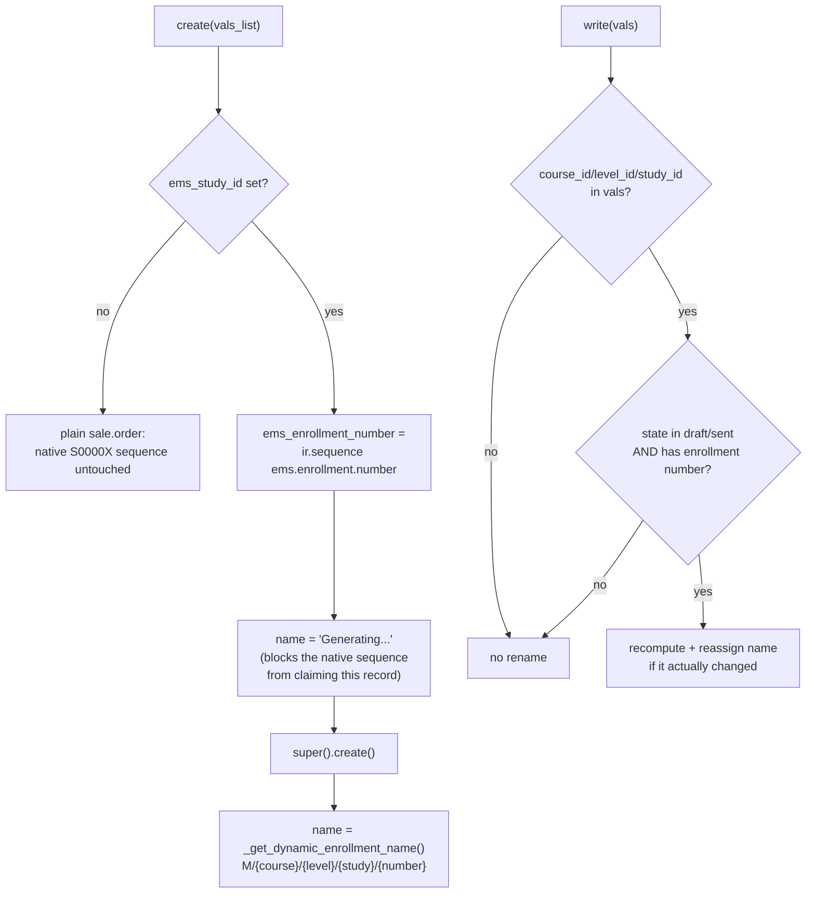
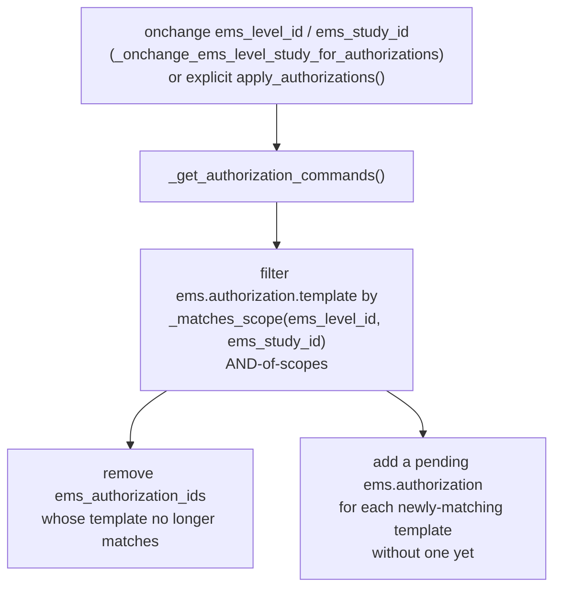
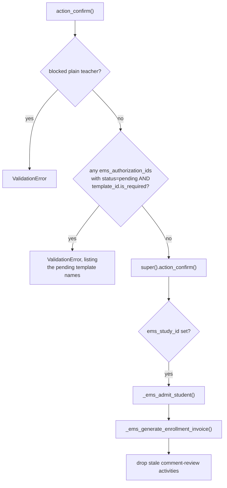
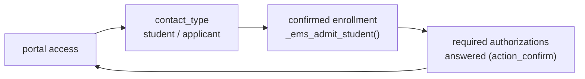

# Technical Reference: Enrollment header (`sale.order` extension)

## Overview

There is no dedicated `ems.enrollment_header` model — "enrollment" at the
document level is this project's name for Odoo's native **`sale.order`**,
extended with EMS-specific fields, state-transition guards and the
admission/billing side-effects that fire on confirmation. Do not confuse it
with [`ems.enrollment`](../contacts/enrollment.md) (a different model: the
student x group x subject junction row created once a student is actually
placed), nor with [`sale.order.template`](enrollment_template.md) (the "pack"
of pre-filled lines an enrollment can start from). Its lines are documented
separately in [`enrollment_line.md`](enrollment_line.md) (`sale.order.line`)
and [`enrollment_product_extension.md`](enrollment_product_extension.md)
(`product.template`).

**Module file:** `models/enrollment/enrollment.py` (`SaleOrder`, `_inherit = "sale.order"`)

---

## Fields

| Field | Type | Notes |
|-------|------|-------|
| `ems_enrollment_number` | `Char`, readonly | Sequence-generated (`ems.enrollment.number`) on `create()`, only when `ems_study_id` is set. Feeds `_get_dynamic_enrollment_name()`. |
| `ems_course_id` | `Many2one → ems.course` | Academic year. Defaults to the course flagged `is_enrollment_default`, falling back to `is_current`. |
| `ems_study_id` | `Many2one → ems.study` | The study being enrolled into. Required at the view level only. |
| `ems_level_id` | `Many2one → ems.level` (`related='ems_study_id.level_id'`, stored) | Read-only, purely derived — needed to group/filter the list view. |
| `shift` | `Selection` (morning/afternoon) | Not required/defaulted at the model level (commented out deliberately). |
| `ems_group_id` | `Many2one → ems.group` | Destination group placement — see [Admission and placement](#admission-applicant--student-and-destination-placement) below. Domain restricted to the selected study only; a shift/course mismatch is a soft onchange warning, never a hard block. |
| `sale_order_template_id` | native, re-domained | Only offers templates whose `ems_study_id` matches this order's `ems_study_id`. |
| `ems_authorization_ids` | `One2many → ems.authorization` | Kept in sync with the level/study selection — see [Authorization sync](#authorization-sync). |
| `ems_payment_method` | `Selection` (transfer/direct_debit) | Read by `_ems_generate_enrollment_invoice()` to decide whether to attach a bank account to the invoice. |
| `ems_has_fees`, `ems_fee_amount`, `ems_non_fee_amount` | computed + stored, via `_compute_fee_amounts` | Split of `order_line` totals by `product_template_id.ems_is_enrollment_fee`. |
| `ems_first_installment`, `ems_second_installment` | computed (not stored), via `_compute_installments` | `first = non_fee + fee * 50%`, `second = fee * 50%` — the deferred-payment split. Mirrored (independently, per-invoice) inside `_ems_generate_enrollment_invoice`'s `pct1` calculation. |
| `ems_enrollment_status_label` | computed (not stored) | Cosmetic label for `state`, decoupled from the native selection labels so it can read "Pre-enrollment"/"Sent to student" instead of the generic sale.order wording. |

---

## Naming: `create()` / `write()`



The name is only ever refreshed while the order is still editable
(`draft`/`sent`); once confirmed (`sale`) a study/course change no longer
touches `name` — the code is meant to be stable from that point on.

---

## Uniqueness: one active enrollment per student per course

`_check_unique_enrollment_per_course` (`@api.constrains('partner_id',
'ems_course_id', 'state')`) blocks creating or updating an order into a state
where the same student already has another non-cancelled order for the same
`ems_course_id`. Cancelled orders (`state == 'cancel'`) are excluded, so a
student can always get a fresh enrollment after a previous one was cancelled.

**Fixed (2026-07-30):** `_check_unique_enrollment_per_course` alone is a Python-only
`search()`-then-raise check — two concurrent transactions could each pass it before either
committed, producing two live enrollments for the same student/course. Confirmed empirically
this race had never actually fired (0 duplicates in both this dev DB and a real production
snapshot), so it stayed a known, low-priority gap rather than an active incident — but was
closed anyway, as a defensive backstop, per the same "close it even if unreachable today"
reasoning applied to [`ems.enrollment`'s duplicate-triple gap](../contacts/enrollment.md).

A plain `_sql_constraints` unique can't express "unique except when cancelled", so
`SaleOrder.init()` creates a **partial unique index** directly instead:
```sql
CREATE UNIQUE INDEX IF NOT EXISTS sale_order_unique_enrollment_per_course
ON sale_order (partner_id, ems_course_id)
WHERE state != 'cancel' AND partner_id IS NOT NULL AND ems_course_id IS NOT NULL
```
mirroring the Python constraint's own skip conditions exactly. `create()`/`write()` now
catch the resulting `psycopg2.IntegrityError` (`_translate_enrollment_race_error`, matching
the established pattern already used in `ems.grade_session.create()`) and re-raise the same
friendly `ValidationError` message, so the rare race case reads the same as the common
already-blocked case rather than surfacing a raw DB error.

**Testing gotcha found while adding this:** unlike the `@api.constrains` check (which always
flushes before its own `search()`), the raw DB index only sees writes actually flushed to
PostgreSQL. A test that cancels one order and creates another for the same student/course
*within the same transaction* needs an explicit `self.env.flush_all()` in between, or
PostgreSQL still sees the pre-cancel row and incorrectly rejects the new one as a duplicate.
Confirmed via a full-codebase grep that no real production code path does this same
cancel-then-recreate sequence within a single transaction (real usage always spans separate
requests, which are already fully flushed and committed by the time a later one runs) — so
this is a test-only timing artifact, not a production behavior change. Tested in
`tests/test_enrollment_header.py` (`test_unique_enrollment_index_exists`/
`test_unique_enrollment_index_rejects_raw_duplicate_at_db_level`/
`test_unique_enrollment_index_allows_raw_duplicate_when_cancelled`/
`test_translate_enrollment_race_error_matching_index_raises_validation_error`/
`test_translate_enrollment_race_error_other_constraint_reraises_unchanged`).

---

## Tutor-blocking guards

`_is_blocked_tutor()` returns `True` for a *plain* teacher (member of
`ems.group_teacher` but none of `ems.group_tutor`,
`ems.group_academic_admin`, `ems.group_secretary`), **and**, since
2026-07-30, for a tutor who isn't genuinely *this order's own* tutor. It
gates `action_cancel`, `action_quotation_sent`, `action_quotation_send`,
`action_send_enrollment_proposal` and `action_confirm` — each raises a
`ValidationError` up front for a blocked caller, before calling into the
native action.

**Fixed (2026-07-30):** this Python guard used to only ask "is this a plain
teacher?" — the underlying `ir.rule`s in `security/rules/contacts.xml`
(`rule_sale_order_tutor` etc.) independently restrict write access for
`ems.group_teacher` members to orders where
`partner_id.tutor_id.user_id = user.id` (i.e. the caller is genuinely *that
student's* group tutor, not just someone in `group_tutor`), further limited
to `state == 'draft'` — so a tutor who is a `group_tutor` member but not
*this particular student's* tutor used to sail past `_is_blocked_tutor()`
and only get stopped by the `ir.rule` layer itself, with a bare
`AccessError` instead of the friendlier `ValidationError` a plain teacher
gets. Rather than re-deriving `rule_sale_order_tutor`'s own condition by
hand in Python (which would drift out of sync with the XML rule over time —
the same class of duplication bug just fixed for
[`ems.authorization.template`'s matching semantics](authorization.md)),
`_is_blocked_tutor()` now calls the record's own
`has_access('write')` (Odoo v18's non-deprecated access-check API, which
evaluates the real `ir.rule` domain) for a tutor: if it comes back `False`,
they're blocked with the same friendly message. Tested in
`tests/test_enrollment_header.py`
(`test_tutor_of_a_different_student_gets_friendly_error`/
`test_tutor_can_confirm_own_tutored_student`, the latter a regression guard
proving a genuine tutor can still confirm their own student's draft
enrollment).

**Fixed (2026-07-30):** cross-study/cross-tutor placement restrictions during
the enrollment *proposal* flow were enforced only in
[`ems.enrollment_proposal_wizard`](enrollment_proposal_wizard.md) — a tutor
editing an existing `draft` order's form directly (not through the wizard)
could set `ems_group_id` to a group belonging to a different study than
`ems_study_id`, since the client-side `@api.onchange` guards
(`_onchange_ems_study_id`/`_onchange_ems_group_id`) don't run on a direct
`write()`/RPC call and no `@api.constrains` backed them. Closed with
`_check_group_matches_study` (`@api.constrains('ems_group_id',
'ems_study_id')`), which raises a `ValidationError` whenever
`ems_group_id` is set and `ems_group_id.study_id != ems_study_id` — including
when `ems_study_id` is empty: a destination group always implies a study, by
every real writer of the field (the wizard sets both together; the model's
own `_ems_suggest_group()` refuses to suggest a group at all while
`ems_study_id` is empty; the form view marks `ems_study_id` `required="1"`).
A first version of the fix relaxed the check to allow "group set, study
empty," on the unverified assumption that this was a legitimate case — it
wasn't; only a direct ORM bypass (a test fixture) could reach that state, as
confirmed by auditing every real write path for `ems_group_id`. Tested in
`tests/test_enrollment_header.py`
(`test_group_from_another_study_raises`/`test_group_from_same_study_is_allowed`/
`test_clearing_group_is_allowed`/`test_group_without_study_raises`).

---

## Authorization sync

`ems_authorization_ids` (rows on [`ems.authorization`](authorization.md)) are
kept in step with the order's level/study selection, not hand-picked by the
user:



This shares the same AND-of-scopes matching as `ems.authorization.template`'s
own retroactive apply/remove methods, via the shared `_matches_scope()`
predicate — see [`authorization.md`](authorization.md#fixed-2026-07-30-unified-and-of-scopes-matching).

`action_confirm` then blocks on any authorization still `pending` whose
template is `is_required`:



---

## Offer to an ex-student (`sent`): ex-student → applicant

`write()`'s own "→ `sent`" branch calls `_ems_offer_to_ex_student()` (beside
`_ems_unfollow_teachers()`), which converts the partner of every EMS enrollment
being sent from `alumni`/`withdrawal` into `applicant`. It also unarchives them, points `study_id`/`level_id` at the study on
the order (the exit cleared both), and wipes the `exit_*` metadata.
`has_graduated` is left alone — it is a permanent mark. `expelled` is deliberately
never converted, matching `_ems_admit_student()` below, which only readmits
`applicant`/`alumni`/`withdrawal`.

**Why this has to exist.** Without it the four requirements form a closed loop and
a returning ex-student can never get in:



Sending the offer is the one deliberate act outside that loop, which is why the
hook lives on the send and not on `create()`: a draft can still be deleted.

**It must hang off `write()`, never off `action_quotation_sent()`.** Odoo does not
call that method when the quotation is emailed — the path the UI actually takes:
`message_post()` marks the order itself with a direct
`write({'state': 'sent'})` (`sale/models/sale_order.py`, guarded by the
`mark_so_as_sent` context key, with `tracking_disable=True`, which is also why no
`draft → sent` tracking value is recorded for it). `action_quotation_sent()` is
only reached from the "Mark as sent" action, the payment flow and EMS's own bulk
button — and it ends in that same `write()` anyway. Hooking the conversion there
first (issue #433) therefore missed the email composer entirely, and the
`TransactionCase` tests went green over it because they called
`action_quotation_sent()` directly instead of driving the real path; issue #438
moved it and added a test posting with `mark_so_as_sent=True`.

`action_send_enrollment_proposal()` calls the helper on every order it sends, not
only the drafts: a re-send of an already-`sent` offer involves no state change, so
`write()`'s branch never fires for it. That is also the recovery path for an offer
sent before the conversion existed. The helper is idempotent — an `applicant` is
skipped.

`applicant` is not a workaround here; it is the state that already models "holding
an offer for a study, with a portal user of their own". The transition wizard does
exactly the same for a graduate whose offer nobody has confirmed yet
(`ems.course_transition_wizard._apply_pending_graduates()`), and
`ems.portal.access.wizard` sends a *minor* applicant's credentials to the family
rather than to the minor whenever family contacts are on file — see
[`contacts/portal_access_wizard.md`](../contacts/portal_access_wizard.md).

---

## Admission (applicant → student) and destination placement

On confirmation, `_ems_admit_student()`:
1. Converts an `applicant` partner into a `student` (`_ems_convert_to_student`).
2. Clears the GEDAC `preinscription_*` fields if the study being confirmed
   matches the pending assignment (a different study being confirmed — the
   manual escape hatch — leaves the assignment standing).
3. If the bulk pass has already happened for this enrollment
   (`_ems_placement_is_individual()`: the destination study is `transitioned`,
   **or** the enrollment's course is already the company's current one),
   immediately calls `_ems_apply_destination_placement()` — this is the
   latecomer path; an enrollment for a course that has not started yet is
   placed in bulk later by the transition wizard, not here.

`_ems_suggest_group()` / `_ems_fill_suggested_group()` provide a best-guess
`ems_group_id` (same acronym + shift as the student's current group for a
continuer; lowest-letter group of the shift for an applicant) without forcing
it — placement always goes through the explicit `ems_group_id` field.

`_ems_apply_destination_placement()` is idempotent and shared between this
individual/latecomer path and the transition wizard's bulk path: it sets
`partner.main_group_id` and creates one `ems.enrollment` row per
(student, group, subject) triple not already present, running under `sudo()`
because `ems.enrollment` blocks manual creation for non-admins.

That `sudo()` did not actually get past the block until 2026-09-01. `sudo()`
only sets `env.su`; `env.user` stays the real one, and `ems.enrollment`'s guard
asked `env.user.has_group('ems.group_academic_admin')` — which is false for
everybody who ever confirms an enrollment (the student on the portal, the
secretary in the backend). It stayed invisible while the placement only ran for
a study already `transitioned`, and broke every confirmation the moment the
26-27 flip made `_ems_placement_is_individual()` true for the whole pending
queue. The guard now honours `env.su` — see
[`contacts/enrollment.md`](../contacts/enrollment.md#default_get--admin-only-manual-creation).

---

## Billing

The student picks `payment_term_id` on the portal enrollment-confirm page
from the plans an admin/secretary marked portal-visible — see
[`payment_term.md`](payment_term.md) for that `account.payment.term`
extension. `_ems_generate_enrollment_invoice()` (idempotent — a no-op if a
live `out_invoice` already exists) creates and posts the enrollment's
invoice:

- **Single payment:** one due date (`_ems_billing_due_dates()`'s first date,
  15-Jul of the course start year by default).
- **Deferred (fees split):** a two-line `account.payment.term` is generated
  on the fly, splitting `ems_first_installment` / `ems_second_installment`
  as percentages of the invoice total, due at the first/second dates
  respectively. Only triggered when the order's `payment_term_id` already
  has more than one line *and* there's a non-zero second installment.
- **Direct debit:** attaches the student's first bank account
  (`partner_bank_id`) to the invoice — but only if it's already trusted
  (`allow_out_payment = True`). **Fixed 2026-07-30:** this method used to try
  to silently force-trust an untrusted account
  (`bank.sudo().allow_out_payment = True`) right here, but that doesn't
  reliably work — Odoo's own `account_move` validation (an anti-fraud check)
  strips an untrusted bank reference from the invoice under sudo/portal
  contexts regardless, which is exactly what caused 332 of 363 posted
  direct-debit invoices in production to end up with no bank account
  attached. Rather than keep fighting that check, an untrusted bank now
  raises a clear `ValidationError` instead — the real fix is making sure the
  account is trusted *before* invoicing is attempted (see
  `student_document.md`'s IBAN-approval flow, and
  `plans/student_document_iban_renewal_allow_out_payment.md` for the full
  investigation).

`action_ems_reapply_benefits()` is the explicit re-entry point for a
confirmed order whose benefit status changed after confirmation (confirmed
orders freeze their fee lines against later bonification/exemption changes):
it cancels the unpaid invoice, recomputes price/discount on the lines, and
regenerates the invoice — refusing if any existing invoice already has a
payment registered.

---

## Portal comment review

When a student/family leaves a comment instead of confirming (the "comment"
action on `controllers/portal_enrollment.py`'s confirm route),
`_ems_schedule_comment_review_activities()` schedules one systray to-do per
configured reviewer and posts the comment on the enrollment's chatter. See
[`mail_activity.md`](mail_activity.md) for how resolving one reviewer's
copy closes it for the others, and how the "Sales Order" systray group gets
relabeled "Enrollments".

---

## Views

| View | File | Notes |
|------|------|-------|
| List/Search | `views/academic_management/enrollment/enrollment_list.xml`, `enrollment_search.xml` | The Matricules list; `action_ems_enrollments`. |
| Form | `views/academic_management/enrollment/enrollment_form.xml` | Adds all EMS fields, authorization lines, `action_send_enrollment_proposal` button. |
| Menu | `views/academic_management/enrollment/menu.xml` | Under Academic Management. |
| Contact kanban | `views/community/contact/kanban.xml` | Overrides `action_view_sale_order`, embedding the student's own enrollments. |
| Contact form | `views/community/contact/form.xml` | Adds/relabels the *Sales & Purchase* page and its `action_view_sale_order` button for a student partner. |

## Data

Enrollment number sequence: `data/custom/ems.sequence.enrollment.xml`
(`ems.enrollment.number`, `__import__.`-prefixed per the centre-owned data
convention). Authorization template seed data:
`data/custom/ems_authorization_template_data.xml`.

## Fixed in this pass (2026-07-28)

Class renamed `ems_SaleOrder` (mixed snake/Pascal case) → `SaleOrder`,
matching the sibling `_inherit`-only classes in `models/enrollment/`. All
inline comments translated from Spanish to English. Loop variable renamed
`rec` → `order` throughout, per the project's coding standard (loop variable
named after the model). Every previously-untranslated `ValidationError`
message and one activity `summary=` wrapped in `_()`, with the corresponding
`.po` entries added to `i18n/ca_ES.po`/`i18n/es_ES.po`. New test coverage in
`tests/test_enrollment_header.py` (naming, uniqueness constraint,
fee/installment computes, tutor guards including the `ir.rule` interaction
above, the `action_confirm` authorization gate, `apply_authorizations`).
Two real, pre-existing gaps were found and documented above (no
`_sql_constraints` backing the uniqueness rule; `_is_blocked_tutor()` not
covering the `ir.rule` layer's per-student tutor check) but left unfixed —
they are business-logic-adjacent security changes, out of scope for a
normalization pass.
