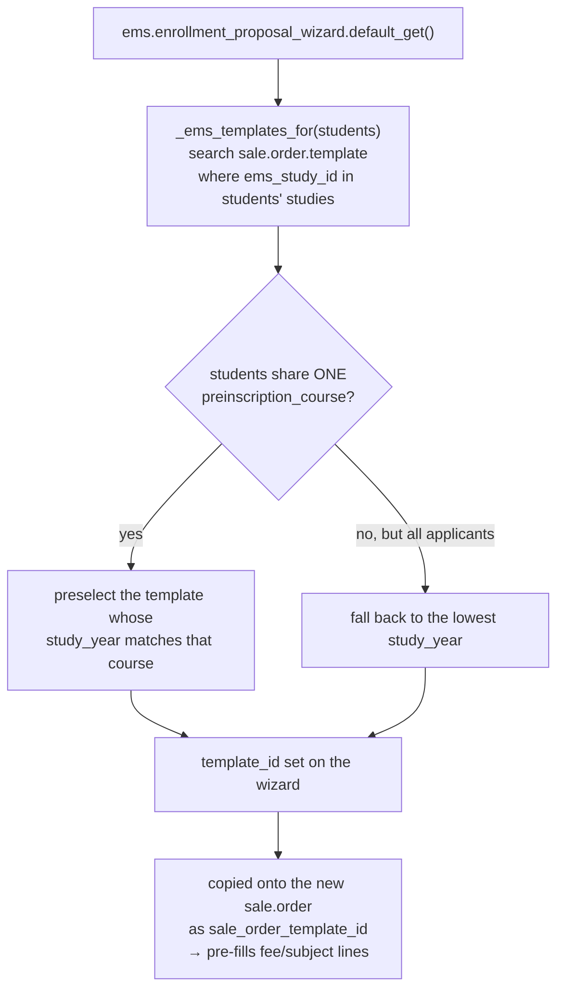

# Technical Reference: Enrollment templates (`sale.order.template` extension)

## Overview

There is no dedicated `ems.enrollment_template` model — "enrollment template" is this project's name for Odoo's native **`sale.order.template`** (a reusable quotation template, from the `sale_management` module), extended with three EMS-specific fields. A template is a study's fee "pack" for a given entry course: which products (subjects, fees) get pre-filled onto a new enrollment ([`sale.order`](enrollment.md)) once picked.

**Module file:** `models/enrollment/enrollment_template.py` (`SaleOrderTemplate`, `_inherit = 'sale.order.template'`)

---

## Fields

| Field | Type | Notes |
|-------|------|-------|
| `ems_study_id` | `Many2one → ems.study` | Which study this template belongs to. Required at the view level (`views/academic_management/enrollment_configuration/enrollment_template_form.xml`), not at the model level. |
| `ems_level_id` | `Many2one → ems.level` (`related='ems_study_id.level_id'`, stored) | Read-only convenience field, purely derived — drives `ems.study.uses_enrollment_flow` alongside `ems_study_id` (see [`ems.study`](../curriculum/study.md#uses_enrollment_flow-computation)). |
| `study_year` | `Integer` | The entry course this template is for (1st, 2nd…). Central to auto-selection — see below. |
| `ems_existing_product_ids` | `Many2many → product.product` (computed, not stored) | Every product already on one of this template's lines — used purely to filter the product-picker domain on new lines (`ems_existing_product_ids` excludes what's already there, avoiding duplicate subject/fee lines). |

`_compute_existing_products` (`@api.depends('sale_order_template_line_ids.product_id')`) just maps the existing lines' products — no business logic beyond that.

---

## Feeding the enrollment proposal wizard

`ems_study_id` and `study_year` together are what let [`ems.enrollment_proposal_wizard`](enrollment_proposal_wizard.md) auto-preselect the right template for a batch of students without the secretary picking one by hand every time — see that wizard's `_ems_templates_for`/`default_get`. A study with **no** active template for a given course simply offers none (the wizard falls back to "free mode" for secretary/admin, blocking a plain tutor — see the wizard's own doc).

### `_ems_find_for(study, course)`

A single-template lookup for an *already known, exact* `(study, course)` pair — `search([('ems_study_id', '=', study.id), ('study_year', '=', course)], limit=1)`, or an empty recordset if `study`/`course` is falsy. Used by [`res.partner._ems_refresh_enrollments_from_template()`](../contacts/contact.md#_ems_refresh_enrollments_from_template--regenerating-subject-enrollments-on-a-study-change) to resolve the template for a student whose course is already known (their auto-picked group's `course`), unlike `_ems_templates_for()` above, which lists *candidates* across several students/a course floor for a human to pick from in a wizard dropdown — a different shape of problem, not a case the two share a domain for. Nothing enforces a single template per study+course (see CLAUDE.md's data folder conventions); if more than one matches, the first one found is used — there is no extra signal here to disambiguate further, the same place the wizard itself ends up once nothing else narrows a course down to one candidate.

## Driving `ems.study.uses_enrollment_flow`

`ems.study`'s own `uses_enrollment_flow` computed field (consumed by the "no destination" report, transition-status computation, and the transition wizard preview) is derived from whether **any** active `sale.order.template` points at that study via `ems_study_id` — this file's `ems_study_id` field is the only thing that flag actually reads. See [`ems.study`](../curriculum/study.md#uses_enrollment_flow-computation) for the full diagram.

---

## Views

Pure `_inherit` xpath extensions of the native `sale.order.template` views — no standalone view of its own:

| View | File | Notes |
|------|------|-------|
| List/Search | `views/academic_management/enrollment_configuration/enrollment_template_view.xml` | Adds `study_year`/`ems_level_id`/`ems_study_id` columns and group-by filters; `action_ems_enrollment_template` ("Enrollment Templates") |
| Form | `views/academic_management/enrollment_configuration/enrollment_template_form.xml` | Adds the "Academic Information" group; hides several native fields not relevant here (`number_of_days`, `mail_template_id`, `journal_id`, `require_signature`, `require_payment`, the *Optional Products*/*Terms & Conditions* pages); restricts the line product picker's domain to products matching the template's study/level (`ems_study_ids`/`ems_level_ids` on `product.template`, excluding `ems_existing_product_ids`) |
| Menu | `views/academic_management/enrollment_configuration/menu.xml` | `menu_ems_enrollment_templates`, under Academic Management → Configuration |

## Data

Seed templates ship in `data/cat/ems_enrollment_template_data.xml` (~1080 lines, one per study/course combination) and `data/custom/ccff/ems_enrollment_template_opt.xml` (centre-specific optional-subject templates).

## Fixed in this pass (2026-07-28)

Class renamed `ems_SaleOrderTemplate` (mixed snake/Pascal case) → `SaleOrderTemplate`, matching the sibling `_inherit`-only classes already in `models/enrollment/` (e.g. `ProductTemplate` in `enrollment_product_extension.py`). `ems_level_id`'s `string="Nivel"` (Spanish, the field's *source* text — an oversight, not a translation) fixed to `string="Level"`, reusing the project's already-translated "Level" string rather than creating a new one.
