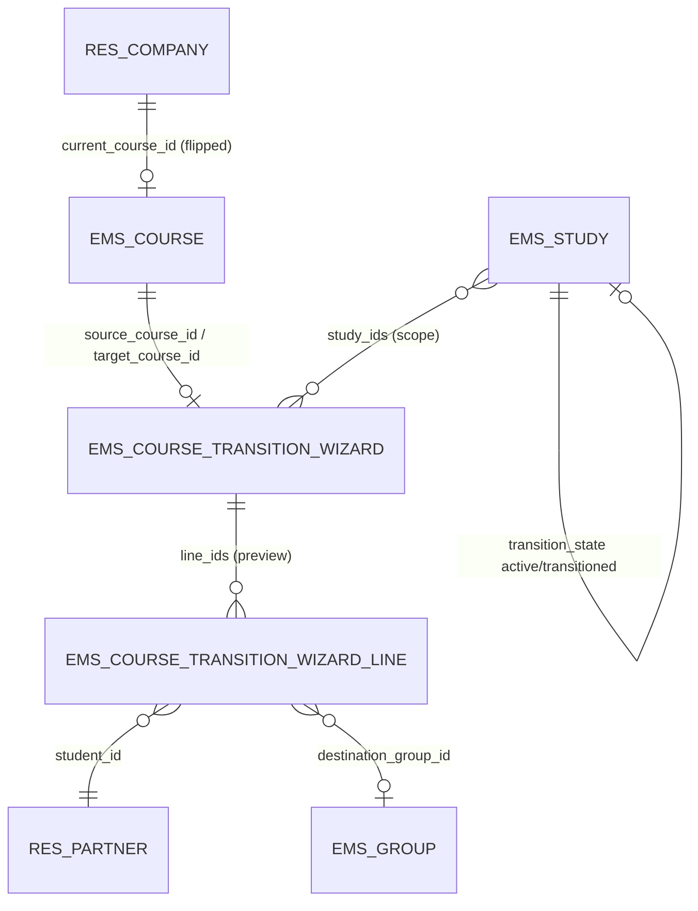
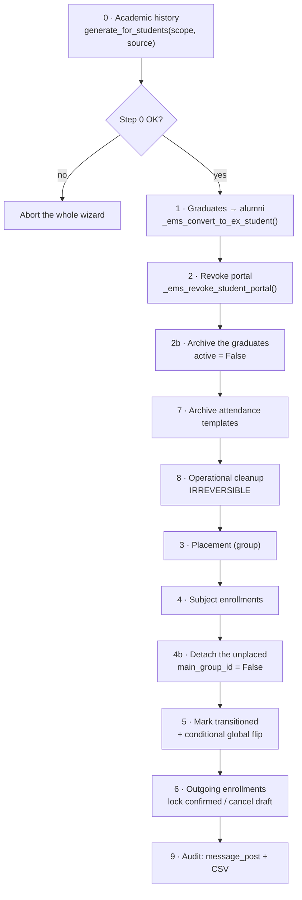
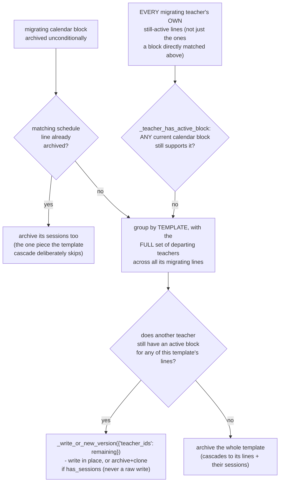
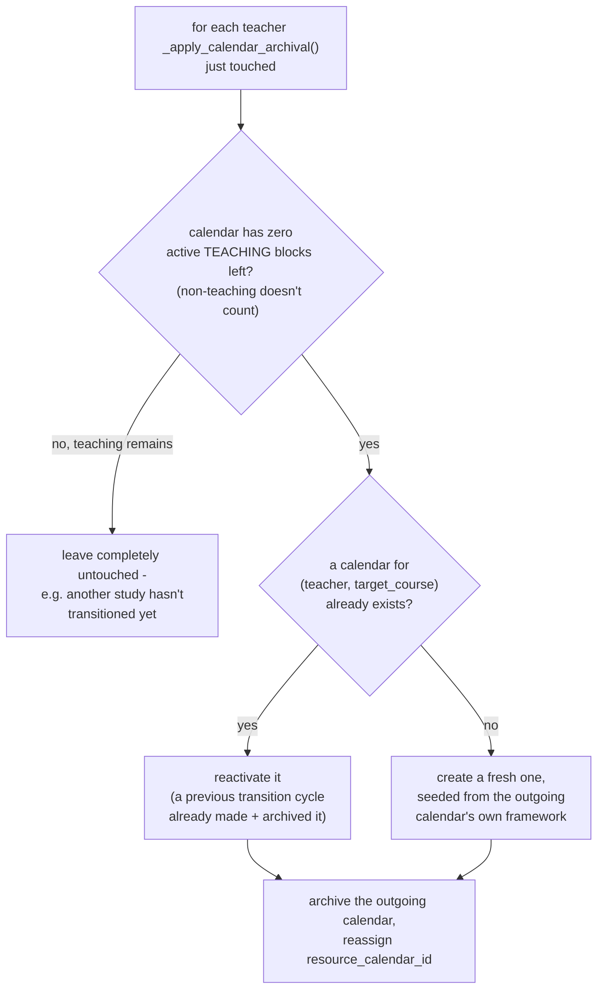
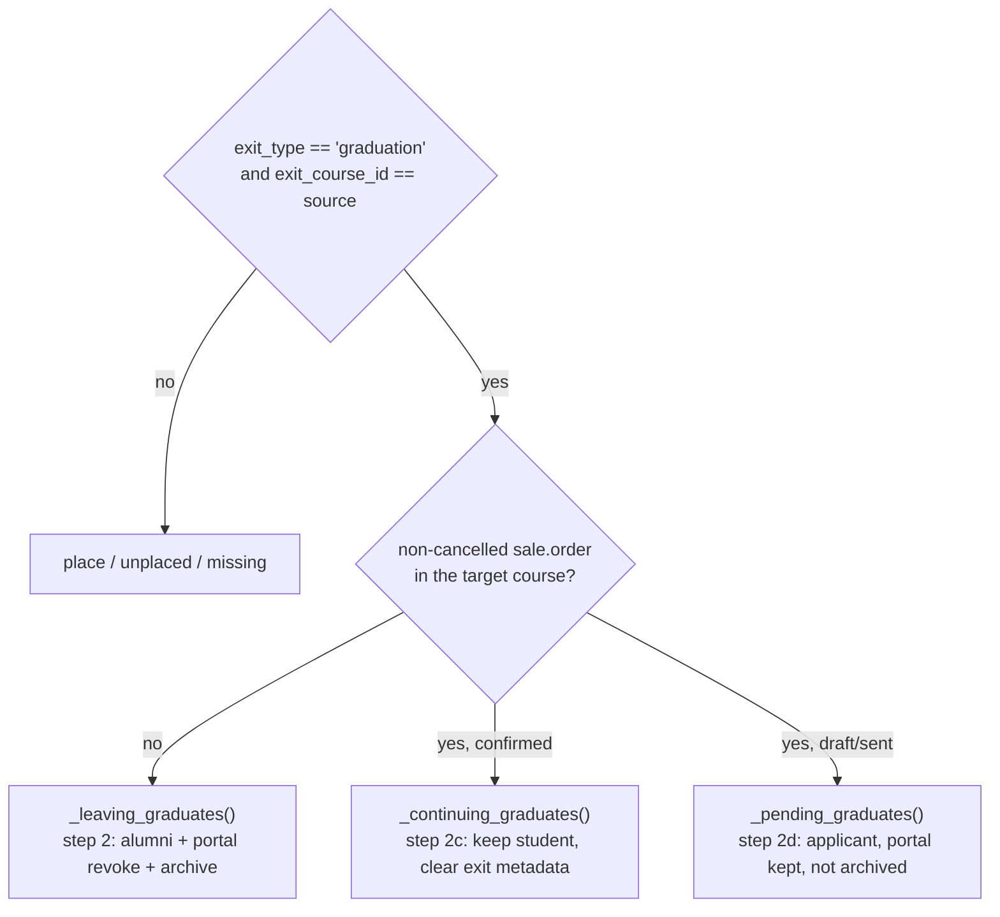
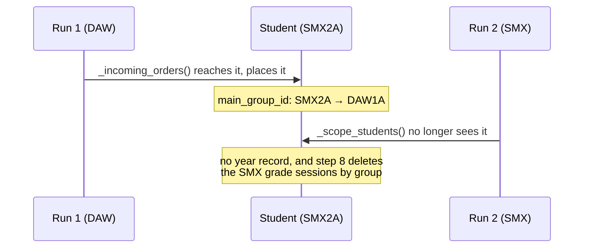
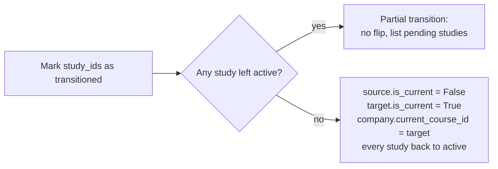

# Technical Reference: `ems.course_transition_wizard`

## Overview

`ems.course_transition_wizard` is the **end-of-year transition**: the single operation that closes the outgoing course and opens the incoming one. It freezes the academic history, turns graduates into archived alumni, places the returning students into their destination groups from their confirmed enrollments, and wipes the operational records of the year that just ended.

It is deliberately **scoped by study** (`study_ids`), because studies do not finish at the same time: a CFGS may be closed in June while an ESO level is still evaluating. Each run transitions the studies it is given and marks them `transitioned`; the **global course flip** (which course is "current") only happens on the run that leaves no `active` study behind.

The wizard is **preview-first**: nothing is written until a dry-run has listed the blockers, the warnings and the exact record counts, and the operator has ticked the backup checkbox. Step 8 is irreversible.

**Module files:** `models/settings/course_transition_wizard.py`, `models/curriculum/study.py` (`transition_state`), `models/enrollment/enrollment.py` (`_ems_admit_student` latecomer branch), `views/settings/course_transition_wizard.xml`, `views/settings/form.xml`, `security/ir.model.access.csv`, `tests/test_course_transition.py`, `static/tests/tours/course_transition_tour.js`

## Hierarchy and relations



Both models are `TransientModel`: the preview is a throwaway projection, never a stored plan.

## `ems.study.transition_state`

```python
transition_state = fields.Selection(
    [('active', 'Active'), ('transitioned', 'Transitioned')],
    default='active', copy=False)
```

A new field, so **no migration script** is needed (no XML ID is renamed). It is the switch that makes a *latecomer* work: `sale.order._ems_admit_student()` places a student immediately (group + subject enrollments) when the destination study is already `transitioned`, and leaves the placement to the bulk wizard while the study is still `active`. That branch already exists in `enrollment.py`, guarded by a `getattr` because the field did not exist yet; creating the field and dropping the `getattr` activates it.

Step 5 resets every study back to `active` when the flip happens, so the next course starts clean.

## Preview (dry-run — writes nothing)

### Blockers

| Blocker | Rule |
|---------|------|
| Target course | It exists and is different from `source_course_id` |
| Evaluation not closed | Every `ems.grade_session` of the **last round** (max existing `round` per group·subject) of the groups in scope is in state `final`, linking the offenders to `ems.action_grade_session_state_wizard` |
| Confirmed enrollment with no group | No `sale.order` of `_incoming_orders()` lacks `ems_group_id` (D13) |
| Student with no enrollment | No `missing` line whose `study_id.uses_enrollment_flow` is true (D17) |
| Origin study still evaluating | No study this run pulls a student **out of** — outside the scope and not yet `transitioned` — has an unfinalised last round (D11) |

### Warnings (informative, never blocking)

| Warning | Note |
|---------|------|
| Graduates continuing at the centre | `action = 'graduate_continue'`, **listed one by one**: they keep the graduation but are neither converted nor archived (D10) |
| Students with no destination | `transition_status = 'missing'`, **listed one by one** (D8), split by `study.uses_enrollment_flow` |
| Draft / sent enrollments in the target course | **NOT cancelled** — step 6 only touches the outgoing course. They stay open for a September confirmation |
| Incomplete evaluation | See the rule below (D9) |
| Students with no group at all | `_orphan_students()`, **listed one by one** (D18) |
| Attendance templates to archive | Including templates whose `group_ids` span studies both in and out of scope |
| Records to delete | Counts per model for step 8, grade sessions included |

### Incomplete-evaluation rule (D9)

The criterion depends on whether the group is in the **last course of its study**:

- **Not the last course** (e.g. 1st of a CFGM/CFGS): `internal_is_complete` on `ems.grade_subject_line`. Promotion to the next course is decided by the *internal* grade — the 90% awarded by the centre.
- **Last course**: `has_final`, which also demands the external (work placement) part.

The reason is that the **work placement (EM) only exists in the final course**, when students actually go to a company. Since the centre's `ems.planning` gives a 10% `external_ponderation` to first-course subjects as well, `_final_from_parts()` returns `(0, False)` for them — no final grade at all, not even a failing one. Using `has_final` everywhere would therefore report *every* first-course student as incompletely evaluated.

This mirrors the semantics already frozen in the academic history, where `ems.student.year_record.subject.state` is binary and **determined only by the RAs**: a pending or failed work placement never fails a subject, because the student repeats the placement, not the subject.

## Apply



Steps 3 and 4 are a single bulk call to `sale.order._ems_apply_destination_placement()`, which is already idempotent and already ordered (group before subject enrollments). Every step is scoped to `study_ids` except the flip.

### Why the cleanup runs before the placement

The steps are numbered by the phase they belong to, not by the order they execute in: **7 and 8 run before 3 and 4**, and that is load-bearing rather than cosmetic.

`res.partner._ems_clear_operational_records()` deletes *every* `ems.enrollment` of the student with no group or course filter. It was written for a withdrawal, where the student leaves the centre altogether and keeping any enrollment would be wrong. Running it after the placement would therefore delete the very enrollments steps 3-4 had just created, leaving every promoted student in their new group with no subjects at all.

`tests/test_course_transition.py::test_apply_keeps_the_new_enrollments_after_the_cleanup` pins this down: swapping the two blocks makes it fail, together with the two placement tests.

### Archiving attendance templates cascades to their schedule lines (step 7)

`_templates_to_archive()` (the scope minus any template whose `group_ids` span a study still out
of scope) is archived via `action_archive()`, not a bare `write({'active': False})` — the
distinction matters: `EmsAttendanceTemplate.action_archive()` is overridden to also archive
`attendance_schedule_ids`, while a plain `write()` bypasses that override entirely. An earlier
version of this method used `write()` directly, which left every archived template's schedule
lines `active=True` forever - invisible in the template's own (now-archived) form, but still
matched by `classify_external_conflicts`/`find_self_conflicts` (`ems.attendance_template`, used by
the working-schedule import wizard's own conflict screens), silently contradicting those methods'
own docstring assumption that a transitioned study has nothing active left to reconcile against.
`test_apply_archives_the_schedule_lines_of_an_archived_template` pins this down - the two older
template tests never caught it because their own `_template()` fixture creates a template with no
schedule lines at all.

### Teacher calendar blocks: found at preview, archived at apply (`plans/course_transition_teacher_schedule_archival.md`, phases 5b-5c)

`_migrating_calendar_blocks()` finds every active `resource.calendar.attendance` row, on any
teacher's real (non-framework) personal calendar, whose own `group_ids` belongs to a study in
scope — the calendar-side mirror of `_scope_templates()`'s domain, but read directly from the
calendar block itself rather than trusted purely via the attendance template it happens to back.
This is deliberately **independent** of `_templates_to_archive()`: a teacher can build their own
schedule bypassing the normal template/calendar sync, so a calendar block genuinely in scope isn't
guaranteed to have a perfectly-matching template/schedule line — `resource.calendar` is meant to be
the authoritative source for "what does this teacher's calendar say they're teaching," independent
of whether the template side agrees (see the plan's own decisions 3/4). `action_preview()` counts
these blocks (`calendar_block_count`, shown alongside `template_count`) — read-only, same as every
other preview counter.

`_apply_calendar_archival()` (step 7a, called right after `_templates_to_archive().action_archive()`
in `_apply_cleanup`) is where they actually get archived. For every migrating block it finds the
matching `ems.attendance_schedule` line(s) — **preferably a direct read of the block's own
`attendance_schedule_id` FK** (added 2026-08-11 specifically to replace this kind of lookup, wired
into this call site 2026-09-02 — see `plans/calendar_pipeline_simplification.md` for why it took
this long: nothing had gone back to update this call site once the FK existed), **falling back
to** `ems.attendance_mixin.find_schedule_lines_for_teaching`
(matched by teacher+subject+group overlap+weekday/time, **deliberately not room** — searched with
`active_test=False`, since the line may already be archived by the template-cascade that just ran)
only for a legacy block whose calendar row predates that FK and was never resynced since. Either
way, then:



The "already archived" branch is the expected path on well-synced data: every co-teacher of the
same class shares the same `group_ids`, so they migrate together in the same run and
`_templates_to_archive()` (unconditional by study scope) already archived the line — this call just
catches up the one piece that cascade deliberately skips (`attendance_session_ids`, since archiving
a schedule line never cascades to sessions on its own — see
[`attendance_schedule.md`](../attendance/attendance_schedule.md)). The "does another teacher still
need it" branch only matters for the decision-3/4 drift case: a calendar block can reference an
in-scope group even when its own template's `group_ids` don't, so `_templates_to_archive()` never
reaches that template at all — `_apply_calendar_archival()` is what still catches it, independently,
from the calendar side.

**Second, orphaned-line pass (2026-08-10, developer feedback: "lo que manda es el calendario"),
right after the direct block-match loop above:** for every migrating teacher, every one of their
OWN still-active lines — not only the ones a specific calendar block happened to match directly —
is checked via `_teacher_has_active_block(teacher, line)`: does ANY of that teacher's current
calendar blocks still support this exact line (same subject, group overlap, weekday/time — again,
never room)? If not, the line counts as departed too, exactly like one found via a direct match.
Real scenario this closes: a teacher edits their calendar by hand, bypassing the normal sync, so an
old line (a different group/time the calendar no longer shows at all) would otherwise never be
found by the direct block-match loop and would linger active forever. `_teacher_has_active_block()`
is reused for both directions of this check — a REMAINING co-teacher genuinely still supported (its
original use, in the `still_needed` branch above) and a DEPARTING teacher's own line with no
calendar support left (this newer one) — same predicate, same room exclusion, one function.

**Phase 4 of `plans/calendar_pipeline_simplification.md` (2026-09-02):** `_teacher_has_active_
block()` used to run its own standalone `resource.calendar.attendance` query to answer "what does
this teacher's calendar currently say they teach"; it now builds that answer from `hr.employee.
_teaching_entries_from_calendar()` instead — the exact same primitive `_apply_teaching_resync()`
just below already reuses, and the same one `ems.attendance_template.sync_from_schedule_batch()`/
`regenerate_all_from_calendars()` rely on elsewhere. One definition of "current teaching entries
from the calendar" for the whole module, instead of two that could silently drift apart.

**Third, fully UNSCOPED catch-up (2026-08-10, same day, found re-running a real transition right
after the first two fixes above were deployed):** the 4 real stray session headers that originally
motivated this whole fix (David Delgado, see `find_schedule_lines_for_teaching`'s own docs) turned
out to need a THIRD fix, not just the first two — both checks above only ever consider a teacher
who is currently "migrating" *in this specific run* (an active calendar block, or an active line to
compare one against), but David Delgado's entire calendar had already been fully archived in an
*earlier* run (already rolled over to his current calendar, zero active blocks left), so he never
entered `affected_teachers` this time either, and his already-archived stale line was never looked
at by either check. Fixed with one more, deliberately unconditional query, right before this method
returns: every already-archived `ems.attendance_schedule` line **anywhere** with still-active
sessions gets those sessions archived — not scoped to this run's own `affected_teachers` or
`study_ids` at all. This is a plain data-integrity invariant ("an archived line's sessions are also
archived"), correct precisely because there is no legitimate scenario where an archived line should
keep an active session, regardless of which run (or how long ago) archived it.

**The decision is made once per TEMPLATE, with every departing teacher found across all of that
template's migrating lines, never once per line/teacher.** Two reasons, found while implementing
this exact branch:
- **Correctness**: `teacher_ids` lives on the template, shared by every one of its lines — deciding
  per line and writing it directly the first time a departure is found would be wrong the moment a
  template has more than one line, and would corrupt already-taken sessions' own
  `template_teacher_ids` (a `related` field) the moment the template `has_sessions` — see
  [`attendance_template.md`](../attendance/attendance_template.md)'s "Identity fields, locking, and
  the 'Edit' button". The fix: never write `teacher_ids` directly here — always go through
  `_write_or_new_version()` (`ems.attendance_mixin`), the exact same mechanism the "Edit" button
  uses, which writes in place only when there's no session history yet, or archives the original
  (leaving its own `teacher_ids`, and its sessions' `template_teacher_ids`, historically untouched)
  and clones a corrected version otherwise.
- **No needless clones**: deciding with the *full* departing set (not one teacher at a time) means
  a template every one of whose co-teachers departs in the same run is simply archived outright —
  `remaining` comes out empty, so `_write_or_new_version()` is never even called for it. Only a
  template that genuinely keeps at least one active co-teacher goes through the write-or-clone path.

Building the `_write_or_new_version({'teacher_ids': ...})` call itself surfaced two further, more
general bugs in that shared mechanism (not specific to this wizard) — see
[`attendance_template.md`](../attendance/attendance_template.md)'s own note on the two 2026-08-06
fixes (`attendance_schedule_ids` needed `copy=True`; the follow-up `.action_unarchive()` needed
`active_test=False`) — both had to land before this branch could work at all. The `teacher_ids`
override itself must be a full replacement command (`[(6, 0, remaining.ids)]`), not a `(3, id)`
"unlink" one: `_write_or_new_version`'s archive+clone branch applies `vals` via `copy()`'s own
`default` argument, which populates the brand-new record's `teacher_ids` from `vals` alone rather
than merging it with the original's.

### Attendance justifications and "daily issues" also get caught up (2026-08-10)

Found auditing real dev data before a batch import: `ems.attendance_justification` and
`ems.attendance_issue_status`/`_student`/`_tutor` ("daily issues") were never wired into this
wizard at all, in any of its earlier phases — confirmed by grep, zero references in this file
before this fix. `res.partner._ems_clear_operational_records()` (called later in `_apply_cleanup`,
see "Why the cleanup runs before the placement" above) already **deletes** issue records, but only
for a student still in `_scope_students()` at run time — captured by *current* `main_group_id`.
A student already detached from any group (stranded by an earlier run's `_apply_detach_unplaced()`,
or a reinforcement-group student never captured by `main_group_id` at all) falls outside that scope
forever, exactly the gap that left 2 justifications and 27 "daily issue" rows (10 tutor + 17 status)
sitting active in real data, all referencing sessions that were themselves already correctly
archived.

`_apply_attendance_records_archival()` (step 7c, called right after `_apply_calendar_archival()` in
`_apply_cleanup`, so it sees both this run's own newly-archived sessions and any pre-existing
leftover) fixes this with a condition keyed on the session's own archived state instead of student
scope — correct regardless of which run originally archived the underlying session:

- `ems.attendance_justification`: archived if it has at least one `attendance_session_line_ids`
  entry and **all** of them point at an already-archived session.
- `ems.attendance_issue_status`: archived directly by a domain on
  `attendance_session_line_id.attendance_session_id.active = False`. Its parent
  `attendance_issue_student`/`attendance_issue_tutor` are then archived too, once each is left with
  no active children — read via the model's own default active-filtered relation (no extra
  bookkeeping needed: "no active children left" and "the field reads empty" are the same
  observable state once the children are archived).

**Archives, never deletes** — unlike `_ems_clear_operational_records()`'s deletion, which is
specifically justified there for a student who has actually left the centre and whose stats are
already frozen in the year record. These records have no such freezing step, so archiving (keeping
them findable via the "Archived" filter, matching every other attendance model in this system) is
the safer default.

### A teacher's calendar rolls onto the next course once teaching empties out (`plans/course_transition_teacher_schedule_archival.md`, phases 6-7)

`_apply_calendar_rollover(teachers)` (step 7b, right after `_apply_calendar_archival()` — which
returns exactly the teacher set this needs, captured *before* their migrating blocks were
archived) is what actually makes a teacher's `resource_calendar_id` track the current course over
time, closing the loop `resource.calendar`'s own `employee_id`/`course_id` fields
(`working_schedule.md`) were added for:



- **The emptying check** (`calendar.attendance_ids.filtered(lambda a: a.active and not
  a.non_teaching)`) deliberately ignores non-teaching entries (a guard duty, a coordination
  meeting…) — a teacher who's done teaching but still has a leftover fixed commitment on their old
  calendar still rolls over; only *real teaching left* blocks it. This is what lets phases 5 and 6
  cooperate automatically without a manual trigger: a teacher only spanning studies that all
  transition together empties out and rolls immediately; one who also teaches a still-pending
  study keeps their current calendar untouched, exactly as before.
- **Reactivate before create**: searched with `active_test=False` on `(employee_id, course_id)` —
  a calendar for that exact pair can already exist, archived, from an *earlier* transition cycle
  (a teacher who left and came back, or a centre re-running a transition). Reusing it instead of
  minting a duplicate is what "one-per-(teacher, course), archived, never orphaned" (decision 5)
  actually requires in practice, not just at first creation.
- **Seeding**: a freshly *created* (not reactivated) calendar is seeded from the outgoing
  calendar's own `source_framework_id` — not unconditionally the company's default — so a teacher
  who's been following e.g. the CFGS framework keeps following it across the transition; the
  company default is only a fallback for a calendar that was never seeded from one to begin with.
- **Framework calendars are never touched** — `_migrating_calendar_blocks()` already excludes
  their attendance rows from ever counting as "migrating" in the first place (see above), but the
  `is_framework` guard here is kept anyway since this method's own precondition (being in
  `_apply_calendar_archival()`'s returned teacher set) is the only thing that would otherwise stop
  it from ever reaching a framework calendar by accident.

### The outgoing calendar's leftover non-teaching rows, and `ems.teaching`/`tutor_id` (2026-09-01, `plans/course_transition_stale_teacher_assignments.md`)

Two gaps found via a real Guard Duty Board report (a departed/reassigned teacher still showing
guard-duty slots), both stemming from the same root cause: the archival above is thorough for the
*calendar* side of a teacher's outgoing assignments, but nothing downstream of it reacted to the
adjacent, loosely-coupled models mirroring the same real-world fact.

**1. `ems_working_schedule.action_archive()` now cascades to its own `attendance_ids`** (mirrors
`ems.attendance_template.action_archive()`'s cascade to its schedule lines). The emptying check
above deliberately never counts a non-teaching row as "teaching left" — which is correct for
*whether to roll over*, but previously meant those non-teaching rows (guard duty, a coordination
meeting) were simply abandoned, still `active=True`, on the calendar `_apply_calendar_rollover()`
was about to retire. Any screen reading `resource.calendar.attendance` directly without also
checking `calendar_id.active` (the Guard Duty Board did) kept surfacing them indefinitely. The
Guard Duty Board's own query (`guard_duty_board.py`) now also filters `calendar_id.active = True`
as defense-in-depth — not redundant with the cascade, since a future path could in principle
archive a calendar through some other route without following the same convention.

**2. `_apply_teaching_resync(teachers)` (step 7c, right after `_apply_calendar_rollover()`)
resyncs `ems.teaching` from each teacher's now-final calendar.** `ems.teaching` was never touched
anywhere in this wizard before — a teacher's stale (subject, group) links from before the
transition survived forever, since the working-schedule importer's own incremental sync is
additive-only by design (`replace=False`, see `working_schedule.md`) and never removes them
either. The fix reuses `hr.employee._teaching_entries_from_calendar()` (the same entries dict
`ems.attendance_template.regenerate_all_from_calendars()` already builds for its own template
rebuild — extracted into a shared helper so both stay in sync with one calendar-reading
implementation) and calls `ems.teaching.sync_from_schedule(teacher, entries)` — the same
`replace=True` reconciliation the Schedule tab's own live edit already uses
(`ems_working_schedule.apply_schedule_changes`), just triggered from the transition instead of a
manual save. `regenerate_all_from_calendars()` itself gained the identical call, since it has the
exact same "rebuild from the calendar, but never touched `ems.teaching`" gap.

A group's tutoring assignment is itself recorded as an ordinary `ems.teaching` row on the group's
own tutoring subject (`ems.subject.is_tutorship`) — deliberately never a stored relation to
`ems.group.tutor_id`, which predates this model's calendar-driven sync and is still set directly
on the group form. `ems.teaching.unlink()` now clears `tutor_id` whenever the teaching row it
loses is one of these, and only while `tutor_id` still matches the departing teacher (never
clobbering a reassignment that happened in between). Because this lives on `unlink()` itself —
the one choke point every removal path already goes through — it fires for the resync above *and*
for a plain manual Schedule-tab reset, with no group-emptiness heuristic anywhere in this wizard.
Groups themselves are never archived by any of this (they're reused across academic years) — only
the now-stale tutoring/teaching references are.

**3. `_apply_detach_unplaced()` now also clears a stranded student's own group delegate**, via
the same `res.partner._ems_clear_stale_delegate()` helper `_ems_clear_operational_records()`
already used for a student leaving the centre entirely — extracted so both paths share one
implementation instead of the check existing in only one of them.

### Browsing archived templates/sessions/calendars afterwards (phase 8 of the same plan)

All three models this section's own steps archive can be found again afterwards via the search
bar's **Filters → Archived** toggle: `ems.attendance_template`/`ems.attendance_session_header`
needed the filter added by hand (see their own dev docs — Odoo does not auto-add it), while
`resource.calendar` already had it natively. A new **Course** group-by option on the "Working
Schedules" list (`working_schedule.md`) is what actually exposes the "who taught, in which
course" historical query the plan's phase 3-7 fields were built for.

### Archiving the graduates (D4, step 2b)

Graduates are **archived**, not just converted, consistent with issue #357 (withdrawals and alumni are both archived, mirroring how archiving an `hr.employee` asks for a departure reason).

The archive runs **after** the portal revoke and lives in the wizard rather than in `_ems_convert_to_ex_student()`, for two reasons: the helper runs before the revoke, and `res.partner.write()` refuses to archive a contact still linked to an active portal user. A student whose revoke failed is reported and left active instead of raising, so one failure cannot roll back a batch of hundreds.

### Graduating and continuing at the centre (D10, step 2c)

Finishing a study and enrolling into another one are **independent facts, not a contradiction**. A CFGM graduate moving up to a CFGS, or a CFGS graduate starting a second one — even in another family — is both at once, and the case is high volume: the 25-26 data has 28 SMX leavers enrolled into ASIX/DAM/DAW.

Earlier versions treated it as a blocker ("a student cannot leave and come back in the same run"), which refused the whole transition. It is now derived and split:



**Nobody marks `graduate_continue`.** It is a computed preview label: the tutor only knows about the graduation, and the enrollment arrives on its own through the GEDAC assignment, so the wizard is the only place where the two facts meet.

### Why an unconfirmed offer becomes an applicant (D12, step 2d)

The three cases are not two. A graduate holding an offer **nobody has confirmed yet** can be neither placed (there is nothing to place) nor turned into alumni, and the reason is a hard constraint rather than a preference:

> #357 archives every alumnus, and `res.partner.write()` refuses to archive a contact with an active portal user. An alumnus is therefore, by construction, someone **without portal** — and `/my/gestion-matriculas` is `auth="user"`, so without portal the offer could never be confirmed. `_ems_revoke_student_portal()` makes it worse: it revokes the family's user too unless another child is still enrolled, cutting off both routes.

`applicant` is the state that already models this exact situation, and reusing it means no new machinery:

| Need | Already provided by `applicant` |
|------|--------------------------------|
| Portal access | `ems.portal.access.wizard` domain is `('contact_type', 'in', ('student', 'applicant'))`, and an applicant gets **its own** login rather than the family's |
| Sees the offer | `get_portal_enrollment()` filters by partner, state and course under `sudo()` — no `contact_type` check |
| Return path | `sale.order._ems_admit_student()` has always converted `applicant` → student on confirmation |
| Not archived | Applicants are never archived by the transition |

Conceptually it is not a workaround: an internal SMX graduate holding an ASIX offer is in the very same position as an outsider who preinscribed to ASIX. `study_id`/`level_id` follow the destination on the order so they read as an applicant of the study they are heading to; the exit metadata is cleared (they have not left, they are waiting to come in); `has_graduated` stays, which is what makes a later manual withdrawal land on alumni.

**D3 reversed:** the wizard used to offer an "archive applicants without a confirmed enrollment" checkbox. It never archived anything — the flag only ever reached a warning, no apply step consumed it — and the intent was wrong anyway: applicants with no enrollment in July are precisely the ones who may turn up in September, and now that a graduate holding an unconfirmed offer becomes an applicant itself, the sweep would have caught them too. Checkbox, counter, warning and `_declined_applicants()` are gone; summer clean-up stays manual.

**Order is load-bearing:** step 2c runs *after* `_apply_history()`, because `year_record._generate_one()` stamps how the student left the outgoing course by reading `exit_course_id` — which `_ems_convert_to_student()` clears. `has_graduated` is never touched: it is permanent (D2).

`_ems_convert_to_student()` also sets `active = True`, and `sale.order._ems_admit_student()` converts `alumni`/`withdrawal` as well as `applicant`, so the individual September path matches what the bulk `_apply_placement()` already did.

### Freezing the history on the way out of the group (D11)

`year_record._generate_one()` reads `student.main_group_id` to stamp the group, study, level and tutor of the year that ends. Step 0 therefore only reaches the students the run still sees in its own groups — and `_incoming_orders()` reaches **further than** `_scope_students()`, so a run can place a student whose origin study it is not transitioning.

Run order does not solve it. The 25-26 data has students finishing SMX to start ASIX/DAM/DAW; the symmetric case (finish ASIX start DAM, finish DAM start ASIX in the same year) makes the dependency **cyclic**, so whichever study runs first strands the other:



So the freeze moved to `sale.order._ems_apply_destination_placement()` — the single choke point every placement goes through, bulk and individual — right **before** `main_group_id` is overwritten, passing the origin group explicitly through the new `group=` argument of `generate_for_students()`/`_generate_one()`.

`freeze_on_leaving()` is a no-op when a record for `(student, current_course)` already exists (the normal case: step 0 got there first) and when the origin study is already `transitioned` (its own run froze everybody, and the current course may already be the incoming one).

Two consequences elsewhere:

- **A blocker**, not a warning: freezing a history half-way is worse than refusing to run, so `_unclosed_origin_studies()` checks the last round of every out-of-scope origin study this run would pull someone out of. `_last_round_sessions()` now takes an optional `groups` argument so both blockers share it.
- **Step 8 clears `ems.enrollment` by group as well as by student**, for exactly the reason grade sessions already did: a student pulled out by another study's run is no longer in `_scope_students()`, and its enrollments in the outgoing groups would linger forever.

### Detaching whoever nobody placed (step 4b)

`ems.group` carries the course number but **not the academic year**, so groups are reused: a student left pointing at the outgoing group turns up next September as a member of the new cohort. Nothing used to clear it — leaving graduates lose it in step 1 and placed students have it overwritten in step 3, but everybody else kept it. On the 25-26 data that is ~107 students with no enrollment plus ~161 enrolled without a destination group.

The criterion is **who was actually placed**, not "who is still sitting in a group of the scope":

```python
stranded = (students - placed).filtered(lambda student: student.main_group_id)
```

`_apply_placement()` therefore returns the placed `res.partner` recordset instead of a count. Keying on the scope groups would detach a student promoted from 1st to 2nd year of the same study, since its destination group is in the scope too — `test_apply_keeps_the_group_of_a_student_promoted_within_the_same_study` pins that down.

`study_id` and `level_id` are deliberately **kept**: they record what the student was doing, which is what the "no destination" report and a late enrollment both read. Only the group goes.

### An unplaced student was a dead end (D13)

A `sale.order` confirmed **without** `ems_group_id` used to be a warning: *"they will be skipped"*. It was skipped indeed — and then there was no way back:

```python
# the probe that settled it
tras apply            -> no group
tras escribir el grupo -> no group          # write() had no side effect
tras action_confirm    -> UserError: "Some orders are not in a state requiring confirmation"
```

`_ems_apply_destination_placement()` only ran from `action_confirm()` and from the wizard's bulk pass, so filling the group in afterwards did nothing and the order could not be confirmed twice. The student was left with no group, no subject enrollments and no evaluation sessions, recoverable only by editing `main_group_id` by hand and creating every `ems.enrollment` one by one. On the 25-26 data that was **161 enrollments against 129 placeable ones**.

Two changes, because one alone is not enough:

- **A blocker**, not a warning. A warning is the right shape when the consequence is recoverable; this one was not.
- **`_ems_place_on_group_assignment()`**, called from `write()` when `ems_group_id` is filled in. It is deliberately narrow — `state == 'sale'`, placement is individual (below), and the student has **no** group yet. That last guard matters: `_ems_apply_destination_placement()` creates the new group's enrollments but does not remove the old ones, so re-pointing an already-placed student would leave it enrolled in two groups at once.

### The destination course of a re-enrolment (D15)

`_ems_suggest_group()` reads the destination course from `sale_order_template_id.study_year`. A **repeater** never goes through a template: they re-enrol only in what they failed, so the field is empty and the suggestion gave up before looking at a single group. On the 25-26 data that was 10 of the 51 confirmed enrollments with no destination group.

Matching their lines against a template as a whole does not work either — no template is ever a superset of them:

```
Zakariae Boukraa (SMX2D)
   Seguretat informàtica
   Muntatge i manteniment d'equips     <- module pending from an earlier course
   Matrícula El Puig Castellar         <- economic item
   Quota AMPA                          <- economic item
   Tutoria 2n SMX                      <- the one reliable handle
```

`_ems_course_from_tutorship()` uses the tutorship instead: there is exactly one per enrollment and it is course-specific (`Tutoria 2n SMX`, `T2_CFGS_ICB0_DAM`), so whichever templates sell that product pin the year down. It resolves all 10.

Ambiguity returns nothing and the group stays empty — no tutorship line, more than one, or templates disagreeing on the year. If the centre ever stopped making tutorships course-specific, the rule would simply find no answer instead of guessing wrong.

It does **not** touch the other 41: those fail because no group exists at all in the destination study/course/shift (GA1B afternoon promoting to a 2nd year that only exists in the morning, AD with no 2nd-year group at all). That is missing data, not a rule the code can improve.

### A pending subject was placed in the wrong group, not just the wrong course (D20)

D15 fixed **which group the order itself resolves to** — `Zakariae Boukraa`'s own destination is correctly `SMX2D`. It did not fix where each individual subject on that order is actually taught. `_ems_apply_destination_placement()` stamped `ems_group_id` onto **every** subject found among the order's line products, including `Muntatge i manteniment d'equips` — the module pending from an earlier course in that same worked example — which needs to be taught in a 1st-course group, not `SMX2D`.

Confirmed on this dev DB before the fix: **194 active `ems.enrollment` rows across 103 students** had a subject placed in a group of the wrong course. Independent evidence it is real, not a template-data artifact: several of the rows were for a subject literally named `Tutoria 1r AD` (1st-course tutoring), enrolled under `AD2A` (2nd course).

`ems.study._ems_subject_course(product)` generalizes the lookup `_ems_course_from_tutorship()` already did for the tutorship product to any subject: which single course's template (if exactly one) sells it. `_ems_apply_destination_placement()` now calls it per subject and, when it disagrees with the order's own group, redirects that one subject's `ems.enrollment` to `ems.group._ems_equivalent_for_course()` — an exact `acronym`+`shift` match in the target course, falling back to the first group of that study+course by the model's own order (`_order = "name"`) so a pending subject is never left unplaced (deliberately looser than D15's own "no exact match → leave empty" rule: this only decides where a student attends one class, not their home group).

A subject sold by templates of **both** courses stays on the order's own group — genuinely ambiguous, and a real case in this data (AIF's `Recursos humans i responsabilitat social corporativa` / `Sostenibilitat aplicada al sistema productiu` are sold by both `AIF-1` and `AIF-2`), so the rule declines to guess rather than pick one course over the other.

A one-time migration (`migrations/18.0.0.23.1/post-migrate.py::_reassign_misplaced_subject_enrollments`) reuses the same two methods to backfill every already-existing misplaced row, so it can never drift from the live logic. It reassigned exactly the 194 rows found during triage.

### Newcomers stop being applicants at the worst moment (D16)

`_ems_suggest_group()` picked its strategy with `contact_type == 'applicant'`. The question it means to ask is *"is there an origin group to copy the letter from?"*, and the contact type looked equivalent — but it stops being true at exactly the wrong moment: confirming the enrollment runs `_ems_admit_student()`, which turns the applicant into a student. From then on a newcomer awaiting the bulk placement matched neither branch and got no suggestion at all.

The condition is now the absence of `main_group_id`, which is what the two strategies actually differ on. It surfaced on a single student — a GEDAC applicant admitted straight into 2nd year whose destination group did not exist when she enrolled — but 150 students were one manual step away from the same hole: `student`, no group, confirmed enrollment, waiting for the transition.

### Placement is individual after the flip too (D14)

`_ems_admit_student()` keyed the individual placement on `ems_study_id.transition_state == 'transitioned'`. But step 5 puts **every** study back to `active` once nothing is pending, so in the normal end state — the whole centre transitioned — the branch was true for nobody and confirming an enrollment in September placed no one:

```
flip=True | transition_state after the flip='active' | group after confirming=NONE
```

`_ems_placement_is_individual()` now answers the real question, "has the bulk pass already happened for this enrollment?", with two ways of being true:

| Condition | Situation |
|-----------|-----------|
| `transition_state == 'transitioned'` | Partial transition: that study is done, the centre still runs the outgoing course |
| `ems_course_id == company.current_course_id` | The course has already started, so the wizard is long past |

An enrollment for a course that has not started yet is still left to the wizard.

### Nobody who confirms an enrollment is an admin (2026-09-01, in production)

Making the placement individual after the flip immediately exposed a second, older
problem: from that moment every pending confirmation actually created `ems.enrollment`
rows, and `ems.enrollment.default_get()` refuses creation to anyone outside
`ems.group_academic_admin`. Confirming a pending 26-27 enrollment answered *"Only admins
can create manual enrollments"* and placed nobody.

The placement had run under `sudo()` since it was written, precisely to get past that
guard — but `sudo()` only sets `env.su`, it does **not** make `env.user` the superuser, so
the guard kept reading the real user: the student confirming on the portal, or the
secretary confirming in the backend. The guard now lets `env.su` through, which is the
only signal that separates a form opened by hand from a placement running on somebody's
behalf. See [`contacts/enrollment.md`](../contacts/enrollment.md#default_get--admin-only-manual-creation).

### A student with no enrollment blocks, but only where enrolling is the flow (D17)

D8 originally said the opposite: list them, never block, *"in July there is no way to tell a student moving to another school from one who enrolls late"*. That reasoning still holds for **withdrawing them automatically**, which the wizard still refuses to do. It does not hold for letting the run pass without anybody looking, because two things turned out to be irreversible:

- **Graduating them afterwards is impossible.** `graduation_wizard._is_last_course()` needs `main_group_id` to tell whether the student is in the last course, and step 4b has just taken it away.
- **Withdrawing them afterwards destroys the year record** (see the withdrawal note below).

Scoping is what makes it workable. `study.uses_enrollment_flow` — computed from the study having an active `sale.order.template` — separates the two worlds, and the 25-26 data shows why a blanket blocker would be unusable:

| Study | Uses the flow | Students | With no enrollment |
|-------|---------------|----------|--------------------|
| ESO | no | 493 | **478** |
| BTX | no | 112 | **107** |
| ASIX | yes | 55 | 28 |
| SMX | yes | 130 | 9 |

ESO and BTX do not enroll through `sale.order` at all; their continuity arrives with the September Esfer@ re-import, so a missing enrollment there is the expected state and stays a warning. In a vocational cycle it is a blocker.

**A draft or sent proposal is enough** to clear it: those students are `pending`, not `missing`. The blocker only fires when there is nothing at all.

### A frozen record is never rewritten from an empty group (D18)

`year_record.generate_for_students()` is idempotent on `(student_id, course_id)`: an existing record has its content **replaced**, subject lines unlinked and all. That is what makes it safe to call repeatedly — until the student has nothing left to read.

After a run, a student the transition did not place has no `main_group_id` (step 4b) and no live grade lines (step 8 deleted them, precisely because the record replaces them). Regenerating then rewrites the record from blanks:

```
before  group=CTWS2A  study="CTWS (2026)"  1 subject
after   group=False   study=False          0 subjects
```

And the record is the **only** surviving trace of that year — the grades it copied are gone. Only a backup restores it.

It is not hypothetical: `ems.withdrawal_wizard.action_apply()` regenerates on every exit, `_current_course()` stays on the outgoing course until the global flip, and the manual tells the operator to register the leavers **after** applying the transition. The window is exactly the summer.

The guard lives in `_generate_one()` rather than in the withdrawal wizard: three callers reach it (the transition, the withdrawal wizard and `freeze_on_leaving`), and a fourth would reintroduce the bug. An explicit `group=` argument still refreshes normally, which is what `freeze_on_leaving()` relies on.

### The preview only promises what THIS run will do (D19)

`_incoming_orders()` filters by `study_ids`, so a run places into its own studies and nothing else. A CFGM graduate moving up to a CFGS the centre has not transitioned yet is therefore **not** placed by the CFGM run — their destination study's run will do it — and step 4b detaches them in the meantime.

The preview showed the destination group anyway. On the first real SMX run all 22 `graduate_continue` lines promised ASIX1A / DAM1A / DAW1A / GA1C, and afterwards those 22 students had no group and no subject enrollments: correct behaviour, wrongly announced, on screen and in the audit CSV alike.

`_destination_of(order)` now returns the group only when the order's study is in scope **and** the order is confirmed; otherwise the column stays empty, which is what it already means for `graduate` and `missing`. A warning names them so the information is not lost:

> *N student(s) are heading to a study this run is not transitioning, so they are not placed here: they keep their enrollment and join their group when that study transitions. Meanwhile they are left with no group.*

Same defect class as `place_count` announcing 138 and moving 122 (D-pending): the preview is a promise, and every number in it has to be one the apply keeps.

#### Students with no group are reported, not hidden (D18)

`_scope_students()` captures through `main_group_id`, so an active student without one belongs
to **no run at all**, whatever studies are picked: step 0 freezes no year record for them and
step 8 cleans nothing. It is pre-existing data quality — an Esfer@ import that found no group, a
manual edit — but the transition is where it stops being recoverable: afterwards they sit among
the hundreds of students a run legitimately leaves group-less.

`study_id` is the discriminator. `_apply_detach_unplaced()` keeps it on purpose when detaching,
so **no group and no study** means nobody ever placed them. Measured on the rehearsal database
right after the full transition:

| | Students | Attendance lines | Year records |
|---|---|---|---|
| No group, with a study (detached by a run) | 646 | 0 | 653 |
| **No group and no study** | **8** | **197** | **0** |

Warning, not blocker: the run is not unsafe, and fixing the data is the operator's call. Giving
them a group or registering their withdrawal before applying is what the message asks for.

#### `place_later`, so the label matches the promise too (D17)

Withholding the destination group was only half of it: the line kept the `place` action, whose
label reads "Joins its group for the next course" — which this run does not do. The audit CSV
inherits that word, and the CSV is the reference for undoing a case by hand, so it has to be
literally true.

Confirmed enrollments heading outside `study_ids` are now a distinct action, **`place_later`**
("Joins when its own study transitions"), with its own counter. `graduate_continue` keeps its
label — those students *do* graduate, only the placement is deferred — and is still recognised
by its empty destination group.

Reproduced twice during the first full rehearsal: transitioning ESO/BTX/AO first listed 17
students as `place`, and all 17 ended the run with no group (their own studies placed them in
the second run, which is the intended flow).

### Conditional flip (step 5)



`ems.course` enforces "only one current" and "only one enrollment default" through Python `@api.constrains`, not SQL, so the outgoing flag must be **cleared before** the incoming one is set.

#### The flip does not touch `is_enrollment_default` (D16)

It used to clear it on the incoming course, on the reasoning that the running course is
nobody's "next course" any more. That was wrong: enrollments keep being processed all
through September for the course that has just started, and the field is not only a
default value — it is how the module answers "which course do new enrollments belong
to". `enrollment.py`, `enrollment_proposal_wizard`, `graduation_wizard._next_course()`,
`res.partner._compute_transition_status()` and `year_record._academic_result()` all
resolve it with the same `search([('is_enrollment_default', '=', True)], limit=1)`.

Clearing it left **no course flagged at all**, so every one of those returned an empty
recordset and the "students without destination" report stopped working — with no UI to
put the flag back (`ems.course` had no view until this same issue added one).

So the incoming course now stays both `is_current` and `is_enrollment_default`. Opening
the following year's campaign is a deliberate act, not a side effect of the transition:
whoever starts it moves the flag from the course form.

### Latecomers

Students with no confirmed enrollment when their study transitions do **not** block. Step 0 archives their history, step 8 cleans their operational records and steps 3-4 skip them, so they end up as `student` with no group and `transition_status = 'missing'`. If they enroll later, `action_confirm()` → `_ems_admit_student()` → the now-active `transitioned` branch places them on their own.

Marking a genuine leaver as withdrawn stays **manual** (`ems.withdrawal_wizard`), by design: in July there is no way to tell a student moving to another school from one who simply enrolls late. The D8 listing exists precisely so that list is on screen when the transition finishes.

## Access control

| Group | Preview | Apply | Notes |
|-------|---------|-------|-------|
| `ems.group_academic_admin` | ✅ | ✅ | Sole owner of the wizard and of the Settings button (D1); already owns the grade-session state wizard the preview links to |
| `ems.group_secretary` | ❌ | ❌ | Manages enrollments, not the academic calendar |
| `ems.group_tutor` / teachers | ❌ | ❌ | — |
| Portal / families | ❌ | ❌ | — |

The wizard writes through `sudo()` where the reused helpers already do (`_ems_apply_destination_placement`, `_ems_clear_operational_records`): the operator is an academic admin, not necessarily a grades or attendance manager.

## Safeguards

- **Backup checkbox** — a single mandatory confirmation ("I have taken a backup") enables Apply.
- **Step 0 gates step 8** — the operational records are only deleted once the history has been frozen.
- **Idempotency** — every step can be re-run if the transition is interrupted, step 8 excepted.
- **Grade sessions must be deleted** (step 8) because `UNIQUE(group_id, subject_id, round)` carries no course; deleting them also resets `is_locked` naturally.
- **`has_graduated` is permanent** — never reset, and readonly on the contact form (D2).

### The blocking overlay is shared with the grade wizards

`static/src/js/backend/blocking_action_form.js` exposes `blockingActionFormView(messages)`, a
form-view factory that blocks the UI on the named buttons and unblocks in
`afterExecuteActionButton` (which Odoo calls even when the action raised, so a failure cannot
leave the screen stuck — proven by the import wizard's error-dialog tour). It backs four
wizards: this one (`action_apply`), grade session creation, grade session state change and the
Esfer@ grade import.

No live counter anywhere, for the reason above: a single transaction publishes nothing until it
commits.
